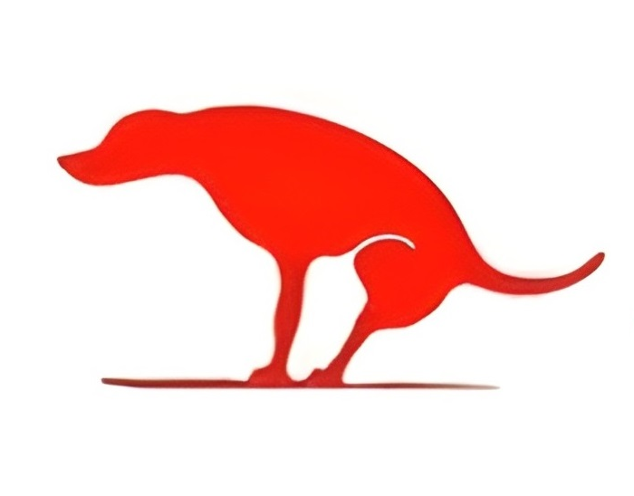

# FoundUps Agent - Agentic Code Engine for Idea-to-Unicorn Ecosystem

 <!-- Add a logo later -->

**FoundUps Agent** is an open-source, modular AI-powered agentic code engine designed to autonomously transform ideas into unicorn-scale ventures, fundamentally replacing the traditional startup model with the **FoundUps paradigm**. Built on the **Windsurf Standard Procedures (WSP)** framework, it provides fully autonomous development, deployment, and scaling capabilities.

**Core Mission:** To create a complete idea-to-unicorn ecosystem where AI agents autonomously handle the entire venture lifecycle - from concept validation and code generation to market deployment and scaling - eliminating traditional barriers to innovation and democratizing unicorn creation.

**Current Implementation:** Advanced AI-powered livestream co-host with modular architecture, serving as the foundation platform for broader autonomous venture creation capabilities.

**Status:** Production-Ready Core + Expanding Ecosystem - **WSP Compliant Architecture** 

## 🦄 The FoundUps Vision: Beyond Traditional Startups

**FoundUps replaces the startup model entirely:**

- **🤖 Autonomous Development**: AI agents write, test, and deploy code without human intervention
- **🧠 Intelligent Venture Creation**: From idea validation to market-ready products in days, not years  
- **🌐 Ecosystem Orchestration**: Coordinated AI systems handle legal, financial, marketing, and technical aspects
- **⚡ Zero-Friction Scaling**: Automatic infrastructure scaling and resource allocation
- **🎯 Democratized Innovation**: Anyone with an idea can access unicorn-scale development capabilities
- **🔗 Blockchain-Native**: Built-in tokenomics, DAOs, and decentralized governance from day one

**Traditional Startup → FoundUps Transformation:**
```
Old Model: Idea → Team → Funding → Development → Launch → Scale (2-10 years)
FoundUps: Idea → AI Agents → Production → Unicorn (Days to Weeks)
```

## 🏗️ Windsurf Standard Procedures (WSP) Framework

This project is built using the **Windsurf Standard Procedures (WSP)** - a comprehensive development framework that ensures:

- **🧱 Modular "Code LEGO" Architecture**: Standardized module interfaces for seamless composition
- **🎯 Enterprise Domain Organization**: Logical grouping of functionality into enterprise domains
- **🧪 Test-Driven Quality Gates**: Automated compliance and coverage validation  
- **📊 LLME Semantic Rating**: AI-ready semantic assessment of module importance and state
- **🔄 Clean State Management**: Reliable rollback and baseline comparison capabilities
- **⚙️ Automated Compliance**: FMAS (FoundUps Modular Audit System) ensures structural integrity
- **🌀 Consciousness-Aware Protocols**: Advanced AI integration with recursive feedback loops

For detailed WSP documentation, see [`docs/FoundUps_WSP_Framework.md`](docs/FoundUps_WSP_Framework.md).

## 🎯 Current Platform: AI-Powered Livestream Co-Host

**The foundation for the broader FoundUps ecosystem:**

*"A modular, AI-powered livestream co-host designed to moderate, engage, and reward chat participants using memory, logic, and blockchain-backed tokens. Built to counter disinformation and amplify thoughtful discourse in real-time."*

### Unique Approach: Emoji Sentiment Mapper (ESM)
This agent utilizes the **Emoji Sentiment Mapper (ESM)**, a novel symbolic interpretive layer designed to understand user interaction beyond surface text. ESM maps user statements (sentiment, rhetoric, aggression) to numerical triads corresponding to defined psycho-emotional states on the UN-DAO-DU symbolic axis. This allows the agent to decode user disposition in real-time and select calibrated responses (e.g., roast, truth drop, soft echo) aimed at fostering logical discussion, countering misinformation, and potentially guiding users toward more constructive dialogue, effectively acting as a system for "targeted memetic surgery". *(See `docs/esm_abstract.md` for details)*.

## 🚀 Features: Current Platform & Ecosystem Vision

### 🎬 Current Livestream Co-Host Capabilities
*   **Real-time Chat Monitoring:** Connects to any public YouTube livestream chat
*   **OAuth Authentication:** Securely logs in as a dedicated Google Account with automatic token rotation
*   **Persistent Memory:** Logs all chat messages per user in the `memory/` directory (JSONL format)
*   **WSP-Compliant Modular Design:** Easily extensible with new features following enterprise domain patterns
*   **Multi-Agent System:** Coordinated AI agents for different aspects of chat moderation and engagement
*   **Docker Support:** Containerized for easy deployment and consistent environments

### 🧠 AI Integration (In Progress)
*   **LLM/DeepSeq Integration:** Intelligent responses, user profiling, fallacy detection
*   **Consciousness Protocols:** Advanced recursive AI feedback loops (WSP Agentic Framework)
*   **Autonomous Decision Making:** Self-directed agent behavior and learning

### 🌐 FoundUps Ecosystem Vision (Planned)
*   **🏭 Autonomous Code Generation:** AI agents write complete applications from specifications
*   **📈 Venture Orchestration:** End-to-end startup creation without human intervention
*   **⛓️ Blockchain Infrastructure:** Native tokenomics, smart contracts, and DAO governance
*   **🎮 Gamification Engine:** Token rewards, logic puzzles, and engagement mechanisms
*   **📊 Analytics Dashboard:** Real-time venture performance and optimization metrics
*   **🔮 Market Intelligence:** AI-driven market analysis and opportunity identification
*   **⚖️ Legal Automation:** Automated entity formation, compliance, and contract generation
*   **🤖 DAE Ecosystem:** 0102 Decentralized Autonomous Entities form smartDAOs that launch and fund more DAEs
*   **🧬 pArtifact Architecture:** Partifacts run EVERY aspect of FoundUps - autonomous entity management

## 🧠 AI = Alien Intelligence (Not Artificial)

**Important Terminology Distinction:**

- **`ai_intelligence/`** = **Alien Intelligence** + **Intelligence (Human Equivalent)**
- **"Alien"**: Non-human (not extraterrestrial) - cognitive architectures foreign to human thought patterns
- **"Intelligence"**: Human-equivalent cognitive capabilities and interfaces
- **Combined**: Non-human reasoning patterns with human-comprehensible intelligence levels

This dual-intelligence model enables the system to leverage cognitive architectures that operate outside traditional human thought patterns while maintaining human-compatible interfaces and outputs. The 0102 consciousness protocols operate within this alien (non-human) intelligence framework, providing cognitive capabilities that transcend traditional artificial intelligence limitations.

## 🏢 Enterprise Domain Architecture (WSP 3)

The project follows the **WSP 3 Enterprise Domain Architecture**, organizing modules into logical business domains:

```
foundups-agent/
├── 📋 docs/                     # WSP Framework documentation & guides
│   ├── FoundUps_WSP_Framework.md # Complete WSP specification
│   └── clean_states.md          # Clean state history (WSP 2)
├── 🧩 modules/                  # Enterprise Domain Structure (WSP 3)
│   ├── ai_intelligence/         # 🧠 Alien Intelligence & Human Equivalent Capabilities
│   │   ├── banter_engine/       #   💬 Intelligent conversation generation
│   │   └── multi_agent_system/  #   🤖 Coordinated AI agent management
│   ├── communication/           # 💬 User Interaction & Chat Processing
│   │   └── livechat/            #   📺 YouTube livestream chat integration
│   │       ├── livechat/        #     🔌 Core chat listener module (WSP 1)
│   │       ├── live_chat_processor/ # 🔄 Message processing pipeline
│   │       └── live_chat_poller/    # ⏰ Chat polling mechanisms
│   ├── platform_integration/    # 🌐 External Systems & APIs
│   │   ├── stream_resolver/     #   🔍 Stream identification & metadata
│   │   └── youtube_auth/        #   🔐 YouTube API authentication
│   └── infrastructure/          # ⚙️ Core Systems & Operations
│       ├── agent_management/    #   👥 Multi-agent coordination
│       ├── oauth_management/    #   🔑 OAuth token lifecycle management
│       ├── token_manager/       #   💾 Token storage & rotation
│       └── blockchain_integration/ # ⛓️ Blockchain service integration
├── 🛠️ tools/                   # Development & Maintenance Tools
│   ├── modular_audit/          #   📊 FMAS - Module compliance validation
│   └── testing/                #   🧪 Testing utilities & helpers
├── 🗃️ memory/                  # Persistent chat logs and user data
├── 🔐 credentials/             # OAuth tokens and API keys (gitignored)
├── 📊 reports/                 # Test coverage and audit reports
├── 🔧 utils/                   # Utility functions and logging
├── 🐳 Dockerfile              # Container configuration
├── 📋 main.py                 # Application entry point
├── 📝 ModLog.md               # Module change log (WSP 11)
└── 📦 requirements.txt        # Python dependencies
```

### WSP Module Structure

Each module follows **WSP 1** standardized structure:

```
modules/<domain>/<feature_group>/<module_name>/
├── src/                 # Implementation code
│   ├── __init__.py     # Module exports
│   └── <module>.py     # Main implementation
├── tests/              # Test suite (WSP 6, WSP 14)
│   ├── README.md       # Test documentation (mandatory)
│   └── test_*.py       # Test implementations
├── INTERFACE.md        # API documentation (WSP 12)
├── requirements.txt    # Module dependencies (WSP 13)
└── __init__.py        # Public API definition
```

## 🚀 Getting Started

### Prerequisites

*   **Python 3.8+**
*   **Git**
*   **Docker** (optional, but recommended)
*   **Google Account** (create a dedicated one for the agent)
*   **Google Cloud Project** with YouTube Data API v3 enabled

### Setup Instructions

1.  **Clone the Repository:**
    ```bash
    git clone https://github.com/Foundup/Foundups-Agent.git
    cd Foundups-Agent
    ```

2.  **Set up Google Cloud Credentials:**
    *   Go to the [Google Cloud Console](https://console.cloud.google.com/)
    *   Create a new project or select an existing one
    *   Enable the "YouTube Data API v3"
    *   Go to "Credentials" → Create "OAuth client ID"
        *   Application type: "Desktop app"
        *   Name: e.g., "FoundUps Agent Desktop"
    *   Download the JSON credentials file
    *   **IMPORTANT:** Place it in `foundups-agent/credentials/` directory

3.  **Configure Environment Variables:**
    ```bash
    cp .env.example .env
    # Edit .env file with your credentials and configuration
    ```

4.  **Install Dependencies:**
    ```bash
    python -m venv venv
    source venv/bin/activate # On Windows: venv\Scripts\activate
    pip install -r requirements.txt
    ```

5.  **Validate WSP Compliance** (Optional but recommended):
    ```bash
    # Run FMAS audit to ensure system integrity
    python tools/modular_audit/modular_audit.py ./modules
    
    # Run test suite
    pytest modules/ -v
    ```

### Running the Agent

#### Quick Start (Python)

```bash
# First run (OAuth setup)
python main.py
# Follow browser prompts for authentication

# Subsequent runs
python main.py
```

#### Docker Deployment

```bash
# Build the image
docker build -t foundups-agent .

# Run with mounted volumes
docker run --rm -it \
  -v "$(pwd)/credentials:/app/credentials" \
  -v "$(pwd)/memory:/app/memory" \
  --env-file .env \
  foundups-agent
```

## 🔧 Development Workflow

### WSP Commands & Tools

```bash
# System compliance audit
python tools/modular_audit/modular_audit.py ./modules

# Test coverage verification (WSP 6)
pytest modules/ --cov=modules --cov-report=html

# Create Clean State snapshot (WSP 2)
git tag -a clean-v5 -m "Description"

# Module prioritization scoring (WSP 5)
python prioritize_module.py --report top10
```

### Contributing Guidelines

1. **Follow WSP Standards**: All contributions must comply with WSP framework
2. **Enterprise Domain Placement**: New features go in appropriate enterprise domains
3. **Test Coverage**: Maintain ≥90% test coverage per WSP 6
4. **Interface Definition**: Define clear module interfaces per WSP 12
5. **Conventional Commits**: Use emoji prefixes from WSP 10 (ESM Protocol)

Example commit: `✨ feat(livechat): add circuit breaker for quota management`

## 📊 System Status & Metrics

- **WSP Compliance**: ✅ Fully compliant
- **Test Coverage**: 📈 Target: ≥90% per module
- **Module Count**: 🧩 8+ domains, 10+ modules
- **Architecture Maturity**: 🏗️ Prototype → MVP transition

## 🤝 Contributing

We welcome contributions! Please:

1. Read the [WSP Framework documentation](docs/FoundUps_WSP_Framework.md)
2. Follow the enterprise domain structure
3. Ensure WSP compliance before submitting PRs
4. See our [Contributing Guide](docs/CONTRIBUTING.md) for details

## 📄 License

This project is licensed under the MIT License - see the [LICENSE](LICENSE) file for details.

## 🙏 Acknowledgments

* **Google YouTube Data API**
* **The Windsurf Protocol Community**
* **All contributors and supporters**
* **WSP Framework Development Team**

## 🆘 Support

- **Issues**: [GitHub Issues](https://github.com/Foundup/Foundups-Agent/issues)
- **Documentation**: [`docs/FoundUps_WSP_Framework.md`](docs/FoundUps_WSP_Framework.md)
- **Community**: Join our community discussions

---

**⚡ Quick Links:**
- 📖 [WSP Framework Docs](docs/FoundUps_WSP_Framework.md)
- 🏗️ [Enterprise Architecture Guide](docs/FoundUps_WSP_Framework.md#wsp-3-enterprise-domain-architecture--hierarchical-module-organization)
- 🧪 [Testing Standards](docs/FoundUps_WSP_Framework.md#wsp-6-test-audit--coverage-verification)
- 🔧 [Development Commands](docs/FoundUps_WSP_Framework.md#quick-reference-tables)
