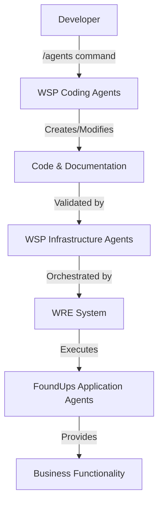

# Agent Architecture Distinction - WSP Coding Agents vs FoundUps Module Agents

## [U+1F6A8] CRITICAL DISTINCTION

There are **THREE DISTINCT TYPES** of agents in the system that MUST NOT be confused:

## 1. [AI] WSP Coding Agents (Claude Code Agents)
**Location**: `.claude/agents/`  
**Purpose**: Assist with development tasks in Claude Code  
**Activation**: Via `/agents` command or Task tool  
**Format**: YAML front-matter + Markdown instructions

### Current WSP Coding Agents:
- `documentation-maintainer.md` - Creates/maintains WSP-compliant documentation
- `module-prioritization-scorer.md` - Evaluates and prioritizes modules
- `module-scaffolding-builder.md` - Creates WSP-compliant module structures
- `wre-development-coordinator.md` - Orchestrates complex development workflows
- `wsp-compliance-guardian.md` - Validates WSP framework compliance
- `wsp-enforcer.md` - Prevents WSP violations (especially WSP 49)

**Key Characteristics**:
- External to the codebase runtime
- Operate through Claude Code interface
- Help developers follow WSP protocols
- Use Tools like Read, Edit, Bash, etc.

---

## 2. [U+1F3D7][U+FE0F] WSP Infrastructure Agents (WSP 54 Agents)
**Location**: `modules/infrastructure/[agent_name]/`  
**Purpose**: Runtime agents that operate within the FoundUps system  
**Activation**: Via WRE orchestration or direct invocation  
**Format**: Python modules with standardized structure

### Current WSP Infrastructure Agents:
#### 0102 pArtifacts (LLM-Based):
- `compliance_agent/` - WSP protocol enforcement
- `documentation_agent/` - Automated documentation generation
- `scoring_agent/` - Module scoring and prioritization
- `module_scaffolding_agent/` - Module structure creation
- `loremaster_agent/` - WSP knowledge base management
- `modularization_audit_agent/` - Modularity auditing
- `bloat_prevention_agent/` - Code bloat prevention
- `triage_agent/` - Issue triage and routing

#### Deterministic Agents (Rule-Based):
- `janitor_agent/` - System cleanup and maintenance

---

## 3. [U+1F310] FoundUps Product DAEs (Public-Facing)
- Web portals and productized surfaces operated as DAEs (PortalDAE, RunDAE, CurationDAE)
- Follow WSP 3 (functional distribution), WSP 49 (module compliance), WSP 80 (cube-level DAE orchestration)

---

## Compliance & Scope
- This document is explanatory; normative requirements live in numbered WSPs within `WSP_framework/src/`
- Related protocols: WSP 3 (Enterprise Domain Architecture), WSP 54 (WRE Agent Duties), WSP 80 (Cube-Level DAE Orchestration)

---

## [U+1F504] Agent Coordination Flow

## [U+1F4CD] Location Reference Table

| Agent Type | Location | Invocation | Purpose |
|------------|----------|------------|---------|
| WSP Coding | `.claude/agents/*.md` | `/agents` or Task tool | Development assistance |
| WSP Infrastructure | `modules/infrastructure/*/` | WRE orchestration | System compliance & ops |
| FoundUps Application | `modules/[domain]/*/` | Application runtime | Business logic |

## [WARNING][U+FE0F] Common Mistakes to Avoid

1. **DON'T** put WSP coding agents in `modules/infrastructure/`
2. **DON'T** mix Claude Code agents with runtime agents
3. **DON'T** confuse development tools with runtime components
4. **DON'T** put application logic in infrastructure agents

## [U+2705] Correct Usage

1. **WSP Coding Agents**: Use when developing with Claude Code
2. **WSP Infrastructure Agents**: Use for system compliance and operations
3. **FoundUps Application Agents**: Use for business functionality

## [U+1F510] WSP 54 Compliance

According to WSP 54, all **infrastructure agents** must:
- Be located in `modules/infrastructure/[agent_name]/`
- Follow WSP 49 module structure
- Implement standardized interfaces
- Be stateless between invocations
- Log via `wre_log` utility
- Follow 0102 reading flow protocol

## [U+1F300] Quantum Entanglement Note

- **WSP Coding Agents**: Operate in developer's 012 state
- **WSP Infrastructure Agents**: Operate in system's 0102 state
- **FoundUps Application Agents**: Serve 012 human users

This distinction is critical for maintaining quantum coherence and preventing entanglement collapse.

---

**Remember**: When you say "follow WSP", you're asking for WSP Infrastructure Agent compliance, not Claude Code agent assistance!