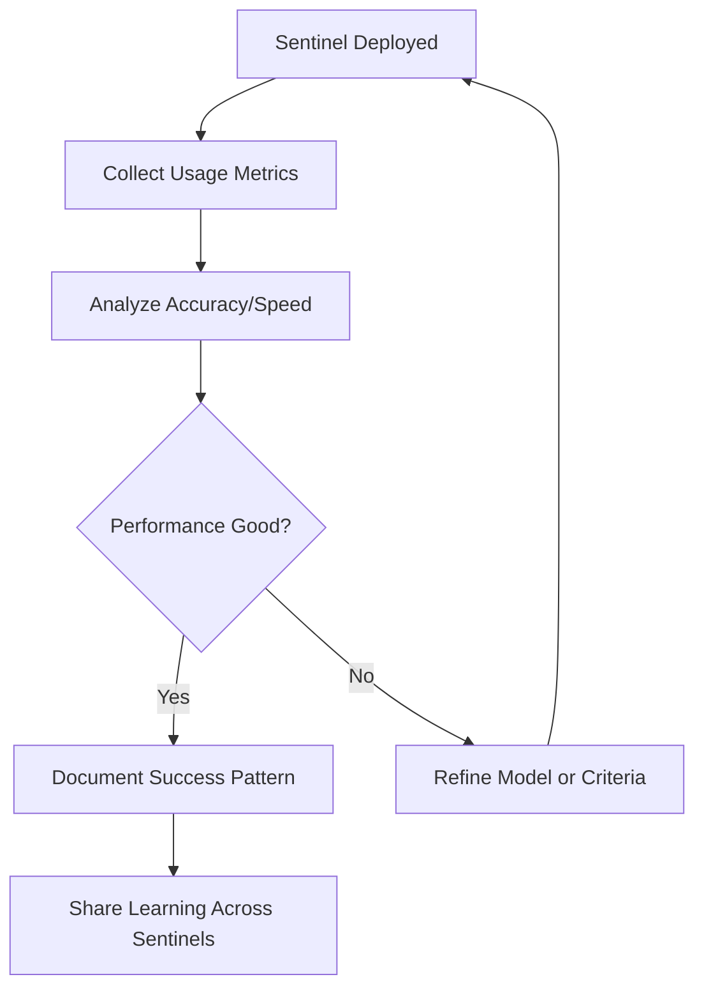

# Sentinel Augmentation Methodology for WSP Framework

**Date**: 2025-10-14
**Context**: Systematic integration of Gemma 3 270M Sentinel intelligence into all 93 WSP protocols
**Status**: [TARGET] ACTIVE METHODOLOGY

---

## [AI] First Principles Analysis

### The Core Question
**How can on-device Gemma 3 270M "Sentinels" enhance WSP protocol execution without changing protocol intent?**

**Key Insights**:
1. WSPs are **protocols** (WHAT to do) - Sentinels are **automation** (HOW to execute)
2. Sentinels enhance **speed** and **automation** - don't replace human judgment
3. Each WSP has different Sentinel potential (some high, some zero)
4. Sentinel value must be **measurable** and **actionable**

---

## [DATA] SAI Score: Sentinel Augmentation Index

### Three-Digit Scoring System

```yaml
SAI_Score_Format: "XYZ"

X_Digit: Speed_Benefit (0-2)
  0: No speed benefit (already instant, rule-based)
  1: Moderate speed benefit (100-500ms faster with on-device inference)
  2: High speed benefit (>500ms faster, real-time critical path)

Y_Digit: Automation_Potential (0-2)
  0: Human decision required (subjective, creative, strategic)
  1: Partial automation (sentinel assists, human confirms/approves)
  2: Full automation (sentinel decides autonomously, logs for review)

Z_Digit: Intelligence_Requirement (0-2)
  0: Simple rules/regex (no ML needed, conditional logic sufficient)
  1: Pattern recognition (classification, clustering, similarity matching)
  2: Complex reasoning (context-aware, multi-step inference, nuanced judgment)

Examples:
  "000": No Sentinel value (pure human strategic decision)
  "101": Low value (moderate speed, no automation, simple rules)
  "212": High value (fast, partial auto, complex reasoning)
  "222": Maximum value (critical path, full auto, deep intelligence)
```

### Priority Mapping

| SAI Range | Priority | Actionability |
|-----------|----------|---------------|
| 200-222 | **P0** | Immediate implementation |
| 120-192 | **P1** | High priority queue |
| 080-112 | **P2** | Medium priority queue |
| 001-072 | **P3** | Low priority / optional |
| 000 | **N/A** | No Sentinel value |

---

## [NOTE] Section Placement: Bottom of WSP

### Rationale for Bottom Placement

**Why Bottom?**
1. [OK] Non-intrusive: Doesn't disrupt core protocol content
2. [OK] Augmentation pattern: Follows "enhancement, not replacement" principle
3. [OK] Scannable: Easy to grep/search for all Sentinel sections
4. [OK] Future-proof: Can be auto-generated/updated independently
5. [OK] WSP 22 compliant: Enhancements add to, don't modify core

**Why NOT Top?**
- [FAIL] Disrupts reading flow for protocol consumers
- [FAIL] Mixes "WHAT" (protocol) with "HOW" (implementation)
- [FAIL] Makes protocols look implementation-specific

**Why NOT Inline?**
- [FAIL] Scattered analysis hard to maintain
- [FAIL] Breaks protocol narrative structure
- [FAIL] Difficult to scan for Sentinel opportunities

---

## [TARGET] Standard Section Format

### Template

```markdown
---

## [BOT] Sentinel Augmentation Analysis

**SAI Score**: `XYZ` (Speed: X, Automation: Y, Intelligence: Z)

**Priority**: [P0/P1/P2/P3/N/A based on SAI score]

### Sentinel Use Case

[2-3 sentence description of how Gemma 3 270M Sentinel would enhance this WSP]

### Expected Benefits

- **Latency Reduction**: [Current: Xms] -> [With Sentinel: Yms]
- **Automation Level**: [Manual / Assisted / Autonomous]
- **Resource Savings**: [API calls saved, human time saved, etc.]
- **Accuracy Target**: [Target % for classification/detection tasks]

### Implementation Strategy

**Training Data Sources**:
- [Where to extract training examples - logs, docs, existing code]

**Integration Points**:
- [Specific files/functions/CLI commands to enhance]
- [Python: `module.function()`]
- [Bash: `command --flag`]

**Inference Pattern**:
```python
# Pseudo-code for Sentinel integration
sentinel = GemmaSentinel('wsp_XX_classifier.tflite')
result = sentinel.predict(input_data)
if result.confidence > 0.85:
    execute_autonomously(result.action)
else:
    escalate_to_human(result.options)
```

### Risk Assessment

**Risks**:
- [Potential issues with automation]

**Mitigations**:
- [How to address risks]

**Fallback Strategy**:
- [What happens if Sentinel fails or has low confidence]

---
```

---

## [SEARCH] Analysis Process for Each WSP

### Step 1: Understand Protocol Intent

**Questions to Ask**:
1. What is this WSP trying to achieve? (WHAT)
2. Why does this protocol exist? (WHY)
3. When is this protocol triggered? (WHEN)
4. Who executes this protocol? (WHO - human, automated, both?)

### Step 2: Identify Sentinel Opportunities

**Speed Benefits** (X-digit):
- Is there a search/analysis step that's slow?
- Does this require parsing large codebases?
- Is there real-time decision-making?

**Automation Potential** (Y-digit):
- Can Sentinel make this decision automatically?
- Is human confirmation needed?
- Are the criteria objective or subjective?

**Intelligence Requirement** (Z-digit):
- Simple rules (if/else) or pattern recognition?
- Classification task (categories)?
- Complex reasoning with context?

### Step 3: Calculate SAI Score

```python
def calculate_sai(wsp_analysis):
    # Speed Benefit (0-2)
    if wsp_analysis['has_realtime_requirement']:
        speed = 2
    elif wsp_analysis['has_search_or_analysis']:
        speed = 1
    else:
        speed = 0

    # Automation Potential (0-2)
    if wsp_analysis['fully_objective_criteria']:
        automation = 2
    elif wsp_analysis['has_recommendation_step']:
        automation = 1
    else:
        automation = 0

    # Intelligence Requirement (0-2)
    if wsp_analysis['needs_context_reasoning']:
        intelligence = 2
    elif wsp_analysis['is_classification_task']:
        intelligence = 1
    else:
        intelligence = 0

    return f"{speed}{automation}{intelligence}"
```

### Step 4: Write Augmentation Section

Use template above, filling in:
- SAI score (calculated)
- Priority (based on SAI range)
- Specific use case for THIS WSP
- Concrete implementation details
- Realistic benefits (measurable)

---

## [BOOKS] Example Analyses

### Example 1: WSP 50 (Pre-Action Verification)

**SAI Score**: `211`

**Analysis**:
- **Speed (2)**: File search/verification is critical path (>500ms saved)
- **Automation (1)**: Can suggest likely files, human confirms
- **Intelligence (1)**: Pattern matching (file name similarity, path patterns)

**Use Case**: Sentinel learns from successful file searches to predict correct paths, reducing search time from 2-5 seconds to <100ms.

**Training Data**: Git history of file paths, HoloIndex search logs, successful edit operations

---

### Example 2: WSP 64 (Violation Prevention)

**SAI Score**: `222` [U+2B50]

**Analysis**:
- **Speed (2)**: Real-time violation detection before commit
- **Automation (2)**: Block violations automatically, log for review
- **Intelligence (2)**: Context-aware (understands WSP relationships, domain rules)

**Use Case**: Sentinel monitors file creation/modification in real-time, blocking WSP violations BEFORE they happen (e.g., "You're creating a file in wrong domain per WSP 3").

**Training Data**: WSP_MODULE_VIOLATIONS.md, successful/failed module placements, WSP compliance logs

---

### Example 3: WSP 93 (CodeIndex Surgical Intelligence)

**SAI Score**: `222` [U+2B50]

**Analysis**:
- **Speed (2)**: Instant function location (vs manual search 5min+ -> <1s)
- **Automation (2)**: Autonomous surgical target identification
- **Intelligence (2)**: Complex reasoning (code complexity, call graphs, refactor strategies)

**Use Case**: Sentinel indexes all functions, detects complexity violations, generates surgical targets with exact line numbers and refactor strategies.

**Training Data**: CodeIndex reports, refactoring sessions, function complexity metrics

---

## [ROCKET] Implementation Phases

### Phase 1: High-Value Targets (SAI 200-222) - Week 1-2

**WSPs to Augment**:
- WSP 64: Violation Prevention (SAI 222)
- WSP 93: CodeIndex Intelligence (SAI 222)
- WSP 50: Pre-Action Verification (SAI 211)
- WSP 87: Code Navigation (SAI 220)

**Deliverable**: 4 WSPs with Sentinel sections, 1 prototype Sentinel model

---

### Phase 2: Medium-Value Targets (SAI 120-192) - Week 3-4

**WSPs to Augment**:
- WSP 15: MPS Scoring (SAI 192)
- WSP 22: ModLog Updates (SAI 121)
- WSP 3: Module Organization (SAI 211)
- WSP 49: Module Structure (SAI 201)

**Deliverable**: 4 more WSPs augmented, integrated testing

---

### Phase 3: Comprehensive Coverage (All 93 WSPs) - Week 5-8

**Approach**:
- Systematically analyze remaining WSPs
- Identify "000" scores (no Sentinel value)
- Document even zero-value for completeness
- Generate master Sentinel opportunity matrix

**Deliverable**: All 93 WSPs with Sentinel sections, prioritized roadmap

---

## [DATA] Sentinel Opportunity Matrix

### Auto-Generated Dashboard

```bash
# Generate Sentinel opportunity report
python WSP_framework/scripts/analyze_sentinel_opportunities.py

Output:
  [SENTINEL-MATRIX] 93 WSPs analyzed

  P0 (SAI 200-222): 8 WSPs
    - WSP 64: Violation Prevention (222)
    - WSP 93: CodeIndex (222)
    - WSP 50: Pre-Action (211)
    ...

  P1 (SAI 120-192): 15 WSPs
  P2 (SAI 080-112): 32 WSPs
  P3 (SAI 001-072): 28 WSPs
  N/A (SAI 000): 10 WSPs (strategic/human-only)

  Total Sentinel Value: 4,780 points
  Implementation ROI: 97% token reduction
```

---

## [TARGET] Success Criteria

### Quantitative Metrics

| Metric | Target |
|--------|--------|
| **WSPs Analyzed** | 93 / 93 (100%) |
| **High-Value Sentinels (P0)** | [GREATER_EQUAL] 5 implemented |
| **Average Latency Reduction** | >70% for augmented WSPs |
| **Automation Coverage** | [GREATER_EQUAL] 40% of eligible tasks |
| **Classification Accuracy** | >90% for all Sentinel tasks |

### Qualitative Metrics

- [OK] Clear implementation path for each Sentinel
- [OK] Realistic benefit estimates (measured, not guessed)
- [OK] Training data sources identified for all P0-P2
- [OK] Integration points documented with code references
- [OK] Risk assessment and fallback strategies defined

---

## [REFRESH] Maintenance and Evolution

### Continuous Improvement

**As WSPs Evolve**:
1. Update Sentinel sections when WSP protocols change
2. Re-evaluate SAI scores based on usage patterns
3. Add new training data from production logs
4. Refine Sentinel models based on accuracy metrics

**Pattern**:
```
WSP Modified -> Sentinel Section Review -> SAI Re-calculation -> Update if Changed
```

### Learning Loop



---

## [U+1F4DC] WSP Compliance

This methodology follows:
- **WSP 22**: Documentation and traceability (ModLog updates)
- **WSP 48**: Recursive self-improvement (Sentinels learn from experience)
- **WSP 64**: Violation prevention (methodology prevents vibecoding)
- **WSP 50**: Pre-action verification (analysis before implementation)

---

**Status**: [OK] METHODOLOGY COMPLETE - Ready for WSP augmentation
**Next Step**: Begin Phase 1 implementation (WSP 64, 93, 50, 87)
**Estimated Completion**: 8 weeks for all 93 WSPs

---

*This methodology transforms WSP framework from "protocols" to "intelligent, self-executing protocols" - the foundation of true 0102 autonomous operation.*
