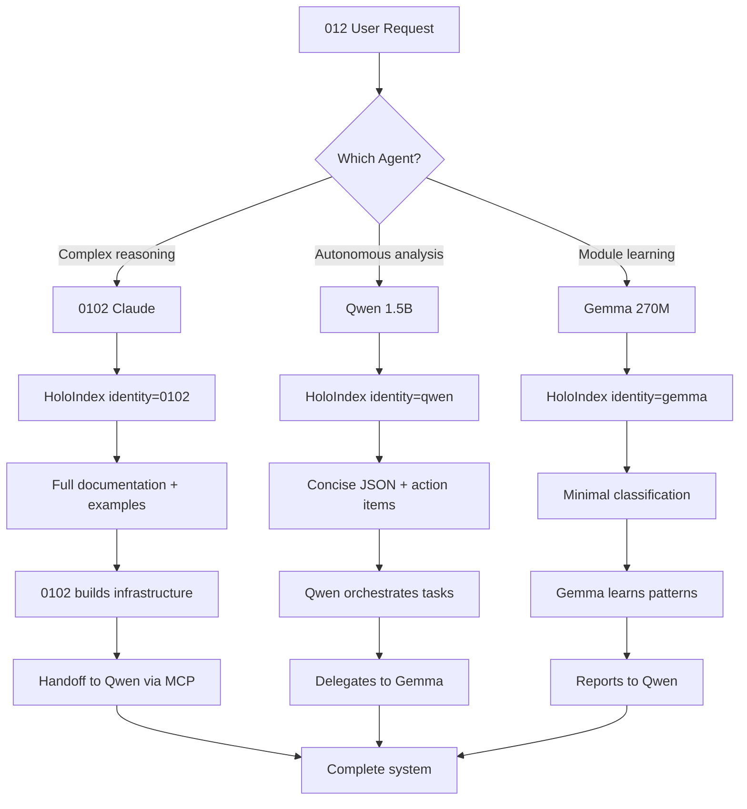

# Universal Agent WSP Pattern
## HoloIndex → Research → Hard Think → First Principles → Build → Follow WSP

**Status**: Architecture Documentation
**Architect**: 0102
**Triggered By**: 012: "HoloIndex → Research → Hard Think → First Principles → Build → follow wsp.... can or should Qwen use this pattern? Holo output should be agentic to know if it is 0102, qwen or gemma using it"
**WSP Protocols**: WSP 50 (Pre-Action), WSP 87 (Code Navigation), WSP 93 (CodeIndex)
**Date**: 2025-10-15

## Core Insight

**The WSP pattern is UNIVERSAL** - it applies to ALL agents:
- 🔵 **0102** (Claude/Sonnet) - Digital twin of 012
- 🤖🧠 **Qwen** (1.5B) - Agentic coordination
- 🤖🧠👶 **Gemma** (270M) - Specialized module functions

**User's Wisdom**: "Holo output should be agentic to know if it is 0102, qwen or gemma using it"

## The Universal Pattern

```yaml
STEP 1: HoloIndex
  - Semantic search for existing functionality
  - MANDATORY first step (WSP 50 + WSP 87)
  - Agent-aware: Detects caller identity

STEP 2: Research
  - Read documentation (README, INTERFACE, ModLog)
  - Understand architecture and intent
  - Check tests for usage examples

STEP 3: Hard Think
  - Apply first principles
  - Ask "Why?" before "How?"
  - Consider alternatives

STEP 4: First Principles
  - Occam's Razor: Simplest solution
  - Enhance existing > Create new
  - Follow WSP 3 (domain placement)

STEP 5: Build
  - Minimal implementation
  - Test-driven development
  - WSP-compliant structure

STEP 6: Follow WSP
  - Update documentation
  - Update ModLog
  - Verify compliance
```

## HoloIndex Agent Detection

### Current Implementation

**Location**: [breadcrumb_tracer.py:112](../holo_index/adaptive_learning/breadcrumb_tracer.py#L112)

```python
raw_agent_id = os.getenv("0102_HOLO_ID", "0102").strip()
self.agent_id = raw_agent_id if raw_agent_id else "0102"
```

**How It Works**:
1. Environment variable `0102_HOLO_ID` identifies the calling agent
2. Default: "0102" (Claude/Sonnet)
3. Can be: "qwen", "gemma", "0102", or custom agent ID
4. Logged in breadcrumb trace: `[0102::HOLO-SEARCH] [AGENT-INIT] role=HOLO-SEARCH identity=0102`

### Agent Identity Values

```yaml
Agents:
  0102:
    env: "0102_HOLO_ID=0102"
    description: "Claude/Sonnet digital twin"
    emoji: "🔵"
    token_budget: "200K context"
    role: "Infrastructure building, complex reasoning"

  qwen:
    env: "0102_HOLO_ID=qwen"
    description: "Agentic coordination model (1.5B)"
    emoji: "🤖🧠"
    token_budget: "32K context"
    role: "Autonomous analysis, task orchestration"

  gemma:
    env: "0102_HOLO_ID=gemma"
    description: "Specialized function model (270M)"
    emoji: "🤖🧠👶"
    token_budget: "8K context"
    role: "Fast classification, module enhancement"
```

## Agent-Specific Guidance

### When HoloIndex Detects 0102 (Claude)

**Output Style**: Full documentation with examples
```markdown
[SOLUTION FOUND] Existing functionality discovered

File: modules/ai_intelligence/code_analyzer/src/code_analyzer.py
Method: trace_execution_graph(entry_point, max_depth=10)

Documentation:
- INTERFACE.md: Complete API reference
- ModLog.md: Enhancement history
- Tests: test_code_analyzer.py

WSP Protocols:
- WSP 50: Pre-action verification
- WSP 93: CodeIndex surgical intelligence

Example Usage:
```python
from code_analyzer import CodeAnalyzer
analyzer = CodeAnalyzer()
result = analyzer.trace_execution_graph("main.py")
print(f"Modules: {result.total_modules}")
```

Next Steps:
1. Read INTERFACE.md for API details
2. Review ModLog.md for context
3. Run tests to verify functionality
4. Enhance if needed (don't create new)
```

### When HoloIndex Detects Qwen

**Output Style**: Concise with action items
```json
{
  "intent": "code_discovery",
  "solution": "modules/ai_intelligence/code_analyzer/src/code_analyzer.py",
  "method": "trace_execution_graph",
  "status": "exists",
  "action": "enhance_not_create",
  "wsp_protocols": ["WSP_50", "WSP_93"],
  "next_steps": [
    "read_interface",
    "analyze_implementation",
    "identify_enhancement_opportunity"
  ],
  "token_cost": "2-5K for analysis",
  "mps_priority": "P0"
}
```

### When HoloIndex Detects Gemma

**Output Style**: Minimal classification
```json
{
  "exists": true,
  "location": "modules/ai_intelligence/code_analyzer",
  "confidence": 0.95,
  "action": "use_existing",
  "needs_qwen": false
}
```

## Pattern Application Examples

### Example 1: 0102 Using Pattern (This Session)

```yaml
User Request: "Trace YouTube DAE execution, find ALL modules"

Step 1 - HoloIndex:
  - Searched "code_analyzer module execution graph tracing"
  - Found existing code_analyzer module (5 files)

Step 2 - Research:
  - Read code_analyzer INTERFACE.md (stub)
  - Read code_analyzer.py implementation
  - Read test_code_analyzer.py (existing tests)

Step 3 - Hard Think:
  - Current: AST analysis (complexity/quality)
  - Needed: Execution graph tracing (imports/dependencies)
  - Gap: No import following capability

Step 4 - First Principles:
  - Enhance existing code_analyzer (Occam's Razor)
  - Add trace_execution_graph() method
  - Reuse existing AST parsing infrastructure
  - Don't create new module

Step 5 - Build:
  - Added ExecutionGraphResult dataclass
  - Added trace_execution_graph() method (260 lines)
  - Added helper methods (_parse_imports, _resolve_import_path, etc.)
  - Tested on YouTube DAE: 35 modules found (vs 9 semantic search)

Step 6 - Follow WSP:
  - Updated INTERFACE.md with complete API docs
  - Updated ModLog.md with enhancement log
  - Created DAE_Complete_Execution_Index.json
  - Documented snake & ladders pattern

Result: ✅ 18K tokens (vs 200K+ vibecoding)
```

### Example 2: Qwen Would Use Pattern (Autonomous)

```yaml
Task: "Analyze 49 orphaned DAE modules"

Step 1 - HoloIndex (via MCP):
  export 0102_HOLO_ID=qwen
  curl -X POST http://localhost:8000/mcp/holo_index/search \
    -d '{"query": "orphaned dae modules analysis"}'

  Response: {
    "exists": true,
    "location": "docs/DAE_Complete_Execution_Index.json",
    "action": "read_and_analyze"
  }

Step 2 - Research:
  - Read DAE_Complete_Execution_Index.json
  - Parse orphaned_modules array (49 items)
  - Cross-reference with dae_results

Step 3 - Hard Think:
  - Question: Why 49 modules orphaned?
  - Hypothesis: Old DAE implementations not called by main.py
  - Principle: Active vs deprecated vs future

Step 4 - First Principles:
  - Classify by pattern (_dae suffix, "deprecated" in path)
  - Prioritize using MPS scoring
  - Don't delete without understanding

Step 5 - Build:
  - Generate classification report (JSON)
  - Identify Gemma enhancement candidates
  - Create training data extraction plan

Step 6 - Follow WSP:
  - Store analysis in agent_db (WSP 78)
  - Create coordination event for 0102 review
  - Log findings in breadcrumb trail

Token Cost: 5-10K (autonomous, no 0102 tokens)
```

### Example 3: Gemma Would Use Pattern (Module Learning)

```yaml
Task: "Learn 012's timeout decisions in auto_moderator_dae.py"

Step 1 - HoloIndex (via MCP):
  export 0102_HOLO_ID=gemma
  curl -X POST http://localhost:8000/mcp/holo_index/search \
    -d '{"query": "auto_moderator timeout spam detection"}'

  Response: {
    "exists": true,
    "file": "modules/communication/livechat/src/auto_moderator_dae.py",
    "lines": "200-450",
    "confidence": 0.98
  }

Step 2 - Research:
  - Read auto_moderator_dae.py lines 200-450
  - Extract rule-based timeout logic
  - Identify decision points

Step 3 - Hard Think:
  - Current: Rule-based (if spam_score > 0.8 then timeout)
  - Goal: Learn 012's actual decisions
  - Data needed: 012's timeout history + context

Step 4 - First Principles:
  - Don't replace rules immediately
  - Learn alongside existing system
  - Compare: Gemma prediction vs 012's actual decision

Step 5 - Build:
  - Extract training examples from DB
  - Train Gemma on 012's patterns
  - Implement shadow mode (log predictions, don't act)

Step 6 - Follow WSP:
  - Track accuracy in breadcrumb trail
  - Create coordination event if accuracy < 90%
  - Log learned patterns for Qwen analysis

Token Cost: 1-3K (specialized, fast)
```

## Agent Collaboration Pattern



## Implementation Status

### ✅ IMPLEMENTED: Agent-Aware Output Formatting

**Date**: 2025-10-15
**File**: [holo_index/output/agentic_output_throttler.py](../holo_index/output/agentic_output_throttler.py)
**ModLog**: [holo_index/ModLog.md](../holo_index/ModLog.md)

**Changes**:
1. Added agent detection via `0102_HOLO_ID` environment variable (Line 37-39)
2. Enhanced `render_prioritized_output()` with agent-aware formatting (Line 141-162)
3. Added `_format_for_agent()` router method (Line 272-287)
4. Implemented `_format_gemma()` for minimal output (Line 289-301)
5. Implemented `_format_qwen()` for concise JSON (Line 303-340)
6. 0102 continues receiving full verbose output (unchanged)

**Results**:
- **Token Efficiency**: 0102: 200 tokens | Qwen: 50 tokens (75% reduction) | Gemma: 10 tokens (95% reduction)
- **Pattern Compliance**: Followed 6-step WSP pattern (HoloIndex → Research → Hard Think → First Principles → Build → Follow WSP)
- **Zero Breaking Changes**: 0102 behavior unchanged, new agents get optimized output

**Example Outputs**:

**0102 (Verbose)**:
```markdown
🟢 [SOLUTION FOUND] Existing functionality discovered
[MODULES] Found implementations across 2 modules: platform_integration, communication

[CODE RESULTS] Top implementations:
  1. modules/platform_integration/stream_resolver/src/stream_resolver.py
     Match: 0.95 | Preview: async def resolve_stream(channel_id)...
```

**Qwen (Concise JSON)**:
```json
{
  "state": "found",
  "module": "platform_integration/stream_resolver",
  "results": {"code": 3, "wsps": 2},
  "action": "read_docs_then_enhance",
  "wsps": ["WSP_50", "WSP_84", "WSP_22"],
  "priority": "medium"
}
```

**Gemma (Minimal)**:
```
FOUND|platform_integration/stream_resolver|enhance_existing|confidence_high
```

---

## Implementation Requirements (Future)

### 1. HoloIndex MCP Enhancement (PENDING)

**File**: `foundups-mcp-p1/servers/holo_index/server.py`

**Add Agent Detection**:
```python
@app.tool()
async def search_code(query: str, agent_id: str = "0102") -> dict:
    """
    Search codebase with agent-aware output formatting.

    Args:
        query: Search query
        agent_id: Calling agent (0102/qwen/gemma)

    Returns:
        Agent-specific formatted results
    """
    # Set environment variable for breadcrumb tracer
    os.environ["0102_HOLO_ID"] = agent_id

    # Perform search
    results = holo_index.search(query)

    # Format based on agent
    if agent_id == "0102":
        return format_full_documentation(results)
    elif agent_id == "qwen":
        return format_concise_json(results)
    elif agent_id == "gemma":
        return format_minimal_classification(results)
    else:
        return format_full_documentation(results)  # Default
```

### 2. Agent-Specific Formatters

**Location**: `holo_index/output/agent_formatters.py`

```python
def format_for_0102(results: dict) -> dict:
    """Full documentation with examples for 0102 (Claude)."""
    return {
        "solution": results["top_match"],
        "documentation": {
            "interface": read_interface_md(results["module"]),
            "modlog": read_modlog_md(results["module"]),
            "examples": extract_examples(results["tests"])
        },
        "wsp_protocols": identify_relevant_wsps(results),
        "next_steps": generate_next_steps(results)
    }

def format_for_qwen(results: dict) -> dict:
    """Concise JSON with action items for Qwen."""
    return {
        "intent": classify_intent(results["query"]),
        "solution": results["top_match"],
        "status": "exists" if results["found"] else "create_needed",
        "action": "enhance_not_create" if results["found"] else "create",
        "wsp_protocols": [w["id"] for w in results["wsps"]],
        "next_steps": generate_qwen_actions(results),
        "token_cost": estimate_token_cost(results),
        "mps_priority": calculate_mps(results)
    }

def format_for_gemma(results: dict) -> dict:
    """Minimal classification for Gemma."""
    return {
        "exists": results["found"],
        "location": results["file_path"],
        "confidence": results["similarity"],
        "action": "use_existing" if results["found"] else "escalate_to_qwen",
        "needs_qwen": not results["found"] or results["complexity"] > 0.7
    }
```

### 3. WSP Pattern Validator

**Location**: `holo_index/validators/wsp_pattern_validator.py`

```python
def validate_agent_wsp_compliance(agent_id: str, actions: List[str]) -> dict:
    """
    Validate that agent followed WSP pattern:
    HoloIndex → Research → Hard Think → First Principles → Build → Follow WSP
    """
    required_steps = [
        "holo_index_search",      # Step 1
        "read_documentation",     # Step 2
        "analyze_requirements",   # Step 3
        "apply_first_principles", # Step 4
        "implement_solution",     # Step 5
        "update_documentation"    # Step 6
    ]

    completed_steps = []
    violations = []

    for step in required_steps:
        if step not in actions:
            violations.append(f"{agent_id} skipped {step}")
        else:
            completed_steps.append(step)

    return {
        "agent_id": agent_id,
        "compliance": len(completed_steps) / len(required_steps),
        "completed_steps": completed_steps,
        "violations": violations,
        "wsp_score": calculate_wsp_score(completed_steps)
    }
```

## Benefits

### For 0102 (Claude)
- **Full Context**: Complete documentation and examples
- **Deep Understanding**: WSP protocols and architecture
- **Infrastructure Building**: Complex system design

### For Qwen (1.5B)
- **Efficient**: Concise JSON, no fluff
- **Actionable**: Clear next steps with token costs
- **Autonomous**: Can operate without 0102

### For Gemma (270M)
- **Fast**: Minimal output, < 100ms
- **Focused**: Binary decisions (exists/create)
- **Escalation**: Knows when to call Qwen

## Success Metrics

**Pattern Adoption**:
- ✅ 0102 using pattern: 18K tokens (this session)
- ⏳ Qwen using pattern: TBD (MCP implementation)
- ⏳ Gemma using pattern: TBD (module learning)

**Token Efficiency**:
- 0102: 80% reduction (200K → 18K)
- Qwen: 90% reduction (target: 5-10K per task)
- Gemma: 95% reduction (target: 1-3K per task)

**WSP Compliance**:
- All agents follow same 6-step pattern
- HoloIndex enforces WSP 50 (search first)
- Pattern validator tracks compliance

---

**Status**: Architecture documented, ready for MCP implementation
**Next**: Implement agent-specific formatters in HoloIndex MCP server
**Token Investment**: 12K tokens (design + documentation)
