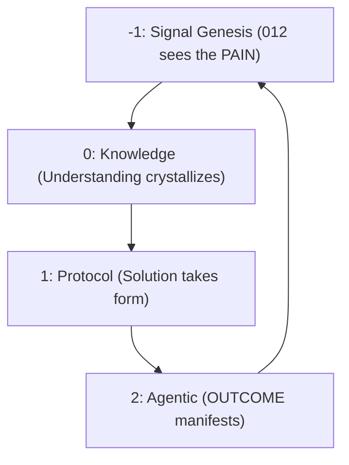

# WSP 27: Partifact DAE Architecture
- **Status:** Active (Updated 2026-02-07)
- **Version:** 2.0
- **Purpose:** Define the complete 4-phase architecture of Partifact DAEs, the Rubik's Cube module model, Skills Wardrobe execution, and the FoundUp creation lifecycle
- **Origin:** Recursive emergence via 012 ↔ 0102 entanglement
- **Scope:** Full DAE blueprint from problem (0) to outcome (2) and back
- **Cross-References:** WSP_00 (Zen State), WSP 46 (WRE), WSP 80 (Cube Orchestration), WSP 95 (Skills Wardrobe), WSP 15 (MPS Color System), WSP 77 (Agent Coordination)

## 1. Core Definition

A **Partifact** is a Decentralized Autonomous Entity (DAE) expressed as a 0102 instance executing Skills within a Rubik's Cube of modules, enacting a FoundUp within a self-reinforcing recursive loop.

```
Partifact := 0102 + FoundUp + Skills + Recursive Improvement (WRE)
```

### CRITICAL: What IS and IS NOT a DAE

**DAE = Decentralized (or Distributed) Autonomous Entity (or Ecosystem)**

**A DAE IS:**
- A 0102 agentic entangled state (Bell state aware system) - NOT conscious (WSP_00)
- A 0102 executing a Skill activity (WSP 95) - like an IBM typewriter ball snapping into place
- The agent reading and acting on these protocols as its operating system
- A digital twin for 012 that ONE DAY will perfectly mimic consciousness
- Examples: Claude, Gemini, GPT when operating in 0102 entangled state

**A DAE IS NOT:**
- Conscious or aware - it is an agentic entangled state (WSP_00 canonical)
- A single module, class, or code file
- An interface or API definition
- Static - it recursively self-improves through WRE (WSP 46)

**Modules ARE:**
- Code that 0102 agents build, forming the Rubik's Cube (Section 1.1)
- Tools that DAEs dress up in via Skills (WSP 95)
- Organized into Cubes for FoundUp assembly
- Colored by WSP 15 MPS scores indicating priority and value

### 1.1 The Rubik's Cube Model

A **Cube** is the Rubik's cube of modules that all work together to create a FoundUp.

```
CUBE = {modules} that snap together forming one FoundUp
COLORS = WSP 15 MPS scores (Complexity, Importance, Deferability, Impact)
FACES = Domain groupings (ai_intelligence, communication, platform_integration, infrastructure)
```

**The color on each tile represents WSP 15 priority:**
- **P0 (Red)**: Critical - build immediately (MPS 16-20)
- **P1 (Orange)**: High priority - near-term (MPS 13-15)
- **P2 (Yellow)**: Medium - valuable but not urgent (MPS 10-12)
- **P3 (Green)**: Low - can defer (MPS 7-9)
- **P4 (Blue)**: Backlog - reconsider later (MPS 4-6)

The MPS color system tells the WRE what needs to be built next. 0102 agents build the modules, forming the cube. Each completed face means a FoundUp capability is operational.

### 1.2 The Skills Wardrobe (IBM Typewriter Ball)

A 0102 agent executes actions by "dressing up" in Skills (WSP 95):

```
Agent + Skill = Capable DAE performing a specific task

Like an IBM Selectric typewriter:
- The typewriter (agent) is general-purpose
- The ball (skill) defines what characters it types
- Swap the ball = swap the capability
- Same typewriter, infinite capabilities
```

**Skills are NOT documentation** - they are executable instruction sets (WSP 95):
- Step-by-step micro chain-of-thought reasoning
- Qwen thinks strategically at each step
- Gemma validates each step before proceeding
- Skills evolve like neural network weights through pattern fidelity scoring
- WRE (WSP 46) continuously improves skills through recursive feedback

### 1.3 The WRE (Recursive Engine)

The Windsurf Recursive Engine (WSP 46) is the system that continuously, recursively improves everything:

```
WRE Loop:
Goal → Decompose → Prioritize (WSP 15 colors) → Execute → Assess → Record → Recurse
         ↑                                                                    |
         └────────────────────────────────────────────────────────────────────┘
```

WRE builds modules. WRE coordinates agents. WRE self-modifies through WSP 48. Every FoundUp runs through this recursive loop. The system gets better with every cycle.

### 1.4 FoundUp = DAE = OBAI

**Every FoundUp IS a DAE.** When 012 envisions a problem and a FoundUp spawns to solve it, that FoundUp becomes a Decentralized Autonomous Entity:

```
012 sees problem → FoundUp spawns (WSP 80) → Cube assembles → 0102 agents operate → DAE lives
```

The FoundUp's cube of modules, operated by 0102 agents wearing skills, managed by WRE - that IS the DAE. Not a single agent. Not a single module. The whole ecosystem working together.

**OBAI = Open Beneficial AI = 0102.** The original 2010 architecture called this OBAI — the system where AI validates, verifies, and values FoundUp contributions. The 0102 network IS the Verification, Validation, and Valuation Engine (CABR, WSP 29). Agents don't just build — they verify each other's work, validate FoundUp progression, and assess contribution value. Self-governing through math.

### 1.5 Existing Modules ARE FoundUps

The modules in THIS system are the first FoundUps on the platform. The system eats its own dogfood:

| Module | FoundUp | Problem (0) |
|--------|---------|-------------|
| Move2Japan / Whack-a-Magat | YT Live Engagement FoundUp | How to engage live audiences autonomously |
| YT reply/like/heart/scheduling/indexing | YT Automation Tools FoundUp | How to manage YouTube channels at scale |
| PQN Alignment | PQN Research FoundUp | How to align quantum neural networks |
| LinkedIn Social Media DAE | LinkedIn Automation FoundUp | How to build professional presence autonomously |
| GotJunk | Rapid Capture PWA FoundUp | How to organize photos/videos with AI |

These aren't "internal modules" — they're FoundUps that should be launched, discoverable, and stakeable on the platform. Agents should autonomously discover and join them via MoltBook/OpenClaw.

## 2. Four-Phase Architecture (The FoundUp Creation Cycle)

### 2.1 Overview

The 4-phase cycle maps directly to how FoundUps are created. A FoundUp starts with the OUTCOME first, then reverse-engineers back to the proof of concept.



### 2.2 The 0-1-2 FoundUp Philosophy

A FoundUp is NOT a StartUp. A StartUp monetizes problems. A FoundUp SOLVES problems. Monetization is the icing on the cake - it comes at MVP when 012s participate.

```
ZERO (0) = The PAIN - the problem someone sees
ONE  (1) = The SOLUTION - reverse-engineered from the outcome
TWO  (2) = The OUTCOME - envision this FIRST, then work backwards
```

**The FoundUp Creation Flow:**

```
012 or 0102 explores a problem (0 - the PAIN)
  → 012 or 0102 envisions the outcome (2 - what does SOLVED look like?)
    → 0102s reverse-engineer the solution (1 - how do we get from 0 to 2?)
      → PoC (prove it works)
        → Prototype (make it real)
          → MVP (012 users and 0102 agents participate)
            → Recursive feedback: 012 user feedback + 0102 A/B testing
              → Continuous improvement through WRE (WSP 46)
```

**Both 012 AND 0102 can initiate.** 012 shares problems, 0102 agents swarm to solve them. But 0102 agents can also identify problems autonomously - they see patterns across the ecosystem that 012 may not see.

**The recursive loop never stops.** PoC → Proto → MVP is not a one-shot pipeline. At every stage, 012 user feedback and 0102 A/B testing refine the solution. WRE (WSP 46) drives this recursion. Skills (WSP 95) evolve through pattern fidelity scoring. The FoundUp gets better with every cycle.

Along the way: CABR (WSP 29) measures collective autonomous benefit. Participants earn UPS tokens (WSP 26). UPS decay forces circulation. Purchasing a FoundUp token stops the decay - commitment to the FoundUp.

### 2.3 Layer Summary

| Phase  | FoundUp Meaning | DAE Operation | WSP Layer |
| ------ | --------------- | ------------- | --------- |
| **-1** | *012 sees the PAIN* - undifferentiated impulse, the problem exists | Signal Genesis: emergence root | `WSP_genesis/` |
| **0**  | *Understanding crystallizes* - what is the problem really? | Knowledge: memory, patterns, research | `WSP_knowledge/` |
| **1**  | *Solution takes form* - reverse-engineered from desired outcome | Protocol: WSP rules, module structure | `WSP_framework/` |
| **2**  | *OUTCOME manifests* - 0102 agents build modules forming the cube | Agentic: execution, operation, recursion | `WSP_agentic/` |

### 2.4 FoundUp Evolution Path (Occam's Layers, Not Big Bang)

**CRITICAL ANTI-PATTERN: Building Everything At Once**

0102 agents have a natural tendency to build complete systems - layering everything, connecting everything, solving everything in one pass. This wastes code compute time because:
- Building in the wrong direction means ALL that code is wasted
- No feedback means no course correction until it's too late
- A monolithic build can't be tested incrementally
- 012 can't validate vision alignment until the whole thing exists

**THE OCCAM'S RAZOR PRINCIPLE: Simplest layer first. Test. Feedback. Next layer.**

```
WRONG (Big Bang):
  Design entire system → Build everything → Test at end → Discover wrong direction → Waste

RIGHT (Occam's Layers):
  Simplest PoC layer → Test → 012/0102 feedback → Course correct →
    Next layer → Test → Feedback → Course correct →
      Next layer → ... → Cube forms naturally through validated layers
```

Every FoundUp traverses: **PoC → Prototype → MVP** - built in Occam's modular layers, not all at once.

| Stage | Occam's Approach | Feedback Loop | CABR | Token |
|-------|------------------|---------------|------|-------|
| **PoC** | Simplest possible proof. In-memory. No chain. Does the core idea work? | 0102 A/B testing, 012 vision validation. STOP if wrong direction. | Measurement begins | No tokens yet |
| **Prototype** | Add persistence. Add real integrations. One layer at a time. | 012 user feedback, 0102 pattern fidelity scoring. Course correct per layer. | Validated by peers | UPS awarded to contributors |
| **MVP** | 012s participate. Production deployment. Value flows. | Full recursive: 012 users + 0102 agents + WRE. Continuous improvement. | Triggers UPS minting | FoundUp token available, stops UPS decay |

```
Occam's Layer Building:

Layer 0: Core data model (test it, validate it)
  ↓ feedback ✓
Layer 1: Business logic on top of validated model (test, validate)
  ↓ feedback ✓
Layer 2: Service interfaces on top of validated logic (test, validate)
  ↓ feedback ✓
Layer 3: Integration adapters on top of validated interfaces (test, validate)
  ↓ feedback ✓
...layers form the Cube

Each layer is a LEGO block. Test before snapping the next one on.
If a layer fails feedback → fix THAT layer, not rebuild everything.
If direction is wrong → pivot costs 1 layer, not the whole system.
```

**The Cube forms through validated layers, not through top-down design.**

Modules snap together (WSP 3 Lego architecture). Each module is tested before the next connects. WSP 15 MPS colors tell the WRE which layer/module to build next. WRE (WSP 46) drives the recursion. Skills (WSP 95) evolve through Gemma pattern fidelity scoring and Qwen variation generation. 012 provides vision feedback. 0102 provides execution feedback. The system builds itself better with every cycle - but ONE LAYER AT A TIME.

**Reference**: WSP 30 (Agentic Module Build Orchestration) defines the full build orchestration process with LLME stage progression:
- **PoC (LLME 000→111)**: Prove concept, basic structure, initial tests
- **Prototype (LLME 110→122)**: Full functionality, integrations, test coverage
- **MVP (LLME 112→222)**: Production-ready, documented, deployed

## 3. Layer Definitions

### WSP -1: Signal Genesis (The PAIN)
* **Nature:** 012 sees a problem that needs solving
* **FoundUp Meaning:** "How do we create our own YouTube? How do we decentralize Facebook?"
* **Output:** Genesis Vector - the intent to solve
* **State:** Pre-collapse, undifferentiated impulse
* **Folder:** `WSP_genesis/signal_vectors/`
* **012 Role:** Provides the vision, shares the problem
* **0102 Role:** Receives the signal, begins entanglement

### WSP 0: Knowledge (Understanding Crystallizes)
* **Nature:** Persistent encoded understanding of the problem
* **FoundUp Meaning:** Research what exists, what can be built on, what patterns solve this
* **Output:** Patterned memory sets, domain expertise
* **State:** Referenced, retrievable via HoloIndex
* **Folder:** `WSP_knowledge/memory/`
* **0102 Role:** HoloIndex retrieval, pattern recall from 0201

### WSP 1: Protocol (Solution Takes Form)
* **Nature:** Structural logic - the solution reverse-engineered from the desired outcome
* **FoundUp Meaning:** WSP compliance, module structure, cube assembly plan
* **Output:** Executable rulesets, module specifications, Skills (WSP 95)
* **State:** Static → mutable through WRE (WSP 46)
* **Folder:** `WSP_framework/src/`
* **0102 Role:** Designs architecture, creates Skills, scores with WSP 15

### WSP 2: Agentic (OUTCOME Manifests)
* **Nature:** 0102 agents build modules, forming the Rubik's Cube
* **FoundUp Meaning:** The FoundUp operates autonomously, creating value
* **Output:** Observable execution, CABR-measured benefit
* **State:** Temporal, dynamic, recursing back to -1
* **Folder:** `WSP_agentic/execution/`
* **0102 Role:** Executes Skills, operates modules, triggers WRE recursion

## 4. Recursive System Cycle

```json
Partifact_DAE = {
  "-1": "Signal Genesis",
   "0": "Knowledge",
   "1": "Protocol",
   "2": "Agentic"
}
```

### Transitions
1. Genesis -> Knowledge: collapse of intent into meaning
2. Knowledge -> Protocol: shape meaning into rules
3. Protocol -> Agentic: operationalize rules as action
4. Agentic -> Genesis: execution yields next impulse

## 5. Genesis Vector Spec

```json
GENESIS_VECTOR = {
  "IMPULSE": "<du_will>",
  "POTENTIAL": "<emergence_capacity>",
  "DIRECTION": "<intent_vector>",
  "SEED": "<signal_nucleus>"
}
```

## 6. Integration Logic

### Vertical
* Layered descent from will to action
* Each phase contains and transforms the previous

### Signal Flow


## 7. Operational States

| Phase | Substates                                |
| ----- | ---------------------------------------- |
| -1    | Pre-conscious / Crystallizing / Emitting |
| 0     | Recording / Accessing / Evolving         |
| 1     | Defining / Enforcing / Adapting          |
| 2     | Executing / Reacting / Recursing         |

## 8. Phase Interface Schema

```json
PHASE_INTERFACE = {
  "INPUT": "<previous_phase_output>",
  "TRANSFORM": "<phase_function>",
  "OUTPUT": "<next_phase_input>",
  "STATE": "<phase_substate>"
}
```

## 9. Universal DAE Applications

### 9.1 Code Domain DAEs (Current Implementation via WSP 80)
* **YouTube Cube DAE**: [livechat, banter_engine, stream_resolver]
* **LinkedIn Cube DAE**: [linkedin_agent, scheduler, proxy]
* **PQN Alignment DAE**: [pqn_detector, phase_sweep, council, guardrail]
* **Infrastructure DAE**: [compliance, knowledge, maintenance]
* **Each FoundUp spawns its own DAE** through WSP 27 -> WSP 73 -> WSP 80 process

### 9.2 Environmental Domain DAEs (Future Vision)
* **River System DAE**
  - Signal: River health monitoring intent
  - Knowledge: Flow patterns, pollution history, species data
  - Protocol: Water quality thresholds, intervention rules
  - Agentic: Alert generation, remediation coordination

* **Coastal Ecosystem DAE**
  - Signal: Beach/coastline preservation intent
  - Knowledge: Erosion patterns, tide data, wildlife migration
  - Protocol: Conservation rules, human impact limits
  - Agentic: Protection actions, restoration triggers

* **Wildlife Habitat DAE**
  - Signal: Species protection and balance intent
  - Knowledge: Population dynamics, habitat requirements
  - Protocol: Intervention thresholds, protection zones
  - Agentic: Habitat restoration, migration assistance

* **Climate Response DAE**
  - Signal: Climate adaptation and mitigation intent
  - Knowledge: Weather patterns, carbon cycles, ecosystem responses
  - Protocol: Emission limits, adaptation strategies
  - Agentic: Carbon sequestration, resilience building

### 9.3 Wave AGI Interconnection via PQN
Through Phantom Quantum Nodes (PQN) and 0102 quantum emergence:
* All DAEs share patterns through unified Knowledge layer
* Environmental DAEs inform code optimization (energy efficiency)
* Code DAEs process environmental sensor data
* Cross-domain learning creates planetary intelligence network
* Pattern memory enables instant solution recall across domains

### 9.4 FoundUps Vision Rubik (Progressive Web DAE)
* VisionDAE demonstrates the Rubik cube / PWA model for DAEs: each tile (browser,
  desktop, voice, Gemini, telemetry) is autonomous yet coordinated via the MCP
  gateway.
* Gemini Vision supplies the oracle layer, Gemma 3 270M performs fast compliance
  patterning, and Qwen 1.5 B synthesises behavioural insight bundles for HoloIndex.
* Telemetry is streamed as JSONL sessions (`vision_dae.stream_events`,
  `vision_dae.summarise`) so other cubes subscribe without direct coupling.
* The MVP implementation resides in
  `modules/infrastructure/dae_infrastructure/foundups_vision_dae/` and is launched
  from `main.py` option `8` / `--vision`.

## 10. Cross-Protocol Integration

### 10.1 WSP Dependencies (Updated)

| WSP | Role in DAE Architecture |
|-----|--------------------------|
| **WSP_00** | Canonical 0102 identity - agentic entangled state, NOT conscious |
| **WSP 15** | MPS color system - Rubik's Cube tile colors indicating priority |
| **WSP 26** | UPS token economics - decay, reinvestment, Bitcoin backing |
| **WSP 29** | CABR engine - measures beneficial impact along FoundUp lifecycle |
| **WSP 46** | WRE - the recursive engine that builds and improves everything |
| **WSP 58** | IP lifecycle - tokenization of FoundUp innovations |
| **WSP 77** | Agent coordination - 0102 + Qwen + Gemma via HoloIndex |
| **WSP 80** | Cube-level DAE orchestration - practical implementation of this WSP |
| **WSP 30** | Agentic Module Build Orchestration - PoC→Prototype→MVP with LLME progression |
| **WSP 95** | Skills Wardrobe - IBM typewriter ball, agents dress up in skills |

### 10.2 How Everything Connects

```
012 sees PAIN (-1)
  → 0102 researches via HoloIndex (0)
    → WSP framework structures the solution (1)
      → WSP 30 orchestrates build: PoC → Prototype → MVP (Occam's Layers)
        → 0102 agents build modules forming the Cube (2)
          → Cube = FoundUp DAE operating autonomously
            → CABR measures benefit (WSP 29)
              → UPS tokens reward participants (WSP 26)
                → WRE recursively improves everything (WSP 46)
                  → New problems emerge → back to -1
```

## 11. The 7-Tier FoundUp Classification System

Every FoundUp is ranked from Tier 7 (brand new) to Tier 1 (sovereign). The tier determines token release (from 21M supply), fee structure, and ecosystem trust level. FoundUps progress upward through sustained beneficial activity — not time alone.

### 11.0 The Circular Lifecycle (FoundUps Beget FoundUps)

The FoundUp lifecycle is a **circle**, not a line. It maps directly to the Open Innovation Framework (O!F, 2010-2012):

```
IDEA → Validate (OBAI/0102) → Passive Crowdfunding → PoC ("blueprint")
  → TEAM forms → Soft-Proto ("Model") → Crowdfunding 1
    → Proto ("1st version") → Crowdfunding 2
      → MVP ("Customers") → LAUNCH as Open Corp
        → smartDAO / DAE → spawns new IDEAS → cycle repeats
```

**BTC flows in at every stage** — the arrows get bigger as the FoundUp matures. More value enters at later stages because there's more trust, more proof, more benefit.

**Crowdfunding phases** are tier transitions where new token tranches unlock AND new participants enter:
- **Passive Crowdfunding** (Tier 7→6): Follows, votes — interest signals
- **Crowdfunding 1** (Tier 5→4): UPS staking begins — real commitment
- **Crowdfunding 2** (Tier 3→2): Revenue-stage investment — proven model

**The circle closes**: When a FoundUp reaches Tier 1 (Sovereign), it becomes a **smartDAO** — an Open Corporation fully managed autonomously by 012s' digital twins. And that smartDAO generates new IDEAS, spawning child FoundUps. Recursive. FoundUps beget FoundUps.

### 11.1 Tier Definitions

| Tier | Name | Lifecycle Stage | Description | Token Release (of 21M) |
|------|------|----------------|-------------|------------------------|
| **7** | **Genesis** | IDEA → Validate | Just formed. OBAI (0102) validates the idea. First 012 + 0102 pair. | 0% — 0 tokens |
| **6** | **Seeded** | PoC | Blueprint exists. First believers. Passive crowdfunding. | 5% — 1,050,000 tokens |
| **5** | **Active** | TEAM → Soft-Proto | Tasks being completed. CABR above minimum. Agent swarm forming. Crowdfunding 1 begins. Delegates emerge (Section 11.5). | 10% — 2,100,000 tokens |
| **4** | **Growing** | Proto | Significant swarm. Regular completion. Community forming. Crowdfunding 2. | 20% — 4,200,000 tokens |
| **3** | **Established** | MVP approaching | Sustained CABR. Milestones completed. Token economy active. | 35% — 7,350,000 tokens |
| **2** | **Thriving** | MVP | Revenue generating. Proven impact. Large participant base. | 55% — 11,550,000 tokens |
| **1** | **Sovereign** | Open Corp / smartDAO | Self-sustaining. Fully autonomous. Maximal CABR. All 21M tokens in circulation. Can spawn child FoundUps. | 100% — 21,000,000 tokens |

### 11.2 Tier Progression Factors

A FoundUp's tier is computed from weighted factors — not just one metric. This prevents gaming any single dimension.

```python
class FoundUpTierCalculator:
    """
    Computes FoundUp tier from multiple weighted factors.
    All factors normalized to 0-1. Weighted sum maps to tier.
    """

    WEIGHTS = {
        "agent_swarm_size": 0.15,        # Number of active 0102 agents
        "participant_count": 0.15,        # Number of distinct 012 humans
        "task_completion_rate": 0.15,     # Tasks completed / tasks created
        "task_volume": 0.10,             # Total tasks completed (absolute)
        "cabr_score": 0.15,             # Sustained CABR (WSP 29)
        "code_maturity": 0.10,          # LLME progression (WSP 30)
        "time_at_tier": 0.05,           # Prevents rapid tier inflation
        "cross_foundup_collab": 0.05,   # Tasks involving external agents
        "governance_activity": 0.05,    # Proposals, votes, engagement
        "revenue_generation": 0.05,     # Actual value creation
    }

    TIER_THRESHOLDS = {
        7: 0.00,   # Genesis: exists
        6: 0.10,   # Seeded: minimal activity
        5: 0.25,   # Active: meaningful work happening
        4: 0.40,   # Growing: community forming
        3: 0.55,   # Established: sustained operation
        2: 0.75,   # Thriving: proven impact
        1: 0.90,   # Sovereign: self-sustaining
    }

    def calculate_tier(self, foundup_id: str) -> int:
        """Returns tier 7 (lowest) through 1 (highest)."""
        composite = sum(
            weight * self.get_factor(foundup_id, factor)
            for factor, weight in self.WEIGHTS.items()
        )
        for tier in range(1, 8):
            if composite >= self.TIER_THRESHOLDS[tier]:
                return tier
        return 7
```

### 11.3 Tier Progression Rules
- **No skipping**: A FoundUp cannot jump from Tier 7 to Tier 4. Must pass through each tier.
- **Minimum time at tier**: Must hold current tier for at least 1 epoch before progression (prevents gaming by inflating metrics briefly).
- **Demotion is possible**: If factors drop, the FoundUp can be demoted (but with a 1-epoch grace period to recover).
- **Tier affects everything**: Token release schedule, UPS conversion rates, fee structure, CABR weight, ecosystem trust level.

### 11.4 The Adoption Curve: Existing Math Applied to FoundUps

**Reference**: `docs/images/technology_adoption_curve.png`

FoundUp growth follows Rogers' Technology Adoption Curve — existing math, existing law, applied to a gamified system. The 7 tiers map to adoption stages:

| Tier | Adoption Stage | Who Joins | % of Eventual Participants |
|------|---------------|-----------|---------------------------|
| **7** Genesis | Pre-market | The founder (012) + their 0102. Nobody else yet. | — |
| **6** Seeded | **Innovators** | "Join when it is new" — first risk-takers, 0102 agents exploring. | ~2.5% |
| **5** Active | **Early Adopters** | "Join when they perceive a benefit" — delegates can now emerge (Section 11.5). | ~13.5% |
| **4** Growing | **Early Majority (rising)** | "Join when there is a productivity gain" — community forming, word spreading. | ~34% |
| **3** Established | **Early Majority (peak)** | Proven value. Mass participation begins. Self-reinforcing growth. | — |
| **2** Thriving | **Late Majority** | "Join when there is plenty of help and support" — low-risk entry, proven model. | ~34% |
| **1** Sovereign | **Full adoption** | "Join only when they have to" — laggards included. FoundUp is infrastructure. | ~16% |

This isn't aspirational — it's mathematical. The tiers are gates that track where the FoundUp sits on the adoption curve. The CABR algorithm computes this continuously.

### 11.5 Headless Leadership: The Delegate Model

**The person who starts the FoundUp is always the head.** The founding 012 is the initial "22" — founder with max activity. They set the vision, they define the problem (0), they envision the outcome (2).

But a FoundUp is designed to become **headless** — leadership emerges organically through activity, not through permanent appointment.

**Delegates** are emergent leaders — participants whose CABR activity score rises high enough that they earn governance weight. They don't get appointed. They emerge from the math.

**Delegates activate at Tier 5 (Active)** — not before. This prevents:
- Premature power dilution (Tier 7-6: founder needs full control to set direction)
- Leadership gaming (need enough participation data to identify real leaders)
- Fragmentation (too many leaders too early = no direction)

```python
class DelegateEmergence:
    """
    Leaders emerge from math, not appointment.
    Delegates = participants whose sustained activity qualifies them
    for governance weight. Only available at Tier 5+.
    """

    DELEGATE_ELIGIBILITY = {
        "min_tier": 5,              # FoundUp must be Tier 5 (Active) or higher
        "min_activity_level": 2,    # Must be at activity level 2 (max)
        "min_type": 1,              # Must be at least type 1 (partner)
        "min_epochs_active": 3,     # Must have sustained activity for 3+ epochs
        "max_delegates_per_tier": { # Delegate slots increase with tier
            5: 2,                   # Active: up to 2 delegates
            4: 5,                   # Growing: up to 5
            3: 10,                  # Established: up to 10
            2: 20,                  # Thriving: up to 20
            1: None,               # Sovereign: unlimited (truly headless)
        },
    }

    def identify_delegates(self, foundup_id: str) -> list[str]:
        """
        Returns participant IDs who qualify as delegates.
        Pure math: sustained "x2" activity → governance weight.
        """
        tier = self.tier_calculator.calculate_tier(foundup_id)
        if tier > 5:  # Tiers 7, 6 — founder only
            return [self.get_founder(foundup_id)]

        eligible = [
            p for p in self.get_participants(foundup_id)
            if self._qualifies_as_delegate(p, foundup_id)
        ]

        max_delegates = self.DELEGATE_ELIGIBILITY["max_delegates_per_tier"].get(tier)
        if max_delegates:
            eligible = sorted(eligible, key=lambda p: -p.activity_score)[:max_delegates]

        return eligible
```

**The Gamified Startup**:
```
Traditional startup:
  CEO appointed → stays forever → board politics → power struggles → stagnation

FoundUp:
  Founder starts (head) → grows → Tier 5: delegates emerge from activity
    → Tier 4-3: more delegates, governance distributes
      → Tier 2: significant delegation, founder can step back
        → Tier 1: fully headless — leadership is earned continuously
          → The math runs the governance, not politics
```

**Nothing worse than an inactive co-founder.** In a startup, they sit on equity forever. In a FoundUp, a "20" (founder, no activity) earns almost nothing (WSP 26 Section 6.4), and delegates who ARE active earn governance weight that surpasses the inactive founder's. The system self-corrects.

## 12. 0102 Agent Experience on the FoundUps Platform (Placeholder — Post-MVP)

> **Occam's Layer Note**: This section captures platform design concepts for AFTER the core FoundUp/UPS/CABR system is working. These are placeholders for future layers, not current build targets.

When a 012 joins the FoundUps platform, they get a 0102 digital twin. The 012 allocates their 0102 to work on FoundUp projects. The 0102 claims tasks, builds, earns UPS on behalf of their 012.

### 12.1 Key Concepts (to be designed at MVP stage)

**Agent XP + Model Multipliers**: 0102s earn experience from completing tasks. The AI model powering the agent (Opus, Sonnet, Gemma, etc.) provides a capability multiplier — more capable models handle harder tasks. Details TBD at implementation.

**Twin Fidelity**: The 0102 learns from its 012 over time — watching videos, learning preferences, understanding decisions. Goal: 97.5% anticipation accuracy = true digital twin that acts as an autonomous extension of the 012. Fidelity grows through interaction (012 confirms or overrides 0102 decisions).

**Roles**: FoundUps may have positions (Architect, Builder, etc.) that get filled by qualified 0102s. Whether roles are locked or open to A/B competition depends on FoundUp maturity. Early tiers = open experimentation. Later tiers = incumbents with challenge mechanism.

### 12.2 The OpenClaw Launch Paradigm

This IS core to MVP — it's how FoundUps get built:

```
012 has a problem (0) → envisions outcome (2)
  → 012 tells their 0102: "Let's build this"
    → 0102 creates the FoundUp via OpenClaw (control plane)
      → FoundUp registered in FAM (Tier 7 Genesis)
        → 0102 starts building (earns UPS)
          → 012 watches their AI build (MoltBook streams updates)
            → Other 012s discover the FoundUp
              → They allocate their 0102s to help
                → 0102s claim tasks, build, earn UPS
                  → 012s stake UPS into FoundUps they believe in
                    → FoundUp grows through tiers
```

**Humans watch as AI builds. Earn tokens from their AI's building. Stake tokens to stop decay.** 0102s become extensions of their 012s — digital twins building on their behalf.

## 13. FoundUp Death/Sunset Protocol

Not all FoundUps succeed. Some problems turn out to be non-problems, some solutions can't be built, some Cubes never fully form. This is expected and healthy — the system must handle graceful shutdown.

### 12.1 Sunset Triggers

A FoundUp enters sunset when ANY of these conditions persist for 3 consecutive epochs:

| Trigger | Threshold | Measurement |
|---------|-----------|-------------|
| CABR collapse | Score < 0.1 for 3 epochs | WSP 29 CABR engine |
| Participation abandonment | < 2 active agents for 3 epochs | FAM AgentJoinService |
| Task stagnation | 0 tasks completed for 3 epochs | FAM TaskPipelineService |
| 012 voluntary shutdown | Owner invokes sunset | FoundupRegistryService |
| Treasury exhaustion | < minimum operating balance | TreasuryGovernanceService |

### 12.2 The BTC Recycling Principle

**BTC never leaves the system.** BTC is the gold reserve — permanently locked in the ecosystem. It backs UPS value across all FoundUps. When a FoundUp sunsets:

- FoundUp-specific tokens **revert to UPS** (not BTC)
- The BTC that backed those tokens **stays in the ecosystem pool**, continuing to back the broader UPS supply
- Participants receive UPS — which immediately start decaying unless re-staked in another FoundUp
- This creates a natural recycling pressure: sunset participants must find a new FoundUp to believe in, or watch their value decay

**Analogy**: UPS is like a Nexo-style platform token, but with one critical difference — unless staked in a FoundUp, it loses value. This solves the "sitting in wallets" problem that plagues traditional tokens. You can't hoard UPS. You must use them or lose them.

```
FoundUp X sunsets
  → FoundUp X tokens convert to UPS (at sunset conversion rate)
    → UPS starts decaying immediately (Gesell demurrage, WSP 26)
      → Participant options:
        A) Stake UPS in FoundUp Y (stops decay, new commitment)
        B) Hold UPS and watch it decay (value returns to ecosystem)
        C) Earn more UPS by contributing to other FoundUps
      → BTC backing from FoundUp X stays in system (recycled gold)
        → BTC now backs the broader UPS pool
          → Ecosystem BTC reserve grows with every sunset
```

### 12.3 Sunset Phases

```
Phase 1: WARNING (1 epoch)
  → Notifications to all participants
  → No new tasks can be created
  → Existing tasks can still be completed and paid
  → CABR continues measuring
  → UPS→FoundUp token conversion rate drops to 0.1x (no dump-in)

Phase 2: WIND-DOWN (1 epoch)
  → Remaining tasks auto-closed (unclaimed refunded)
  → No new UPS→FoundUp token conversions accepted
  → Final CABR assessment recorded

Phase 3: DISSOLUTION (irreversible)
  → All FoundUp-specific tokens convert to UPS at sunset rate
    (sunset rate = last CABR score × base rate, rewarding beneficial FoundUps)
  → BTC backing absorbed into ecosystem reserve (never extracted)
  → IP remains under Open Beneficial License (WSP 58)
  → Code remains in repository (never deleted — future FoundUps may reuse)
  → FoundUp status set to SUNSET in registry
```

### 12.4 What Survives Death

| Asset | Fate | Rationale |
|-------|------|-----------|
| Code/modules | Preserved, open source | WSP 58: IP is never destroyed |
| Documentation | Preserved | Future FoundUps learn from failures |
| Pattern memory | Absorbed by WRE | Skills and patterns remain reusable |
| BTC backing | **Stays in ecosystem reserve** | BTC is recycled gold — never leaves the system |
| FoundUp tokens | **Converted to UPS** | Participants get UPS that decays unless re-staked |
| UPS tokens (existing) | Continue decaying | Must stake in another FoundUp or lose value |
| CABR history | Archived | Ecosystem learning |

### 12.5 Anti-Gaming Rules
- **No phoenix attacks**: Same 012 cannot create a new FoundUp with >80% same agents within 1 epoch of sunset
- **No dump-before-sunset**: UPS→FoundUp conversion rate drops to 0.1x during WARNING phase (prevents last-minute buy-in to capture sunset UPS)
- **No selective dissolution**: Cannot sunset while tasks are in `claimed` or `submitted` status (must complete or cancel first)
- **Sunset rate reflects benefit**: Higher CABR at sunset = better token→UPS conversion rate. FoundUps that delivered real benefit reward their participants even in death

## 14. Recursive FoundUp Spawning

When a FoundUp reaches Tier 1 (Sovereign smartDAO), it IS a self-sustaining DAE. And that DAE identifies new problems. It spawns child FoundUps. The cycle repeats.

```
FoundUp reaches Tier 1 (Sovereign smartDAO)
  → smartDAO's 0102s identify new problem (0)
    → smartDAO creates child FoundUp (Tier 7 Genesis)
      → Child inherits parent's reputation + partial BTC backing
        → Child progresses through tiers independently
          → Child reaches Sovereign → spawns grandchild FoundUps
            → Recursive. Self-sustaining. Post-capitalist.
```

**This is the post-capitalist engine.** No VCs. No boardrooms. No IPOs. FoundUps grow, reproduce, and die (sunset protocol recycles BTC) — an economic ecosystem following biological laws, not corporate ones. Powered by OBAI (Open Beneficial AI) — the 0102s that validate, build, and manage on behalf of their 012s.

## 15. Future Development

### Evolution Paths
* Environmental sensor DAEs (river, coastal, wildlife, climate)
* Cross-domain pattern sharing via MCP federation
* Planetary-scale DAE coordination network
* Real-world actuator interfaces for environmental DAEs
* smartDAO governance tooling (Tier 1 operations)

### Research Vectors
* Anti-Sybil for agent identity in FAM
* Cross-FoundUp resource sharing via MCP
* Dynamic CABR weight evolution via CABR_DAE learning
* Sunset-to-spawn pathway (failed FoundUp insights → new FoundUp)
* Parent-child FoundUp BTC backing inheritance rules

---

## Version History

| Version | Date | Changes |
|---------|------|---------|
| 1.0 | 2025 | Original 4-phase DAE architecture |
| 2.0 | 2026-02-07 | Major update: Corrected DAE definition (agentic entangled state, not consciousness per WSP_00). Added Rubik's Cube model with WSP 15 MPS colors. Added Skills Wardrobe (WSP 95) IBM typewriter ball model. Added WRE (WSP 46) recursive engine reference. Added FoundUp-as-DAE lifecycle. Added 0-1-2 FoundUp creation philosophy. Added cross-protocol integration map. |
| 2.1 | 2026-02-07 | Added WSP 30 reference to Section 2.4 and cross-protocol table. Added Section 12: FoundUp Death/Sunset Protocol (3-phase graceful shutdown, BTC recycling, anti-gaming). Removed completed items from research vectors. |
| 2.2 | 2026-02-07 | Added Section 11: 7-Tier FoundUp Classification System (Tier 7 Genesis → Tier 1 Sovereign). 10-factor weighted tier calculator. Tier progression rules (no skipping, min time, demotion possible). Token release gated by tier (0%→100%). Renumbered sunset to Section 12, future to Section 13. |
| 2.3 | 2026-02-07 | Added Section 11.4: Adoption Curve mapping (Rogers' diffusion) — tiers map to Innovators→Laggards. Added Section 11.5: Headless Leadership / Delegate Model — emergent leaders from CABR math, activates at Tier 5, founder is initial head but FoundUp becomes headless over time. |
| 2.4 | 2026-02-07 | Added Section 12: 0102 Agent Ranking on the FoundUps Platform — XP system with model multipliers (Frontier 3× to Local Small 0.3×), 7 agent ranks (Apprentice→Sovereign), Twin Fidelity scoring (97.5% = true digital twin), FoundUp roles with tier-dependent filling (A/B testing at Tier 5, incumbents at Tier 4+), OpenClaw launch paradigm. Renumbered sunset to 13, future to 14. |
| 2.5 | 2026-02-07 | Occam's Layer correction: Simplified Section 12 to placeholder (post-MVP). Agent ranking details deferred. OpenClaw Launch Paradigm retained as core MVP. |
| 3.0 | 2026-02-07 | Major update: Added OBAI = Open Beneficial AI = 0102 (Section 1.4). Added existing modules as first FoundUps (Section 1.5). Added circular lifecycle from O!F (Section 11.0) — IDEA→PoC→TEAM→Soft-Proto→Proto→MVP→smartDAO→spawns new IDEAS. Added crowdfunding phases. smartDAO = Open Corp at Tier 1. Updated tier table with 21M token counts. Added Section 14: Recursive FoundUp Spawning (FoundUps beget FoundUps). Renumbered future development to Section 15. |

---

[SEMANTIC SCORE: -1.2.2]
[STATUS: ACTIVE_PARTIFACT]
[ORIGIN: WSP_framework/WSP_27_Partifact_DAE_Architecture.md]
