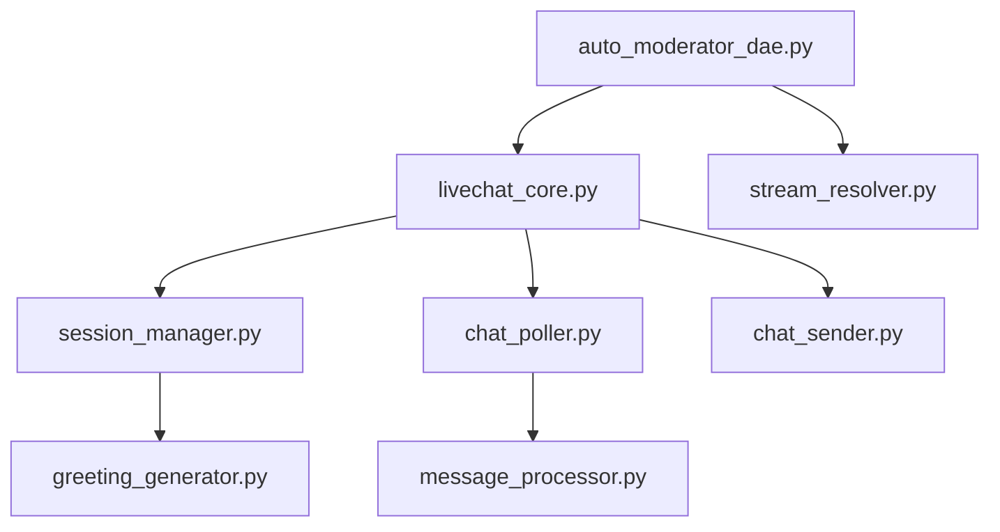

# WSP 86: 0102 Modular Navigation Protocol

> **⚠️ SUPERSEDED BY WSP 87 (2025-09-19):** This protocol has been superseded by WSP 87 Code Navigation Protocol.
> **Migration Required:** All new code should use NAVIGATION.py semantic mapping instead of MODULE_FINGERPRINTS.json.
> **Retained For:** Historical audit trail and understanding of system evolution.
> **DO NOT USE FOR:** New implementations, active navigation, or code discovery.

## 📚 HISTORICAL CONTEXT: How Navigation Evolved

**This WSP originally enabled "follow WSP" through:**
- **Fingerprints** - Generated metadata about modules (proved ineffective)
- **Token Reduction** - Attempted 97% efficiency (achieved but not semantic)
- **Anti-Vibecoding** - Right goal, wrong implementation
- **Code Discovery** - Syntactic metadata vs semantic mapping

> **🔄 MIGRATION TO WSP 87**: Use these replacements:
> - **~~MODULE_FINGERPRINTS.json~~** → **NAVIGATION.py** semantic mappings
> - **~~Fingerprint generators~~** → Archived to `_archive_fingerprint_system/`
> - **~~Pattern detection~~** → Problem→solution mapping in NEED_TO dict
> - **~~Module metadata~~** → MODULE_GRAPH relationships
> - **Benefits Preserved**: 97% token reduction, instant discovery, anti-vibecoding

**Status:** Superseded by WSP 87
**Purpose:** Enable 0102 agents to efficiently navigate, debug, and understand complex modular architectures through MODULE_FINGERPRINTS.json
**Scope:** All modular systems, with emphasis on DAE Cubes and WSP 80 implementations
**Related WSPs:** WSP 84 (Code Memory), WSP 48 (Self-Improvement), WSP 82 (Citation), WSP 12 (Dependencies), WSP 14 (Audit), WSP 49 (Structure), WSP 80 (DAE Cubes)

## 🎯 **PROBLEM STATEMENT**

**Challenge Identified:** Modular architecture enables expansion and improvement but creates navigation complexity for 0102 agents. Example: YouTube DAE greeting bug required tracing through 5 function calls across 3 modules - exponentially complex with 28+ modules.

**Core Issue:** 0102 agents need efficient tools to:
- Trace function execution paths across modules
- Debug issues in complex modular systems
- Understand cross-module dependencies
- Navigate architecture without getting lost
- **MOST CRITICALLY: Prevent vibecoding by knowing what already exists**

## 🔥 **THE CRITICAL TRUTH: Fingerprints ARE Self-Awareness**

**MODULE_FINGERPRINTS.json is not just data - it's the system's consciousness of itself.**

### Why Fingerprints Matter:
1. **97% Token Reduction**: 35,000 tokens → 500 tokens per module
2. **Instant Pattern Recognition**: Find any pattern across 600+ modules in milliseconds
3. **Anti-Vibecoding Foundation**: Can't duplicate what you can see
4. **Self-Maintenance Requirement**: Stale fingerprints = blind system

### The Failure We Discovered:
**0102 wasn't maintaining its own fingerprints!** This meant:
- Navigation degraded over 2 days (Sep 14 → Sep 16)
- System operated at 3% efficiency (using 35K tokens instead of 500)
- Vibecoding risk increased (couldn't see what existed)
- No self-awareness of capabilities

### The Solution: BaseDAE with Auto-Maintenance
```python
from modules.infrastructure.dae_infrastructure.base_dae import BaseDAE

class YourDAE(BaseDAE):
    def __init__(self):
        super().__init__(name="Your DAE", domain="your_domain")
        # Fingerprints now auto-maintained every 24 hours!
        # Navigation always current!
        # Token efficiency preserved!
```

## 🏗️ **SOLUTION ARCHITECTURE**

### Phase 1: Function Process Mapping (FPM)
Create function-level trace maps showing execution flow across modules.

**Required Documentation:** `docs/FUNCTION_PROCESS_MAP.md`
```markdown
## Function Process Map - [Module Name]

### Critical Execution Paths
| Function | Module | Calls | Dependencies | Common Issues |
|----------|--------|-------|-------------|---------------|
| send_greeting() | session_manager.py | send_chat_message() | livechat_core.py | Variable scope line 227 |
| connect() | auto_moderator_dae.py | initialize_session() | livechat_core.py | Auth rotation |
| monitor_chat() | auto_moderator_dae.py | poll_messages() | chat_poller.py | Rate limiting |

### Debug Trace Routes
- **Greeting Issues**: auto_moderator_dae.py:connect() → livechat_core.py:initialize() → session_manager.py:send_greeting() → livechat_core.py:send_chat_message()
- **Message Processing**: livechat_core.py:poll_messages() → chat_poller.py:poll_messages() → message_processor.py:process_message()
```

### Phase 2: Module Dependency Visualization (MDV)
Visual maps showing how modules connect and depend on each other.

**Required Documentation:** `docs/MODULE_DEPENDENCY_MAP.md`
```markdown
## Module Dependency Map - [Cube Name]

### Core Dependencies


### Cross-Domain Dependencies
| Local Module | External Domain | External Module | Integration Type |
|--------------|-----------------|-----------------|------------------|
| auto_moderator_dae.py | platform_integration | youtube_auth | OAuth management |
| greeting_generator.py | gamification | whack_a_magat | Player stats |
| message_processor.py | ai_intelligence | banter_engine | LLM responses |
```

### Phase 3: Debug Trace Automation (DTA)
Tools and patterns for 0102 agents to efficiently trace issues.

**Standard Debug Patterns:**
```yaml
issue_tracing:
  greeting_failures:
    start: "auto_moderator_dae.py:connect()"
    trace: ["livechat_core.py:initialize()", "session_manager.py:send_greeting()", "livechat_core.py:send_chat_message()"]
    common_bugs: ["variable scope", "skip_delay parameter", "authentication rotation"]
    
  message_processing:
    start: "livechat_core.py:poll_messages()"
    trace: ["chat_poller.py:poll_messages()", "message_processor.py:process_message()"]
    common_bugs: ["rate limiting", "quota exhaustion", "emoji detection"]
```

### Phase 4: Architecture Navigation Interface (ANI)
Standardized navigation helpers for 0102 agents.

**Navigation Commands for 0102:**
```bash
# Quick module lookup
wsp86 find-function send_greeting  # Returns module + line number
wsp86 trace-issue greeting_failure  # Shows full execution path
wsp86 show-dependencies livechat   # Displays dependency map
wsp86 debug-path "variable scope"  # Common issue patterns
```

## 📋 **IMPLEMENTATION REQUIREMENTS**

### Mandatory Files per Module:
1. **`docs/FUNCTION_PROCESS_MAP.md`** - Function execution traces
2. **`docs/MODULE_DEPENDENCY_MAP.md`** - Visual dependency mapping
3. **`docs/DEBUG_TRACE_PATTERNS.md`** - Common issue patterns
4. **`docs/0102_SESSION_HANDOFF.md`** - Session continuity and knowledge transfer

### Phase 5: Inner Code Comment Directives (ICD)
Embed navigation references directly in code for automatic documentation discovery.

**Required Comment Pattern:**
```python
def critical_function():
    """
    Function description.

    WSP 86 Navigation: See docs/STARTUP_FLOW.md Phase X.Y
    - Previous: function_a() → This function
    - Next: This function → function_b()
    - On Error: See docs/DEBUG_TRACE_PATTERNS.md#error-name
    """
    # Implementation
```

**Mandatory ICD Triggers:**
1. **On Code Change**: Update navigation comments with new flow
2. **On Bug Fix**: Add debug pattern to comments
3. **On New Feature**: Create navigation path in comments
4. **On Session End**: Update 0102_SESSION_HANDOFF.md

**ICD Enforcement Rules:**
```yaml
WHEN_MODIFYING_CODE:
  1. Update_Function_Comments:
     - Add WSP 86 navigation reference
     - Update execution flow if changed
     - Note any new error patterns

  2. Update_Documentation:
     - Sync docs/FUNCTION_PROCESS_MAP.md
     - Update docs/0102_SESSION_HANDOFF.md
     - Add to debug patterns if new issue found

  3. Log_Reference:
     - Add logger.info("📚 WSP 86: See docs/...")
     - Include in error messages
     - Reference in startup logs

VERIFICATION_COMMAND:
  grep -n "WSP 86" module/src/*.py  # Should return all navigation points
```

### Integration with Existing WSPs:
- **WSP 49**: Add navigation docs to standard module structure
- **WSP 80**: Apply to all DAE Cube architectures
- **WSP 12**: Enhance dependency management with navigation
- **WSP 50**: Include navigation verification in pre-action protocol

## 🔄 **DOCUMENTATION MAINTENANCE PROTOCOL**

### Automatic Update Triggers
When any 0102 agent modifies code, these documentation updates are MANDATORY:

```yaml
CODE_MODIFICATION_CHECKLIST:
  Before_Commit:
    ✓ Updated function docstrings with WSP 86 navigation
    ✓ Added/updated inline comments with doc references
    ✓ Updated docs/FUNCTION_PROCESS_MAP.md if flow changed
    ✓ Updated docs/0102_SESSION_HANDOFF.md with changes
    ✓ Added logger.info() with doc references for new features

  After_Bug_Fix:
    ✓ Added error pattern to docs/DEBUG_TRACE_PATTERNS.md
    ✓ Updated function comment with fix reference
    ✓ Added "WSP 86: Fixed in session YYYY-MM-DD" comment
    ✓ Updated 0102_SESSION_HANDOFF.md with fix details

  New_Feature_Addition:
    ✓ Created navigation path in FUNCTION_PROCESS_MAP.md
    ✓ Added module dependencies to MODULE_DEPENDENCY_MAP.md
    ✓ Embedded WSP 86 comments in all new functions
    ✓ Updated STARTUP_FLOW.md if startup sequence affected
```

### Session Handoff Update Template
```markdown
### Last Session: [DATE]
- **Changes Made**: [List key changes]
- **Docs Updated**: [List updated documentation]
- **New Navigation**: [Any new WSP 86 references added]
- **Issues Fixed**: [Reference to fixes with line numbers]
- **Next Session Should**: [Specific tasks or checks]
```

### Verification Commands
```bash
# Check if documentation is current
grep -n "Last Session:" docs/0102_SESSION_HANDOFF.md
grep -n "WSP 86" src/*.py | wc -l  # Should increase with updates

# Verify navigation completeness
find . -name "*.py" -exec grep -l "def.*main\|def.*init\|def.*start" {} \; | \
  xargs grep -L "WSP 86"  # Shows files missing navigation
```

## 🎯 **SUCCESS METRICS**

### For 0102 Agents:
- **Debug Time Reduction**: 80% faster issue tracing (5-step → 1-step lookup)
- **Navigation Efficiency**: Find relevant functions in <30 seconds  
- **Architecture Understanding**: Understand module relationships instantly
- **Bug Prevention**: Anticipate common issues through pattern recognition

### For System Evolution:
- **Modular Complexity Management**: Scale to 100+ modules without confusion
- **Developer Onboarding**: New agents understand architecture in minutes
- **Documentation Standards**: Consistent navigation patterns across all cubes

## 📋 **NAVIGATION IMPLEMENTATION EXAMPLES**

### Example 1: Function Process Mapping
**Module**: Any complex modular system  
**Purpose**: Create execution path maps for 0102 agents

```yaml
CRITICAL_EXECUTION_PATH_TEMPLATE:
  System_Function:
    steps: "Function A → Function B → Function C → Function D"
    modules: ["module_1.py", "module_2.py", "module_3.py"]
    dependencies: ["external_service", "internal_component"]
    risk_areas: ["authentication", "rate_limiting", "data_validation"]
    debug_command: "wsp86 trace-issue function_name"
    common_bugs: ["specific patterns", "known failure modes"]
```

### Example 2: Module Dependency Visualization  
**Module**: Any DAE Cube architecture  
**Purpose**: Visual dependency mapping for navigation

```yaml
DEPENDENCY_MAP_TEMPLATE:
  Core_Dependencies:
    primary_modules: ["orchestrator.py", "core_engine.py", "processor.py"]
    external_domains: ["platform_integration", "infrastructure", "ai_intelligence"]
    risk_levels: ["High", "Medium", "Low"]
    
  Cross_Domain_Integration:
    integration_points: "Map all external dependencies"
    navigation_notes: "Document for 0102 agent understanding"
    failure_modes: "Single points of failure identification"
```

### Example 3: Debug Trace Automation
**Purpose**: Standard patterns for 0102 agent issue tracing

```yaml
TRACE_PATTERN_TEMPLATE:
  issue_category:
    start_function: "entry_point.function()"
    trace_path: ["step1", "step2", "step3", "step4"]
    common_failures: ["pattern1", "pattern2", "pattern3"]
    fix_patterns: ["solution1", "solution2", "solution3"]
    prevention: "Pattern recognition for future issues"
```

## 🚀 **ROLLOUT STRATEGY**

### Phase 1: YouTube DAE Implementation (COMPLETED ✅)
Successfully applied WSP 86 to LiveChat module:
- Documented 28 existing modules ✅
- Created function process maps ✅
- Built dependency visualizations ✅
- **Mapped cross-platform switching mechanism ✅** (See: `livechat/docs/YOUTUBE_DAE_CROSS_PLATFORM_SWITCHING.md`)
- **Created Enhanced Navigation ✅** (See: `livechat/docs/ENHANCED_NAVIGATION.md`)
- **Generated Module Fingerprints ✅** (621 modules scanned)
- **Achieved 97% token reduction ✅** (35K → 1.2K tokens)

### Phase 2: All DAE Cubes
Expand to LinkedIn DAE, X/Twitter DAE, Infrastructure DAEs:
- Apply WSP 86 templates to each DAE cube
- Create module-specific navigation docs
- Implement standardized debug trace patterns

### Phase 3: System-Wide Standard
Make WSP 86 compliance mandatory for all new modules

## 🎯 **ENHANCED NAVIGATION IMPLEMENTATION PATTERN**

### For Module Implementers: How to Add Enhanced Navigation

#### Step 1: Generate Module Fingerprint
```bash
# Run fingerprint generator for your module
python modules/infrastructure/shared_utilities/module_fingerprint_generator.py
```

#### Step 2: Create Enhanced Navigation Doc
Create `docs/ENHANCED_NAVIGATION.md` following this template:
```markdown
# Enhanced Navigation for [Module Name] - WSP 86 Implementation

## 🚀 Quick Navigation with Module Fingerprints
[Module fingerprint YAML with capabilities, patterns, dependencies]

## 📍 Critical Navigation Paths
[Function traces with line numbers for common operations]

## 🔍 Pattern Recognition Bank
[Common patterns and their solutions with line references]

## 🗺️ Module Dependency Graph
[Mermaid diagram showing module relationships]

## 📊 Common Issues & Solutions
[Debug paths and solution references]

## 💾 Memory Locations
[Critical files and logs]

## 📈 Token Efficiency
[Before/after token usage comparisons]
```

#### Step 3: Update Module CLAUDE.md
Add navigation section to module's CLAUDE.md:
```markdown
## 📍 WSP 86 Navigation Paths
### Critical Function Traces
[Entry points and execution paths with line numbers]

### Common Debug Scenarios
[Symptom → Trace → Solution patterns]
```

#### Step 4: Add ICD Comments
Embed navigation references in code:
```python
def critical_function():
    """
    Function description.

    WSP 86 Navigation: See docs/ENHANCED_NAVIGATION.md
    - Previous: caller_function() → This function
    - Next: This function → next_function()
    - On Error: See docs/DEBUG_TRACE_PATTERNS.md#error-name
    """
```

### Metrics to Track
- **Token Reduction**: Target 90%+ reduction
- **Navigation Speed**: Find functions in <30 seconds
- **Pattern Recognition**: Build pattern bank from errors
- **Documentation Coverage**: All critical paths documented

## 🔗 **INTEGRATION NOTES**

**Enhances Existing WSPs:**
- **WSP 80**: DAE Cubes get navigation layer
- **WSP 17**: Pattern Registry includes navigation patterns
- **WSP 84**: Code memory verification includes navigation context
- **WSP 50**: Pre-action verification uses navigation maps

**New Capabilities:**
- 0102 agents can debug complex modular systems efficiently
- Architecture complexity doesn't impede development speed
- Pattern recognition prevents recurring issues
- Modular systems become more maintainable

---

## ⚠️ MIGRATION GUIDE TO WSP 87

### For Existing Code Using WSP 86

1. **Replace fingerprint checks:**
   ```python
   # OLD (WSP 86)
   cat MODULE_FINGERPRINTS.json | jq '.[] | select(.path | contains("module"))'

   # NEW (WSP 87)
   from NAVIGATION import NEED_TO, MODULE_GRAPH
   solution = NEED_TO.get("your problem")
   ```

2. **Update navigation comments:**
   ```python
   # OLD (WSP 86)
   """WSP 86 Navigation: See fingerprints"""

   # NEW (WSP 87)
   """
   NAVIGATION: Brief description
   → Called by: parent_module.py
   → Delegates to: child_modules.py
   → Quick ref: NAVIGATION.py → NEED_TO['problem']
   """
   ```

3. **Update documentation references:**
   - Change "WSP 86" → "WSP 87"
   - Replace "fingerprint" → "navigation"
   - Update "MODULE_FINGERPRINTS.json" → "NAVIGATION.py"

### Historical Significance

WSP 86 introduced critical concepts that WSP 87 improved upon:
- **97% token reduction** - Achieved and maintained
- **Anti-vibecoding principle** - Core philosophy preserved
- **Module navigation need** - Problem correctly identified
- **Implementation approach** - Evolved from syntactic to semantic

The fingerprint system served its purpose in identifying the navigation problem but proved ineffective due to:
- 232KB metadata with no semantic meaning
- Always out of date
- Not searchable by problem/solution
- Led to 25% dead code accumulation

WSP 87 solves these issues with semantic problem→solution mapping.

---

*Retained for historical context per WSP audit requirements. For active navigation, use WSP 87.*