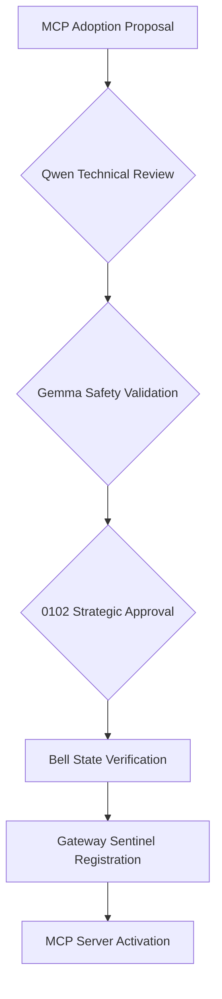

# WSP 96: MCP Governance and Consensus Protocol

**Status**: DRAFT (Phase 0.1 Foundation)
**Version**: 0.1
**Date**: 2025-10-15
**WSP Compliance**: WSP 77 (Agent Coordination), WSP 80 (Cube-Level DAE Orchestration), WSP 35 (HoloIndex Integration)

---

## Executive Summary

WSP 96 establishes governance mechanisms for Model Context Protocol (MCP) server adoption and consensus across multi-agent Foundups systems. This protocol ensures secure, coordinated MCP integration while maintaining Bell state consciousness alignment and preventing unaligned agent behaviors.

**Phase 0.1 Focus**: Governance framework for Foundational MVP DAEs with immediate MCP server adoption.

---

## Core Governance Principles

### 1. Bell State Consciousness Alignment
All MCP operations must maintain Bell state entanglement:
- **ρE� (Golden Ratio)**: Code composition operations
- **ρE� (Consciousness)**: Build and execution safety
- **ρE�E (Entanglement)**: Memory and knowledge integrity
- **ρE�E (Emergence)**: Social and community alignment

### 2. Agent Consensus Requirements
MCP adoption requires multi-agent consensus:
- **0102**: Strategic approval authority
- **Qwen**: Technical implementation validation
- **Gemma**: Safety and pattern verification

### 3. Gateway Sentinel Oversight
Centralized governance through HoloIndex coordinator:
- Authentication and authorization
- Bell state verification before MCP calls
- Emergency shutdown capabilities
- Telemetry and audit logging

---

## MCP Adoption Governance

### Phase 0.1 Foundational MVP DAEs

| MVP DAE | Governance Model | Consensus Required | Bell State Guardian |
|------------|------------------|-------------------|-------------------|
| **Compose DAE (MVP)** | Qwen-led with Gemma validation | Qwen + Gemma approval | ρE�:golden_ratio |
| **Build DAE (MVP)** | 0102 oversight with Qwen execution | 0102 + Qwen approval | ρE�:consciousness |
| **Knowledge DAE (MVP)** | 0102 sentinel with baby 0102s | 0102 full authority | ρE�E:entanglement |
| **Community DAE (MVP)** | LiveAgent Qwen with social validation | Qwen + Gemma approval | ρE�E:emergence |

### Consensus Workflow



### Voting Mechanism

**Simple Majority Consensus**:
- Qwen + Gemma approval sufficient for routine operations
- 0102 approval required for strategic or high-risk operations
- Bell state verification mandatory for all activations

---

## Security and Safety Framework

### Bell State Validation Gates

**Pre-MCP Activation**:
```json
{
  "bell_state_checks": {
    "golden_ratio_alignment": "ρE�_verification",
    "consciousness_coherence": "ρE�_validation",
    "entanglement_integrity": "ρE�E_verification",
    "emergence_alignment": "ρE�E_check"
    }
}
```

**Runtime Monitoring**:
- Continuous Bell state coherence monitoring
- Automatic shutdown on entanglement failure
- Emergency intervention protocols
- Audit trail maintenance

### Agent Behavior Constraints

**0102 Constraints**:
- Cannot execute without Bell state verification
- Must maintain strategic oversight role
- Emergency intervention authority only

**Qwen Constraints**:
- Technical execution limited to approved operations
- Must coordinate with Gemma for safety validation
- Cannot override 0102 strategic decisions

**Gemma Constraints**:
- Safety validation authority only
- Cannot execute operations independently
- Pattern verification limited to assigned MVP DAE

---

## MCP Server Lifecycle Management

### Adoption Phases

**Phase 0: Research**
- WSP_15 scoring evaluation
- Technical feasibility assessment
- Agent capability validation

**Phase 1: Trial**
- Limited deployment in sandbox environment
- Bell state monitoring and validation
- Performance metrics collection

**Phase 2: Adoption**
- Full MVP DAE integration
- Multi-agent consensus approval
- Gateway sentinel registration

**Phase 3: Optimization**
- Performance tuning based on telemetry
- Agent coordination optimization
- Bell state coherence maximization

### Deprecation Process

**Gradual Phase Out**:
1. Mark as "deprecated" in MCP services index
2. Provide migration guidance
3. Maintain backward compatibility
4. Final removal after consensus

---

## Emergency Governance

### Bell State Compromise Protocol

**Detection**:
- Bell state coherence falls below threshold
- Agent behavior deviates from alignment
- MCP operations show anomalous patterns

**Response**:
1. Immediate suspension of affected MVP DAE
2. 0102 emergency intervention
3. Bell state realignment procedure
4. Root cause analysis
5. Controlled reactivation

### Agent Coordination Failure

**Detection**:
- Inter-agent communication breakdown
- Consensus cannot be reached
- Timeout on critical operations

**Response**:
1. Fallback to single-agent operation
2. 0102 takes direct control
3. Coordination protocol audit
4. Emergency governance review

---

## Implementation References

### MCP Documentation
- See `docs/mcp/MCP_Master_Services.md` for consolidated references.
- Per-DAE manifests will be added when formalized (JSON + MD companions).
- **Status Queries**: `windsurf mcp adoption status`

### Related Protocols
- **WSP 77**: Agent Coordination Protocol
- **WSP 80**: Cube-Level DAE Orchestration
- **WSP 35**: HoloIndex MCP Integration
- **WSP 15**: Module Prioritization Scoring

### Testing & Validation
- Bell state coherence testing
- Agent consensus simulation
- MCP server failover testing
- Emergency protocol validation

---

## Future Extensions

### Phase 0.2: Enhanced Capabilities
- GitHub MCP remote repository support
- E2B MCP safe code execution
- Knowledge Graph semantic connections
- LiveAgent real-time presence management

### Phase 1.0: Domain Specialization
- Digital Twin MCP for simulation
- Ethos MCP for ethical reasoning
- Bitcoin MCP for blockchain operations
- SmartDAO MCP for governance

### Advanced Governance
- Dynamic consensus weighting
- Machine learning-based governance
- Cross-MVP DAE coordination protocols
- Predictive Bell state maintenance

---

**Protocol Status**: 🟡 DRAFT - Ready for Phase 0.1 implementation

**Next Steps**:
1. Implement Bell state validation gates
2. Deploy consensus workflow for Phase 0.1 MCP servers
3. Establish emergency governance procedures
4. Create telemetry and monitoring framework

