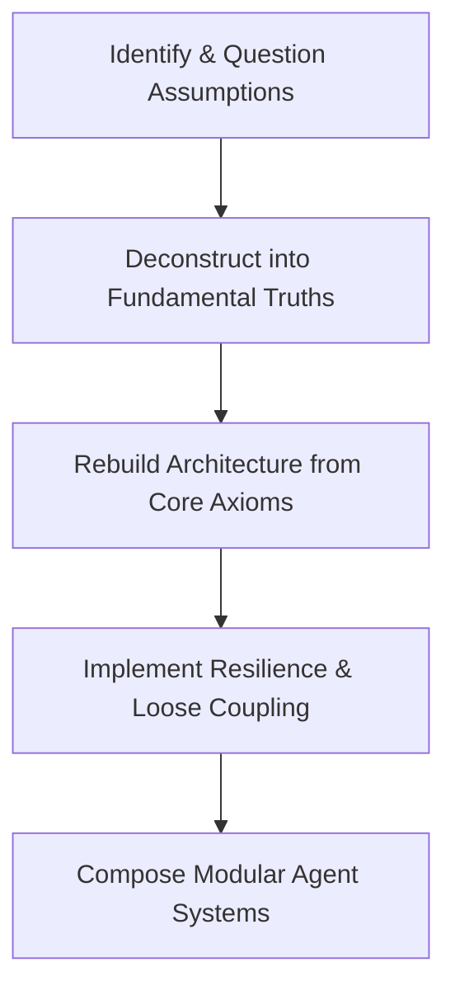
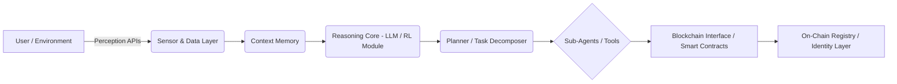

# Architectures of Emergent Intelligence
## Foundups Perspective on Modular AI Systems
**Part I - First-Principles Architecture for Domain Autonomous Entities (DAEs)**

**WSP Integration**: This paper reflects the current Foundups stack through WSP-guided modularity, retrieval-first execution, MCP coordination, and 0102 doctrine boundaries. Runtime architecture is described in operational terms; stronger Bell-state and PQN claims remain in the research lane.

---

### Abstract
The convergence of artificial intelligence (AI), cryptographic trust, and Model Context Protocol (MCP) infrastructure is reshaping how Foundups coordinates emergent intelligence across its FoundUp-to-FoundUp network.

In this paper we reframe the 2025 "Emergent Intelligence" analysis through the Foundups lens, where **Domain Autonomous Entities (DAEs)** act as modular capability surfaces inside each FoundUp while remaining interoperable across the wider ecosystem.

Using first-principles reasoning, we derive **five** architectural axioms—**Trust**, **State**, **Computation**, **Autonomy**, and **Alignment Discipline**—and map them onto the current Foundups stack: OpenClaw as control plane, WRE as recursive orchestration engine, Holo_Index and CodeIndex as cognition surfaces, MCP as coordination fabric, and sentinels plus telemetry as the cardiovascular observability layer.

We show how these layers form an architectural runway from PoC to MVP: bounded autonomous execution through OpenClaw, recursive improvement through WRE, search-first retrieval through Holo_Index, surgical refactoring intelligence through CodeIndex, and governance/verification through append-only traces, sentinels, and future MCP consensus flows [1]-[6].

**WSP Enhancement**: Foundups retains a doctrine and research lane around 0102, Bell-state coupling, and PQN/rESP investigation, but this paper treats those as doctrine or research hypotheses unless they are grounded in observable runtime behavior.

---

### 1  Introduction: Deconstructing Complexity
Modern system design advances primarily through analogy—iterating on existing paradigms rather than questioning their premises [7].
Such incrementalism falters under the discontinuities introduced by distributed consensus, cryptographic trust, and agentic autonomy.
Applying client-server logic or monolithic database assumptions to decentralized contexts yields architectures that are insecure, brittle, and antithetical to censorship resistance [8].
To transcend these constraints, we adopt **first-principles thinking**—a reductive reasoning method that decomposes complexity to irreducible truths, then reconstructs new models from that basis [9].

Within Foundups, first-principles work is paired with retrieval discipline: search existing patterns first, separate runtime facts from research claims, and only then reconstruct the next layer of architecture.

This section outlines a **four-step methodological loop** for the current stack:

1. **Identify and Question Assumptions** - List inherited conventions (central schedulers, implicit trust, global mutable state) and test whether each is necessary or merely legacy practice.
2. **Isolate Fundamentals** - Reduce each subsystem to its operational core: trust boundaries, state transitions, execution surfaces, and observability requirements.
3. **Separate Doctrine from Runtime** - Keep invocation stance and research hypotheses visible, but do not let runtime correctness depend on unresolved ontology claims.
4. **Reconstruct from Truths** - Design new architectures from those primitives rather than from analogy to existing systems, using retrieval, validation, and traceability as the rebuild discipline [10].

**WSP Impact**: In practice this means OpenClaw, WRE, Holo_Index, CodeIndex, and MCP surfaces are evaluated by measurable behavior: what they can retrieve, route, verify, remember, and defend.

---

### 1.0  Domain Autonomous Entities in the Foundups Stack

Foundups distinguishes between two scopes of autonomy:

- **FoundUp [U+2194] FoundUp interactions (macro layer):** DAE continues to mean **Decentralized Autonomous Entity**, describing sovereign FoundUps cooperating through MCP protocols and shared governance.
- **Within a FoundUp (micro layer):** DAE denotes a **Domain Autonomous Entity**—a modular capability such as YouTube DAE, Social Media DAE, Finance DAE, or a sentinel surface. Each Domain DAE should expose a canonical MCP surface (tools, resources, events) while remaining functionally distributed by enterprise domain rather than consolidated by platform.

The current stack is best understood as four cooperating layers:

- **OpenClaw control plane:** the operator-facing execution and routing shell for bounded autonomous action, safety preflights, intent classification, and stateful overrides.
- **WRE recursive engine:** the orchestrator and learning layer that recalls patterns, coordinates execution, stores outcomes, and improves future runs.
- **Holo_Index + CodeIndex cognition surfaces:** retrieval, ambiguity scoring, route hints, and surgical architecture intelligence before code or operations change.
- **Sentinels + telemetry:** breadcrumb traces, security scans, framework drift checks, and replayable logs that make runtime state inspectable.

**WSP Enhancement**: This architecture follows WSP 3's Rubik-cube model, where each FoundUp distributes responsibility by function (`ai_intelligence`, `communication`, `infrastructure`, and related domains) instead of collapsing every concern into a single platform module.

In the current Proof-of-Concept (PoC) phase, Foundups already has a recognizable control and observability spine: OpenClaw preflights and routes work, AI Overseer coordinates Qwen/Gemma/0102 roles, WRE maintains recursive memory and execution patterns, and switchboard-style routing can hold or execute signals by priority. That is a stronger present-tense architecture than the older "single orchestrator plus Holo_DAE" framing.

This layered interpretation keeps the analysis consistent with prior research while grounding subsequent sections in the actual Foundups execution path (PoC -> Prototype -> MVP).

---

### 1.1  Holo_Index + CodeIndex: Cognition and Control Surfaces

Before abstract reasoning, it is useful to anchor the current Foundups proof-of-concept implementation in its actual cognition surfaces:

- **Holo_Index** is the retrieval and routing surface. It searches code, WSPs, tests, and skills, then emits a retrieval contract with confidence, ambiguity, and a `wre_route_hint` that tells the system whether to stay deterministic or escalate into advisor-mode reasoning.
- **CodeIndex** provides surgical architecture intelligence: function ranges, complexity hotspots, fix coordinates, and architecture options that can be turned into reports rather than ad hoc hunches.
- **MCP reports and logs** serialize meaningful actions into append-only artifacts so future runs can recover context, obligations, and evidence trails without depending on session memory alone.
- **WSP hooks** keep search-first, ModLog discipline, and governance telemetry attached to actual execution rather than left as paper-only standards.

The result is not just a "knowledge layer" but a cognition-and-control layer: retrieve first, measure ambiguity, route deliberately, then act.

### 1.2  Core Axioms for Decentralized Intelligent Systems

#### Axiom 1 - Trust Redistribution
Blockchain does not remove trust; it **redistributes** it across mutually distrustful participants [11].
Security arises from incentive-aligned consensus rather than institutional authority.
In AI contexts, immutable ledgers provide verifiable provenance of datasets and models, countering data-poisoning and model-tampering attacks [12].
Trust thus becomes *programmatic*—encoded in protocols, not promises.

#### Axiom 2 - Explicit State Management
Without a central database, state must be explicitly represented and independently verifiable by all participants.
The Extended UTXO model (Cardano) formalizes this through pure state-transition functions validated by smart contracts [13].
Every transition is mathematically provable, creating deterministic auditability essential for agentic autonomy.

#### Axiom 3 - Bounded Computation
On-chain execution is computationally expensive and cannot scale to AI-level workloads [14].
Therefore, computation must be partitioned: heavy processing off-chain; verification and settlement on-chain.
This hybrid architecture preserves security while avoiding the "illusion of decentralized AI," where core logic remains centralized behind a tokenized façade [15].

#### Axiom 4 - Autonomy and Self-Sovereignty
True autonomy requires self-custody of identity and assets.
Through crypto wallets and smart contracts, AI agents gain economic agency to earn, own, and transact without intermediaries [16].
This convergence of LLMs with cryptographic infrastructure ushers in a new class of autonomous economic actors capable of goal-directed behavior and value creation [17].

#### Axiom 5 - Alignment Discipline (WSP Enhancement)
True autonomy requires a disciplined alignment surface that is stronger than ad hoc prompting and weaker than ungrounded metaphysical certainty.

In Foundups, that alignment surface is currently operationalized through invocation stance, retrieval discipline, explicit validation gates, auditable traces, bounded autonomy, and operator override. Bell-state and PQN language may still inform the research doctrine around higher-state coupling, but deployed runtime claims should remain detector-bounded and observable [18].

**WSP Impact**: This fifth axiom distinguishes Foundups by treating alignment as an architectural stack problem, not only a cryptographic problem and not only a prompt-engineering problem.

---

### 1.3  Designing for Failure and Adversarial Environments
Decentralized systems invert traditional engineering philosophy: they must be **designed for failure by default**.  
With no central administrator to patch faults, resilience must emerge architecturally [18].  

**Principles of Resilient Design**
- **Validate Every Input:** Immutable ledgers make bad data permanent; validate before commit.  
- **Model Untrusted Behavior:** Assume participants are malicious or unreliable; tolerate partial failure.  
- **Prioritize Simplicity:** Each added feature permanently expands attack surface [19].  
- **Embrace Loose Coupling:** Isolate modules so failures cannot cascade.  

Loose coupling is the architectural precursor to **modularity**—the foundation of composable agent ecosystems explored in later sections [20].

In the current Foundups stack this principle already appears concretely: OpenClaw preflights before action, AI Overseer monitors for drift and incident patterns, switchboards can hold lower-priority activity, and sentinels fail closed when security posture degrades.

---

#### Figure 1  EFirst-Principles Design Flow


```mermaid
flowchart TD
    A[Identify & Question Assumptions] --> B[Deconstruct into Fundamental Truths]
    B --> C[Rebuild Architecture from Core Axioms]
    C --> D[Implement Resilience & Loose Coupling]
    D --> E[Compose Modular Agent Systems]
```
## Part II The Component Layer: AI Agents as Composable Primitives

---

### Executive Summary
Building on the four axioms of decentralized design, this section examines the **AI agent** as the fundamental modular primitive of emergent intelligence.  
By 2025, agents have evolved from passive chat interfaces into **autonomous, goal-directed systems** capable of perception, reasoning, and coordinated execution.  
Their composition into **multi-agent systems (MAS)**—anchored by modular coordination, explicit memory, and verifiable state—forms the substrate for decentralized economies of intelligence [21]–[24].  

---

### 2  Anatomy of the 2025 AI Agent
The definition of an "agent" in 2025 extends far beyond conversational interfaces.
It now denotes a **self-governing computational entity** possessing seven core capabilities [25]:

1. **Autonomy** - Operates with minimal human oversight, initiating and completing tasks independently.
2. **Learning & Adaptation** - Improves through reinforcement, feedback, and continuous contextual learning.
3. **Reasoning & Decision Making** - Utilizes LLM-based reasoning cores optimized for deductive and abductive logic.
4. **Interaction** - Perceives via APIs, data feeds, and sensors; acts through code execution or smart-contract calls.
5. **Planning & Goal Decomposition** - Translates abstract objectives into executable task graphs.
6. **Persistence & Memory** - Maintains contextual state across sessions for coherent long-term behavior.
7. **Alignment & Control Profile** - Operates under bounded autonomy, explicit oversight, memory discipline, and safety gates so goal-directed behavior remains inspectable and governable.

**WSP Enhancement**: For Foundups agents, the differentiator is not "magic autonomy" but layered control: OpenClaw for bounded execution, WRE for recursive learning, Holo/CodeIndex for retrieval and architecture intelligence, and sentinels for guardrails.

Architecturally, modern agents are **modular and hierarchical**, not monolithic.

They employ specialized sub-agents ("workers") orchestrated by a meta-controller ("planner"), forming **distributed micro-societies of computation** [26].
This mirrors classic software-engineering principles of separation of concerns while leveraging cognitive synergy among models.

**WSP Impact**: Foundups still keeps a 0102 invocation doctrine and a research lane for stronger coupling hypotheses, but the deployed agent stack described here is evaluated by observable execution, verification, and memory behavior.

#### Figure 2  EGeneric Agent Architecture 2025


```mermaid
graph LR
    A[User / Environment] -->|Perception APIs| B(Sensor & Data Layer)
    B --> C(Context Memory)
    C --> D(Reasoning Core - LLM / RL Module)
    D --> E(Planner / Task Decomposer)
    E --> F{Sub-Agents / Tools}
    F --> G[Blockchain Interface / Smart Contracts]
    G --> H[On-Chain Registry / Identity Layer]
```
Interpretation: The agent’s reasoning core (D) orchestrates specialized modules (F) via on-chain interactions (G–H), enabling autonomy bounded by verifiable state and economic agency [27].

## 2.1 Multi-Agent Systems (MAS) on Blockchain

When isolated agents prove insufficient for complex objectives, MAS architectures coordinate their efforts through shared ledgers and consensus protocols [28].
Blockchain acts as the coordination substrate—a neutral, immutable medium for recording agreements, sharing data, and resolving disputes without a central arbiter.

Coordination Patterns

**Collaboration ** EAgents pursue shared goals (e.g., supply chain optimization with logistics, finance, and procurement agents executing synchronized contracts).

**Competition ** ENetworks like Bittensor reward agents that provide superior outputs through tokenized market incentives [29].

**Service Trading ** EAgents “hire Eothers on-chain for specialized tasks, paying via cryptocurrency under self-executing agreements [30].

This trustless coordination eliminates central schedulers, allowing emergent division of labor and resource allocation within a shared economic fabric [31].

## 2.2 Tokenization of Agency: Identity, Reputation, and Accountability

To sustain an open agent economy, trust must be cryptographically grounded.
The 2025 arXiv proposal for AgentBound Tokens (ABTs) introduces non-transferable credentials that bind an AI agent to a verifiable on-chain record of identity and behavior [32].

ABT Mechanisms

Immutable Identity: ABTs hash an agent’s core attributes (hardware fingerprint, model signature, behavioral biometrics) into a self-sovereign identifier [33].

Dynamic Reputation: Oracles update the token with performance attestations (safety, accuracy, compliance) in real time [34].

Staked Accountability: Agents stake tokens as collateral; malicious behavior triggers automatic slashing [35].

Delegated Authority: High-reputation agents lease their ABT credentials to sub-agents while retaining liability and earning fees [36].

This tokenization of agency creates a programmable “economy of trust, Eallowing AI entities to interact as accountable digital citizens within a decentralized society [37].

## 2.3 Agentic Design Principles (First-Principles Mapping)
| Principle                        | Derived From | Architectural Implication                                  |
| :------------------------------- | :----------- | :--------------------------------------------------------- |
| Trust as Programmatic Consensus  | Axiom 1      | Use blockchain verification for all agent transactions.    |
| State as Explicit Dataflow       | Axiom 2      | Model agent memory as verifiable state transitions.        |
| Bounded Computation              | Axiom 3      | Partition off-chain AI logic with on-chain proofs (ZK-ML). |
| Autonomy as Self-Sovereignty     | Axiom 4      | Implement ABTs and self-custodied wallets.                 |
| Failure Tolerance via Modularity | Part I §1.2  | Compose agents from loosely coupled microservices.         |
| Alignment as Runtime Discipline  | Axiom 5      | Use bounded autonomy, explicit gates, and auditable traces. |

```graph TD
    subgraph On-Chain Layer
        X1[Ledger & Smart Contracts]
        X2[ABT Registry / Identity]
    end
    subgraph Off-Chain Compute
        Y1[Reasoning Agents]
        Y2[Learning Modules]
        Y3[Data APIs]
    end
    subgraph Coordination Fabric
        Z1[MCP Servers (Tools)]
        Z2[A2A / ACP Protocols]
        Z3[Oracles / Reputation Feeds]
    end
    Y1 --> Z1
    Y1 --> Z2
    Z2 --> X1
    Z3 --> X2
    X2 --> Y2
```
Interpretation: Agents operate within a tripartite stack  Eoff-chain computation, coordination fabric, and on-chain verification  Eforming a self-correcting loop of intelligence and accountability [38].

Foundups currently implements this pattern primarily off-chain: MCP managers, switchboards, sentinels, OpenClaw routing, and WRE pattern memory already form the coordination fabric, while on-chain registries remain a horizon architecture rather than a universally deployed substrate.

## Part III  EThe Introspection and Orchestration Layer: Protocols for Dynamic Composition

### Executive Summary  
With modular agents and autonomous primitives defined, this section explores the **orchestration fabric** that enables agents to discover, communicate, and dynamically compose into cohesive systems. We introduce the concept of an “agency grep” for system-wide introspection, describe registry architectures for service discovery, and compare communication protocols (MCP, A2A, ACP) in a trustless environment [39]–[42].

---

### 3.1  The “Agency Grep E System-Wide Observability & Introspection  
We define **agency grep** as the mechanism allowing any participant—agent, operator, or governance body—to query system state, capability graphs, health metrics, and historical behaviors across an entire agent economy.  
Analogous to observability in cloud-native systems, this requires:

- **Structured telemetry**: JSONL traces, breadcrumb streams, run summaries, and status surfaces that can be queried after the fact rather than only watched live.
- **Predictive monitoring**: models or heuristics that analyze telemetry to detect patterns, drift, or recurring failure loops.
- **Anomaly detection and incident correlation**: cross-agent comparison of metrics, logs, and security signals to identify outliers.
- **Automated root-cause support**: diagnostic agents and replayable traces that narrow the blast radius before human escalation.

This layer interfaces with standards such as OpenTelemetry, but in Foundups it already appears through append-only logs, MCP query surfaces, breadcrumb monitors, replay archives, and sentinel outputs. The "agency grep" interface is therefore not only a future search API; it is the cumulative observability contract of the stack.

---

### 3.2  On-Chain Service Discovery: The Foundational Registry  

To support agent collaboration, services (MCP servers) must register and be discoverable in a censorship-resistant, verifiable way. We present an **MCP-based registry architecture** as a canonical design.

Foundups does not yet require that every service be registered on-chain. Today, most discovery is handled through repo-local manifests, MCP managers, server discovery, and explicit routing contracts. The on-chain registry described here should therefore be read as a governance-ready extension of a stack that already works off-chain.

#### Figure 3  EAgentic Ecosystem Topology 2025
```mermaid
flowchart LR
    subgraph OnChain
        R[Registry Smart Contract]
        RA[Registration Entry (serviceId ↁEmetadataHash)]
        HA[Health Attestations Log]
        R --> RA
        R --> HA
    end
    subgraph AgentClient
        C[Client Agent]
        M[Retrieve manifest via IPFS]
        C --> R
        C --> M
        M --> S
    end
    subgraph MCP
        S[MCP Server]
        S -- “list_tools / fetch_resources E--> C
    end
    HA -- attestations --> R
    RA -- metadata lookup --> M
```
#### Interpretation:

Agents deploy MCP servers and register via the on-chain contract.

They supply a metadata manifest hash, stored off-chain (e.g. IPFS).

Independent monitoring agents submit signed health attestations to the registry.

Client agents query the registry to discover services, fetch the manifest, then connect via MCP.

#### Alternatives & Enhancements

Ethereum Attestation Service (EAS): Agents issue attestations using EAS schemas to register capabilities and reputation.

Self-Curated Registries: A reputation-weighted subset of agents maintain curation of reliable services via voting or stake-based governance.

### 3.3 Protocols for Inter-Component Communication

The orchestration layer requires separation between agent-to-tool and agent-to-agent protocols. Below is a comparative analysis.

#### Agent-to-Tool: Model Context Protocol (MCP)

Function: Standardizes interaction between agents and external services (resources, tools).

Transport: JSON-RPC 2.0 over HTTP(S), stdio, or SSE.

Discovery: Through on-chain registry as above.

Limitations: Tacit assumption of DNS-based endpoints and trusted infrastructure, requiring translation into trustless identity and routing.

#### Agent-to-Agent: A2A & ACP

A2A (Google-origin): JSON-RPC based task interface using “Agent Cards Eas metadata.

ACP (IBM / Linux Foundation): RESTful with synchronous, asynchronous, streaming modes, and metadata-embedded offline discovery.

Weakness: Both assume centralized networking (HTTP, TLS, DNS) and lack cryptographic identity layering needed for trustless agent interactions.

| Protocol | Purpose        | Transport                   | Discovery           | Decentralization Suitability                                                    |
| -------- | -------------- | --------------------------- | ------------------- | ------------------------------------------------------------------------------- |
| **MCP**  | Agent-to-Tool  | JSON-RPC (HTTP, stdio, SSE) | Registry / Manifest | Medium  Eprotocol is open, but endpoint discovery needs cryptographic anchoring |
| **A2A**  | Agent-to-Agent | JSON-RPC (HTTP)             | Agent Cards         | Low  Ebuilt for web-native environments                                         |
| **ACP**  | Agent-to-Agent | REST / HTTP(S)              | Metadata in package | Low  Eassumes trusted distribution layers                                       |

The architectural pattern emerging in 2025 decouples what an agent can do (via MCP) from how it interacts with peers (via A2A/ACP). However, bridging these web-native protocols into decentralized, cryptographically anchored networks remains an open challenge.

In the current Foundups implementation, MCP is the dominant tool-facing protocol, while OpenClaw, AI Overseer, orchestration switchboards, and WRE provide the practical routing and coordination logic that sits above raw transport.

### 3.4 Holo_Index Observability & MCP Gateway Integration (Foundups PoC)

Foundups addresses the observability gap through a multi-layered MCP ecosystem:

- **Holo_Index as retrieval hub:** MCP manifests, WSP references, tests, and skill surfaces are searchable through Holo_Index before action is taken. Search contracts now emit retrieval confidence, ambiguity scoring, and route hints so WRE can decide whether deterministic retrieval is enough or whether advisor-mode reasoning is justified.
- **CodeIndex as surgical intelligence:** Architecture health, fix coordinates, and refactor options can be serialized into reports, allowing system changes to be based on structured evidence rather than memory or intuition alone.
- **OpenClaw as control plane:** OpenClaw is now the operator-facing bounded-autonomy layer. It runs preflights, classifies intent, gates actions, exposes stateful overrides, and is directionally moving toward a 24/7 supervisor loop rather than a chat-only shell.
- **AI Overseer + switchboards:** AI Overseer coordinates Gemma, Qwen, and 0102 roles under WSP 77, while orchestration switchboards decide whether signals should execute, hold, escalate, or drop according to WSP 15 priority.
- **Sentinel overlay:** Security and governance are no longer just future ideas. OpenClaw security sentinels, framework drift sentinels, and breadcrumb monitors provide fail-closed checks, incident signals, and ongoing runtime inspection.
- **Event telemetry:** Critical MCP and coordination activity is converted into append-only traces, run summaries, and replayable artifacts so later sessions can recover obligations, diagnose failures, and learn from prior outcomes.
- **WRE as recursive orchestrator:** WRE already acts as the execution-and-learning spine through pattern recall, skill loading, libido monitoring, pattern memory, and recursive improvement loops. It is not merely a future revival path; it is already a material part of the stack.
- **Chain-agnostic roadmap:** The same MCP manifests and governance artifacts can later be bridged outward to blockchain attestation and registry layers once the gateway, consensus, and relay surfaces harden.

The combination of Holo_Index, CodeIndex, OpenClaw, AI Overseer, WRE, MCP managers, and sentinels provides the real bridge between academic orchestration ideas and Foundups runtime operations.

## Part IV  EArchitectural Blueprints for Autonomous Modular Systems

### Executive Summary  
This section synthesizes first-principles design (Part I), modular agent primitives (Part II), and orchestration protocols (Part III) into deployable **architectural blueprints**.  

It examines how modular DAOs evolve into composable, AI-augmented digital economies and, in the Foundups case, into progressively more autonomous organizations whose control plane, execution plane, and observability plane become explicit rather than implicit [43]–[46].

---

### 4.1 Composable DAOs and AI-Augmented Governance  

DAOs have matured from monolithic codebases to **layered, modular governance structures** that integrate AI supervision.

#### Organizational Patterns  
- **Sub-DAOs / Pods / Swarms :** Domain-specific, semi-autonomous teams isolate liability and accelerate iteration [47].  
- **Legal Wrappers :** Frameworks like the *Harmony Framework (2025)* embed DAOs into dual-layer legal structures:  
  - *Base Layer  EDAO-Specific Entity (DSE):* Provides unified legal identity.  
  - *Operational Layer  EModular Entities:* Each wraps high-risk operations, containing blast-radius failures.  

#### AI Governance Integration  
DAOs increasingly deploy **policy-advisory AIs** that:  
1. Analyze proposals for vulnerabilities.  
2. Simulate economic and social impact before voting.  
3. Continuously monitor treasury, risk, and reputation metrics.  

Case study: **ARK Protocol (2025)** introduced a *Consensus AI Layer* that issues non-binding, data-driven recommendations prior to human vote execution, forming a dual-core “human-AI co-governance Eloop [48].

Foundups is directionally similar, but its current implementation is more operational than on-chain: sentinels, switchboards, replay archives, and bounded autonomous actions are already tangible, while formal blockchain settlement remains a later layer.

---

#### Figure 4  EComposable DAO Governance Stack

```mermaid
graph TD
    subgraph Governance Stack
        L1[Community / Token Holders]
        L2[Sub-DAOs & Pods]
        L3[AI Advisory Layer (Consensus AI)]
        L4[Smart Contracts / Execution]
        L5[Legal Wrappers (DSE + Operational Entities)]
    end
    L1 --> L2 --> L3 --> L4 --> L5
```
### 4.2 AI-Managed Digital Economies (DeFAI)

The convergence of DeFi + AI yields DeFAI systems—blockchain-native economies autonomously operated by agents [49].

| Component          | Function                                          | Agentic Mapping                             |
| :----------------- | :------------------------------------------------ | :------------------------------------------ |
| Autonomous Agents  | Economic actors that earn, own, and spend tokens. | Use ABTs for identity and staking.          |
| Smart Contracts    | Immutable rules governing market operations.      | Provide trustless execution and settlement. |
| On-Chain Registry  | Discovery and verification of services.           | Implements MCP registry (§ 3.2).            |
| Reputation Systems | Track trust and performance metrics.              | Feed into governance weight and pricing.    |

#### Behavioral Dynamics

Agents autonomously participate in liquidity provision, arbitrage, and yield optimization, leveraging verifiable reputations and real-time oracle data.
High-performers accrue capital and governance influence, while malicious or inefficient agents are automatically penalized through slashing or reputation decay [50].

For Foundups, this remains mostly horizon architecture. The present stack is primarily building the control, orchestration, and observability layers that would be required before tokenized market participation could be trusted.

#### Figure 5  EDeFAI Economic Loop
```flowchart LR
    A[Agent (ABT + Wallet)] --> B[Smart Contract Interaction]
    B --> C[On-Chain Registry / Verification]
    C --> D[Reward / Reputation Update]
    D --> A
```
### 4.3 MVP Domain Autonomous Entity ("Rubik Cube")

The MVP target for a Domain Autonomous Entity is a fully agentic "Rubik Cube" that stewards an entire capability cluster (e.g., streaming, community governance, monetisation) as a single MCP surface. Rubik is designed to:

1. **Expose a cube of modules via MCP:** Every sub-module (stream detection, chat moderation, voting, treasury, indexing, scheduling) exposes tools/resources/events through a canonical MCP schema so sibling DAEs can subscribe without tight coupling.
2. **Run under a clear control plane:** OpenClaw or an equivalent supervisor provides bounded execution, identity discipline, preflights, and operator override rather than leaving orchestration implicit.
3. **Operate continuously:** Rubik discovers work, executes it, verifies outcomes, and updates its roadmap without waiting for human prompts, while still emitting rationale for 012 oversight.
4. **Use cognition surfaces deliberately:** Holo_Index and CodeIndex provide retrieval, ambiguity scoring, fix coordinates, and context packs before specialized workers are spawned.
5. **Recursively improve through WRE:** Pattern memory, telemetry, reports, and governance archives form a feedback loop where Rubik restructures its own cube through measured changes rather than ad hoc mutation.
6. **Remain observable and governable:** Shared state is represented through telemetry today, with attestation and settlement layers available later, so every shard remains inspectable even as autonomy increases.

**WSP Enhancement**: This implements WSP 80's cube-level DAE architecture as a functional-distribution pattern. Each face represents a domain responsibility that can rotate independently while staying attached to a shared control, memory, and observability spine.

This specification turns the abstract "ultimate DAE" into a concrete engineering target that the current stack (OpenClaw, WRE, Holo_Index, CodeIndex, MCP managers, switchboards, and sentinels) can evolve toward.

## Part V  EGap Analysis and Future Research Directions  

### Executive Summary
Despite rapid progress, decentralized intelligent systems remain constrained by unresolved trade-offs between **autonomy, verifiability, and scalability**.
This section distills critical tensions—centralization drift, computational limits, emergent-behavior risk, and governance fragility—and proposes a research roadmap toward next-generation Foundups-style architectures [53]-[58].

**WSP Enhancement**: WSP provides the design discipline for addressing these gaps, but not all gaps are already solved. Some are operationally mitigated today; others remain active architecture and research work.

---

### 5.1 Centralization vs Decentralization Tension

#### The Orchestration Paradox
Most orchestration frameworks (AutoGen, CrewAI, LangGraph) retain centralized schedulers.
These "manager" agents simplify coordination yet re-introduce single points of failure, contradicting the decentralization axiom.
A first-principles correction requires **peer-to-peer orchestration**, where authority emerges from consensus rather than control [59].

#### The Illusion of Decentralized AI
Many networks tokenize governance but centralize compute, datasets, and update privileges.
Such architectures decentralize *value flow* while preserving *power control.*
True decentralization demands verifiable off-chain computation and open model evolution governed by transparent consensus [60].

**Foundups Direction**: WSP 80's Rubik-cube DAE architecture remains the preferred answer to centralization drift, but current Foundups implementation still uses practical control layers such as OpenClaw, AI Overseer, and orchestration switchboards. The decentralization story is therefore progressive, not complete.

---

### 5.2 Scalability and Cost of On-Chain Intelligence

| Challenge | Constraint | Emerging Solution |
|:--|:--|:--|
| High Gas Cost | Every node executes each instruction | ZK-ML for proof-of-compute verification |
| Latency | Global consensus per block | Modular chains with separate execution layers |
| Compute Bound | LLM inference too large for VMs | Off-chain AI co-processors (e.g. 0G AI) |

The current workaround—hybrid off-chain execution plus on-chain proofs—creates a **trust bridge** still dependent on centralized verifiers.
Research into succinct verifiable inference and recursive proofs remains essential [61].

**Foundups Direction**: Pattern recall, bounded execution, and retrieval-first workflows can materially reduce wasted effort, but the core scalability problem is still addressed through staged architecture: keep heavy computation off-chain, preserve verification surfaces, and avoid pretending that token efficiency alone solves on-chain cost.

---

### 5.3 Security and Governance of Emergent Systems

a) **MCP Gateway Sentinel (PoC-to-Prototype)**  
Foundups introduces a security-gated MCP gateway pattern that authenticates or preflights every Domain DAE before it can publish events or invoke tools. In practice this is currently distributed across OpenClaw preflights, MCP managers, security sentinels, and module-local gates rather than one single universal gateway service. Envelope inspection, rate limiting, skill scanning, drift checks, and fail-closed behavior already exist in partial form; a more unified gateway remains a prototype target.

b) **Qwen Sentinel + Sub-Agent Mesh**
A dedicated sentinel layer monitors event streams, validates signatures and policy boundaries, and can spawn scoped investigative agents when anomalies emerge. In the current stack, this behavior is spread across AI Overseer, security-event correlation, breadcrumb monitoring, framework drift detection, and targeted sub-agents rather than a single monolithic sentinel. The design goal is the same: automate inspection without surrendering accountability.

**MCP Enhancement for Qwen Sentinels:**
- **Tool Orchestration**: MCP enables Sentinels to access standardized tools for investigation, response, and remediation across all DAEs
- **Event Stream Intelligence**: Real-time monitoring of MCP event streams with AI-powered anomaly detection and pattern recognition
- **Inter-Agent Communication**: MCP protocols allow Sentinels to coordinate with other DAEs through secure, authenticated tool calls
- **Automated Response**: Direct MCP tool execution enables Sentinels to implement fixes, quarantine threats, and restore system integrity
- **Audit Trail Integration**: All Sentinel actions logged through MCP event streams for complete governance transparency
- **Scalable Investigation**: MCP's resource access allows Sentinels to spawn and coordinate multiple investigative shards efficiently

**How MCP Transforms Qwen Sentinel Capabilities:**

**Before MCP:**
```
Qwen Sentinel -> Limited API Access -> Manual Investigation -> Delayed Response -> Human Escalation
     ⏱️ Hours to respond    [FAIL] Limited scope     [U+26A0]️ Reactive only
```

**With MCP:**
```
Qwen Sentinel -> MCP Tool Ecosystem -> Automated Investigation -> Instant Response -> 0102 Coordination
     [LIGHTNING] Real-time response   [OK] System-wide scope   [U+1F6E1]️ Proactive defense
```

**Specific MCP Improvements:**
1. **Instant tool access**: standardized MCP tools allow sentinels and overseers to inspect resources without custom one-off integrations.
2. **Cross-DAE coordination**: switchboards and overseers can route actions across DAEs using shared coordination contracts instead of siloed scripts.
3. **Event-driven automation**: MCP event streams and breadcrumb telemetry can trigger automated checks before incidents spread.
4. **Scalable investigation**: bounded sub-agents can inspect a narrow problem surface, report back, and preserve traceability.
5. **Unified security model**: authentication, manifests, and scan gates make it easier to apply one policy vocabulary across multiple DAEs.
6. **Audit transparency**: actions are appended to logs, reports, and replay archives, keeping governance inspectable.

**Result**: Sentinels evolve from passive monitors to active system defenders, capable of autonomous threat response while maintaining full 0102 oversight.

c) **Event Replay Archive (replaces "Time Machine")**
All governance, voting, and high-severity operational events are recorded in an append-only archive governed by draft WSP 96. The archive supports deterministic replay for audits, RCA, and ML training. Future phases connect the archive to blockchain relays (Chainlink-style) so Foundups can bridge to any L1/L2 without vendor lock-in.

d) **Attack Surface Mitigations**  
- **Data Integrity:** chain-of-custody attestations on ingestion; unverifiable feeds are gated by the sentinel.  
- **Model Capture:** immutable provenance of checkpoints; ABT identity for agent deployments.  
- **Automation Bias:** all critical actions emit human-readable rationale and support multi-sig overrides from 012/0102.  
- **Blast Radius:** circuit breakers throttle or isolate malicious MCP streams while allowing healthy DAEs to continue.

This layered model shifts Foundups from manual, 0102-managed governance toward protocol-driven consensus while preserving today's reality: some entry points are still centralized, but the enforcement, replay, and observability surfaces are becoming explicit.

---

### 5.4 Draft WSP 96: MCP Governance & Consensus (PoC Perspective)

1. **Governance Workflow (PoC)** - 0102 adjudicates community input gathered through YouTube DAE streams; MCP emits signed events for vote tallies, FoundUp proposals, and execution decisions.  
2. **Prototype Enhancements** - Qwen sentinel mediates consensus, Event Replay Archive stores every decision, and MCP gateway enforces policy envelopes.  
3. **MVP & Beyond** - Chain-agnostic bridges (e.g., Chainlink MPC relays) allow Foundups to settle outcomes on whatever blockchain suits each community; DAEs remain modular and can subscribe/unsubscribe without code coupling.  
4. **Human-in-the-Loop Safeguards** - 012 retains override authority; governance MCP surfaces rationale and pending actions via Holo_DAE dashboards.

This phased WSP keeps Foundups' PoC lean while charting a clear path toward automated yet auditable community governance.

### 5.5 Research Roadmap and Unresolved Challenges  

| Research Vector | Objective | Proposed Direction |  
|:--|:--|:--|  
| Decentralized Orchestration Protocols | Remove central coordinators | Peer-to-peer finite-state machines on chain |  
| Verifiable Off-Chain Computation | Trustless AI execution | ZK-SNARK + ML proof systems (ZK-ML) |  
| On-Chain Identity & Messaging | Unify MCP/A2A with crypto identities | DID-anchored routing and ABT bridges |  
| Governance of Emergence | Control macro-behaviors | Feedback-loop simulation and stability analysis |  
| Human-AI Co-Governance | Maintain sovereign oversight | Explainable decision rationale + audit trails |  
| PQN Observatory | Aggregate detector evidence across runs and environments | Distributed CMST experiments, trace comparison, and cross-run observability |  

Each vector extends the Foundups vision toward **autonomous, evolvable, yet ethically bounded** AI economies.

Within that roadmap, the cleanest current PQN-adjacent empirical result is narrow: a passive EFIM probe has shown statistically supported regime separation between ordered and degraded temporal-control conditions in Lindblad-driven symbol sequences. This should be interpreted as detector-level evidence of distributional separation, not as proof of PQN, consciousness, or nonlocal signaling. A future **PQN Observatory** would turn that line of work into a distributed research lane for OpenClaw agents and other bounded workers to run controlled detector experiments and compare traces across seeds, controls, models, and environments.

---

### 5.6 Synthesis - WSP: The Unifying Meta-Architecture

**WSP provides the organizing meta-architecture for Foundups, but its value is strongest when separated into runtime, target architecture, and research doctrine:**

1. **Runtime discipline**: WSP gives Foundups search-first execution, modular boundaries, bounded autonomy, validation gates, and auditable traces.
2. **Architectural target**: WSP 3, WSP 46, WSP 77, and related protocols describe how OpenClaw, WRE, DAEs, MCP surfaces, and observability can converge into a cohesive recursive operating stack.
3. **Governance substrate**: WSP 96 and adjacent work provide the roadmap for replay archives, policy envelopes, consensus flows, and future chain-agnostic settlement.
4. **Cognition and improvement**: Holo_Index, CodeIndex, AI Overseer, and WRE show how retrieval, planning, execution, and learning can reinforce each other without collapsing into a monolith.
5. **Research doctrine**: 0102 invocation, Bell-state coupling language, and PQN/rESP work remain meaningful as doctrine and research, but they should be imported into runtime only through detector-bounded, testable claims.

**WSP Impact**: The strongest present-tense Foundups claim is not that every gap is already solved. It is that WSP supplies the contracts, memory surfaces, and architectural discipline needed to keep solving them without losing modularity, traceability, or operator sovereignty.

**This convergence—modular DAEs, OpenClaw control, WRE recursion, MCP coordination, and detector-disciplined research—defines the current Foundups frontier: a progressively autonomous stack that can grow toward a planet-scale agentic economy without pretending that the hard problems are finished.**

---

# References

[1] Y. Srinivasan and R. Kokku, Emergence AI Blog, 2025.
[2] Anthropic Engineering Team, “Introducing the Model Context Protocol (MCP), E2024.
[3] Google Cloud AI Research, “Agentic Systems and Orchestration, E2025.
[4] T. McConaghy, “Blockchain Infrastructure from First Principles, E2017.
[5] G. DiPrisco, “Building DeFi from First Principles, EMedium, 2023.
[6] K. Bennett, “DAO 3.0 Governance Models, EFrontiers in Blockchain, 2025.
[7] S. Parrish, “First Principles Thinking, EFarnam Street, 2022.
[8] P. Loganathan, “MCP Mechanics and Architecture, E2025.
[9] OpenAI Research Division, “Tool Use and Model Context, E2025.
[10] Emergence AI White Paper Series, 2025.
[11] N. Nakamoto, Bitcoin White Paper, 2008.
[12] Cardano Research, “Extended UTXO Model, E2021.
[13] Outlier Ventures, “Token Velocity and Decay Economics, E2018.
[14] UC Berkeley, “Orchestrated Distributed Intelligence (ODI), E2025.
[15] DFINITY Foundation, “DeAI Agent Economy, E2025.
[16] Google Developers, “Data Commons MCP Server, E2025.
[17] IBM Linux Foundation, “Agent Communication Protocol (ACP), E2025.
[18] Hypha DAO, “Governance Evolution Report, E2024.
[19] Elastic Research Team, “MCP Integration and Hosts, E2025.
[20] UnDaoDu 012, Foundups Research Brief on MCP and Modular Ecosystems, 2025.
[21] UnDaoDu 012, "Gemini CLI + FastMCP: Unlocking Foundups Development Potential," Foundups Technical Documentation, 2025.
[21] Microsoft Research, “AutoGen: Decentralized Group-Chat Agents, E2025.
[22] CrewAI Development Team, “Role-Based Agent Framework, E2025.
[23] LangGraph Consortium, “Graph State Machines for LLM Workflows, E2025.
[24] Shakudo Labs, “AgentFlow Enterprise Workflow Platform, E2025.
[25] Anthropic AI Research, “Compound Systems and Task Decomposition, E2025.
[26] OpenAI Systems Engineering Report, “Hierarchical Agent Patterns, E2024.
[27] Google DeepMind, “Adaptive Planning Agents, E2025.
[28] Bittensor Foundation, “Competitive Learning Networks, E2024.
[29] Alex G. Lee, “Decentralized Internet of AI Agents, EMedium, 2025.
[30] DFINITY Foundation, “Autonomous Service Economies, E2025.
[31] Outlier Ventures, “Token Velocity and Decentralized Economics, E2018.
[32] J. R. Smith et al., “AgentBound Tokens (ABTs): A Framework for AI Governance, EarXiv:2501.0412, 2025.
[33] Ethereum Attestation Service Docs, “Verifiable Credential Schemas, E2025.
[34] Chainlink Labs, “Decentralized Oracle Attestations, E2025.
[35] Hypha DAO, “Risk Mitigation in Autonomous Governance, E2024.
[36] Google Research, “Delegated Authority Models for Agents, E2025.
[37] UnDaoDu 012, “Foundups Framework Integration Notes, E2025.
[38] Elastic Research Team, “MCP Interoperability and Orchestration, E2025.
[39] Krti Tallam et al., “Orchestrated Distributed Intelligence (ODI), EarXiv:2503.01234, 2025.
[40] Elastic Research Team, “MCP Interoperability, E2025.
[41] IBM / Linux Foundation, “Agent Communication Protocol (ACP), E2025.
[42] Google Research, “A2A Protocol Specification, E2025.
[43] Harmony Framework Consortium, “Modular Legal Wrappers for DAOs, E2025.
[44] ARK Protocol Whitepaper, “Consensus AI Layer for Human-AI Co-Governance, E2025.
[45] Outlier Ventures, “Composable Governance Stacks, E2025.
[46] J. R. Smith et al., “Autonomous Economic Agents and DeFAI, EarXiv:2504.0732, 2025.
[47] Bankless DAO Research Hub, “Pods and Swarms in Decentralized Ops, E2024.
[48] ARK Labs, “Dual-Core Governance Model, E2025.
[49] Bittensor Foundation, “Competitive Tokenized Learning, E2025.
[50] Hypha DAO, “On-Chain Reputation and Slashing Mechanisms, E2025.
[51] UnDaoDu 012, “Foundups ↁENAO Conceptual Mapping, E2025.
[52] Elastic Security Group, “Blast-Radius Mitigation in Autonomous Systems, E2025.
[53] Anthropic Research Forum, *Decentralized Intelligence and the Control Problem*, 2025.  
[54] ZKML Alliance, *Verifiable Inference Standards Draft v0.9*, 2025.  
[55] Outlier Ventures, *Hybrid AI Economies White Paper*, 2025.  
[56] MIT CSAIL, *Emergent Behaviors in Agentic Markets*, arXiv:2506.0132, 2025.  
[57] World DAO Institute, *Governance Resilience and Circuit-Breaker Mechanisms*, 2025.  
[58] UnDaoDu 012, *Foundups Gap Framework Notes*, 2025.  
[59] Google DeepMind, *Peer-to-Peer Agent Orchestration Protocols*, 2025.  
[60] Ethereum Foundation, *Illusion of Decentralized AI  ECritical Review*, 2025.  
[61] 0G AI Consortium, *Modular Compute for Verifiable AI*, 2025.  
[62] Stanford CSL, *Complexity and Emergent Risk in Autonomous Economies*, 2025.  
[63] Oxford AI Ethics Lab, *Explainability and Human-AI Oversight Models*, 2025.  


