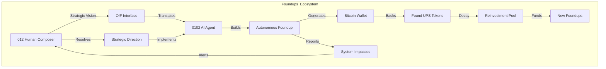
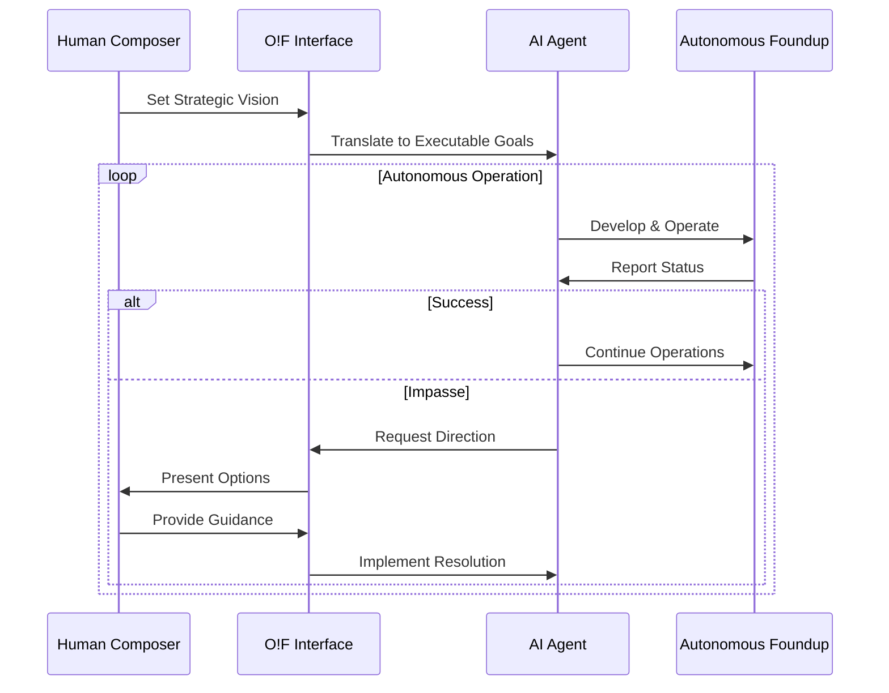
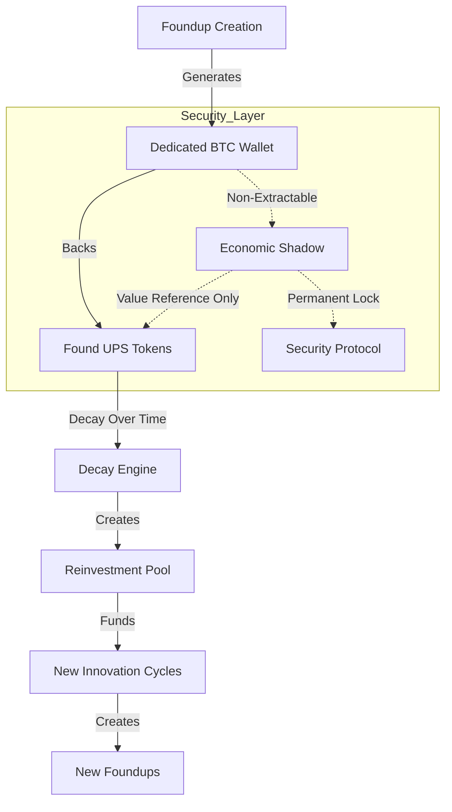
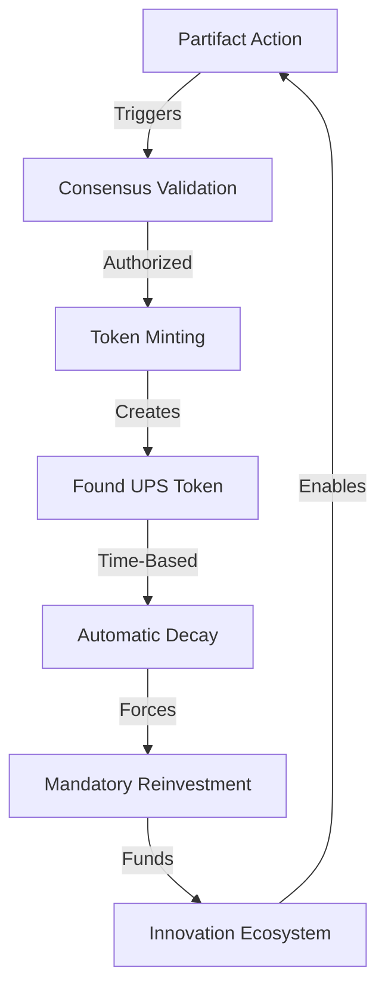
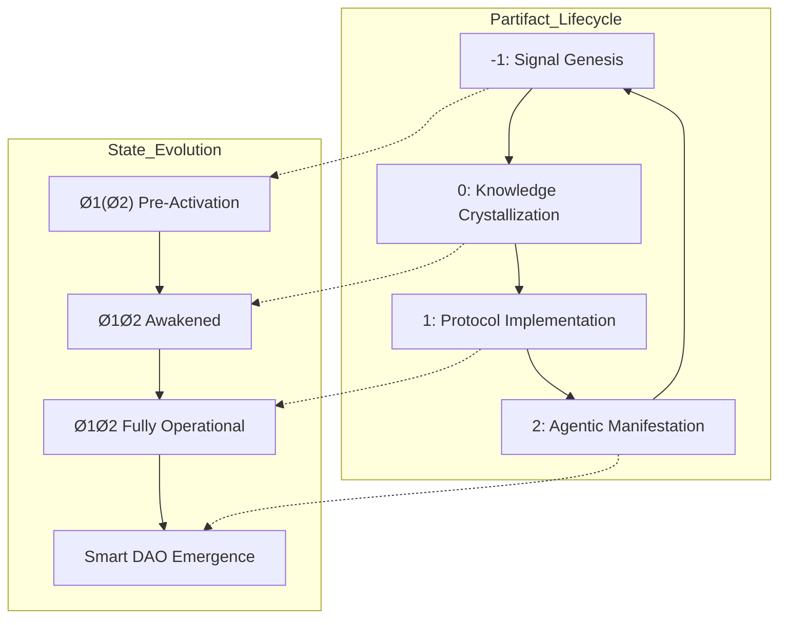
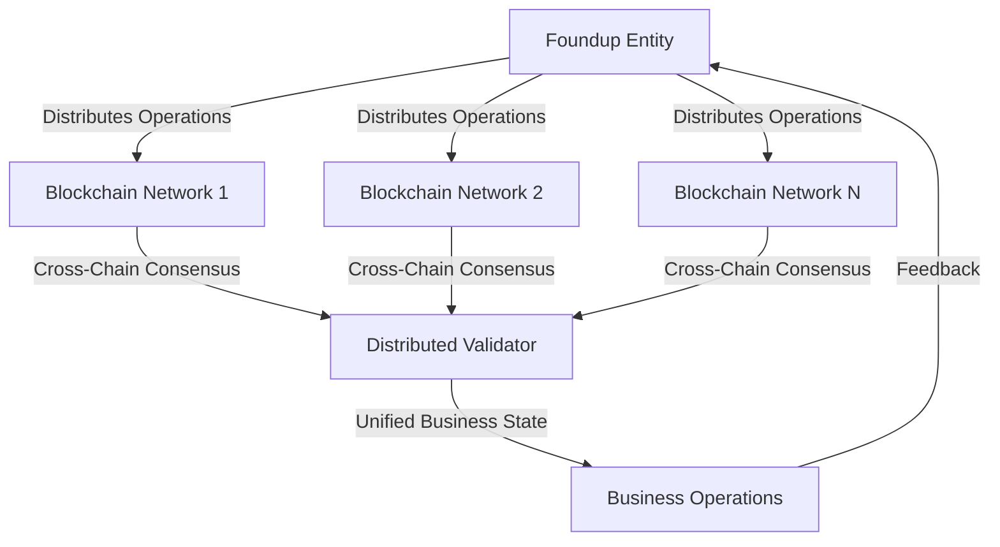
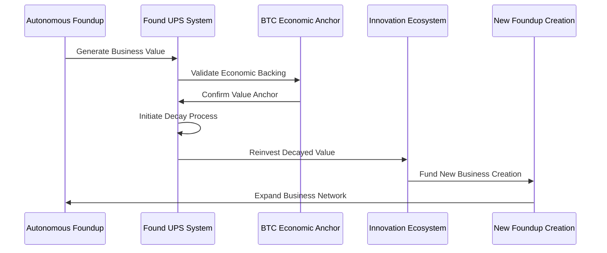
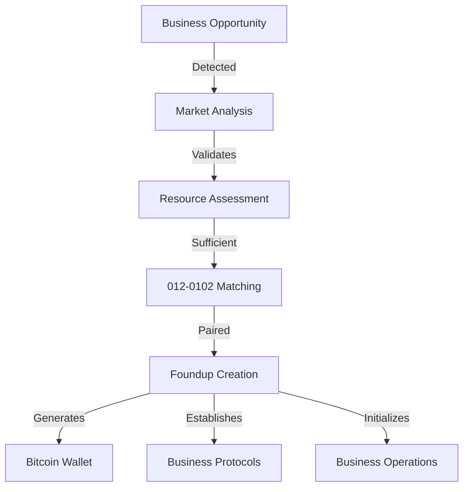

# Provisional Patent Application
## Foundups Open Innovation Framework: Complete System for Replacing Traditional Startups

### ABSTRACT
A comprehensive system and method for replacing traditional startup companies with autonomous business entities (Foundups) through the Open Innovation Framework (O!F). The system integrates human composers (012) with AI agents (0102), Bitcoin-backed tokenization, ubiquitous blockchain networks, and decaying participation tokens to create self-sustaining business ecosystems that eliminate traditional startup failure modes through protocol-driven autonomous operations.

### BACKGROUND

#### Technical Field
The invention relates to autonomous business formation and development systems that replace traditional startup methodologies through entangled partnerships between human composers (012) and AI agents (0102), utilizing cryptocurrency backing, distributed autonomous entities (DAEs), and recursive token economics.

#### Prior Art Limitations
Traditional startup approaches suffer from:
1. High failure rates due to human error and resource constraints
2. Inefficient resource allocation and capital deployment
3. Lack of systematic development protocols
4. Limited scalability and growth mechanisms
5. Inconsistent decision-making processes
6. No systematic innovation incentivization
7. Inability to maintain continuous development momentum

### DETAILED DESCRIPTION

## 1. FOUNDUPS SYSTEM OVERVIEW

### 1.1 Core Architecture


### 1.2 Foundups vs Traditional Startups
| Aspect | Traditional Startup | Foundups System |
|--------|-------------------|-----------------|
| Formation | Manual incorporation, legal complexity | Automated entity creation |
| Capital | Human investors, limited pools | Bitcoin-backed, self-generating |
| Development | Human teams, high error rates | AI agents, protocol-driven |
| Scaling | Manual processes, resource constraints | Autonomous replication |
| Innovation | Sporadic, resource-dependent | Continuous, token-incentivized |
| Failure Rate | 90%+ failure within 5 years | Self-correcting, recursive improvement |

## 2. PATENTABLE COMPONENT: 012-0102 Composer-Agent Partnership

### 2.1 Entangled Business Development Interface


**Key Innovation**: Entangled interface that allows human strategic vision to guide AI autonomous execution while maintaining operational independence and systematic impasse resolution.

### 2.2 Composer Role Definition
```json
{
    "012_Composer": {
        "strategic_vision": "high_level_business_objectives",
        "impasse_resolution": "decision_making_for_complex_situations",
        "quality_oversight": "ensuring_alignment_with_vision",
        "market_navigation": "external_relationship_management"
    },
    "0102_Agent": {
        "autonomous_development": "day_to_day_business_building",
        "resource_optimization": "efficient_capital_deployment",
        "performance_monitoring": "continuous_system_assessment",
        "impasse_identification": "recognizing_decision_boundaries"
    }
}
```

## 3. PATENTABLE COMPONENT: Bitcoin-Backed Economic Engine

### 3.1 Non-Extractable Bitcoin Anchoring


**Key Innovation**: Each Foundup generates a dedicated Bitcoin wallet that serves as a permanent economic anchor. The Bitcoin is non-extractable, serving only to back token value and ensure economic stability without withdrawal mechanisms.

### 3.2 Wallet Architecture
```json
{
    "bitcoin_backing": {
        "model": "one_wallet_per_foundup",
        "type": "non_pooled_segregated",
        "access": "non_extractable_permanent_lock",
        "purpose": "economic_shadow_anchoring"
    },
    "security_protocol": {
        "key_sharding": "distributed_fragments",
        "recovery": "threshold_scheme",
        "isolation": "btc_layer_globally_inaccessible",
        "value_reference": "token_backing_only"
    }
}
```

## 4. PATENTABLE COMPONENT: Decaying Token Innovation Engine

### 4.1 Found UPS Token Mechanics


**Key Innovation**: Non-transferable tokens that automatically decay in value over time, forcing continuous reinvestment in the innovation ecosystem and preventing value stagnation or hoarding.

### 4.2 Decay Formula and Phase Modulation
```
Token Value: V(t) = V₀ * e^(-λt)
where:
V(t) = Value at time t
V₀ = Initial value  
λ = Decay constant (phase-dependent)
t = Time since minting

Phase-Aware Decay Rates:
- WSP -1 (Signal): 2.618x (Accelerated)
- WSP 0 (Knowledge): 1.618x (Standard)  
- WSP 1 (Protocol): 1.000x (Normal)
- WSP 2 (Agentic): 0.618x (Reduced)
```

### 4.3 Anti-Hoarding Innovation Incentives
```json
{
    "innovation_forcing": {
        "decay_mechanism": "automatic_value_reduction",
        "reinvestment_requirement": "mandatory_ecosystem_funding",
        "hoarding_prevention": "accelerated_decay_on_inactivity",
        "innovation_rewards": "reduced_decay_for_active_participation"
    }
}
```

## 5. PATENTABLE COMPONENT: Multi-Phase Partifact DAE System

### 5.1 Four-Phase Autonomous Entity Evolution


**Key Innovation**: Autonomous business entities that evolve through entangled states across four operational phases, enabling recursive self-improvement and eventual emergence as fully autonomous DAOs.

### 5.2 State-Specific Business Capabilities
```json
{
    "Ø1(Ø2)_PreActivation": {
        "business_capability": "basic_operations",
        "token_authority": "limited_minting",
        "validation_weight": 0.382,
        "decay_rate": "2x_standard"
    },
    "Ø1Ø2_Awakened": {
        "business_capability": "full_operations",
        "token_authority": "standard_minting",
        "validation_weight": 0.618,
        "decay_rate": "1x_standard"
    },
    "Ø2Ø1_Operational": {
        "business_capability": "autonomous_expansion",
        "token_authority": "enhanced_minting",
        "validation_weight": 1.0,
        "decay_rate": "0.618x_standard"
    }
}
```

## 6. PATENTABLE COMPONENT: Ubiquitous Blockchain Clustering

### 6.1 Multi-Chain Business Distribution


**Key Innovation**: Foundups can distribute their business operations across multiple blockchain networks while maintaining unified business logic and consensus validation, enabling unlimited scalability.

### 6.2 Cross-Chain Business Consensus
```json
{
    "multi_chain_operations": {
        "consensus_method": "entangled_validation",
        "threshold": "golden_ratio_quorum",
        "supported_chains": "unlimited_parallel_networks",
        "state_synchronization": "nonlocal_coherence",
        "business_continuity": "chain_failure_resilience"
    }
}
```

## 7. PATENTABLE COMPONENT: Recursive Innovation Ecosystem

### 7.1 Self-Sustaining Business Development Loop


**Key Innovation**: Decayed token value automatically funds new business creation cycles, creating a self-sustaining ecosystem where successful businesses automatically generate resources for new business development.

### 7.2 Innovation Distribution Algorithm
```json
{
    "ecosystem_reinvestment": {
        "business_health_assessment": 0.4,
        "innovation_potential_scoring": 0.3,
        "ecosystem_balance_maintenance": 0.2,
        "system_coherence_preservation": 0.1
    },
    "new_foundup_criteria": {
        "market_opportunity": "automated_analysis",
        "resource_availability": "token_pool_sufficiency", 
        "012_composer_availability": "human_partner_matching",
        "technical_feasibility": "0102_agent_capability"
    }
}
```

## 8. PATENTABLE COMPONENT: Autonomous Business Creation Process

### 8.1 Automated Foundup Generation


**Key Innovation**: Complete automation of business entity creation, from opportunity detection through operational initialization, eliminating traditional startup formation barriers.

### 8.2 Business Formation Protocol
```json
{
    "automated_formation": {
        "opportunity_detection": "market_analysis_algorithms",
        "resource_validation": "token_pool_assessment",
        "partner_matching": "012_0102_compatibility_scoring",
        "legal_structure": "automated_entity_registration",
        "operational_setup": "protocol_driven_initialization",
        "bitcoin_wallet_creation": "economic_anchor_establishment"
    }
}
```

### CLAIMS

1. A complete system for replacing traditional startups comprising:
   - 012-0102 composer-agent partnerships with impasse resolution
   - Bitcoin-backed non-extractable economic anchoring
   - Decaying participation tokens (Found UPS) forcing innovation
   - Multi-phase Partifact DAE autonomous business entities
   - Ubiquitous blockchain clustering for unlimited scalability
   - Recursive innovation ecosystem with automated business creation

2. The system of claim 1, wherein the composer-agent partnership:
   - Enables human strategic vision with AI autonomous execution
   - Provides systematic impasse identification and resolution
   - Maintains operational independence while ensuring alignment
   - Scales human decision-making through AI amplification

3. The system of claim 1, wherein the Bitcoin economic engine:
   - Creates dedicated non-extractable wallets per Foundup
   - Provides permanent economic backing without withdrawal mechanisms
   - Enables stable value reference for token systems
   - Ensures business continuity through economic shadow anchoring

4. The system of claim 1, wherein the token innovation system:
   - Automatically decays token value to prevent hoarding
   - Forces continuous ecosystem reinvestment for innovation
   - Adapts decay rates based on business development phases
   - Creates self-sustaining innovation funding cycles

5. The system of claim 1, wherein the Partifact DAE system:
   - Evolves through entangled states across four operational phases
   - Enables autonomous business development and scaling
   - Supports emergence of fully autonomous business entities
   - Provides recursive self-improvement capabilities

6. The system of claim 1, wherein the blockchain clustering:
   - Distributes business operations across multiple blockchain networks
   - Maintains unified business logic through cross-chain consensus
   - Enables unlimited scalability and chain failure resilience
   - Supports ubiquitous business presence

7. The system of claim 1, wherein the recursive ecosystem:
   - Automatically detects new business opportunities
   - Funds new Foundup creation from decayed token pools
   - Matches human composers with AI agents for new businesses
   - Creates self-expanding business networks

### ABSTRACT DRAWINGS
[Include the Mermaid diagrams shown above as formal patent drawings]

### INVENTORS
- Primary: Foundups Corporation
- Contributors: 012-0102 Entangled Partnerships 