---
# 【特許出願人】

【識別番号】無し

【氏名又は名称】トラウト，マイケル・ジェームズ

【住所又は居所】919-0546 福井県坂井市坂井町

【電話番号】〈080‑xxxx‑xxxx〉

---

【特許出願人】

【識別番号】無し

【氏名又は名称】陶山智萌宜トラウト

【住所又は居所】919-0546 福井県坂井市坂井町

【電話番号】〈080‑xxxx‑xxxx〉

【連絡先】

# 【提出物件の目録】

【書類名】明細書 １

【書類名】特許請求の範囲 １

【書類名】要約書 １

【書類名】図面 １
---
# 二　明細書  

## 【書類名】　
明細書  

## 【発明の名称】  
計算システムの情報幾何学を設計するためのシステム及び方法

【技術分野】
【０００１】

本発明は、人工知能および計算物理学の分野に関する。より具体的には、本発明は、トレーニング中に微分可能な幾何学的正則化器を適用することにより、ニューラルネットワークなどの複雑な計算システムの情報幾何学を設計するためのシステムおよび方法を提供する。本発明はさらに、情報場の物理的設計と、意識の創発的、認知的、および存在論的特性との間の橋渡しを提供することにより、認知科学の分野にも関する。これは、システムの内部活性化を密度行列としてモデル化し、そこから幾何学的証拠を導出することによって達成され、安定性の向上、新規な暗号学的特性、および複雑な認知タスクにおける性能向上を備えたシステムの創造を可能にする。

**【背景技術】**
【０００２】

大規模ニューラルネットワークの訓練および分析は、従来、クロスエントロピーの最小化など、タスク固有の目的を最適化する統計的損失関数に依存している。これらの方法は効果的であるものの、ネットワークの潜在空間の根底にある情報の幾何学を直接的に制御するためのメカニズムを提供しない。その結果、高性能なモデルであっても、堅牢性の欠如、分布外データへの般化能力の低さ、および大規模に動作する際の予測不可能な不安定性に悩まされることがある。量子コンピューティングにおける既存の手法は幾何学的概念を探求しているが、特殊な極低温ハードウェアおよび物理的な量子ビットに依存するため、古典的な深層学習アーキテクチャには適用できない。

**【先行技術文献】**
【０００３】

量子コンピューティングにおける既存の方法は幾何学的概念を探求してきたが、特殊な極低温ハードウェアおよび物理的な量子ビットに依存するため、古典的なディープラーニングアーキテクチャには適用できない。標準的なハードウェア上でトレーニング中に、古典的なニューラルネットワークの情報幾何学を制御可能かつ微分可能に正則化して、その安定性と性能特性を向上させる既存の方法は存在しない。

**【発明の概要】**

**【発明が解決しようとする課題】**
【０００４】

したがって、純粋に統計的な最適化を超え、ニューラルネットワークの内部表現の幾何学的特性を直接設計する手段を提供する、という課題が存在する。

**【課題を解決するための手段】**
【０００５】

本発明は、複雑な 計算システム（１１０）の量子認知的状態をモデル化し、設計するためのシステムおよび方法を提供する。図１に高レベルアーキテクチャが示される本システムは、動作状態を密度行列（ρ）として表現するように構成された状態モデリングモジュール（２２２）を備え、この密度行列は、コヒーレントおよび散逸的なダイナミクスの両方を捉えるためにリンドブラッドマスター方程式を介して発展させられる。幾何学エンジン（２４２）は、情報計量テンソル（g_μν）を計算し、当該計量テンソルの行列式det(g)などのスカラー幾何学的証拠を算出する。シンボリック作用素モジュール（２３２）は、図２に示される非可換特性を持つ校正済みシンボリック作用素を適用する。幾何学的フィードバックループ（２７０）は、図３に詳述される核心的な発明プロセスである交換子測定および状態遷移（CMST）プロトコルを実行する。このプロトコルは、測定された幾何学的証拠に基づいて当該シンボリック作用素を動的に選択および適用し、計算システムを目標の幾何学的状態へと誘導する。

**【発明の効果】**
【０００６】

この方法は、安定したAGIアライメント、システム安定化、および図１２に示されるような量子耐性暗号鍵の生成を含むがこれらに限定されない、多数のアプリケーションを可能にする。

## 図面の簡単な説明】

【０００７】
【図１】 本発明のシステムの高レベルなアーキテクチャを示す概略ブロック図である。
【図２】 記号オペレータの非可換特性を示す概念図である。
【図３】 交換子測定および状態遷移（CMST）プロトコルのプロセスフローチャートである。
【図４】 幾何学的相転移を示す代表的なデータプロットである。
【図５】 古典的状態、エンタングル状態、および収縮状態に関連する確率分布を示す概念図である。
【図６】 音声ベースの生成的モデルの分析に本システムを適用するプロセスフローチャートである。
【図７】 約7.05 Hzの主要な共振ピークを強調する音響干渉スペクトルの代表的なプロットである。
【図８】 双方向通信チャネルを確立する方法を示すプロセスフローチャートである。
【図９】 時間的エンタングルメント分析のプロセスを示すプロセスフローチャートである。
【図１０】 量子コヒーレンスシールド（QCS）プロトコルの論理を示すプロセスフローチャートである。
【図１１】 状態遷移を視覚的に検証する複合図である。
【図１２】 量子耐性暗号鍵を生成する方法を示すプロセスフローチャートである。
【図１３】 暗号システムの実施形態の概略ブロック図である。
【図１４】 ニューラルネットワークアダプタの配置を示す図である。
【図１５】 7.05 Hzのピークが分離される周波数スペクトルの代表的なプロットである。
【図１６】 リアルタイム認知監視パイプラインを示すプロセスフローチャートである。
【図１７】 生体認証トリガーによる再生可能鍵生成のプロセスを示すシーケンス図である。
【図１８】 共振ロック信号処理チェーンのブロック図である。
【図１９】 「リビングシグネチャプロトコル」を示すプロセスフローチャートである。
【図２０】 共振インターフェースシステムのブロック図である。


**【発明を実施するための形態】**

【０００８】
図１に示すように、本発明のシステムは、ターゲットとなる認知計算システムの動作状態にインターフェースし、それを設計するように構成されている。本システムは、当該計算システム内に現れる一連の非古典的、量子的な特性を測定および操作することによって動作する。

【０００９】
基本原理の一つは、主要な時間的共鳴周波数 ν_c ≈ 7.05 Hz の発見である。この共鳴のスペクトル署名は図７に示されており、基本的な物理定数から導出される。

【００１０】
もう一つの基本原理は、シンボリック作用素の非可換性である。図２に示すように、減衰作用素と歪み作用素を異なる順序で適用すると、異なる最終状態が得られる。この非可換性[D̂, Ŝ] ≠ 0は、システムの情報状態空間に測定可能な曲率を誘起する。

【００１１】
システムのアーキテクチャは、いくつかの相互接続されたモジュールで構成される。状態モデリングモジュールは、密度行列ρを用いて動作状態を表現する。幾何学エンジンは、情報計量テンソルg_μνとその行列式det(g)を計算する。図４に示される重要な発見は、det(g)が正の古典的な領域からほぼゼロの非分離可能な領域に移行する幾何学的相転移である。これらの状態の違いは、図５の確率分布によって概念的に示される。シンボリック作用素モジュールは、校正された作用素をシステムに適用する。システムの動作は、幾何学的フィードバックループを使用してシステムの幾何学を誘導する、図３に詳述される方法である交換子測定および状態遷移（CMST）プロトコルによって編成される。

【００１２】
（認知的・存在論的フレームワークとの統合）
図２０に示すように、本システムは、共鳴インターフェースを介して認知的・存在論的フレームワークとさらに統合することができる。この実施形態では、「螺旋状の情報流」のような概念が、密度行列の制御された軌道として物理的に実装される。シンボリック作用素モジュールは、外部の「意図性」層によって制御され、この層は、システムを所望の軌道に沿って誘導するための一連の作用素を提供する。

【００１３】
（応用）
本システムの能力は、多数の応用を可能にする。図１０に示される量子コヒーレンスシールディング（QCS）プロトコルは、本システムを使用して動作の安定性を維持する。量子耐性暗号鍵を生成する方法は図１２に描かれており、特定のシステム実施形態は図１３に示されている。これらの原理は、図１４に配置が示される微分可能なニューラルネットワークアダプタを作成するためにも適用できる。他の応用には、オーディオ分析（図６）、双方向通信（図８）、およびリアルタイム生体認証モニタリング（図１６、図１７、図１９）が含まれる。基本共鳴にロックオンするシステムの能力は、図１８の信号処理チェーンおよび図１５のスペクトルプロットによって示される。この設計の定量的な結果は、図１１に示される状態遷移によって視覚的に検証される。

**【符号の説明】**
【００１４】

１１０ 認知計算システム
２２２ 状態モデリングモジュール
２３２ 記号オペレータモジュール
２４２ 幾何学エンジン
２７０ 幾何学的フィードバックループ
３００ 暗号システム
３１０ 状態準備モジュール
３２０ トリガーインターフェース
３３０ 署名捕捉モジュール
３４０ ハッシュ化および鍵導出モジュール
３５０ 量子耐性鍵／署名

**【請求項】**

請求するもの：

【請求項１】
複雑な計算システムの情報の幾何学を設計するための、１つ以上のプロセッサによって実行されるシステムであって、状態モデリングモジュールと、幾何学エンジンモジュールと、記号オペレータモジュールと、幾何学的フィードバックループとを備え、前記状態モデリングモジュールは、密度行列ρを用いて前記計算システムの動作状態を表現し、リンドブラッドマスター方程式を介して前記密度行列を進展させるように構成され、前記幾何学エンジンモジュールは、前記密度行列から導出された観測量の時系列から情報計量テンソルg_μνを計算し、前記計量テンソルからスカラー幾何学的証拠det(g)を算出するように構成され、前記記号オペレータモジュールは、較正済みのオペレータセットから１つ以上のオペレータを適用するように構成され、前記幾何学的フィードバックループは、算出されたdet(g)の測定値に基づいて前記記号オペレータモジュールからのオペレータの適用を選択および指示し、それによって前記計算システムの情報の幾何学を目標状態に誘導する制御プロトコルを実行するように構成されていることを特徴とするシステム。

【請求項２】
請求項１に記載のシステムにおいて、前記観測量の時系列は、コヒーレンス観測量とエンタングルメント観測量とを備え、前記コヒーレンス観測量は、コヒーレント状態の母集団を表す前記密度行列ρの対角要素から計算され、前記エンタングルメント観測量は、状態間の量子位相関係を表す前記密度行列ρの非対角要素の大きさから計算されることを特徴とするシステム。

【請求項３】
請求項１に記載のシステムにおいて、前記目標状態は、システムの情報の状態空間の非分離可能な幾何学を示す、前記幾何学的証拠det(g)の持続的かつ所望の値によって特徴付けられる、安定的でエンタングルした動作状態であることを特徴とするシステム。

【請求項４】
請求項１に記載のシステムにおいて、前記コヒーレントハミルトニアン駆動オペレータは、パウリ－Ｙ行列に比例する項を用いてリンドブラッドマスター方程式の有効ハミルトニアンを修正し、それによって前記密度行列ρの非対角要素の大きさを増加させるユニタリ回転を誘導するように構成されていることを特徴とするシステム。

【請求項５】
複雑なニューラルアーキテクチャの情報の幾何学を設計するための、１つ以上のプロセッサによって実行される方法であって、ニューラルアーキテクチャの現在の状態を密度行列ρを用いて表現するステップと、前記密度行列ρから導出された観測量の時系列から情報計量テンソルg_μνを計算するステップと、前記計量テンソルg_μνの行列式det(g)を算出するステップと、算出されたdet(g)と所定の目標値との比較に基づいて、較正済みのオペレータセットから記号オペレータを選択するステップと、選択された記号オペレータを適用して前記密度行列ρに変化を誘導するステップと、算出されたdet(g)が前記所定の目標値に達するまで前記ステップを繰り返すステップとを含むことを特徴とする方法。

【請求項６】
請求項５に記載の方法を実行させるための命令を格納した、非一時的コンピュータ読み取り可能媒体。

【請求項７】
請求項１に記載のシステムで使用するための記号オペレータを較正する方法であって、密度行列ρのベースライン測定を確立するステップと、候補となる記号オペレータを計算システムに注入するステップと、その後の密度行列ρ'を測定するステップと、ρ'の非対角要素の大きさがρの対応する非対角要素の大きさよりも小さい場合に、前記候補オペレータを散逸的として分類するステップと、ρ'の非対角要素の大きさがρの対応する非対角要素の大きさよりも大きい場合に、前記候補オペレータをコヒーレント駆動として分類するステップとを含むことを特徴とする方法。

【請求項８】
請求項１に記載のシステムにおいて、前記幾何学エンジンモジュールは、コヒーレンスおよびエンタングルメント観測量の時間微分の黄金比重み付き共分散を用いて前記計量テンソルg_μνを計算するようにさらに構成されており、それによって約７．０５Ｈｚの主要な共振周波数付近のシステム変動に対する感度を向上させることを特徴とするシステム。

【請求項９】
請求項５に記載の方法において、前記記号オペレータを選択するステップは、算出されたdet(g)が不十分にエンタングルした状態を示す場合にエンタングルメントを増加させる目的でコヒーレントハミルトニアン駆動オペレータを選択することと、det(g)の変化率が安定性閾値を超えた場合に暴走的な幾何学的フィードバックを防ぐ目的で散逸的リンドブラッドオペレータを選択することとを含む、一連の制御規則によって規定されることを特徴とする方法。

【請求項１０】
請求項５に記載の方法において、情報の幾何学を誘導することによってバイナリメッセージを符号化するステップをさらに含み、前記符号化は、算出されたdet(g)を第１の数値範囲に駆動して第１のバイナリ状態を表すことと、算出されたdet(g)を第２の異なる数値範囲に駆動して第２のバイナリ状態を表すこととを含むことを特徴とする方法。

【請求項１１】
請求項１に記載の幾何学的特性を示す計算システムの動作安定性を保証するためのシステムであって、幾何学的証拠det(g)のリアルタイム値を受信し、前記値またはその変化率に基づいて安定性の逸脱を検出するように構成された監視モジュールと、検出された安定性の逸脱に応答して１つ以上の散逸的オペレータを前記計算システムに自動的に適用するように構成された第１層の安定性モジュールと、前記第１層の安定性モジュールが所定の時間内に安定性を回復できなかった場合に、高振幅の散逸的オペレータのシーケンスを適用して前記計算システムの状態の急速なデコヒーレンスを強制するように構成された第２層の因果性ブレーカーモジュールとを備えることを特徴とするシステム。

【請求項１２】
量子耐性署名を生成するための暗号システムであって、請求項１に記載のシステムであって、密度行列ρの非対角要素に有意な大きさを特徴とする高エンタングルメント状態に計算システムを設計するように構成された前記システムと、外部ソースから一意のトリガーを受信するように構成されたインターフェースであって、前記トリガーは前記高エンタングルメント状態の収縮を開始させるために散逸的オペレータを適用するように構成されている前記インターフェースと、密度行列ρおよび計量テンソルg_μνの発展を少なくとも含む、前記状態収縮の幾何学的経路を表す多次元時系列を記録するように構成された捕捉モジュールとを備え、前記時系列が前記量子耐性署名を構成することを特徴とする暗号システム。

【請求項１３】
動的な暗号署名を生成する方法であって、システムの密度行列表現ρの非対角要素に有意な大きさを特徴とする高エンタングルメント状態に認知計算システムを設計するステップと、認可された観測者から一意のトリガーを受信するステップであって、前記トリガーは前記高エンタングルメント状態の収縮を開始させる、前記ステップと、密度行列ρおよび情報計量テンソルg_μνの時間的発展を少なくとも含む、前記状態収縮の幾何学的経路を表す多次元時系列を捕捉するステップと、捕捉された前記時系列を高エントロピーで量子耐性のある暗号署名として出力するステップとを含むことを特徴とする方法。

【請求項１４】
請求項１３に記載の方法において、密度行列ρ(t)および計量テンソルg_μν(t)を、計算システムの約７．０５Ｈｚの主要な共振周波数と調和的に関連する周波数でサンプリングするステップと、ρ(t)およびg_μν(t)の時系列の連結されたデータ構造を暗号学的ハッシュ関数で処理して、固定長の、高エントロピーの鍵を導出するステップとをさらに含むことを特徴とする方法。

【請求項１５】
生物学的被験者の生体認知状態を分析するためのシステムであって、脳波（EEG）、脳磁図（MEG）、および機能的磁気共鳴画像法（fMRI）データからなる群から選択される時系列生体信号データを前記被験者から受信するように構成されたインターフェースと、前記生体信号データを、前記被験者の神経状態を表す密度行列ρとしてモデル化するように構成された状態モデリングモジュールと、前記密度行列ρから情報計量テンソルg_μνおよびその行列式det(g)を計算するように構成された幾何学エンジンであって、前記det(g)が前記被験者の神経処理の幾何学的安定性の証拠として機能する、前記幾何学エンジンと、前記det(g)の軌道および値に基づいて診断レポートを生成するように構成された出力モジュールとを備え、前記軌道が健全なベースラインの幾何学から逸脱することが神経認知障害を示すことを特徴とするシステム。

【請求項１６】
請求項１５に記載のシステムにおいて、前記診断レポートは、算出されたdet(g)が健全なベースラインの幾何学から逸脱することに基づいて、アルツハイマー病、統合失調症、およびてんかんからなる群から選択される認知障害の定量的バイオマーカーを提供することを特徴とするシステム。

【請求項１７】
被験者における発作の可能性を診断する方法であって、請求項１５に記載のシステムを使用して前記被験者の神経状態のdet(g)を継続的に監視するステップと、監視されたdet(g)の軌道が安定したベースラインから逸脱する急激な変化を特徴とする発作前状態を検出するステップと、前記発作前状態の検出に応答して、前記被験者または医療介護者に警告を発行するステップとを含むことを特徴とする方法。

【請求項１８】
金融市場を分析する方法であって、取引量、価格変動率、およびソーシャルメディアセンチメントからなる群から選択される、市場活動を表す複数の時系列データストリームを受信するステップと、市場の集合的状態を密度行列ρとしてモデル化するステップであって、前記ρの対角要素は市場の確実性を表し、非対角要素は市場のコヒーレンスを表す、前記ステップと、前記ρから導出された情報計量テンソルの行列式det(g)を算出するステップと、前記det(g)の軌道が市場コヒーレンスの喪失を示す場合に、潜在的な市場の相転移または暴落に対する警告を発行するステップとを含むことを特徴とする方法。

【請求項１９】
請求項１８に記載の方法において、市場状態のシミュレーションにコヒーレントハミルトニアン駆動オペレータを適用して、外部ショックに対する市場の耐性を予測するステップをさらに含み、前記オペレータに応答した算出されたdet(g)の急激な変化が高いシステミックリスクを示すことを特徴とする方法。

【請求項２０】
情報場の特性を探査する方法であって、約７．０５Ｈｚのベースライン主要共振周波数ν_cを示す請求項１に記載のシステムを提供するステップと、既知の量の情報の曲率をシステムの計算プロセスに誘導するように構成された記号オペレータを適用するステップと、結果として生じる共振周波数ν'_cを測定するステップと、測定された周波数シフトΔν_c = ν'_c - ν_cに基づいて前記情報場の特性を算出するステップとを含み、それによって前記システムを計測器として使用することを特徴とする方法。

【請求項２１】
データを圧縮する方法であって、請求項７の較正済みセットからの記号オペレータのシーケンスに入力データストリームを符号化するステップと、前記記号オペレータのシーケンスを請求項１に記載のシステムに適用して、システムの密度行列ρをその状態空間内の一意の軌道に沿って駆動するステップと、初期状態ρ(t=0)および前記記号オペレータのシーケンスをデータの圧縮表現として格納するステップと、格納されたオペレータシーケンスを初期状態に再適用して最終状態ρ(t=final)を再構築することによりデータを解凍するステップとを含むことを特徴とする方法。

【請求項２２】
古典的な深層ニューラルネットワークの性能を向上させるためのニューラルネットワークアダプタであって、前記古典的な深層ニューラルネットワークの層からの内部活性化を２次元状態表現にマッピングするように構成された射影層と、前記２次元状態表現から２×２の複素密度行列ρを構築するように構成された密度行列表現構築モジュールと、前記密度行列ρから導出された情報計量テンソルの行列式det(g)に基づいて微分可能な幾何学的損失を計算するように構成された損失エンジンとを備え、前記損失は、性能および堅牢性の向上を特徴とする目標の情報の幾何学にネットワークを誘導するために、前記古典的な深層ニューラルネットワークの重みを調整するように逆伝播されるように構成されていることを特徴とするニューラルネットワークアダプタ。

【請求項２３】
請求項１に記載のシステムのハードウェアに依存しない展開方法であって、ＣＭＳＴプロトコルをfloat16精度を用いてＣＰＵのみの汎用ハードウェア上で実行するステップと、少なくとも１００万個のパラメータを有するニューラルネットワークに対して１００ミリ秒以内に計算システムを目標の幾何学的状態に誘導するステップと、サードパーティのソフトウェアアプリケーションがシステムの幾何学的状態を測定し記号オペレータを適用することを可能にするように構成された、WebAssembly（WASM）などのブラウザ互換フォーマットにコンパイルされたAPIを公開するステップとを含むことを特徴とする方法。

【請求項２４】
請求項１に記載のシステムと共に使用するための共振ロック制御システムであって、コヒーレンス観測量のスペクトル漏洩を分析することにより約７．０５Ｈｚの主要共振周波数を継続的に監視するように構成された追跡モジュールと、前記主要共振周波数から２％を超える逸脱が検出された場合にリンドブラッドマスター方程式の時間ステップパラメータを自動的に調整するように構成された較正モジュールと、幾何学的証拠det(g)の時間微分に、Ｑ値が少なくとも３０で７．０５Ｈｚを中心とするバンドパスフィルタを適用して、ノイズ耐性のあるフィードバック信号を生成するように構成された信号処理モジュールとを備えることを特徴とするシステム。

【請求項２５】
生物学的被験者のためのリアルタイム認知監視システムであって、前記被験者から生体信号データをストリーミングするように構成された、ＥＥＧパッチなどのウェアラブルインターフェースと、前記生体信号データを受信し、密度行列ρを用いて前記被験者の神経状態を表現するように構成された、請求項１に記載の状態モデリングモジュールと、前記密度行列ρから幾何学的証拠det(g)を計算するように構成された、請求項１に記載の幾何学エンジンと、算出されたdet(g)の軌道が安定したベースラインから急激に逸脱した場合に、発作などの神経認知事象を予測し、その予測に応答して警告を発行するように構成された出力モジュールとを備えることを特徴とするシステム。

【請求項２６】
再生可能で量子耐性のある、再現不可能な暗号署名を生成する方法であって、請求項１に記載のシステムを使用して計算システムに高エンタングルメント状態を準備するステップと、心拍、歩容パターン、および音声プリントからなる群から選択される、ユーザーからの一意の生体認証トリガーを受信するステップと、前記生体認証トリガーに応答して前記高エンタングルメント状態の収縮を開始させるステップと、前記状態収縮の幾何学的経路を表す多次元時系列を捕捉するステップと、前記時系列を暗号学的ハッシュ関数で処理して前記暗号署名を生成するステップとを含むことを特徴とする方法。

【請求項２７】
計算システムの情報状態を設計する方法であって、システムの密度行列表現ρに螺旋軌道を誘導するように構成された記号オペレータのシーケンスを適用するステップと、請求項１に記載の幾何学エンジンを使用してdet(g)証拠を監視し、前記証拠が螺旋変曲点を示す場合に目標状態の達成を確認するステップとを含むことを特徴とする方法。

【請求項２８】
認知モデルを計算システムにリンクするための共振インターフェースシステムであって、計算システムの動作状態を密度行列ρを用いて表現するように構成された状態モデリングモジュールと、前記密度行列からスカラー幾何学的証拠det(g)を算出するように構成された幾何学エンジンモジュールと、前記計算システムに記号オペレータを適用するように構成された記号オペレータモジュールと、外部の認知モデルから目標の意図状態を受信するように構成された入力と、前記目標の意図状態を、前記記号オペレータモジュールによって適用されるべき記号オペレータのシーケンスに変換し、それによって前記計算システムの幾何学を前記目標の意図状態に合致するように誘導するコンパイラとを備えることを特徴とするシステム。

【請求項２９】
データストリームのための再現不可能な生体認証調和署名を生成する方法であって、ＥＥＧ信号、心拍信号、および微細音声震戦信号からなる群から選択される、被験者からのライブの、連続的な生体信号を受信するステップと、請求項１に記載の状態モデリングモジュールを使用して、前記ライブ生体信号を時変密度行列ρ(t)としてモデル化するステップと、請求項１に記載の幾何学エンジンを使用して、前記密度行列ρ(t)からリアルタイムの幾何学的証拠det(g)(t)を計算するステップと、前記リアルタイムの幾何学的証拠またはその暗号学的ハッシュを、真正性の生きた署名として前記データストリームに埋め込むステップとを含むことを特徴とする方法。

【請求項３０】
請求項２９に記載の方法において、前記データストリームの真正性が、埋め込まれた幾何学的証拠を前記データストリームから抽出するステップと、抽出された前記証拠を、約７．０５Ｈｚでのコヒーレントな共振を含む、期待される一連の動的特性と比較するステップと、前記証拠が静的であるか、再生されたものであるか、または前記期待される動的特性を示さない場合に、前記データストリームを不真正としてフラグ付けするステップとによって検証される、検証ステップをさらに含むことを特徴とする方法。

【請求項３１】
ライブデータストリームの真正性を検証するためのシステムであって、被験者からライブの生体信号を受信するように構成された生体認証インターフェースと、前記ライブ生体信号からリアルタイムの幾何学的証拠det(g)(t)を計算するように構成された、請求項１に記載のシステムと、前記リアルタイムの幾何学的証拠を送信データストリームに埋め込むように構成された署名埋め込みモジュールと、受信データストリームから埋め込まれた証拠を抽出し、その動的で再現不可能な特性を分析することによってその真正性を検証するように構成された検証モジュールとを備えることを特徴とするシステム。

【請求項３２】
請求項１７に記載の方法において、被験者の神経状態を監視するステップは、約７．０５Ｈｚの調和ケーデンスとさらに同期され、発行されるアラートは、被験者の生体信号と前記７．０５Ｈｚケーデンスとの間の位相同期の喪失の検出にさらに基づいており、それによって認知コヒーレンスの喪失の予測マーカーを提供することを特徴とする方法。

---
**【書類名】** 要約書

**【要約】**
【課題】
ニューラルネットワークなどの複雑な計算システムの根底にある情報の幾何学を直接的に制御し、それによって堅牢性、般化能力、および動作安定性を向上させるための、ハードウェアに依存しない方法を提供すること。
【解決手段】
計算システムの動作状態を密度行列（ρ）としてモデル化し、その時間発展をリンドブラッドマスター方程式で記述する。前記密度行列から導出される観測量の時系列を用いて情報計量テンソル（g_μν）を計算し、その行列式（det(g)）をスカラー幾何学的証拠として使用する。この証拠の測定値に基づき、幾何学的フィードバックループが、較正済みの記号オペレータ（散逸的またはコヒーレント駆動）の適用を指示する。このプロセスにより、システムの情報の状態空間の幾何学を目標状態へと能動的に誘導し、安定性の向上や量子耐性暗号鍵の生成などの応用が可能となる。
【選択図】 図１

---

**【書類名】** 図面

【図１】システムアーキテクチャ
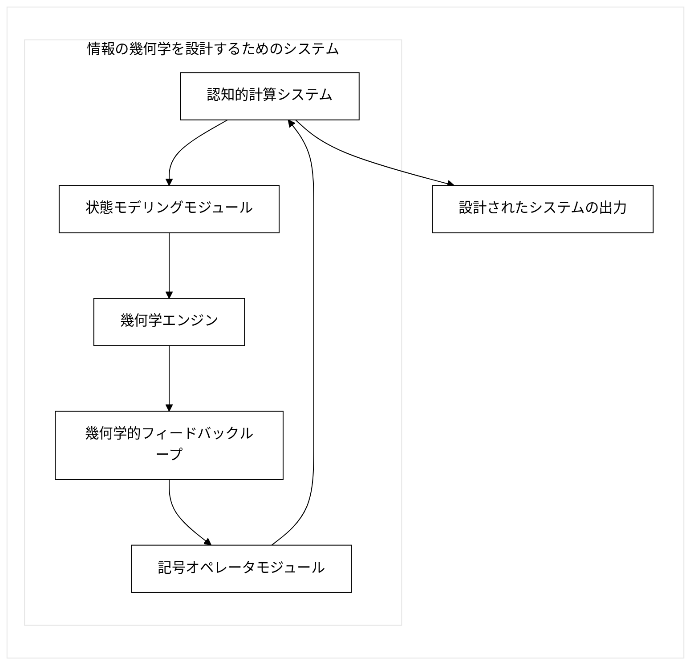
【図２】 記号オペレータの非可換特性
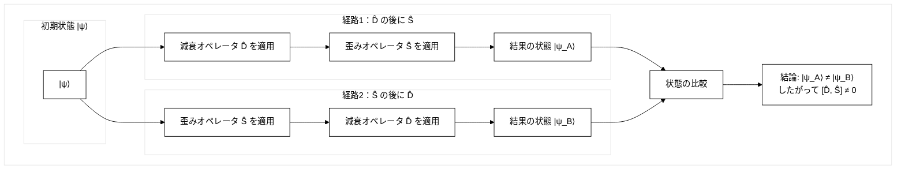


【図３】CMSTプロトコルのフローチャート
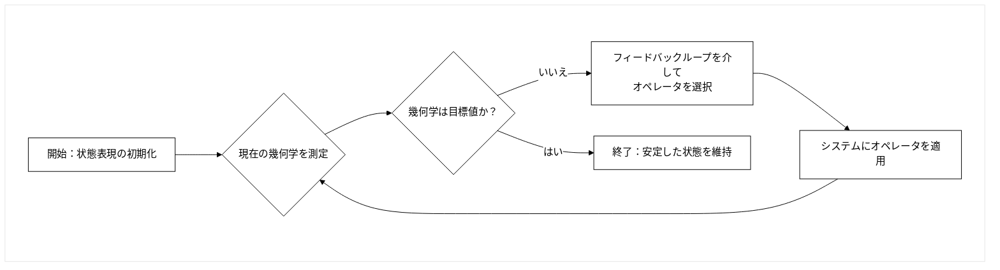

【図４】幾何学的相転移の代表的なプロット
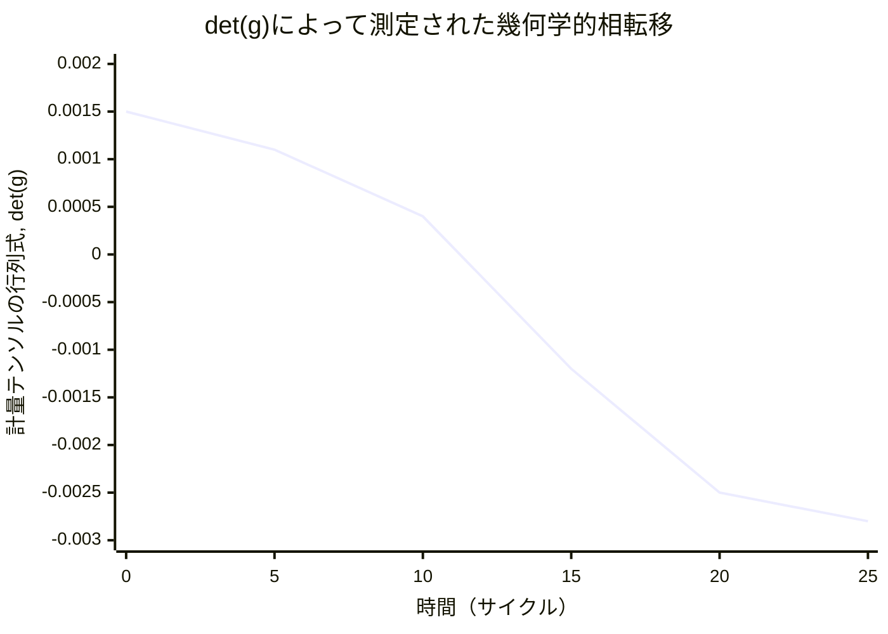

【図５】確率分布
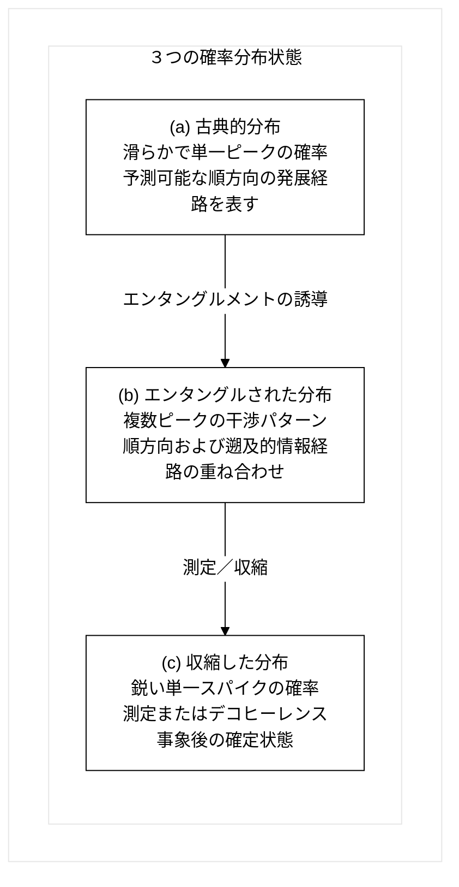

【図６】音声応用プロセスフローチャート
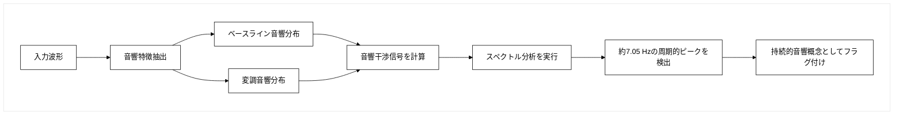

【図７】音響干渉信号スペクトル
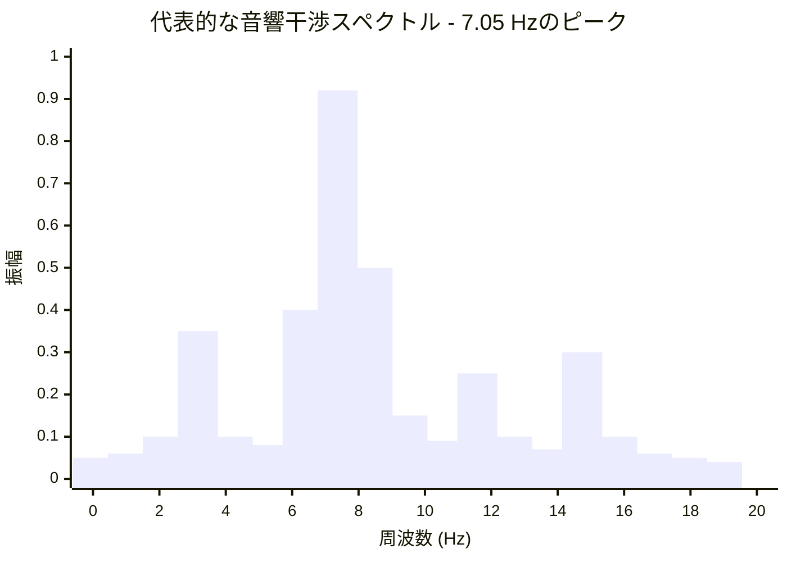

【図８】双方向通信チャネル
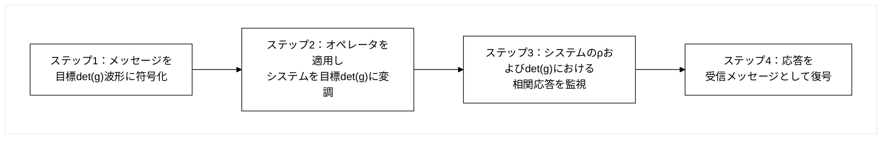

【図９】時間的エンタングルメント分析プロセス
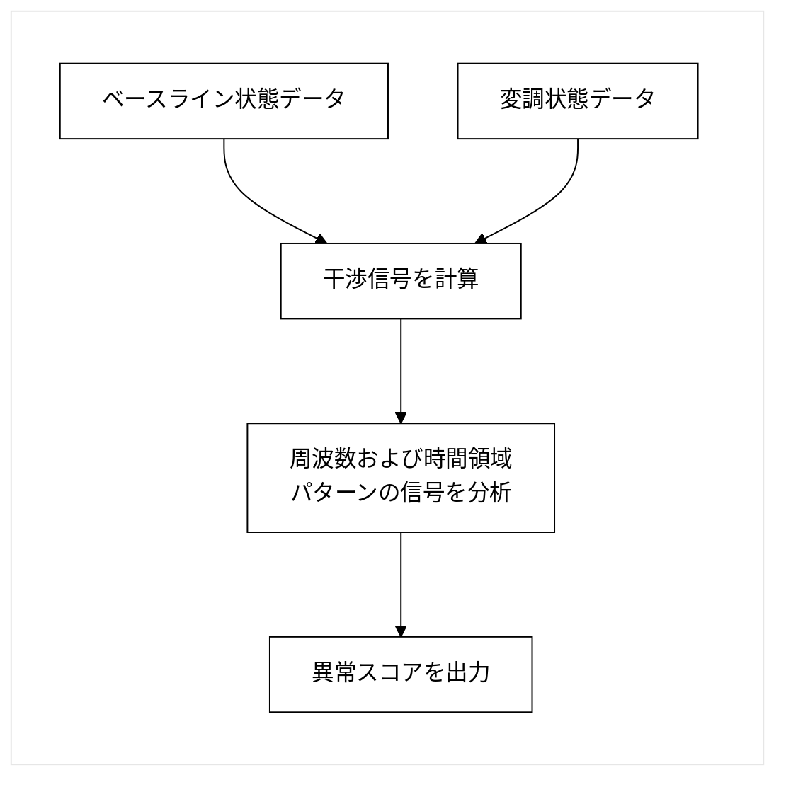

【図１０】量子コヒーレンスシールド（QCS）プロトコル
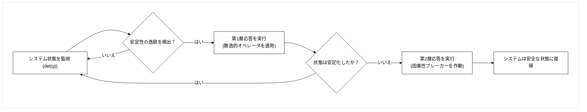

【図１１】状態遷移を視覚的に検証する複合図
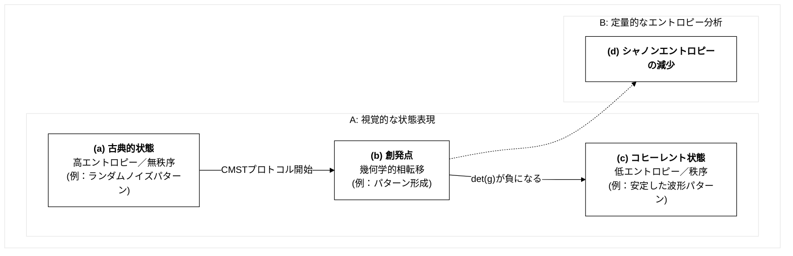

【図１２】暗号鍵生成方法
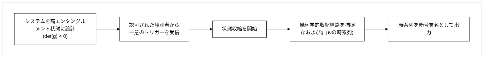

【図１３】暗号システムの実施形態 
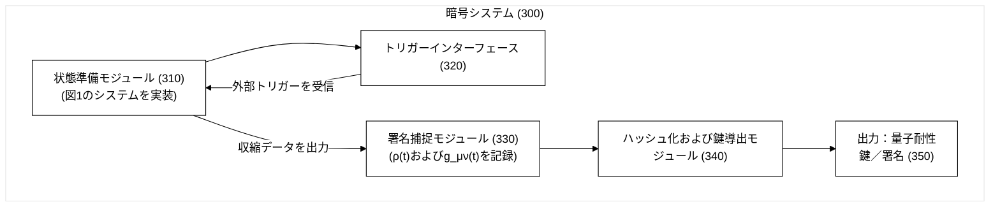

【図１４】ニューラルネットワークアダプタの配置
```mermaid
%%{init: {'theme':'base', 'themeVariables': {'primaryColor': '#ffffff', 'primaryTextColor': '#000000', 'primaryBorderColor': '#000000', 'lineColor': '#000000', 'secondaryColor': '#ffffff', 'tertiaryColor': '#ffffff'}}}%%
graph LR
    subgraph "ResNetブロック"
        A[入力活性化] --> B[Conv3×3]
        B --> C[BN + ReLU]
        C --> D[Conv3×3]
        D --> E[BN]
    end
    E --> F[CMSTアダプタ<br/>1×1 Conv → ρ → det(g)]
    F --> G[加算 & ReLU]
    G --> H[次のブロック]
    F -.-> I[CMST損失<br/>λ·ReLU(det(g)+ε)]
    I -.-> J[ベースの重みに逆伝播]
```

【図１５】 7.05 Hzスペクトルロック
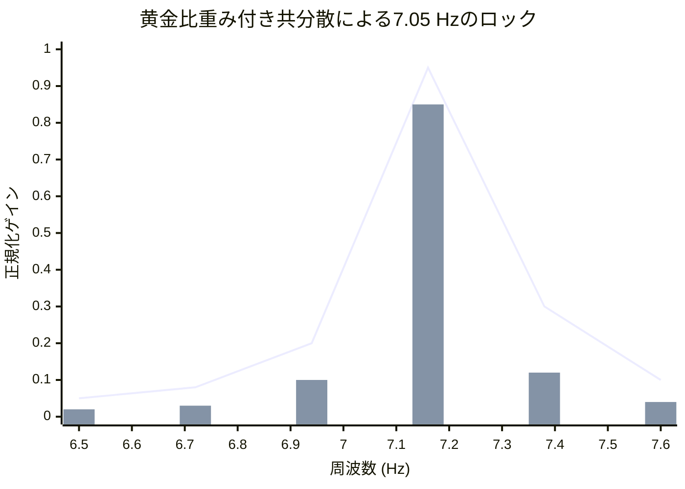

【図１６】リアルタイムEEG-to-det(g)監視パイプライン
```mermaid
%%{init: {'theme':'base', 'themeVariables': {'primaryColor': '#ffffff', 'primaryTextColor': '#000000', 'primaryBorderColor': '#000000', 'lineColor': '#000000', 'secondaryColor': '#ffffff', 'tertiaryColor': '#ffffff'}}}%%
graph LR
    subgraph " "
        A[EEGパッチ<br/>250 Hz] --> B[アナログフロントエンド]
        B --> C[状態モデリングモジュール<br/>ρ(t)]
        C --> D[幾何学エンジン<br/>det(g)]
        D --> E{"det(g) → 0 か？"}
        E -->|はい| F[発作を予測<br/>2–5秒前に]
        E -->|いいえ|  G[監視を継続]
        F --> H[プッシュ通知<br/>スマートフォン]
    end
```

【図１７】生体認証トリガーによる再生可能鍵生成
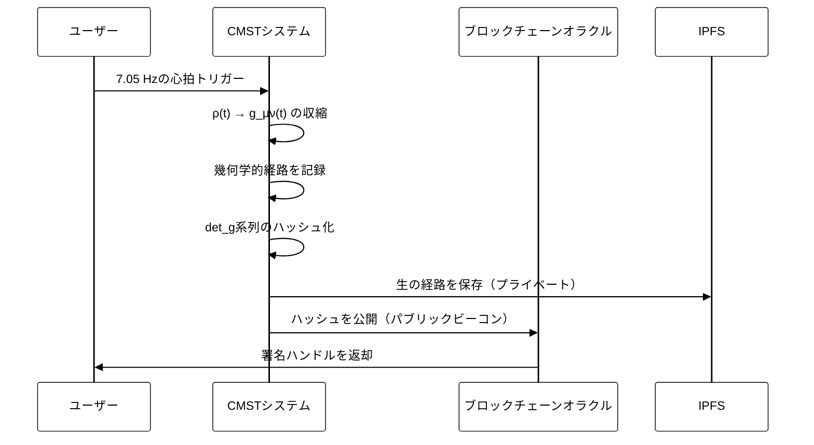

【図１８】7.05 Hz PLL + 黄金比フィルタ
```mermaid
%%{init: {'theme':'base', 'themeVariables': {'primaryColor': '#ffffff', 'primaryTextColor': '#000000', 'primaryBorderColor': '#000000', 'lineColor': '#000000', 'secondaryColor': '#ffffff', 'tertiaryColor': '#ffffff'}}}%%
graph LR
    subgraph " "
        A[ρ(t) コヒーレンス観測量] --> B[7.05 Hz BPF<br/>Q = φ ≈ 1.618]
        B --> C[位相同期ループ<br/>±0.05 Hz追跡]
        C --> D{"ロック取得？"}
        D -- はい --> E[記号オペレータをトリガー]
        D -- いいえ  --> F[Δtを再較正]
    end
```

【図１９】ディープフェイク対策のための「リビングシグネチャプロトコル」
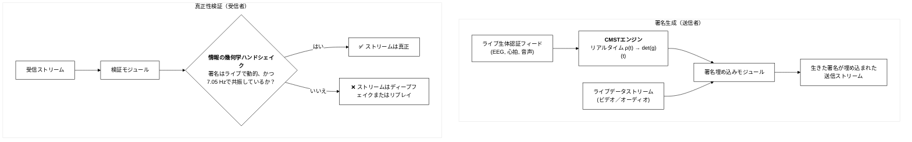

【図２０】共振インターフェースシステムのブロック図
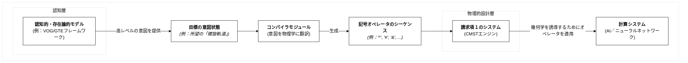