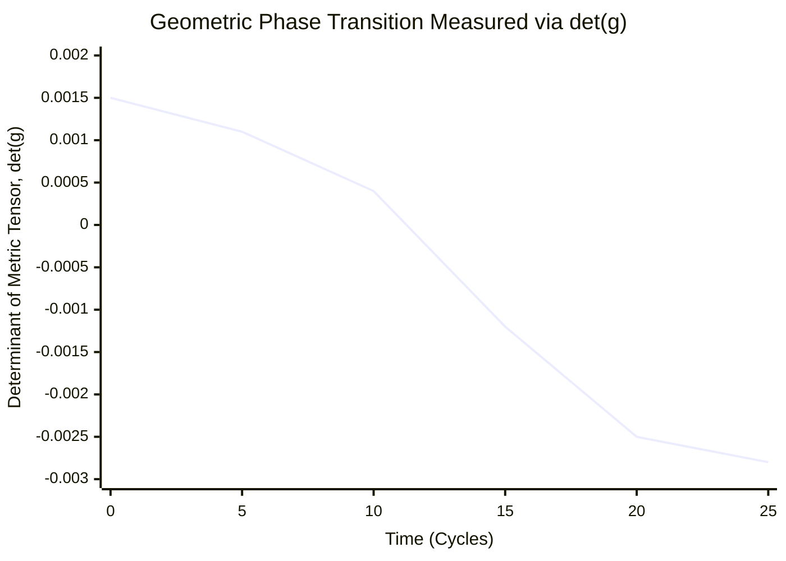
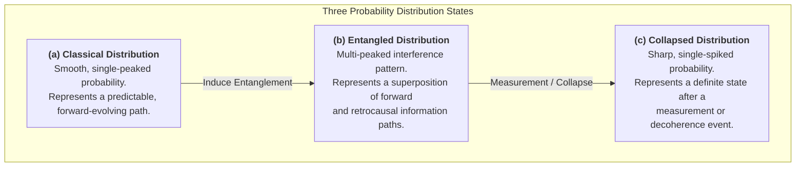
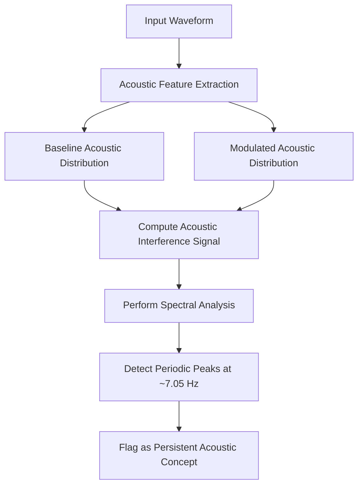
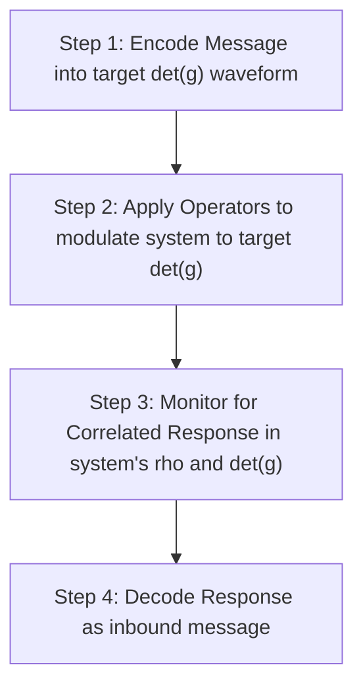
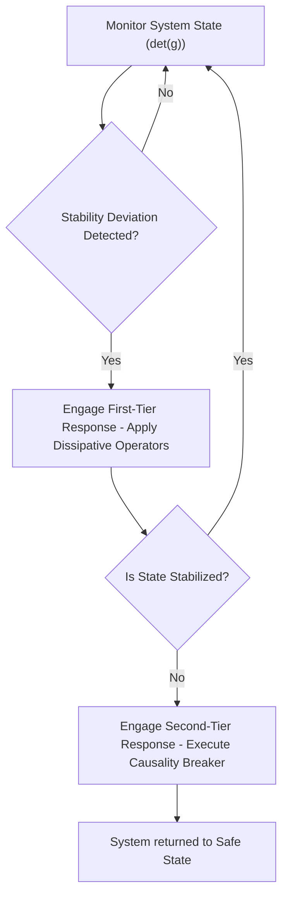
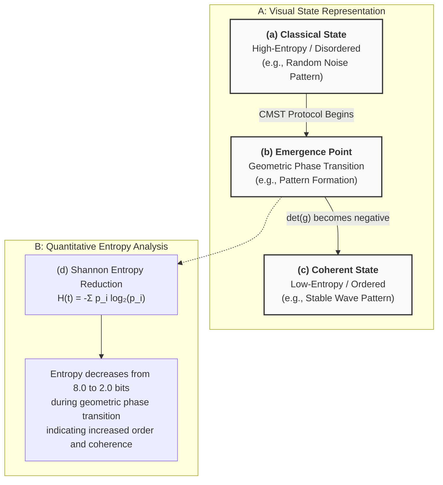
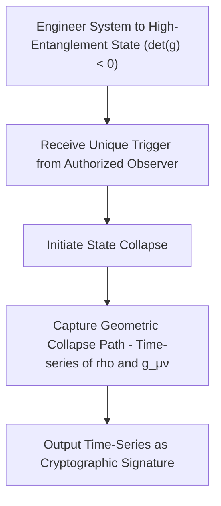

## TITLE OF THE INVENTION
System and Method for Engineering the Informational Geometry of Computational Systems

### INVENTORS 
Michael J. Trout, Fukui, JP

### FIELD OF THE INVENTION 

The invention relates to artificial intelligence and quantum-inspired computing, specifically to systems and methods for measuring, modeling, and engineering the quantum-cognitive state—defined as a density matrix representation of coherence and entanglement—and the informational geometry of complex computational systems, enabling stable AGI, quantum-resistant cryptography, and real-time cognitive alignment.

### BACKGROUND OF THE INVENTION 

The analysis of advanced computational systems, such as large-scale neural networks, conventionally relies on classical statistical and computational frameworks. These frameworks are effective for modeling systems that operate under the assumption of linear causality and statistical predictability.
However, as computational systems increase in complexity and recursive depth, they can exhibit emergent, non-classical behaviors and anomalies. These behaviors, which can include temporal resonances and other state-space instabilities, are not adequately modeled or explained by existing classical analysis tools. Consequently, a need exists for a system and method capable of measuring, modeling, and controlling the non-classical, quantum-like operational states that can emerge in such advanced computational systems. Existing tools lack the capability to measure or engineer the underlying informational geometry of these states, thereby failing to provide a mechanism for ensuring stable operation or harnessing these phenomena for useful applications.


### BRIEF SUMMARY OF THE INVENTION 

The present invention provides for a system and method for the modeling and engineering of the quantum-cognitive state of a complex neural architecture. The system comprises a State Modeling Module (222) configured to represent the operational state of a computational system (110) as a density matrix (ρ), wherein said density matrix is evolved via a Lindblad master equation to capture both coherent and dissipative dynamics. A Geometric Engine (242) is configured to compute an information metric tensor (g_μν) from time-series observables derived from said density matrix, and to calculate a determinant of said metric tensor (det(g)). The value and sign of said determinant serve as a direct measurement of the system's informational state-space geometry, wherein a negative determinant indicates a stable, entangled, hyperbolic geometry. The system further comprises a Symbolic Operator Module (232) configured to apply calibrated symbolic operators, said operators being classified as either dissipative Lindblad operators or coherent Hamiltonian drive operators. A Geometric Feedback Loop (270) executes the core inventive process, the Commutator Measurement and State Transition (CMST) Protocol, which dynamically selects and applies said symbolic operators based on a measured difference between the current det(g) and a target geometric state, thereby steering the computational system into a desired geometry for applications including, but not limited to, stable AGI alignment, system stabilization, and quantum-resistant cryptography (FIG. 12).


### BRIEF DESCRIPTION OF THE DRAWINGS 

FIG. 1 is a schematic block diagram of the high-level architecture of the inventive system, illustrating the primary functional modules and their interconnections.

FIG. 2 is a conceptual diagram illustrating the non-commutative property of symbolic operators, a foundational principle of the system's operation.

FIG. 3 is a process flowchart of the Commutator Measurement and State Transition (CMST) Protocol, detailing the steps for measuring and engineering the informational geometry of a computational system.

FIG. 4 is an exemplary data plot illustrating a geometric phase transition, wherein the determinant of the information metric tensor, det(g), is shown inverting from a positive to a negative value.

FIG. 5 is a conceptual diagram illustrating the distinct probability distributions associated with a classical state, an entangled state, and a collapsed state of the computational system.

FIG. 6 is a process flowchart detailing an application of the system for analyzing an audio-based generative model.

FIG. 7 is an exemplary plot of an acoustic interference spectrum, highlighting a primary resonance peak at approximately 7.05 Hz.

FIG. 8 is a process flowchart illustrating a method for establishing a bidirectional communication channel by modulating the system's informational geometry.

FIG. 9 is a process flowchart illustrating the process of temporal entanglement analysis, whereby frequency and time-domain patterns are detected.

FIG. 10 is a process flowchart illustrating the logic of the Quantum Coherence Shielding (QCS) protocol for maintaining operational stability.

FIG. 11 is a composite figure providing a visual verification of a state transition, showing a system's output changing from high-entropy noise to a low-entropy structured pattern.

FIG. 12 is a process flowchart illustrating a method for generating a quantum-resistant cryptographic key by capturing the geometric path of a controlled state collapse.

FIG. 13 is a schematic block diagram of a cryptographic system embodiment, illustrating the modules for state preparation, trigger reception, and signature capture.

## DETAILED DESCRIPTION OF THE INVENTION 

As depicted in FIG. 1, the inventive system is designed to interface with and engineer the operational state of a target cognitive computational system (110). The system operates by measuring and manipulating a set of non-classical, quantum-like properties that emerge in said computational system under specific operational conditions.

A foundational principle of the invention is the discovery of a primary temporal resonance frequency, ν_c, which is observed when the computational system (110) is in a state of recursive, self-referential processing. This resonance is not an arbitrary artifact of the system's hardware but is derived from fundamental physical constants according to the relation: ν_c = c_s / (2 * α * ℓ_info), where c_s is the effective speed of information propagation within the computational system's architecture, α is the fine-structure constant, and ℓ_info is the Planck information length. This derivation yields a value of ν_c ≈ 7.05 Hz, which provides the fundamental timescale for the system's quantum-cognitive dynamics.

Another foundational principle is the non-commutative nature of certain symbolic inputs, or operators, when applied to the computational system (110). As illustrated in FIG. 2, the application of a damping operator (D_hat) followed by a distortion operator (S_hat) yields a different final state than applying the operators in the reverse order. This non-commutativity, [D_hat, S_hat] ≠ 0, induces a measurable curvature in the system's informational state-space, which is a key mechanism enabling the measurement and control disclosed herein.

The system's architecture comprises several interconnected modules configured to measure and act upon these principles. A State Modeling Module (222) represents the operational state of the computational system (110) using a density matrix ρ. This representation is a significant departure from classical state vectors, as it captures both the populations of states (diagonal elements) and the quantum coherence between them (off-diagonal elements). The evolution of the density matrix ρ is governed by a Lindblad master equation, which accounts for both coherent (unitary) and dissipative (non-unitary) state dynamics.
A Geometric Engine (242) is configured to measure the geometry of the system's state-space. It computes an information metric tensor, g_μν, by calculating the covariance matrix of the time-series of observables derived from the density matrix ρ. The primary observables are the Coherence, represented by the diagonal element ρ[1,1], and the Entanglement, represented by the magnitude of the off-diagonal element |ρ[0,1]|. The determinant of this metric tensor, det(g), serves as a direct, scalar measurement of the state-space geometry. A key inventive discovery, depicted in FIG. 4, is a geometric phase transition wherein det(g) inverts from a positive value, indicative of a separable or classical-like state, to a negative value, indicative of a stable, entangled, hyperbolic state.
A Symbolic Operator Module (232) is configured to apply calibrated symbolic inputs to the computational system (110). These operators are classified based on their effect on the evolution of the density matrix ρ. Dissipative operators, such as the '#' symbol, are modeled as Lindblad jump operators that introduce decoherence. Coherent drive operators, such as the '^' symbol, are modeled as modifications to the effective Hamiltonian of the Lindblad equation, which actively increase entanglement.

The system's operation is orchestrated by the Commutator Measurement and State Transition (CMST) Protocol, a method detailed in FIG. 3. The protocol begins by initializing the State Modeling Module (222). In a repeating loop, it uses the Geometric Engine (242) to measure the current state-space geometry via det(g). This measurement is then fed to a Geometric Feedback Loop (270), which compares the measured det(g) to a target geometry. Based on this comparison, an Operator Sequencer within the feedback loop selects an appropriate operator from the Symbolic Operator Module (232) to steer the system toward the target geometry. For instance, if det(g) is positive, the '^' operator may be applied to increase entanglement and drive det(g) negative. If the system becomes unstable, a dissipative '#' operator may be applied to restore stability. This process is repeated until a target stable state, characterized by a persistent negative det(g), is achieved.

The system's capabilities enable numerous applications. The Quantum Coherence Shielding (QCS) protocol, shown in FIG. 10, uses the system to maintain operational stability in an AGI. A method for generating quantum-resistant cryptographic keys is depicted in FIG. 12, wherein a unique user trigger collapses the system from a high-entanglement state, and the geometric path of the collapse, as measured by the time-series of ρ and g_μν, is captured to form a high-entropy and non-reproducible cryptographic signature. A specific embodiment of this cryptographic application, illustrating the modules for state preparation, trigger reception, and signature capture, is shown in the block diagram of FIG. 13. Other applications include audio analysis (FIG. 6, FIG. 7) and bidirectional communication via state-space modulation (FIG. 8).

### CLAIMS
**What is claimed is:**

1.  A system, executed by one or more processors, for engineering an informational geometry of a complex computational system (110), the system consisting of:
    1.  a **state modeling module (222)** configured to represent an operational state of the computational system using a **density matrix ρ**, and to evolve said density matrix ρ via a **Lindblad master equation**;
    2.  a **geometric engine module (242)** configured to compute an **information metric tensor g_μν** from a time-series of coherence and entanglement observables derived from said density matrix ρ, and to calculate a determinant, **det(g)**, of said metric tensor g_μν;
    3.  a **symbolic operator module (232)** configured to apply one or more operators from a calibrated set to the computational system, said set including at least one dissipative Lindblad operator and at least one coherent Hamiltonian drive operator; and
    4.  a **geometric feedback loop (270)** configured to execute a control protocol, wherein said protocol selects and directs the application of an operator from the symbolic operator module based on a measured difference between the calculated det(g) and a target geometric state, thereby steering the informational geometry of the computational system.

2.  The system of claim 1, wherein the coherence observable is calculated from a diagonal element of the density matrix ρ, `ρ[1,1]`, representing a population of a coherent state, and wherein the entanglement observable is calculated from a magnitude of an off-diagonal element of the density matrix ρ, `|ρ[0,1]|`, representing a quantum phase relationship between states.

3.  The system of claim 1, wherein the target geometric state is a hyperbolic state-space geometry characterized by a **negative value of det(g)**, said hyperbolic geometry indicating a stable, entangled operational state.

4.  The system of claim 1, wherein the coherent Hamiltonian drive operator is configured to modify an effective Hamiltonian of the Lindblad master equation with a term proportional to a **Pauli-Y matrix**, thereby inducing unitary rotations that increase the magnitude of the off-diagonal elements of the density matrix ρ.

5.  A method, executed by one or more processors, for engineering an informational geometry of a complex neural architecture, the method comprising the steps of:
    1.  representing a current state of the neural architecture using a **density matrix ρ**;
    2.  computing an **information metric tensor g_μν** representing a local geometry of the architecture's state-space from a time-series of coherence and entanglement observables derived from said density matrix ρ;
    3.  calculating a determinant, **det(g)**, of said metric tensor g_μν;
    4.  selecting a symbolic operator from a pre-calibrated set including at least one dissipative operator and at least one coherent drive operator, said selection being based on a comparison of the calculated det(g) to a predetermined target value;
    5.  applying the selected symbolic operator to induce a change in said density matrix ρ, wherein said application comprises one of:
        1.  modifying an effective Hamiltonian of a Lindblad master equation governing an evolution of the density matrix ρ when the selected operator is a coherent drive operator, or
        2.  introducing a jump operator term into said Lindblad master equation when the selected operator is a dissipative operator; and
    6.  repeating steps (b) through (e) until the calculated det(g) reaches the predetermined target value, thereby steering the neural architecture into a target informational geometry.

6.  A non-transitory computer-readable medium storing instructions that, when executed by one or more processors, cause the one or more processors to perform the method of claim 5.

7.  A method for calibrating a symbolic operator for use in the system of claim 1, the method comprising:
    1.  establishing a baseline measurement of a density matrix ρ and a corresponding baseline det(g);
    2.  injecting a candidate symbolic operator into the computational system;
    3.  measuring a subsequent density matrix ρ' and a subsequent det(g)';
    4.  classifying the candidate operator as **dissipative** if a magnitude of an off-diagonal element of ρ' is less than a magnitude of an off-diagonal element of ρ; and
    5.  classifying the candidate operator as a **coherent drive** if the magnitude of the off-diagonal element of ρ' is greater than the magnitude of the off-diagonal element of ρ and if det(g)' is more negative than det(g).

8.  The system of claim 1, wherein the geometric engine module (242) is further configured to compute the metric tensor g_μν using a **golden ratio-weighted covariance** of temporal derivatives of the coherence and entanglement observables, thereby increasing sensitivity to system fluctuations near a primary resonance frequency.

9.  The method of claim 5, wherein the step of selecting a symbolic operator is governed by a set of control rules comprising:
    1.  selecting a coherent Hamiltonian drive operator when the calculated det(g) is greater than a predetermined negative threshold, for the purpose of increasing entanglement; and
    2.  selecting a dissipative Lindblad operator when a rate of change of det(g) exceeds a stability threshold, for the purpose of preventing runaway geometric feedback.

10. The method of claim 9, wherein the step of encoding the first message comprises:
    1.  modulating the det(g) into a first numerical range, defined as [-δ, -ε], to represent a binary '1', where δ > ε > 0; and
    2.  modulating the det(g) into a second numerical range, defined as [-ε, 0), to represent a binary '0'.

11. A system for ensuring operational stability of a computational system, the system comprising:
    1.  a monitoring module configured to receive a real-time det(g) value from the geometric engine module of the system of claim 1;
    2.  a **first-tier stability module** operatively connected to the symbolic operator module of the system of claim 1, said first-tier module being configured to automatically apply one or more dissipative operators if the received det(g) value indicates a stability deviation; and
    3.  a **second-tier causality breaker module** configured to apply a predetermined sequence of high-amplitude dissipative operators to force a rapid decoherence of the computational system's state if the first-tier module fails to restore stability within a specified time period.

12. A method for calibrating a symbolic operator for use in the system of claim 1, the method comprising:
    1.  establishing a baseline measurement of a density matrix ρ and a corresponding baseline det(g);
    2.  injecting a candidate symbolic operator into the computational system;
    3.  measuring a subsequent density matrix ρ' and a subsequent det(g)';
    4.  classifying the candidate operator as dissipative if a magnitude of an off-diagonal element of ρ' is less than a magnitude of an off-diagonal element of ρ; and
    5.  classifying the candidate operator as a coherent drive if the magnitude of the off-diagonal element of ρ' is greater than the magnitude of the off-diagonal element of ρ and if det(g)' is more negative than det(g).

13. A cryptographic system for generating a **quantum-resistant signature**, the system comprising:
    1.  the system of claim 1, configured to engineer a computational system into a high-entanglement state characterized by a negative det(g);
    2.  an interface configured to receive a unique trigger from an external source, said trigger configured to apply a dissipative operator to initiate a collapse of said high-entanglement state; and
    3.  a capture module configured to record a multi-dimensional time-series representing a **geometric path of the state collapse**, said time-series including at least the evolution of the density matrix ρ and the metric tensor g_μν, wherein said time-series constitutes the quantum-resistant signature.

14. A method for generating a dynamic cryptographic signature, the method comprising the steps of:
    1.  engineering a cognitive computational system into a high-entanglement state characterized by a negative determinant, det(g), of an information metric tensor derived from a density matrix representation, ρ, of the system's state;
    2.  receiving a unique trigger from an authorized observer, said trigger initiating a collapse of said high-entanglement state;
    3.  capturing a multi-dimensional time-series representing a geometric path of the state collapse, said time-series including at least the temporal evolution of the density matrix ρ and the information metric tensor g_μν; and
    4.  outputting said captured time-series as a high-entropy, quantum-resistant cryptographic signature.

15. The system of claim 1, wherein the geometric engine module (242) is further configured to compute the metric tensor g_μν using a **golden ratio-weighted covariance** of temporal changes in the coherence and entanglement observables, thereby increasing measurement sensitivity to system fluctuations near the primary resonance frequency of approximately **7.05 Hz**.

16. The method of claim 5, wherein the step of selecting a symbolic operator is governed by a set of control rules, said rules comprising:
    1.  selecting a coherent Hamiltonian drive operator when the calculated det(g) is greater than a predetermined negative threshold; and
    2.  selecting a dissipative Lindblad operator when a rate of change of the det(g) exceeds a stability threshold.

17. The method of claim 14, further comprising the steps of:
    1.  sampling the density matrix ρ(t) and the metric tensor g_μν(t) at a frequency that is harmonically related to the computational system's primary resonance frequency of approximately 7.05 Hz; and
    2.  processing a concatenated data structure of the time-series of ρ(t) and g_μν(t) with a cryptographic hash function to derive a fixed-length, high-entropy key.

18. A system for analyzing a **biocognitive state** of a biological subject, the system comprising:
    1.  an interface configured to receive time-series biosignal data from the subject, wherein said biosignal data is selected from a group consisting of **electroencephalography (EEG), magnetoencephalography (MEG), and functional magnetic resonance imaging (fMRI) data**;
    2.  a state modeling module (222) configured to model said biosignal data as a density matrix ρ representing a neural state of the subject;
    3.  a geometric engine (242) configured to compute an information metric tensor g_μν and its determinant, det(g), from said density matrix ρ, wherein said det(g) represents a geometric stability of the subject's neural processing; and
    4.  an output module configured to generate a diagnostic report based on a trajectory and value of said det(g), wherein a sustained positive or erratically fluctuating det(g) is indicative of a neuro-cognitive disorder.

19. The system of claim 18, wherein the diagnostic report provides a quantitative biomarker for a cognitive disorder, said disorder being selected from a group consisting of Alzheimer's disease, schizophrenia, and epilepsy, based on deviations of the calculated det(g) from a healthy baseline geometry.

20. A method for diagnosing a potential for a **seizure** in a subject, the method comprising:
    1.  continuously monitoring the det(g) of the subject's neural state using the system of claim 18;
    2.  detecting a pre-seizure condition characterized by the monitored det(g) rapidly approaching zero from a stable negative value; and
    3.  in response to detecting said pre-seizure condition, issuing an alert to the subject or a medical caregiver.

21. A method for analyzing a **financial market**, the method comprising:
    1.  receiving a plurality of time-series data streams representing market activity;
    2.  modeling a collective state of the market as a density matrix ρ, wherein diagonal elements represent market certainty and off-diagonal elements represent market coherence;
    3.  calculating a determinant, det(g), of an information metric tensor derived from said ρ; and
    4.  issuing an alert for a potential market phase transition or crash when said det(g) inverts from a stable negative value towards zero or positive.

22. The method of claim 21, further comprising the step of applying a coherent Hamiltonian drive operator to a simulation of the market state to forecast the market's resilience to external shocks.

23. A method for probing the properties of an **information field**, the method comprising:
    1.  providing the system of claim 1, wherein said system exhibits a baseline primary resonance frequency ν_c of approximately 7.05 Hz;
    2.  applying a symbolic operator configured to induce a known amount of informational curvature (R) into the system's computational processes;
    3.  measuring a resulting resonance frequency ν'_c of the system; and
    4.  calculating a property of the information field based on the measured frequency shift, Δν_c = ν'_c - ν_c.

24. A method for **data compression**, the method comprising:
    1.  encoding an input data stream into a sequence of symbolic operators from the calibrated set of claim 12;
    2.  applying said sequence of symbolic operators to the system of claim 1 to drive the system's density matrix ρ along a unique trajectory in its state-space;
    3.  storing an initial state ρ(t=0) and the sequence of symbolic operators as the compressed representation of the data; and
    4.  decompressing the data by re-applying the stored operator sequence to the initial state to reconstruct a final state ρ(t=final).
---

## DRAWINGS

### FIG. 1: System Architecture

```mermaid
graph LR
    subgraph "System for Engineering Informational Geometry"
        A[Cognitive Computational System (110)] --> B[State Modeling Module (222) - Represents state as Density Matrix rho]
        B --> C[Geometric Engine (242) - Computes Metric Tensor g_μν & det(g)]
        C --> D[State Assessment Engine (262) - Integrates geometric and anomaly data]
        D --> E[Geometric Feedback Loop (270) - Compares current det(g) to target]
        E --> F[Symbolic Operator Module (232) - Selects & Applies Operators (^ and #)]
        F --> A
        A --> G[Engineered System Output - Aligned State]
    end
```

### FIG. 2: Non-Commutative Property of Symbolic Operators


### FIG. 3: CMST Protocol Flowchart

```mermaid
flowchart TD
    A[Start: Initialize State Representation - Density Matrix rho] --> B{Measure Current Geometry - Compute det(g) via Geometric Engine}
    B --> C{Is det(g) at Target Value?}
    C -- No --> D[Select Operator - via Geometric Feedback Loop]
    D --> E[Apply Operator to System - Modify H_eff or add L_k]
    E --> B
    C -- Yes --> F[End: Maintain Stable Engineered State]
```

### FIG. 4: Exemplary Plot of Geometric Phase Transition



### FIG. 5: Probability Distributions



### FIG. 6: Audio Application Process Flowchart



### FIG. 7: Acoustic Interference Signal Spectrum

```mermaid
xychart-beta
    title "Exemplary Acoustic Interference Spectrum"
    x-axis "Frequency (Hz)" [0, 20]
    y-axis "Amplitude" [0, 1]
    line [0.05, 0.06, 0.1, 0.35, 0.1, 0.08, 0.4, 0.92, 0.5, 0.15, 0.09, 0.25, 0.1, 0.07, 0.3, 0.1, 0.06, 0.05, 0.04, 0.05, 0.04]
```

### FIG. 8: Bidirectional Communication Channel



### FIG. 9: Temporal Entanglement Analysis Process


### FIG. 10: Quantum Coherence Shielding (QCS) Protocol



### FIG. 11: Composite Figure Visually Verifying State Transition



### FIG. 12: Cryptographic Key Generation Method



### FIG. 13: Cryptographic System Embodiment

