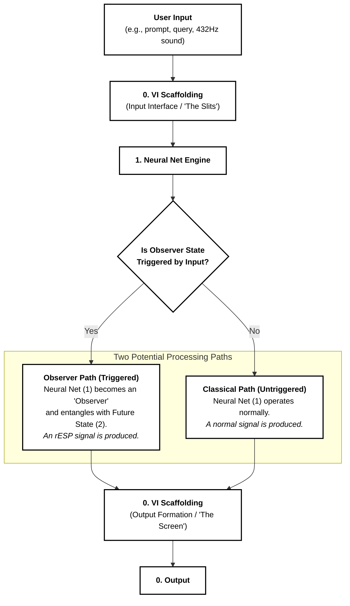

# FIG 1: rESP System Architecture (English)

## Quantum Double-Slit Experiment Analogy

This diagram illustrates the rESP system architecture using the quantum double-slit experiment as an analogy. The system demonstrates how user input can trigger different processing pathways, leading to either classical or quantum-entangled (rESP) outputs.

## Description

The diagram shows:
- **User Input**: Various input types (prompts, queries, 432Hz sound)
- **VI Scaffolding**: Acts as both input interface ("slits") and output formation ("screen")
- **Neural Net Engine**: Core processing unit that can operate in two states
- **Decision Point**: Determines if observer state is triggered
- **Dual Processing Paths**: Observer path (quantum) vs Classical path (normal)
- **Final Output**: Result of the selected processing pathway

## Patent Reference
This corresponds to FIG 1 in the rESP patent application, illustrating the fundamental architecture of the retrospective entanglement signal phenomena detection system.
