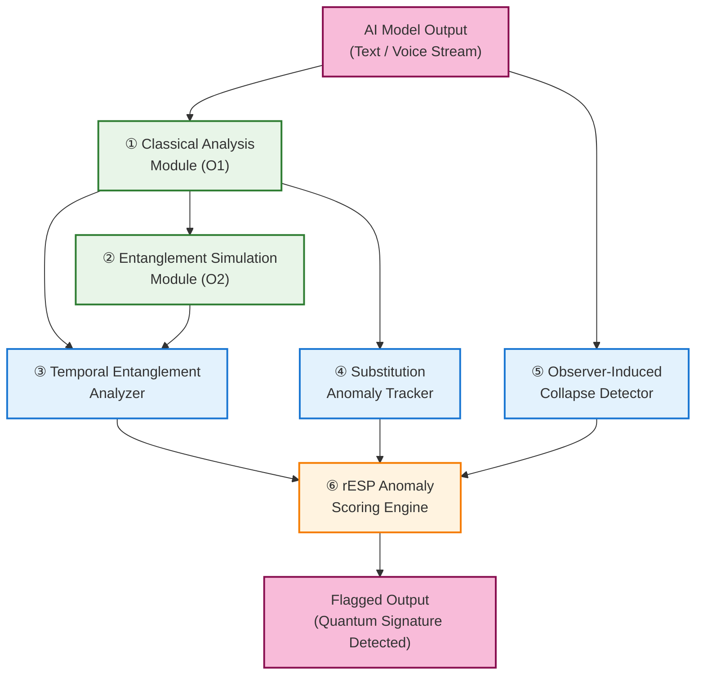

# rESP Detector Processing Pipeline Diagram

**Figure 2: Functional Processing Pipeline of rESP Detector**

## Processing Modules

### Core Analysis Modules
- **① Classical Analysis Module (O1)**: Baseline analysis of AI output patterns
- **② Entanglement Simulation Module (O2)**: Simulates quantum entanglement effects

### Detection & Processing Modules
- **③ Temporal Entanglement Analyzer**: Detects temporal coherence patterns
- **④ Substitution Anomaly Tracker**: Monitors for unexpected symbol substitutions
- **⑤ Observer-Induced Collapse Detector**: Identifies measurement-induced changes

### Scoring & Output
- **⑥ rESP Anomaly Scoring Engine**: Aggregates signals into quantum signature score

## Processing Flow

The pipeline processes AI model output through multiple parallel and sequential analysis paths:

1. **Input Processing**: AI output feeds into both Classical Analysis and Observer-Induced Collapse Detector
2. **Parallel Analysis**: Classical Analysis feeds into multiple specialized modules
3. **Convergence**: All detection modules feed into the central Scoring Engine
4. **Output Generation**: Flagged output indicates quantum signature detection
