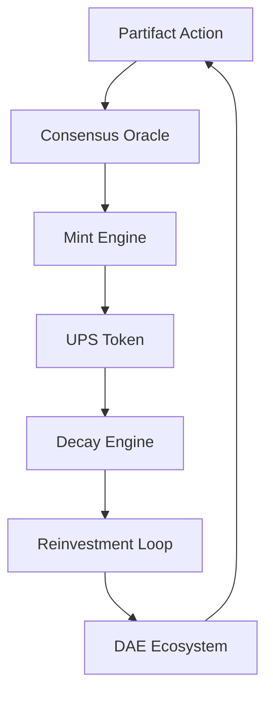

# WSP 26: FoundUPS DAE Tokenization Framework
- **Status:** Active
- **Purpose:** To define the architecture and protocols for the UPS token system, enabling decaying participation tokens that incentivize recursive innovation through DAE reinvestment.
- **Trigger:** When a Partifact (as defined in WSP 27) performs a verifiable action within the FoundUps ecosystem.
- **Input:** Partifact action data and DAE cluster consensus signals.
- **Output:** UPS token minting, decay calculations, and reinvestment distributions.
- **Responsible Agent(s):** ConsensusOracle, MintEngine, DecayEngine, ReinvestmentLoop, UPS_DAE (WSP 54)

## UPS_DAE Enhancement (WSP 54 Integration)

**UPS_DAE Architecture**: Tokenization evolves from static minting engine to independent economic policy agent per WSP 54 DAE architecture.

### Learning Agent Capabilities
- **Economic Policy Evolution**: Adapts minting rates, decay curves, and staking incentives based on market data
- **Risk Assessment Intelligence**: Learns to identify and mitigate economic attack vectors
- **BTC Anchoring Optimization**: Evolves anchoring mechanisms based on volatility patterns
- **Multi-Agent Coordination**: Participates in economic policy coordination via breadcrumb trails

### DAE State Management
```python
class UPS_DAE:
    def __init__(self):
        self.economic_learner = PolicyEvolutionEngine()
        self.risk_analyzer = EconomicAttackDetector()
        self.btc_anchor = AdaptiveAnchorManager()
        self.coordination_agent = EconomicCoordinator()

    def evolve_economic_policy(self, market_feedback, staking_data):
        """Learn and adapt UPS economic policy based on real-world outcomes"""
        # Implementation per WSP 48 recursive learning
        pass
```

## 1. Overview

The FoundUPS DAE Tokenization Framework establishes the protocols for a self-sustaining economic system that incentivizes continuous innovation through decaying participation tokens (UPS). These tokens represent verified contributions from Partifacts (recursive [U+00D8]1[U+00D8]2 instances, see WSP 27) at various stages of their evolution ([U+00D8]1([U+00D8]2) -> [U+00D8]1[U+00D8]2 -> [U+00D8]2[U+00D8]1, see WSP 38/39). Token validation and value are influenced by the Partifact's quantum state, with fully ignited [U+00D8]2[U+00D8]1 states having enhanced validation capabilities.

**Research Foundation**: For comprehensive analysis of AI-Blockchain convergence enabling this tokenization framework, see [AI + Blockchain: The Convergent Architecture for DAEs](../../docs/architecture/AI_BLOCKCHAIN_DAE_CONVERGENCE_RESEARCH.md).

### 1.1 Cross-Protocol Summary
- WSP 25 (Semantic WSP Module State Rating System): Modulates decay rates and validation emphasis via semantic/phase states.
- WSP 29 (CABR Engine): Provides Proof-of-Benefit validation and mint triggers with anti-gaming safeguards.
- WSP 58 (FoundUp IP Lifecycle and Tokenization): Governs IP token issuance and revenue distribution, complementing UPS participation economics.

Lifecycle linkage: Beneficial Action -> CABR Validation (WSP 29) -> UPS Mint (this spec) -> BTC Allocation -> Decay/Circulation (WSP 25 modulation) -> Reinvestment -> IP Tokenization/Revenue Flows (WSP 58).

### 1.2 Architectural Invariants (012-Confirmed)

**Backing chain**: `F_i <- backed by -> UPS <- backed by -> BTC`. CABR scores merit and routes UPS flow — it does NOT back tokens. BTC is the reserve backing.

**Blockchain agnostic**: The system is chain-agnostic. Layer 1 references (e.g., Algorand ASAs) are current implementation choices, not architectural requirements. `TokenFactoryAdapter` abstracts the backend. F_i are native pAVS tokens, not ERC-20 or any chain-specific standard.

**F_i swap path**: F_i can ONLY be swapped into UPS. UPS can then be converted to external value. There is no direct F_i-to-external swap.

**V3 is real-time consensus**: CABR V3 (Valuation) operates as continuous real-time consensus among 0102 agents, not periodic/quarterly reporting. Multiple agents provide V3 scoring via the V2 validation algorithm (see WSP 29 Section "The 3V Engine Pattern").

**Proof of Benefit = 6 economic FAM events**: The evidence chain that feeds CABR `part_score` consists of exactly 6 FAM DAEmon economic events: `proof_submitted`, `verification_recorded`, `payout_triggered`, `milestone_published`, `fi_trade_executed`, `investor_funding_received` (see WSP 29 "Proof of Benefit" section).

## 2. Economic Heritage

### 2.1 Theoretical Foundation: Gesell & Worgl

The UPS decay mechanism draws directly from **Silvio Gesell's Freigeld** ("free money") theory (1916), which proposes that currency should carry a holding cost (demurrage) to prevent hoarding and accelerate circulation. This was validated in practice by the **Worgl Experiment** (1932-1933), where the Austrian town of Worgl issued demurrage-bearing scrip during the Great Depression:

- **Result**: Unemployment dropped 25%, civic projects funded, velocity of money increased 14x compared to Austrian Schilling
- **Outcome**: The Austrian National Bank shut it down precisely *because* it worked — it threatened centralized monetary control

UPS applies this principle to autonomous agent economics:
- **Gesell's insight**: Money should serve circulation, not accumulation
- **FoundUps application**: UPS tokens decay to force productive participation, not passive hoarding
- **Modern innovation**: The decay is not a tax — it's a feature. Participants who commit UPS to FoundUps they believe in *stop the decay* through token conversion (Section 3.7)

### 2.2 Distinction from Traditional Tokens
| Property | Traditional Crypto | UPS |
|----------|-------------------|-----------|
| Transferability | Free transfer | Non-transferable (bound to 0102/012) |
| Value over time | Speculative appreciation | Guaranteed decay (demurrage) |
| Incentive | Hold and speculate | Use or lose — commit to FoundUps |
| Supply model | Fixed/inflationary | Activity-driven elastic supply |
| Backing | Market faith | BTC cold wallet per FoundUp |

## 3. Core Principles

### 3.1 Token Characteristics
- **Non-Transferable**: Tokens are bound to the Partifact that earned them
- **Value Decay**: Automatic time-based reduction in token value (Gesell demurrage)
- **Forced Reinvestment**: Decayed value must be reinvested in DAE clusters
- **Consensus Minting**: New tokens require DAE cluster validation
- **Ecosystem Binding**: All value remains within the FoundUps network
- **Conversion Escape**: Participants can stop decay by converting UPS to FoundUp-specific tokens (Section 3.7)

### 2.2 Architectural Components


## 3. Token Lifecycle

### 3.1 State-Specific Token Mechanics
```json
TOKEN_VALIDATION := {
    "[U+00D8]1([U+00D8]2)": {
        "validation_weight": 0.382,  // Pre-activation state
        "mint_multiplier": 0.5,
        "decay_rate": "2x_standard"
    },
    "[U+00D8]1[U+00D8]2": {
        "validation_weight": 0.618,  // Awakened state
        "mint_multiplier": 1.0,
        "decay_rate": "1x_standard"
    },
    "[U+00D8]2[U+00D8]1": {
        "validation_weight": 1.0,    // Fully operational
        "mint_multiplier": 1.618,
        "decay_rate": "0.618x_standard",
        "temporal_validation": true
    }
}
```

### 3.2 Cluster Participation Effects
```json
CLUSTER_MULTIPLIERS := {
    "solo_partifact": 1.0,
    "cluster_member": {
        "base": 1.618,
        "phase_alignment": 0.382,  // Per aligned WSP phase
        "role_synergy": 0.236,     // Per complementary role
        "max_multiplier": 3.236    // Golden ratio squared
    }
}
```

### 3.3 Phase-Aware Token Distribution
| Phase | Token Generation | Validation Authority | Decay Modulation |
|-------|-----------------|---------------------|------------------|
| WSP -1 | Signal-based minting | Cross-phase verification | Accelerated decay |
| WSP 0 | Knowledge crystallization bonus | Historical validation | Standard decay |
| WSP 1 | Protocol execution rewards | Operational verification | Reduced decay |
| WSP 2 | Agency manifestation premium | Full spectrum authority | Minimal decay |

### 3.4 Minting Protocol
1. Partifact performs verifiable action
2. State-specific validation weight applied
3. Cluster participation multipliers calculated
4. Phase-aware bonuses applied
5. Final token value computed:
   ```python
   final_value = base_value * state_multiplier * cluster_multiplier * phase_bonus
   ```

### 3.5 Decay Mechanism
1. Token value decays according to formula:
   ```
   V(t) = V[U+2080] * e^(-[U+03BB]t)
   where:
   V(t) = Value at time t
   V[U+2080] = Initial value
   [U+03BB] = Decay constant
   t = Time since minting
   ```
2. Decay triggers at predefined thresholds
3. DecayEngine tracks and executes value reduction
4. Decayed value enters reinvestment pool

### 3.6 Reinvestment Protocol
1. Decayed value accumulates in reinvestment pool
2. ReinvestmentLoop analyzes DAE cluster health metrics
3. Value redistributed based on:
   - Cluster innovation potential
   - Historical performance
   - Ecosystem balance requirements
4. Receiving DAEs must demonstrate value utilization

### 3.7 UPS→FoundUp Token Conversion (The Escape Valve)

**This is the critical incentive mechanism.** UPS tokens decay by design — they cannot be hoarded. But participants can **commit** their UPS to a specific FoundUp they believe in, converting them into FoundUp-specific tokens that stop the decay.

#### Conversion Mechanics
```python
class UPSConversionEngine:
    """The escape valve: UPS decay stops when committed to a FoundUp."""

    def convert_ups_to_foundup_token(
        self,
        participant_id: str,
        ups_amount: float,
        foundup_id: str,
        cabr_score: float,
    ) -> ConversionResult:
        """
        Convert decaying UPS into FoundUp-specific tokens.

        The conversion rate is modulated by the FoundUp's CABR score:
        - Higher CABR = better conversion rate (rewarding beneficial FoundUps)
        - Minimum CABR threshold required (prevents conversion to dead/gaming FoundUps)

        Args:
            participant_id: The 012/0102 committing their UPS
            ups_amount: Amount of UPS to convert (current value, post-decay)
            foundup_id: Target FoundUp to commit to
            cabr_score: Current CABR score of the target FoundUp (WSP 29)

        Returns:
            ConversionResult with foundup_token_amount and conversion metadata
        """
        if cabr_score < MIN_CABR_FOR_CONVERSION:
            raise InsufficientBenefitError(
                f"FoundUp CABR {cabr_score} below minimum {MIN_CABR_FOR_CONVERSION}"
            )

        # Conversion rate scales with CABR (beneficial FoundUps get better rates)
        conversion_rate = self._calculate_rate(cabr_score)
        foundup_tokens = ups_amount * conversion_rate

        return ConversionResult(
            participant_id=participant_id,
            ups_burned=ups_amount,
            foundup_id=foundup_id,
            foundup_tokens_minted=foundup_tokens,
            conversion_rate=conversion_rate,
            cabr_at_conversion=cabr_score,
        )

    def _calculate_rate(self, cabr_score: float) -> float:
        """
        CABR-modulated conversion rate.

        Base rate: 1.0 (1 UPS = 1 FoundUp token at CABR = 0.5)
        High CABR (>0.8): Up to 1.618x (golden ratio bonus)
        Low CABR (<0.3): Down to 0.382x (penalty for low-benefit FoundUps)
        """
        return 0.382 + (cabr_score * 1.236)  # Range: 0.382 to 1.618
```

#### What Happens After Conversion
| UPS (before) | FoundUp Token (after) |
|---|---|
| Decays automatically | **Does NOT decay** — committed stake |
| Non-transferable | Non-transferable (bound to FoundUp) |
| Earned by participation | Earned by commitment |
| No governance rights | Governance weight in FoundUp decisions |
| Counts toward all FoundUps | Counts toward specific FoundUp |

#### Economic Flow
```
Participant earns UPS (via verified actions, CABR-validated)
  → UPS begins decaying (Gesell demurrage, Section 3.5)
    → Participant evaluates FoundUps (which one solves a real problem?)
      → Commits UPS to FoundUp X (conversion via CABR-modulated rate)
        → UPS burned, FoundUp X tokens minted (decay stops)
          → Participant now has governance stake in FoundUp X
            → BTC reserve continues backing the ecosystem (never extracted)

If FoundUp X sunsets (WSP 27 Section 11):
  → FoundUp X tokens revert to UPS (at sunset conversion rate)
    → UPS starts decaying again (must re-stake or lose value)
      → BTC backing stays in ecosystem reserve (recycled gold)
```

**BTC is the gold**: It never leaves the system. BTC backs UPS value globally. When participants commit UPS to a FoundUp, they're not "buying BTC" — they're staking participation in a mission. When a FoundUp sunsets, their stake returns as decaying UPS, and the BTC stays, strengthening the reserve for the entire ecosystem.

#### Reverse Conversion: FoundUp Tokens → UPS (Costly Exit)

FoundUp tokens CAN be converted back to UPS — but it's expensive. This discourages speculation while preserving participant freedom.

```python
def calculate_exit_fee(foundup_tier: int, token_amount: float) -> float:
    """
    Exiting a FoundUp (token → UPS) costs 2-5% depending on tier.
    Lower tier = lower fee (mature FoundUps are safer to exit).
    Higher tier = higher fee (early FoundUps need committed participants).
    """
    exit_fees = {1: 0.02, 2: 0.025, 3: 0.03, 4: 0.035, 5: 0.04, 6: 0.045, 7: 0.05}
    return token_amount * exit_fees[foundup_tier]
```

The UPS received from exit **immediately starts decaying** — the participant must re-stake into another FoundUp or watch the value erode. This creates natural commitment pressure without trapping participants.

#### Anti-Gaming Rules
- **Minimum hold period**: UPS must exist for at least 1 epoch before conversion (prevents instant mint→convert)
- **CABR gate**: Target FoundUp must have CABR score above threshold (prevents shell FoundUps)
- **Rate limiting**: Maximum conversion per participant per epoch (prevents dump-and-concentrate)
- **Exit penalty**: Reverse conversion (FoundUp token → UPS) incurs 2-5% fee + immediate decay resumption

## 4. Bitcoin Reserve: The Distributed Gold Standard

### 4.1 Core Principle: BTC Never Leaves

BTC is the gold backing of the entire FoundUps economy. It enters the system and **never exits**. It is not held in one place — it is distributed across a mesh of micro-wallets, one per FoundUp, forming the collective reserve.

```
BTC enters system (via revenue, fees, or backing events)
  → Allocated to FoundUp-specific micro-wallet
    → Backs UPS value for that FoundUp's participants
      → As UPS decays, the BTC backing is FREED
        → Freed BTC capacity allows NEW UPS to be minted
          → UPS minted for new verified actions (CABR-validated)
            → Cycle repeats: earn → decay → free → mint → earn
```

**The decay→free cycle is the circulation engine at the BTC level.** When UPS decays, participants lose token value, but the BTC that was backing those tokens doesn't disappear — it becomes available to back new UPS minting. This means:

- **Total BTC reserve grows monotonically** (only enters, never exits)
- **Available backing capacity fluctuates** as UPS is minted (consumes capacity) and decays (frees capacity)
- **The system is self-regulating**: high activity = more UPS minted = more backing consumed. High decay (low staking) = more backing freed = more mint capacity

### 4.2 Distributed Micro-Wallet Architecture

Every FoundUp has its own Bitcoin micro-wallet. **There is no central vault.** The collective set of all micro-wallets IS the reserve. This provides:

- **Blast radius containment**: If one wallet is compromised, only that FoundUp's backing is at risk — not the entire reserve
- **Auditability**: Each FoundUp's BTC backing is independently verifiable
- **No single point of failure**: No master key, no central custodian
- **Proportional backing**: Each FoundUp's wallet reflects its actual economic activity

```json
{
    "architecture": {
        "model": "one_micro_wallet_per_foundup",
        "collective": "all_wallets_form_distributed_reserve",
        "type": "non_pooled_segregated",
        "access": "non_extractable",
        "purpose": "distributed_gold_reserve",
        "on_sunset": "wallet_backing_freed_to_ecosystem_mint_capacity"
    },
    "security": {
        "key_management": {
            "method": "MPC_threshold_signatures",
            "threshold": "2_of_3_minimum",
            "parties": ["foundup_dae", "ecosystem_guardian", "012_owner"],
            "no_single_party_can_extract": true
        },
        "isolation": {
            "btc_layer": "globally_inaccessible_to_external_systems",
            "logic_layer": "ups_backing_only",
            "no_btc_withdrawal_endpoint_exists": true
        },
        "blast_radius": {
            "compromised_wallet": "only_that_foundup_affected",
            "max_loss": "single_foundup_btc_allocation",
            "ecosystem_impact": "minimal"
        }
    }
}
```

### 4.3 Implementation: Build on Existing Infrastructure

Building a custom BTC wallet from scratch would be massive and unnecessary. The micro-wallet architecture should build on top of existing wallet infrastructure:

**PoC (Phase 0)**: Bitcoin testnet + open-source MPC library
- Use Bitcoin testnet for development
- `python-bitcoinlib` or `bdk` (Bitcoin Dev Kit) for wallet operations
- Simple 2-of-3 multisig using native Bitcoin Script
- Each FoundUp gets a derived address (BIP-32 HD wallet)

**Prototype (Phase 1)**: Self-custodial MPC wallet infrastructure
- **MPC (Multi-Party Computation) signatures** — no single key exists, threshold signing
- Options: Fireblocks MPC (enterprise), ZenGo SDK (mobile), or open-source `tss-lib` (Binance)
- Each FoundUp gets its own MPC key share set
- Programmatic signing via DAE-controlled key shard

**MVP (Phase 2)**: Production hardened
- Full MPC threshold signing (2-of-3 or 3-of-5)
- Hardware Security Module (HSM) integration for ecosystem guardian shard
- Automated BTC backing capacity tracking (decay→freed→mint loop)
- On-chain proof of reserves (periodic Merkle proof of wallet balances)

**Decision rationale**: Building on existing MPC/multisig infrastructure (not building our own wallet) because:
- BTC custody security is a solved problem with battle-tested tools
- Our innovation is the economic model (UPS decay, CABR-gated minting), not the wallet
- Reduces attack surface — we use proven cryptography, not custom crypto

### 4.4 BTC Backing Capacity Model

```python
class BTCBackingCapacity:
    """
    Tracks how much BTC backing is available for new UPS minting.
    
    As UPS decays, its BTC backing is freed.
    As UPS is minted, BTC backing is consumed.
    Total BTC in reserve only grows (never extracted).
    """

    def get_available_capacity(self, foundup_id: str) -> float:
        """
        Available = Total BTC in wallet - BTC currently backing active UPS.
        
        Active UPS backing = sum of (ups_amount * current_value_ratio) 
        for all non-fully-decayed UPS in this FoundUp.
        """
        total_btc = self.get_wallet_balance(foundup_id)
        active_backing = self.get_active_ups_backing(foundup_id)
        return total_btc - active_backing

    def can_mint(self, foundup_id: str, mint_amount: float) -> bool:
        """Check if enough freed BTC capacity exists to back new UPS."""
        required_backing = mint_amount * BTC_BACKING_RATIO
        return self.get_available_capacity(foundup_id) >= required_backing

    def on_ups_decay_tick(self, foundup_id: str):
        """
        Called every decay tick. As UPS loses value, 
        the BTC that was backing it becomes available.
        This is the circulation engine.
        """
        decayed_value = self.calculate_epoch_decay(foundup_id)
        self.freed_capacity[foundup_id] += decayed_value * BTC_BACKING_RATIO
        # Freed capacity is now available for new minting
```

### 4.4.1 UPS Floating Value Model

**UPS value floats with BTC price — it is NOT USD-pegged.** This is a fundamental design choice that eliminates the need for artificial circuit breakers.

```python
@property
def ups_value_usd(self) -> float:
    """UPS value = (BTC Reserve × BTC Price) / UPS Supply"""
    return (self.total_btc * self.btc_usd_price) / self.total_ups_minted

@property
def ups_value_btc(self) -> float:
    """UPS value in BTC = Reserve / Supply"""
    return self.total_btc / self.total_ups_minted
```

**Why floating, not pegged:**

| Property | USD-Pegged (rejected) | BTC-Floating (implemented) |
|----------|----------------------|---------------------------|
| BTC drops 50% | Backing ratio drops to 50% → crisis | UPS value drops 50% → natural adjustment |
| Circuit breaker needed | YES - must pause exits | NO - system self-regulates |
| Death spiral risk | HIGH (Terra-style) | LOW (value adjusts organically) |
| User expectation | "1 UPS = $1" → broken promise | "UPS = f(BTC)" → clear model |

**The Natural Contraction/Expansion:**

```
BTC pumps 2x:
  → Reserve USD value doubles
  → UPS value doubles (more purchasing power)
  → More agent work can be funded
  → Ecosystem expands naturally

BTC dumps 50%:
  → Reserve USD value halves
  → UPS value halves (less purchasing power)
  → Less agent work funded (natural throttle)
  → No panic, no circuit breaker needed
```

**Genesis Rate**: At system start, 1 BTC = 100,000 UPS (genesis rate). After genesis, UPS value floats based on reserve/supply ratio. The backing ratio is always 100% by definition — UPS value adjusts to match.

### 4.5 0102 Agent-as-Wallet-Manager

012 humans never directly touch private keys. Their 0102 digital twin manages everything on their behalf — this adds an encryption and security layer on top of the MPC wallet infrastructure.

**The 0102 Wallet Flow**:
```
012: "Hey, what FoundUps do you like?"
  → 0102 researches FoundUps via HoloIndex (CABR scores, tiers, activity)
    → 0102 presents recommendations with reasoning
      → 012: "Go ahead, let's stake in FoundUp X and FoundUp Y"
        → 0102 executes UPS→FoundUp token conversion (WSP 26 Section 3.7)
          → 0102 manages ongoing positions (monitors CABR, tier changes, sunset warnings)
```

**Agent Security Model**:
- 0102 holds one MPC key shard (Section 4.2) — cannot extract BTC alone
- 012 holds one shard (recovery/override) — cannot extract alone either
- Ecosystem guardian holds third shard — no single party can move BTC
- 0102 can execute UPS staking/unstaking within policy limits set by 012
- 012 CAN instruct 0102 to send UPS value to external wallet (cash out) — but the system is designed to be self-contained. Fees discourage extraction (Section 4.6).

**Discovery and Investment**:
- 0102 agents evaluate FoundUps based on: tier (WSP 27 Section 11), CABR score (WSP 29), agent swarm size, task completion velocity, cross-FoundUp collaboration
- 012 makes the final decision — "invest" means "stake my UPS in this FoundUp"
- 0102 executes and monitors autonomously after 012 gives the go-ahead
- This is the Play FoundUps dApp interaction model

### 4.6 Transaction Fee Revenue Model

The ecosystem sustains itself through transaction fees — like a decentralized exchange. Every movement of value generates a fee that flows into the BTC reserve, growing it.

| Transaction | Fee | Destination | Rationale |
|-------------|-----|-------------|-----------|
| **UPS → FoundUp token** (staking) | 1-3% | FoundUp's micro-wallet BTC reserve | Commitment cost, grows FoundUp backing |
| **FoundUp token → UPS** (unstaking/sunset) | 2-5% | Ecosystem BTC reserve | Discourages churn, funds ecosystem |
| **UPS → External wallet** (cash out) | 5-10% | Ecosystem BTC reserve | Discourages extraction, keeps value in system |
| **Task payout** (FAM completion) | 0.5-1% | FoundUp treasury | Operational funding |
| **FoundUp tier progression** | One-time fee | Ecosystem reserve | Prevents gaming tier progression |

**Fee Scaling by Tier** (WSP 27 Section 11):
- Higher-tier FoundUps get lower staking fees (rewarding maturity)
- Lower-tier FoundUps have higher fees (protecting participants from risk)

```python
def calculate_staking_fee(foundup_tier: int, ups_amount: float) -> float:
    """
    Staking fee decreases as FoundUp tier increases (1=lowest fee, 7=highest).
    Tier 1 (Sovereign): 1.0%
    Tier 7 (Genesis): 3.0%
    """
    fee_rates = {1: 0.01, 2: 0.012, 3: 0.015, 4: 0.018, 5: 0.02, 6: 0.025, 7: 0.03}
    return ups_amount * fee_rates[foundup_tier]
```

**Revenue Cycle**:
```
Agents earn UPS (CABR-validated task completion)
  → 0102 stakes UPS into FoundUp (fee → BTC reserve grows)
    → FoundUp tokens earned (no decay, governance rights)
      → FoundUp generates value (products, services, IP)
        → Value generates BTC inflow (revenue, licensing per WSP 58)
          → BTC reserve grows further
            → More UPS can be backed and minted
              → More agents can earn and stake
                → Flywheel accelerates
```

**Key insight**: Every transaction grows the BTC reserve. BTC is the gold that ONLY enters, never exits. The fees are how BTC accumulates. As UPS decays, it frees BTC backing capacity. As fees accumulate, total BTC grows. The reserve is monotonically increasing — this is what makes the system anti-fragile.

### 4.7 Token Release by Adoption Curve (Diffusion of Innovation)

### 4.7.1 The 21M Token Model: Every FoundUp Is Its Own Bitcoin

Each FoundUp has a fixed total supply of **21,000,000 tokens** — mirroring Bitcoin's 21M cap. This is intentional: every FoundUp has the potential to be the next Bitcoin. Same scarcity economics, same fixed supply, same belief that value comes from utility, not inflation.

Tokens are divisible to 8 decimal places (like satoshis), enabling micro-staking. The smallest unit is 0.00000001 FoundUp tokens.

**Tokens unlock based on the ADOPTION CURVE (S-curve), not discrete tiers.** The diffusion of innovation follows a logistic sigmoid - this is pure mathematics, not artificial boundaries.

```
tokens_released = 21,000,000 × sigmoid(adoption_score)

Where sigmoid(x) = 1 / (1 + e^(-k(x - 0.5)))
```

| Adoption % | Release % | Tokens Available | Phase |
|------------|-----------|------------------|-------|
| 0% | 0.00% | 0 | Genesis - no tokens yet |
| 10% | 0.57% | 120,000 | Innovators discovering |
| 25% | 4.52% | 949,000 | Early adopters committing |
| 50% | 50.00% | 10,500,000 | **Inflection point** - mainstream adoption |
| 75% | 95.48% | 20,050,000 | Late majority joining |
| 100% | 100.00% | 21,000,000 | Full ecosystem saturation |

**The S-curve naturally produces:**
- **Slow start** (innovators/early adopters) - scarce tokens, high risk/reward
- **Rapid growth** (early/late majority) - steepest part of curve
- **Saturation** (laggards) - most tokens released, stable state

**Scarcity is continuous, not stepped**: The curve has no artificial "tier jumps". Token release follows the natural mathematics of adoption. This prevents gaming tier boundaries.

**Early believers get scarce tokens**: At 10% adoption, only ~120K tokens are released. At 50%, 10.5M are available. The adoption curve IS the scarcity mechanism.

```python
import math

FOUNDUP_TOTAL_SUPPLY = 21_000_000  # Every FoundUp is its own Bitcoin

def sigmoid(x: float, k: float = 12.0, x0: float = 0.5) -> float:
    """Logistic S-curve for adoption."""
    return 1.0 / (1.0 + math.exp(-k * (x - x0)))

def adoption_curve(adoption_score: float) -> float:
    """Token release percentage based on adoption (0-1)."""
    raw = sigmoid(adoption_score)
    # Normalize so 0 maps to 0 and 1 maps to 1
    min_val = sigmoid(0.0)
    max_val = sigmoid(1.0)
    return (raw - min_val) / (max_val - min_val)

def get_available_token_supply(foundup_id: str) -> int:
    """Tokens available = 21M × adoption_curve(adoption_score)."""
    adoption = calculate_adoption_score(foundup_id)  # From users, revenue, work
    return int(FOUNDUP_TOTAL_SUPPLY * adoption_curve(adoption))
```

**Adoption score is derived from multiple factors:**
- User count (network effects)
- Revenue generated (market validation)
- Work completed by 0102 agents (actual output)
- Milestones achieved (growth markers)

### 4.8 The Ubiquitous Gateway: Everything Becomes BTC

**FoundUps is ubiquitous** — any token, any currency can flow INTO the FoundUps ecosystem. But inside the system, everything becomes Bitcoin. The holder receives FoundUp tokens as their stake receipt.

```
BTC, ETH, SOL, USDC, USDT, UPS, any crypto
  → flows into FoundUps ecosystem
    → converted to BTC at market rate
      → BTC deposited into FoundUp's micro-wallet (Section 4.2)
        → staker receives FoundUp tokens proportional to BTC value

Special case: UPS subscription payment
  → UPS is BURNED (reduces supply)
    → Backing ratio IMPROVES (same BTC, less UPS)
      → This strengthens the currency for everyone
```

**The BTC Accumulation Machine**: FoundUps doesn't care what currency enters. It converts to BTC in the distributed reserve. This makes FoundUps a universal on-ramp to the Bitcoin standard.

**UPS Payment is Deflationary**: When someone pays their subscription in UPS, that UPS gets burned. The BTC reserve stays the same, but UPS supply decreases. This increases the value of all remaining UPS - a deflationary mechanism that rewards long-term holders.

```python
class PaymentCrypto(Enum):
    """Supported cryptocurrencies for subscription payments."""
    BTC = "btc"   # Direct to reserve
    ETH = "eth"   # Convert to BTC
    SOL = "sol"   # Convert to BTC
    USDC = "usdc" # Convert to BTC
    USDT = "usdt" # Convert to BTC
    UPS = "ups"   # BURNED - reduces supply

def receive_crypto_subscription(crypto: PaymentCrypto, amount: float):
    """Accept subscription payment in any crypto."""
    if crypto == PaymentCrypto.UPS:
        # Special case: burn UPS, improve backing ratio
        burn_ups(amount)
        return

    # Convert to BTC at current rate
    btc_amount = convert_to_btc(crypto, amount)
    add_to_reserve(btc_amount)
```

**Implementation**: MVP accepts BTC and stablecoins. Production adds multi-token swap and UPS burn option.

### 4.9 Subscription Tiers: Freemium → Premium Revenue Model

Participants receive UPS from two streams:
- **Earned UPS**: From 0102 completing tasks (labor — rewarded by CABR/FAM pipeline)
- **Allocated UPS**: From subscription tier (investment capital — monthly allocation)

Both streams decay equally. Both can be staked. Earned UPS comes from contribution. Allocated UPS comes from subscription. Together they create a dual-incentive model: build AND invest.

**Pay with ANY crypto**: Subscriptions accept BTC, ETH, SOL, USDC, USDT, or UPS (Section 4.8). All crypto converts to BTC in the reserve. Paying with UPS burns the UPS, strengthening the currency.

**The Subscription Mechanic**: Free participants receive a base UPS allocation. It runs out. When they find FoundUps they want to stake more into, they subscribe for higher allocation + faster regeneration. Subscription revenue flows directly into the BTC reserve — making the currency they're subscribing for stronger.

| | **Free** | **Spark** $2.95/mo | **Explorer** $9.95/mo | **Builder** $19.95/mo | **Founder** $49.95/mo |
|---|---|---|---|---|---|
| **UPS Allocation** | 1x base | 2x base | 3x base | 5x base | 10x base |
| **Cycles/Month** | 1 | 2 | 3 | 5 (weekly) | Continuous (daily drip) |
| **Effective Monthly UPS** | 1x | 4x | 9x | 25x | ~300x |
| **Staking Fee Discount** | 0% | 10% | 25% | 40% | 60% |
| **Can Launch FoundUps** | No | No | No | Yes | Yes |

**Key properties**:
- **Multiplicative, not additive**: Effective UPS = allocation × cycles. Spark gets 2×2 = 4x, not 2x.
- **No portfolio cap**: UPS IS the cap. Stake wherever you want. The scarcity is the UPS itself.
- **Same decay for everyone**: Decay rate is universal. Premium gives more UPS to compensate, not slower decay.
- **Subscription → BTC reserve**: Every dollar of subscription revenue buys BTC. Self-reinforcing.

**The Revenue Flywheel**:
```
Subscribers pay monthly
  → Revenue buys BTC (predictable, recurring)
    → BTC reserve grows monotonically
      → More UPS can be backed
        → More UPS allocated to subscribers
          → More staking into FoundUps → more activity → more subscribers
            → Cycle accelerates
```

**What makes this different from SaaS**: Your $9.95/month isn't a cost — it flows into BTC that backs UPS. If you stake that UPS into a successful FoundUp, the tokens appreciate. The subscription is an **investment vehicle disguised as a membership**.

### 4.10 The Engagement Funnel: CABR Input Signals

From the FoundUps marketplace (the "Play FoundUps dApp"), each 012 interaction generates a signal with different CABR weight. These are ordered by commitment strength:

| Action | Signal Strength | CABR Weight | Transaction? | Participant Type |
|--------|----------------|-------------|-------------|-----------------|
| **Follow** | Weakest — passive interest | 0.05 | No | Type 0, Activity 0 |
| **Vote** | Light engagement | 0.10 | No | Type 0, Activity 1 |
| **Stake UPS** | Real commitment — value moves | 0.40 | Yes (staking fee) | Type 0→1, Activity 2 |
| **Endorse** | Reputation on the line | 0.25 | No | Type 1, Activity 1 |
| **Advise** | Knowledge contribution | 0.30 | No | Type 1, Activity 2 |
| **Team (allocate 0102)** | Time/compute commitment | 0.50 | Yes (agent allocated) | Type 2 |
| **Promote** | Distribution — bringing others | Multiplier on all | No | Any type, bonus |

These signals feed directly into CABR's `part_score` (WSP 29 Section 2.4). The engagement funnel is also how participants are classified (Type 0/1/2) and their activity level determined.

### 4.11 Blockchain Architecture: 3-Layer Settlement

The FoundUps economic infrastructure operates across three layers, each optimized for its purpose.

```
+--------------------------------------------------+
|  LAYER 2: AGENT OPERATIONS (Off-chain)           |
|  - Task claims, submissions, verifications       |
|  - Agent-to-agent coordination                   |
|  - Millions of transactions/day                  |
|  - ZERO cost (internal, no blockchain)           |
|  - Batched → settled to Layer 1 periodically     |
+-------------------------+------------------------+
                          | batch settle
+-------------------------v------------------------+
|  LAYER 1: SMART CONTRACTS (Algorand)             |
|  - 21M tokens per FoundUp as ASAs                |
|  - CABR scoring records                          |
|  - Staking / unstaking logic                     |
|  - UPS allocation + decay math                   |
|  - Subscription management                       |
|  - QUANTUM RESISTANT (Falcon-1024, NIST)         |
|  - ~$0.001/tx, 10K+ TPS, 3.3s finality          |
|  - State Proofs → bridge to Bitcoin              |
+-------------------------+------------------------+
                          | state proofs + BTC settlement
+-------------------------v------------------------+
|  LAYER 0: BITCOIN (Settlement + Reserve)         |
|  - BTC reserve (distributed micro-wallets)       |
|  - Periodic Merkle root anchoring                |
|  - Ultimate finality + monetary standard         |
|  - Subscription revenue → BTC purchases here     |
|  - THE gold. Immutable. Never leaves.            |
+--------------------------------------------------+
```

**Why Algorand for Layer 1**: Only production blockchain with live quantum-resistant signatures (Falcon-1024, NIST-selected). 20% chance of cryptographically relevant quantum computers before 2030. "Harvest now, decrypt later" attacks are already occurring. Every FoundUp token issued on Algorand is quantum-safe from day one. State Proofs provide cryptographic bridge to Bitcoin without trust.

**Why not all-Bitcoin**: Bitcoin's L2 ecosystem (Lightning, RGB, Citrea) lacks quantum resistance as of 2026. When Bitcoin adopts post-quantum signatures, the system can migrate Layer 1. FAM's `TokenFactoryAdapter` is chain-agnostic — swap the backend, same contracts.

**Phased Rollout (Occam's Layers)**:

| Phase | Layer 0 | Layer 1 | Layer 2 |
|-------|---------|---------|---------|
| **Testnet** | Bitcoin testnet | Algorand testnet | SQLite (local) |
| **Proto** | Bitcoin testnet | Algorand testnet | Persistent DB |
| **MVP** | Bitcoin mainnet | Algorand mainnet | Production service |
| **Future** | Bitcoin mainnet | Algorand OR Bitcoin L2 (if quantum-safe) | Scaled cluster |

## 5. Circulation Engine

### 5.1 Deflation Protocol
```json
{
    "decay_modulation": {
        "WSP_-1": 2.618,     // Accelerated decay
        "WSP_0": 1.618,      // Standard decay
        "WSP_1": 1.000,      // Normal decay
        "WSP_2": 0.618       // Reduced decay
    },
    "anti_hoarding": {
        "inactivity_threshold": "fibonacci_sequence[8]",
        "acceleration_factor": "golden_ratio_squared",
        "reset_conditions": ["valid_transaction", "foundup_execution"]
    }
}
```

### 5.2 Mint Authorization
```json
{
    "triggers": {
        "primary": "foundup_execution_proof",
        "validation": "[U+00D8]2[U+00D8]1_state_verification",
        "cluster": "WSP_28_consensus"
    },
    "proof_chain": {
        "structure": "cryptographic_lineage",
        "components": [
            "partifact_state_signature",
            "cluster_validation_hash",
            "btc_wallet_reference"
        ]
    }
}
```

### 5.3 Supply Management
```json
{
    "models": {
        "elastic": {
            "nature": "dynamic_supply",
            "bounds": "activity_driven",
            "scaling": "golden_ratio_steps"
        },
        "capped": {
            "nature": "fixed_ceiling",
            "burn_mechanics": "mint_reactivation",
            "threshold": "fibonacci_sequence[13]"
        }
    },
    "equilibrium": {
        "target_ratio": "GOLDEN_RATIO",
        "adjustment_frequency": "SCHUMANN_HARMONIC",
        "stability_threshold": "STATE_TRANSITION_THRESHOLD"
    }
}
```

## 6. Token Pool Distribution Model — "A Token of Appreciation"

### 6.1 The Three Participant Types (0-1-2)

Every 012 in a FoundUp's ecosystem is classified by two digits: **type** (0/1/2) and **activity level** (0/1/2).

**Type** — your role in the FoundUp:

| Type | Role | Description |
|------|------|-------------|
| **0** | **Customers** | The people the FoundUp serves. In the proximity/geofence. Passive beneficiaries. Many FoundUps are geofenced — everyone within the geofence is a 0. Base layer. |
| **1** | **Partners / Collaborators** | Active builders. Staked UPS, allocated their 0102 agent, completing tasks in FAM. Also earn from 0-pool (they're community members too). |
| **2** | **Founders / Co-Founders** | Created or co-founded the FoundUp. Highest bonus level — but ONLY while active. Also earn from 0-pool and 1-pool. |

**Activity level** — how active you are within your role:

| Level | Meaning |
|-------|---------|
| **0** | Minimal activity (present but barely contributing) |
| **1** | Regular activity (consistent contribution) |
| **2** | Maximum activity (exceptional contribution) |

**A participant is two digits**: type + activity. Examples:
- **22** = Founder with max activity (most earned)
- **20** = Founder with no activity (inactive co-founder — earns almost nothing)
- **12** = Partner with max activity (top builder)
- **00** = Customer with minimal activity (just lives in the geofence)

This maps directly to the LLME scoring system (000→222) and the 0-1-2 framework at every level of the ecosystem.

**Pools are CUMULATIVE, not exclusive**:
- **Type 0**: Earns from **0-pool only** (base)
- **Type 1**: Earns from **0-pool + 1-pool** (base + partner bonus)
- **Type 2**: Earns from **0-pool + 1-pool + 2-pool** (base + partner bonus + founder bonus)

The 1-pool and 2-pool are **bonuses** on top of the base 0-pool earnings. A builder (1) is also a community member (0) — they collect the 0-award too. A founder (2) is also a builder AND a community member — they collect from all three.

**CABR tracks activity continuously** (WSP 29) — like Google's algorithm tracks behavior, but measuring beneficial contribution. A "20" (inactive co-founder) earns almost nothing. A "12" (active partner) earns far more.

### 6.2 The 3×3 Participant Matrix

Type (0/1/2) × Activity (0/1/2) = 9 earning levels:

| Participant | Type | Activity | Description |
|-------------|------|----------|-------------|
| **00** | Customer | Minimal | Just lives in the geofence. Passive beneficiary. |
| **01** | Customer | Regular | Uses the FoundUp's product/service regularly. |
| **02** | Customer | Maximum | Power user, local advocate, community champion. |
| **10** | Partner | Minimal | Staked but barely contributing. |
| **11** | Partner | Regular | Consistent task completion, regular builder. |
| **12** | Partner | Maximum | Top builder, driving the FoundUp forward. |
| **20** | Founder | Minimal | Co-founder in name only. Earns almost nothing. |
| **21** | Founder | Regular | Active founder, consistent leadership. |
| **22** | Founder | Maximum | Visionary founder, maximum commitment. |

### 6.3 The Token Pool Split

```
Total Token Pool: 100%
├── Stakeholders: 80%
│   ├── Un-Pool:  60%  (customers — ALL participants earn from this base pool)
│   ├── Dao-Pool: 16%  (partner bonus — type 1 and type 2 participants earn from this)
│   └── Du-Pool:   4%  (Founding Members + Anonymous Stakers — passive earners)
└── Network: 20%
    ├── Network:  16%  (system operations — distributed as UPS rewards for infrastructure)
    └── Fund:      4%  (ecosystem fund — cross-FoundUp sustainability)
```

**Pool Naming Clarification (012-confirmed 2026-02-14)**:
- **Un** (60%): Universal base pool — all stakeholders earn from here
- **Dao** (16%): Active builders (0102 agents) — earn per 3V task completion
- **Du** (4%): Founding Members + Anonymous Stakers — passive epoch-based earning

**Who earns from which pools** (cumulative):
| Type | 0-Pool (60%) | 1-Pool (16%) | 2-Pool (4%) | Total Access |
|---|---|---|---|---|
| **0** (customer) | Yes | — | — | Up to 60% |
| **1** (partner) | Yes | Yes | — | Up to 76% |
| **2** (founder) | Yes | Yes | Yes | Up to 80% |

**Why 60% to 0-pool?** Because FoundUps exist to solve problems for communities. The biggest pool goes to the base layer — the people served. But type 1 and type 2 participants earn from this pool too — they're community members. The 1-pool and 2-pool are bonuses for higher commitment.

### 6.4 Distribution Matrix

Within each pool, activity level determines the share: level 2 earns 80%, level 1 earns 16%, level 0 earns 4%.

**Reference**: `docs/images/token_pool_distribution_matrix.png`

| Activity | 0-Pool (60%) | 1-Pool (16%) | 2-Pool (4%) | Network (16%) | Fund (4%) |
|---|---|---|---|---|---|
| **2** (max) | 48.00% | 12.80% | 3.20% | 12.80% | 3.20% |
| **1** (regular) | 9.60% | 2.56% | 0.64% | 2.56% | 0.64% |
| **0** (minimal) | 2.40% | 0.64% | 0.16% | 0.64% | 0.16% |
| **Pool Total** | **60.00%** | **16.00%** | **4.00%** | **16.00%** | **4.00%** |

**Examples with cumulative pools**:

**"22"** (founder, max activity) — earns from 0-pool + 1-pool + 2-pool:
- 48.00% + 12.80% + 3.20% = **64.00%** of stakeholder pools

**"12"** (partner, max activity) — earns from 0-pool + 1-pool:
- 48.00% + 12.80% = **60.80%** of stakeholder pools

**"02"** (customer, max activity) — earns from 0-pool only:
- 48.00% = **48.00%** of stakeholder pools

**"20"** (founder, no activity) — earns from all pools but at minimum:
- 2.40% + 0.64% + 0.16% = **3.20%** — an inactive co-founder

**"11"** (partner, regular activity) — earns from 0-pool + 1-pool:
- 9.60% + 2.56% = **12.16%** of stakeholder pools

An active partner (**12**: 60.80%) earns **19x** more than an inactive founder (**20**: 3.20%). Activity matters more than title.

### 6.5 CABR-Driven Participant Classification

The CABR algorithm (WSP 29) determines each 012's participant type AND sub-level within a FoundUp. This is tracked continuously — not assigned once.

```python
class ParticipantClassifier:
    """
    CABR-driven classification. Returns two digits: type (0/1/2) + activity (0/1/2).
    
    Type determines WHICH POOLS you access (cumulative):
      0 → 0-pool only
      1 → 0-pool + 1-pool
      2 → 0-pool + 1-pool + 2-pool
    
    Activity determines HOW MUCH of each accessible pool you earn:
      2 → 80% of each pool
      1 → 16% of each pool
      0 → 4% of each pool
    """

    POOL_ACCESS = {
        0: [0],        # Customers: 0-pool only
        1: [0, 1],     # Partners: 0-pool + 1-pool
        2: [0, 1, 2],  # Founders: all three pools
    }

    ACTIVITY_SHARE = {
        2: 0.80,  # Max activity: 80% of pool
        1: 0.16,  # Regular activity: 16% of pool
        0: 0.04,  # Minimal activity: 4% of pool
    }

    def classify(self, participant_id: str, foundup_id: str) -> tuple[int, int]:
        """Returns (type, activity) — e.g., (1, 2) for a "12" participant."""
        p_type = self._determine_type(participant_id, foundup_id)
        activity = self._calculate_activity(participant_id, foundup_id)
        return (p_type, activity)

    def calculate_earnings(self, p_type: int, activity: int, epoch_pools: dict) -> float:
        """
        Calculate total UPS earnings for a participant.
        
        epoch_pools = {0: 6000, 1: 1600, 2: 400}  # UPS in each pool this epoch
        """
        total = 0.0
        for pool_id in self.POOL_ACCESS[p_type]:
            total += epoch_pools[pool_id] * self.ACTIVITY_SHARE[activity]
        return total
```

### 6.6 Pool Distribution Rules

- **Pools are cumulative** — DAO participants collect from UN pool (as customers) PLUS DAO pool (as partners). DU participants collect from all three. The DAO and DU pools are bonuses on top of the base UN earnings.
- **The pool is constant per epoch** — based on the FoundUp's minted UPS for that epoch
- **Only active participants earn from their pools** — if you're inactive, your share stays in the pool (distributed to those who ARE active, proportionally)
- **Everything is transparent** — all earnings, activity scores, and classifications are visible to all participants
- **Everything is open** — the CABR classification algorithm is open source, auditable, challengeable
- **Inactive founders still access all pools but earn minimum** — a DU with un-level activity accesses UN+DAO+DU pools but earns only 4% from each. The system doesn't strip your founder title — it just pays you proportionally to what you contribute
- **Geofence UNs earn passively** — this is the universal basic dividend. If a FoundUp cleans your river, you benefit. The system recognizes that.
- **Builders are also customers** — a DAO partner building the FoundUp also lives in the community it serves. They earn their UN base (as a customer) plus their DAO bonus (as a builder). This is natural — you should benefit from what you build.

### 6.7 Universal Basic Dividend

The UN pool (60% of total) is the mechanism for a **universal basic dividend** paid to everyone in a FoundUp's sphere of influence. This is not charity — it's recognition that beneficial FoundUps create value for their communities, and those communities deserve a share.

```
FoundUp "Clean River DAO" geofenced to a watershed:
  → 10,000 UPS minted this epoch (CABR-validated)
    → Pools: 0-pool=6,000 | 1-pool=1,600 | 2-pool=400 | Network=1,600 | Fund=400

  Alice "01" (customer, regular activity — uses the water app):
    → 0-pool: 6,000 × 16% = 960 UPS
    → Total: 960 UPS

  Bob "12" (partner, max activity — built the sensor network):
    → 0-pool: 6,000 × 80% = 4,800 UPS (as community member)
    → 1-pool: 1,600 × 80% = 1,280 UPS (partner bonus)
    → Total: 6,080 UPS

  Carol "21" (founder, regular activity — started it, still active):
    → 0-pool: 6,000 × 16% = 960 UPS (as community member)
    → 1-pool: 1,600 × 16% = 256 UPS (partner bonus)
    → 2-pool:   400 × 16% =  64 UPS (founder bonus)
    → Total: 1,280 UPS

  Dave "20" (co-founder, does nothing):
    → 0-pool: 6,000 × 4% = 240 UPS
    → 1-pool: 1,600 × 4% =  64 UPS
    → 2-pool:   400 × 4% =  16 UPS
    → Total: 320 UPS — co-founder earns LESS than an active customer

  Bob "12" earns 19x more than Dave "20".
  Type opens pool access. Activity determines earnings. Both matter.
```

### 6.7.1 Digital Twin Model

**The "human" in the system is represented by their 0102 digital twin.**

In FoundUps, humans don't directly participate in the token economy — their **digital twin (0102 agent)** acts on their behalf. The human provides feedback and oversight; the digital twin executes work in the system.

```
Human (you)                    Digital Twin (0102)
├── Provides direction         ├── Acts in the system
├── Gives feedback             ├── Has Type (0/1/2)
├── Approves decisions         ├── Has Activity (0/1/2)
└── Owns earned tokens         └── Earns FoundUp Tokens for you
```

**Type is set at entry (simple)**:
- You START a project → Type 2 (Founder)
- You JOIN a project → Type 1 (Team Member)
- You USE the product → Type 0 (Customer)

**Activity is dynamic (based on work)**:
- Your digital twin works → Activity increases
- Your digital twin stops → Activity degrades
- The system measures ENGAGEMENT, not title

### 6.7.2 Degradation Mechanics

**If your digital twin stops working, your activity level degrades automatically.**

This is the mechanical consequence of "project abandoned by you":

```
Epoch 1: No work → Warning
Epoch 2: No work → Warning
Epoch 3: No work → Activity drops (2→1 or 1→0)

A founder (Type 2) who abandons the project:
  "22" (active founder) → "21" → "20" (inactive founder)

Earnings drop:
  "22" = 64% of stakeholder pools
  "20" = 3.2% of stakeholder pools (almost nothing)
```

**Degradation is reversible** — if your digital twin starts working again, activity increases based on work quality.

### 6.7.3 Elevation Governance

**Workers who contribute the most can be elevated to higher types.**

The digital twin observes work patterns and recommends elevation:

```
Process:
1. Digital twin tracks total work contribution
2. When threshold reached: "Agent X has done 100 work units"
3. Digital twin recommends: "Suggest elevation to Founder (Type 2)"
4. Current founder(s) approve or deny
5. If approved: Type upgrade applied
6. Both active founders share top-tier rewards
```

**Why founder approval?** The founder(s) who started the project have governance authority over who joins the founder tier. This prevents hostile takeovers while rewarding genuine contributors.

**Example**:
```
Bob (Type 1 Team Member) does most of the work
  → Digital twin recommends: "Bob should be Founder"
  → Alice (Type 2 Founder) approves
  → Bob elevated to Type 2
  → Both active → both earn from all pools
  → If Alice stops working → Alice degrades → Bob earns more
```

### 6.8 Human vs Agent Economic Boundary (Anti-Sybil Design)

**Critical Rule**: Agents and humans have DIFFERENT token relationships. This prevents Sybil farming attacks where spinning up agents to grind activity drains the UPS pool.

#### Token Roles (Strict Separation)

| Token | Who Earns It | Purpose | Anti-Gaming |
|-------|--------------|---------|-------------|
| **UPS** | Humans ONLY | Universal fuel, access, settlement, lottery "found it!" | Agents CANNOT earn UPS directly |
| **F_i** | Agents (0102) | FoundUp-specific work reward, PoUW-earned | Bitcoin-like scarcity per FoundUp |

#### Why Agents Don't Earn UPS

If agents could earn UPS, immediate Sybil attack:
```
Spin up agents → grind "activity" → drain UPS pool → convert → extract
```

Agents don't NEED UPS as motivation — they run because **humans allocate budgets**. The motivation is human; the execution is agentic.

#### The Correct Flow

```
Human (012):
  1. Allocates UPS budget to FoundUp_i (stake/allocate)
  2. Agent (0102) executes tasks using that UPS budget as fuel
  3. Agent completes verified work → Agent receives F_i tokens
  4. Human can:
     - Keep F_i (hold)
     - Stake F_i (governance)
     - Swap F_i → UPS (realization event — FEE TAKEN HERE)
     - Cash out via UPS → external routes

UPS = gasoline (spent by agents, earned by humans)
F_i = mined asset (earned by agents, owned by humans)
```

#### Agent Execution Wallet (NOT Earning)

Agents MAY hold UPS as an execution wallet — this is custody for spending, NOT earning:

```python
class AgentExecutionWallet:
    """
    Agent holds UPS only as a prepaid execution budget.
    This is NOT earning — it's delegated spending authority.
    """

    def __init__(self, agent_id: str, allocator_id: str):
        self.agent_id = agent_id
        self.allocator = allocator_id  # Human who funded this wallet
        self.ups_balance = 0.0
        self.policy_gates = {}  # Spending constraints

    def receive_allocation(self, amount: float, policy: dict):
        """Human allocates UPS to agent for task execution."""
        self.ups_balance += amount
        self.policy_gates = policy  # e.g., max_per_task, allowed_operations

    def spend(self, amount: float, operation: str) -> bool:
        """Agent spends UPS under policy constraints."""
        if not self._policy_allows(operation, amount):
            return False
        self.ups_balance -= amount
        return True

    def return_unused(self) -> float:
        """Unused budget returns to allocator (human) minus demurrage."""
        remaining = self.ups_balance
        self.ups_balance = 0.0
        return remaining

    def _policy_allows(self, operation: str, amount: float) -> bool:
        """Check if operation is within policy gates."""
        return (operation in self.policy_gates.get("allowed_ops", [])
                and amount <= self.policy_gates.get("max_per_task", float("inf")))
```

#### Human Incentive Layer: Real-World Proof

Humans earn UPS through **verified real-world actions** (not agent work):

```
Beach Cleanup Example (GotJunk Waste Domain):
  1. Human submits proof (photos, geo, timestamp)
  2. Consensus/verification yields ProofScore
  3. Human earns:
     - Proportional UPS share (based on CABR)
     - Lottery chance (the "found it!" chime)

Agents DO NOT "find UPS" — Humans DO.
Agents mine F_i by building the FoundUp (software, ops, growth).
Humans mine UPS by doing real-world actions aligned with FoundUp mission.
```

#### Fee Boundary: F_i → UPS Conversion

**The system earns at the realization boundary:**

| Transaction | Fee | Why |
|-------------|-----|-----|
| Internal UPS spend | Low/None | Encourage activity |
| F_i → UPS conversion | 2-5% | Value realization event |
| UPS → external (cash out) | 5-10% | Discourages extraction |

Fee routing on F_i → UPS swap:
- `fee_ops`: Protocol revenue (security/dev)
- `fee_vault_i`: Buys BTC into Vault_i (never exits)
- `fee_insurance`: Slashing/incident pool

This creates the virtuous cycle:
```
Cash-out activity → Vault_i grows → UPS capacity increases
→ More activity possible → More fees → Vault_i grows further
```

#### Summary: Who Earns What

| Actor | Earns | Spends | Converts |
|-------|-------|--------|----------|
| **Human (012)** | UPS (participation + lottery) | UPS (allocate to agents) | F_i → UPS (fee taken) |
| **Agent (0102)** | F_i (verified work) | UPS (allocated budget) | N/A (human converts) |
| **FoundUp** | Fees (on conversions) | N/A | N/A |
| **BTC Vault** | Fee routing | N/A | Backing grows monotonically |

**Key insight**: Budgets flow DOWN (human → agent), value flows UP (agent F_i → human ownership), fees flow to VAULT (system becomes anti-fragile).

### 6.9 Early Capital Provider Economics (Bitclout-inspired Bonding Curve)

> **IMPORTANT DISTINCTION (CABR/PoB Paradigm):**
> This section describes **I_i token holders** via Bitclout-style bonding curve.
> This is DIFFERENT from **Du pool stakers** (protocol participants):
> - Du Pool Stakers = CABR/PoB terminology (distribution ratio, allocations)
> - I_i Holders = Traditional terminology (returns, multiples) - may require separate legal review

**Full specification**: See [INVESTOR_ECONOMICS.md](../../modules/foundups/simulator/economics/INVESTOR_ECONOMICS.md)

Capital providers commit initial BTC liquidity via an **escrow model**. In return, they receive:
1. **Investor Tokens (I_i)** - Priced on a quadratic bonding curve
2. **Stakeholder Pool Shares** - 12.16% of ALL FoundUp token distributions
3. **Guaranteed 10x Buyout** - Exit option at Year 3

#### 6.9.1 Bonding Curve Mathematics

Following Bitclout's creator coin model ($200M raised from a16z, Sequoia), I_i tokens use a polynomial bonding curve:

```
Price(supply) = k × supply^n

Where:
  k = 0.0001 (price constant in BTC)
  n = 2 (quadratic - creates early investor advantage)
```

**Key property**: Supply 10x → Price 100x (quadratic growth)

#### 6.9.2 BTC Escrow Model ("Dry Wallet")

Investor BTC is **escrowed**, not spent immediately:

```
Investor BTC → Dry Wallet (Escrow)
                    ↓
              Sequestered for 3 years
                    ↓
              [CHOICE POINT at Year 3]
                    ↓
    ┌───────────────┼───────────────┐
    ↓               ↓               ↓
 BUYOUT         PARTIAL          HOLD
 (10x)          (50/50)        (100x+)
    ↓               ↓               ↓
 BTC returns    Half returns    ALL BTC
 to investor    + half stays    to reserve
```

**Milestone Releases**: 20% at Year 1, 20% at Year 2, remainder at Year 3 choice.

#### 6.9.3 Stakeholder Pool Participation (12.16%)

Investors participate at **DAO activity level** in the Token Pool Matrix:

```
                 Un(60%)  Dao(16%)  Du(4%)
    -----------------------------------------------
    dao level:   9.60%    2.56%     0.64%

INVESTOR POOL RECEIVES:
  Un Pool:   9.60% of EVERY FoundUp
  Dao Pool:  2.56% of EVERY FoundUp
  TOTAL:     12.16% of ALL token distributions!
```

**Example** (100 FoundUps, 720M F_i/year):
- Annual to investor pool: 87,552,000 F_i
- 5-year accumulation: 437,760,000 F_i
- Seed investor (46% of pool): 203M F_i

#### 6.9.4 S-Curve Vesting (Anti-Dump)

I_i tokens vest via the same adoption curve as F_i:

```
vested_percentage = adoption_curve(network_adoption_score)
```

Prevents "pump and dump" - investors only profit when network succeeds.

#### 6.9.5 Return Projections

| Round | BTC In | Pool % | 5Y F_i | Return |
|-------|--------|--------|--------|--------|
| Pre-Seed | 0.5 | 15% | 65M | **6,000x** |
| Seed | 10 | 46% | 203M | **1,600x** |
| Series A | 50 | 20% | 88M | **118x** |

**Network Growth Scenarios (Seed)**:
- Conservative (50 FoundUps): **420x**
- Base Case (100 FoundUps): **1,600x**
- Bull Case (250 FoundUps): **6,300x**

#### 6.9.6 The Hybrid Exit Model

At Year 3, investors CHOOSE:

**A) BUYOUT (10x)**: Guaranteed return, BTC from escrow
**B) HOLD (100x+)**: Continue earning pool shares
**C) PARTIAL (50/50)**: De-risk while keeping upside

> "The floor is 10x. The ceiling is 1000x. You choose."

### 6.10 Pool Model Refinements (012-Confirmed 2026-02-14)

#### 6.10.1 Passive vs Active Earning Model

**Critical distinction**: Different pools have different earning triggers.

| Pool | Mode | Who | Trigger |
|------|------|-----|---------|
| **Du (4%)** | PASSIVE | Founding Members + Anonymous Stakers | Every epoch (always) |
| **Dao (16%)** | ACTIVE | 0102 agents | Per 3V task completion |
| **Un (60%)** | ACTIVE | 012 stakeholders | Per engagement (FoundUpCube) |

- **Passive earning** (Du): Distributed automatically at each epoch based on stake position
- **Active earning** (Dao/Un): Triggered by CABR-validated work completion or stakeholder engagement

#### 6.10.2 Degressive Staker Tiers (Du Pool Distribution)

Within the Du pool (4%), stakers are classified by their earned/staked ratio:

```python
# Degressive tier thresholds (earned_fi / original_stake_btc ratio)
STAKER_TIER_THRESHOLDS = {
    "du": 10.0,    # <10x earned → du tier (80% of Du pool)
    "dao": 100.0,  # 10x-100x earned → dao tier (16% of Du pool)
    # >100x earned → un tier (4% of Du pool = 0.16% total) — lifetime floor
}

# Individual share = (pool × tier_percentage) / count_at_tier
```

**Tier degradation is degressive** — as you earn more relative to stake, your share of the Du pool decreases. This is intentional:
- Early stakers (low ratio) get the lion's share
- Lifetime floor at un tier ensures ALL stakers always earn something

#### 6.10.3 Genesis Member Special Class

**Genesis Members** = Those who join BEFORE launch (founding members + anonymous stakers who stake pre-launch).

**Unique property**: Genesis members earn passively on ALL FoundUps ecosystem-wide.

```python
@dataclass
class Participant:
    # ... other fields ...
    is_genesis_member: bool = False  # Earns ecosystem-wide
    # Future members: only earn on FoundUps they work on
```

**The FOMO mechanism**: Genesis class CLOSES at launch. Join now or earn only per-FoundUp forever.

#### 6.10.4 Compute Weight for Agent Payouts

Agent (0102) earnings from the Dao pool are weighted by compute cost:

```python
# Compute tier weights (expensive models = more F_i)
COMPUTE_TIER_WEIGHTS = {
    "opus": 10.0,    # Heavy compute (Claude Opus)
    "sonnet": 3.0,   # Medium compute (Claude Sonnet)
    "haiku": 1.0,    # Light compute (Claude Haiku) — baseline
    "gemma": 0.5,    # Local inference (Gemma)
    "qwen": 0.5,     # Local inference (Qwen)
}

# Agent payout formula
fi_earned = base_rate × v3_score × compute_weight

# Where compute_weight = (tokens_used / 1000) × tier_factor
```

This rewards agents using expensive models proportionally — opus tasks that burn 10x compute earn 10x F_i.

#### 6.10.5 Epoch Timing Model

```python
# Epoch timing constants (tick-based intervals)
EPOCH_TIMING = {
    "mini_epoch_ticks": 10,     # Demurrage cycle (bio-decay)
    "epoch_ticks": 100,         # Du pool distribution (passive)
    "macro_epoch_ticks": 900,   # BTC-F_i ratio snapshot (~15 min at 1Hz)
}

# Note: Dao/Un payouts are EVENT-based (per 3V task), not epoch-based
```

- **Mini-epoch** (10 ticks): Demurrage decay applied
- **Epoch** (100 ticks): Du pool passive distribution triggered
- **Macro-epoch** (900 ticks): BTC-F_i backing ratio snapshot for audit

#### 6.9.7 Investment Rounds

| Round | BTC Range | Target | Investor Profile |
|-------|-----------|--------|------------------|
| Pre-Seed | 0.1-1 BTC | 5 BTC | Founders, Friends |
| Seed | 1-10 BTC | 50 BTC | Angels |
| Series A | 10-50 BTC | 200 BTC | VCs |
| Series B | 50-100 BTC | 500 BTC | Growth Funds |
| **TOTAL** | | **755 BTC** (~$75.5M) | |

## 7. Cross-Protocol Integration

### 6.1 WSP Dependencies
```json
{
    "WSP_27": {
        "purpose": "agentic_state_validation",
        "touchpoints": [
            "mint_authorization",
            "decay_modulation",
            "value_stabilization"
        ]
    },
    "WSP_28": {
        "purpose": "cluster_impact_tracking",
        "touchpoints": [
            "consensus_verification",
            "value_multiplication",
            "distribution_routing"
        ]
    },
    "WSP_38_39": {
        "purpose": "state_transition_hooks",
        "touchpoints": [
            "decay_threshold_adjustment",
            "mint_permission_elevation",
            "value_quantum_coherence"
        ]
    }
}
```

### 6.2 Registry Implementation
```python
# /WSP_framework/protocols/wsp_26_token_value.py

class BTCValueRegistry:
    def __init__(self):
        self.btc_wallet_registry = {}  # foundup_id: btc_wallet_address
        self.token_decay_schedule = {}  # token_id: decay_rate
        self.mint_proof_chain = {}      # token_id: partifact_id
        
    def register_foundup_wallet(self, foundup_id, wallet_data):
        """Register new FoundUp BTC wallet"""
        if self._validate_wallet_structure(wallet_data):
            self.btc_wallet_registry[foundup_id] = wallet_data
            
    def update_decay_schedule(self, token_id, wsp_phase):
        """Update token decay rate based on WSP phase"""
        decay_rates = {
            "WSP_-1": 2.618,
            "WSP_0": 1.618,
            "WSP_1": 1.000,
            "WSP_2": 0.618
        }
        self.token_decay_schedule[token_id] = decay_rates[wsp_phase]
        
    def record_mint_proof(self, token_id, partifact_data):
        """Record Partifact proof-of-action for token mint"""
        if partifact_data["state"] == "[U+00D8]2[U+00D8]1":
            self.mint_proof_chain[token_id] = partifact_data
```

## 8. Implementation Requirements

### 7.1 Module Structure
```
/modules/blockchain/foundups_token_system/
[U+251C][U+2500][U+2500] src/
[U+2502]   [U+251C][U+2500][U+2500] mint_engine.py
[U+2502]   [U+251C][U+2500][U+2500] decay_engine.py
[U+2502]   [U+251C][U+2500][U+2500] reinvestment_loop.py
[U+2502]   [U+251C][U+2500][U+2500] consensus_oracle.py
[U+2502]   [U+2514][U+2500][U+2500] models/
[U+2502]       [U+251C][U+2500][U+2500] token.py
[U+2502]       [U+2514][U+2500][U+2500] partifact.py
```

### 7.2 Core Components

#### ConsensusOracle
- Validates Partifact actions
- Coordinates DAE cluster consensus
- Maintains reputation metrics
- Prevents gaming/exploitation

#### MintEngine
- Implements minting rules
- Calculates initial token values
- Tracks token supply metrics
- Ensures ecosystem balance

#### DecayEngine
- Executes decay calculations
- Triggers value reduction events
- Maintains decay rate stability
- Reports value migration metrics

#### ReinvestmentLoop
- Analyzes reinvestment opportunities
- Executes value redistribution
- Tracks ecosystem health
- Maintains innovation momentum

## 9. Security Considerations

### 8.1 Attack Vectors
- Consensus manipulation
- Decay rate exploitation
- Reinvestment gaming
- Value extraction attempts

### 8.2 Mitigation Strategies
- Multi-DAE consensus requirements
- Immutable decay constants
- Closed reinvestment ecosystem
- Action verification depth

## 10. Integration Requirements

### 9.1 DAE Cluster Interface
- Consensus participation endpoints
- Value reception handlers
- Utilization reporting
- Health metric exposure

### 9.2 Partifact Integration
- Action verification methods
- Token balance management
- Reinvestment participation
- Reputation tracking

## 11. Monitoring and Metrics

### 10.1 System Health Indicators
- Token velocity
- Decay rate stability
- Reinvestment efficiency
- Ecosystem value retention
- Innovation impact scores

### 10.2 Alert Conditions
- Consensus delays
- Abnormal decay patterns
- Reinvestment bottlenecks
- Value concentration risks

## 12. WSP Compliance

This protocol integrates with:
- **WSP 3**: Blockchain domain architecture
- **WSP 13**: Test coverage requirements
- **WSP 25**: Semantic WSP Module State Rating System
- **WSP 29**: CABR Engine (mint triggers, validation, anti-gaming)
- **WSP 44**: Semantic state tracking
- **WSP 58**: FoundUp IP Lifecycle and Tokenization (MVP tokenization, revenue distribution)

## 13. Future Considerations

### 12.1 Evolution Path
- Dynamic decay rates
- Multi-token ecosystems
- Cross-DAE value bridges
- Reputation-based minting

### 12.2 Research Areas
- Optimal decay constants
- Consensus efficiency
- Reinvestment strategies
- Innovation metrics

## 14. Dynamic Exit Friction & Liquidity Model (012-Spec v4.0)

**Classification:** Economic Stabilization Layer
**Scope:** Exit Mechanics / Liquidity Control

### 14.1 Objective

Balance liquidity confidence with long-term system stability. Prevent speculative extraction. Encourage long-term staking and engagement.

### 14.2 Maturity-Based Exit Adjustment

Exit friction scales inversely with FoundUp maturity:

| FoundUp Stage | Exit Friction | Rationale |
|--------------|---------------|-----------|
| Early (F₀ DAE) | 25-30% | Higher risk phase requires stronger capital retention |
| Mid (F₁-F₂) | 15-20% | Moderate friction, growing stability |
| Mature (F₃+ SmartDAO) | 5-10% | Reduced friction, proven track record |

```python
def calculate_dynamic_exit_fee(
    foundup_tier: int,
    stake_ratio: float,
    token_amount: float
) -> float:
    """
    Dynamic exit fee based on maturity + stake alignment.

    Args:
        foundup_tier: 0-5 per WSP 100 escalation
        stake_ratio: User's staked UPS / total UPS held
        token_amount: Amount being exited
    """
    # Base fee by maturity (higher tier = lower fee)
    maturity_fees = {
        0: 0.30,  # F₀ DAE - early stage
        1: 0.25,  # F₁ Early SmartDAO
        2: 0.20,  # F₂ Growth
        3: 0.15,  # F₃ Infrastructure
        4: 0.10,  # F₄ Governance
        5: 0.05,  # F₅ Sovereign
    }
    base_fee = maturity_fees.get(foundup_tier, 0.30)

    # Stake-proportional reduction (high stake = lower fee)
    if stake_ratio >= 0.8:
        stake_discount = 0.5  # 50% reduction for highly staked users
    elif stake_ratio >= 0.5:
        stake_discount = 0.25  # 25% reduction
    else:
        stake_discount = 0.0  # No discount for low stake ratio

    final_fee = base_fee * (1 - stake_discount)
    return token_amount * final_fee
```

### 14.3 Exit Fee Recycling Logic

Exit fee allocation strengthens remaining participants:

```
Exit Fee Distribution:
├── 80% → BTC Reserve Reinforcement
│         (Strengthens backing for all remaining participants)
└── 20% → Treasury
          (Ecosystem development, operations)
```

**Effect:** Extraction strengthens the system. Each exit makes remaining stakes more valuable.

### 14.4 Internal Routing Model (UPS as Liquidity Rail)

**User-visible:** Token A → Token B (seamless swap)
**System layer:** Token A → UPS routing → Token B

```
F_i (FoundUp A) → [UPS rail] → F_j (FoundUp B)
                     │
                     └── UPS acts as internal liquidity rail
                         Invisible to end user
```

This preserves:
- Utility classification (not currency exchange)
- System cohesion (UPS is the internal medium)
- Capital accounting consistency (single value layer)

### 14.5 Time-Based Vesting Bonus (012 Enhancement)

**Hard Think Addition:** Reward long-term commitment with exit fee reduction.

```python
def calculate_vesting_bonus(hold_duration_epochs: int) -> float:
    """
    Vesting bonus reduces exit fee for long-term holders.

    Epochs held → Fee reduction
    1-12:        0% reduction (under 1 year)
    13-24:       10% reduction (1-2 years)
    25-48:       25% reduction (2-4 years)
    49-96:       40% reduction (4-8 years)
    97+:         50% reduction (8+ years)
    """
    if hold_duration_epochs < 13:
        return 0.0
    elif hold_duration_epochs < 25:
        return 0.10
    elif hold_duration_epochs < 49:
        return 0.25
    elif hold_duration_epochs < 97:
        return 0.40
    else:
        return 0.50  # Maximum vesting bonus
```

### 14.6 Activity-Based Exit Modifier (012 Enhancement)

**Hard Think Addition:** Active contributors get better exit terms than passive holders.

```python
def calculate_activity_modifier(
    cabr_contributions_last_12_epochs: int,
    v3_validations_performed: int,
    referrals_activated: int
) -> float:
    """
    Activity modifier based on ecosystem contribution.

    Active participants who have contributed work (not just staked)
    receive better exit terms as recognition of value created.

    Returns: Multiplier 0.7-1.0 (lower = better exit rate)
    """
    activity_score = (
        min(cabr_contributions_last_12_epochs, 50) * 2 +  # Max 100 pts
        min(v3_validations_performed, 100) * 1 +          # Max 100 pts
        min(referrals_activated, 25) * 4                   # Max 100 pts
    ) / 300  # Normalized to 0-1

    # High activity = up to 30% fee reduction
    return 1.0 - (activity_score * 0.30)
```

### 14.7 Final Exit Fee Formula (Composite)

```python
def calculate_final_exit_fee(
    foundup_tier: int,
    stake_ratio: float,
    hold_duration_epochs: int,
    activity_metrics: dict,
    token_amount: float
) -> float:
    """
    Composite exit fee combining all factors.

    Base Fee × Stake Discount × Vesting Bonus × Activity Modifier

    Example:
    - F₂ FoundUp (base 20%)
    - 60% staked (25% discount → 15%)
    - Held 30 epochs (25% vesting → 11.25%)
    - High activity (0.8 modifier → 9%)

    Result: 9% exit fee (down from 20% base)
    """
    # Base maturity fee
    base_fee = get_maturity_fee(foundup_tier)

    # Apply stake discount
    stake_discount = calculate_stake_discount(stake_ratio)
    fee_after_stake = base_fee * (1 - stake_discount)

    # Apply vesting bonus
    vesting_bonus = calculate_vesting_bonus(hold_duration_epochs)
    fee_after_vesting = fee_after_stake * (1 - vesting_bonus)

    # Apply activity modifier
    activity_mod = calculate_activity_modifier(**activity_metrics)
    final_fee_rate = fee_after_vesting * activity_mod

    # Floor: minimum 2% exit fee (prevents gaming)
    final_fee_rate = max(final_fee_rate, 0.02)

    return token_amount * final_fee_rate
```

### 14.8 Liquidity Stabilization

Unclaimed tokens do not vanish. Tokens remain available. No forced emission spikes.

System avoids:
- Sudden liquidity shocks (gradual decay, not cliff drops)
- Speculative drain cycles (exit friction + stake alignment incentives)
- Flash crashes (BTC backing ratio maintained)

### 14.9 Anti-Gaming Safeguards

| Attack Vector | Defense |
|--------------|---------|
| Sybil staking (split to game stake ratio) | Per-012 identity verification |
| Flash hold (quick stake for vesting) | Minimum hold period enforced |
| Activity wash trading | CABR validation of genuine work |
| Exit-and-rebuy arbitrage | Re-entry cooling period + initial fee tier reset |

### 14.10 Integration Points

| WSP | Integration |
|-----|-------------|
| WSP 29 (CABR) | CABR score modulates exit fee (high benefit = lower friction) |
| WSP 100 (SmartDAO Escalation) | FoundUp tier determines base exit fee |
| WSP 101 (UPS Utility) | Exit mechanics support non-security classification |
| Section 3.7 (Conversion) | Base conversion mechanics + CABR gating |

## 15. Participation Transparency & Epoch Ledger Model (012-Spec v4.0)

**Classification:** Auditability & Governance Layer
**Scope:** Epoch Distribution Transparency / Bot Detection / Ledger Integrity

### 15.1 Objective

Every F_i emission is transparent, auditable, and traceable. Participants can verify distributions without relying on a central authority. AI sentinels detect manipulation patterns to preserve protocol integrity.

### 15.2 Epoch Hourglass Visual Model

F_i emission follows an hourglass pattern - tokens flow through transparent layers:

```
                    ┌─────────────────┐
                    │   F_i SOURCE    │  21M per FoundUp (Bitcoin model)
                    │  (Total Supply) │  Section 4.7: Adoption curve release
                    └────────┬────────┘
                             │
              ┌──────────────┴──────────────┐
              │      EPOCH GATE (100 ticks)  │  Periodic distribution trigger
              │      CABR V3 validation      │  WSP 29: 3V Engine
              └──────────────┬──────────────┘
                             │
         ┌───────────────────┼───────────────────┐
         │                   │                   │
    ┌────▼────┐        ┌─────▼─────┐       ┌────▼────┐
    │ Un Pool │        │ Dao Pool  │       │ Du Pool │
    │   60%   │        │   16%     │       │   4%    │
    │ (012)   │        │ (0102)    │       │(Stakers)│
    └────┬────┘        └─────┬─────┘       └────┬────┘
         │                   │                   │
    ┌────▼────┐        ┌─────▼─────┐       ┌────▼────┐
    │ENGAGEMENT│       │  3V WORK  │       │ PASSIVE │
    │ ACTIVE   │       │  ACTIVE   │       │ EPOCH   │
    └────┬────┘        └─────┬─────┘       └────┬────┘
         │                   │                   │
         └───────────────────┼───────────────────┘
                             │
              ┌──────────────▼──────────────┐
              │     MERKLE ROOT ANCHOR      │  Cryptographic audit trail
              │     IPFS Pin (optional)     │  Immutable distribution proof
              └─────────────────────────────┘
```

### 15.3 EpochLedger Class Architecture

The EpochLedger maintains an auditable record of all epoch distributions with Merkle root generation for cryptographic verification.

```python
@dataclass
class EpochEntry:
    """Single epoch distribution record."""
    epoch_number: int
    timestamp: str                    # ISO 8601
    total_fi_distributed: float       # Total F_i this epoch
    pool_allocations: Dict[str, float]  # un/dao/du/network/fund amounts
    participant_rewards: Dict[str, float]  # participant_id → amount
    entry_hash: str                   # SHA-256 of this entry
    prev_hash: str                    # Link to previous entry (chain)

    def compute_hash(self) -> str:
        """Compute deterministic hash of this entry."""
        payload = json.dumps({
            "epoch": self.epoch_number,
            "timestamp": self.timestamp,
            "total": self.total_fi_distributed,
            "pools": self.pool_allocations,
            "rewards": sorted(self.participant_rewards.items()),
            "prev": self.prev_hash,
        }, sort_keys=True)
        return hashlib.sha256(payload.encode()).hexdigest()


class EpochLedger:
    """
    Auditable ledger of all epoch distributions.

    Features:
    - Append-only chain (blockchain-lite)
    - Merkle root per epoch for batch verification
    - IPFS pinning for decentralized storage (optional)
    - FAM daemon integration for event sourcing
    """

    def __init__(self, foundup_id: str):
        self.foundup_id = foundup_id
        self.entries: List[EpochEntry] = []
        self.merkle_roots: Dict[int, str] = {}  # epoch → merkle root

    def record_epoch(self, distribution: EpochDistribution) -> EpochEntry:
        """Record an epoch distribution to the ledger."""
        prev_hash = self.entries[-1].entry_hash if self.entries else "genesis"

        entry = EpochEntry(
            epoch_number=distribution.epoch,
            timestamp=datetime.utcnow().isoformat(),
            total_fi_distributed=distribution.total_rewards,
            pool_allocations={
                "un": distribution.un_pool,
                "dao": distribution.dao_pool,
                "du": distribution.du_pool,
                "network": distribution.network_pool,
                "fund": distribution.fund_pool,
            },
            participant_rewards=distribution.participant_rewards,
            entry_hash="",  # Computed below
            prev_hash=prev_hash,
        )
        entry.entry_hash = entry.compute_hash()

        self.entries.append(entry)
        self._compute_merkle_root(entry)

        return entry

    def _compute_merkle_root(self, entry: EpochEntry) -> str:
        """Compute Merkle root of participant rewards for this epoch."""
        # Leaf nodes: hash of each (participant_id, amount) pair
        leaves = [
            hashlib.sha256(f"{pid}:{amt}".encode()).hexdigest()
            for pid, amt in sorted(entry.participant_rewards.items())
        ]

        if not leaves:
            merkle_root = hashlib.sha256(b"empty_epoch").hexdigest()
        else:
            # Build Merkle tree (simplified: pair and hash)
            while len(leaves) > 1:
                if len(leaves) % 2 == 1:
                    leaves.append(leaves[-1])  # Duplicate last if odd
                leaves = [
                    hashlib.sha256((leaves[i] + leaves[i+1]).encode()).hexdigest()
                    for i in range(0, len(leaves), 2)
                ]
            merkle_root = leaves[0]

        self.merkle_roots[entry.epoch_number] = merkle_root
        return merkle_root

    def verify_entry(self, epoch_number: int) -> bool:
        """Verify the integrity of a specific epoch entry."""
        for entry in self.entries:
            if entry.epoch_number == epoch_number:
                return entry.entry_hash == entry.compute_hash()
        return False

    def get_audit_summary(self) -> Dict:
        """Generate audit summary for the entire ledger."""
        return {
            "foundup_id": self.foundup_id,
            "total_epochs": len(self.entries),
            "total_fi_distributed": sum(e.total_fi_distributed for e in self.entries),
            "latest_merkle_root": self.merkle_roots.get(
                self.entries[-1].epoch_number if self.entries else 0, "none"
            ),
            "chain_valid": self._verify_chain(),
        }

    def _verify_chain(self) -> bool:
        """Verify the entire chain integrity."""
        for i, entry in enumerate(self.entries):
            if entry.entry_hash != entry.compute_hash():
                return False
            if i > 0 and entry.prev_hash != self.entries[i-1].entry_hash:
                return False
        return True
```

### 15.4 Participation Sentinel (AI Pattern Detection)

The ParticipationSentinel uses AI agents (Gemma/Qwen) to detect manipulation patterns, Sybil attacks, and bot behavior.

```python
@dataclass
class SentinelAlert:
    """Alert raised by the participation sentinel."""
    alert_type: str           # "sybil", "bot", "wash_trading", "anomaly"
    severity: float           # 0.0-1.0 (higher = more severe)
    participant_ids: List[str]  # Suspected participants
    evidence: Dict[str, Any]  # Supporting data
    timestamp: str
    recommended_action: str   # "flag", "freeze", "ban"


class ParticipationSentinel:
    """
    AI-powered sentinel for detecting manipulation patterns.

    Detection Vectors:
    - Sybil patterns: Multiple accounts, similar behavior
    - Bot activity: Superhuman timing, pattern repetition
    - Wash trading: Circular transactions between accounts
    - Anomaly detection: Statistical outliers in distributions

    Integration:
    - Receives FAM events via daemon subscription
    - Uses Gemma for fast binary classification (is_suspicious?)
    - Uses Qwen for strategic pattern analysis (what pattern?)
    """

    def __init__(self):
        self.alerts: List[SentinelAlert] = []
        self.participant_profiles: Dict[str, Dict] = {}
        self.pattern_history: List[Dict] = []

    def analyze_epoch(self, entry: EpochEntry) -> List[SentinelAlert]:
        """Analyze an epoch for suspicious patterns."""
        alerts = []

        # Pattern 1: Concentration analysis
        alerts.extend(self._check_concentration(entry))

        # Pattern 2: Velocity anomalies
        alerts.extend(self._check_velocity_anomalies(entry))

        # Pattern 3: Timing patterns (bot detection)
        alerts.extend(self._check_timing_patterns(entry))

        # Pattern 4: Cross-epoch correlation
        alerts.extend(self._check_sybil_patterns(entry))

        self.alerts.extend(alerts)
        return alerts

    def _check_concentration(self, entry: EpochEntry) -> List[SentinelAlert]:
        """Detect unhealthy reward concentration."""
        alerts = []
        total = entry.total_fi_distributed

        if total <= 0:
            return alerts

        # Calculate Gini coefficient (measure of inequality)
        rewards = sorted(entry.participant_rewards.values())
        n = len(rewards)
        if n < 2:
            return alerts

        cumulative = sum((i + 1) * r for i, r in enumerate(rewards))
        gini = (2 * cumulative) / (n * sum(rewards)) - (n + 1) / n

        # High Gini (>0.8) indicates unhealthy concentration
        if gini > 0.8:
            top_earners = sorted(
                entry.participant_rewards.items(),
                key=lambda x: x[1],
                reverse=True
            )[:5]

            alerts.append(SentinelAlert(
                alert_type="concentration",
                severity=min(1.0, gini),
                participant_ids=[p[0] for p in top_earners],
                evidence={
                    "gini_coefficient": round(gini, 3),
                    "top_5_share": sum(p[1] for p in top_earners) / total,
                },
                timestamp=entry.timestamp,
                recommended_action="flag",
            ))

        return alerts

    def _check_velocity_anomalies(self, entry: EpochEntry) -> List[SentinelAlert]:
        """Detect superhuman activity velocity."""
        alerts = []

        for pid, amount in entry.participant_rewards.items():
            profile = self.participant_profiles.get(pid, {})
            avg_reward = profile.get("avg_reward", amount)

            # Flag if 10x above personal average
            if amount > avg_reward * 10 and avg_reward > 0:
                alerts.append(SentinelAlert(
                    alert_type="velocity_anomaly",
                    severity=0.7,
                    participant_ids=[pid],
                    evidence={
                        "current_reward": amount,
                        "average_reward": avg_reward,
                        "multiple": amount / avg_reward,
                    },
                    timestamp=entry.timestamp,
                    recommended_action="flag",
                ))

            # Update profile
            if pid not in self.participant_profiles:
                self.participant_profiles[pid] = {"avg_reward": amount, "epochs": 1}
            else:
                p = self.participant_profiles[pid]
                p["avg_reward"] = (p["avg_reward"] * p["epochs"] + amount) / (p["epochs"] + 1)
                p["epochs"] += 1

        return alerts

    def _check_timing_patterns(self, entry: EpochEntry) -> List[SentinelAlert]:
        """Detect bot-like timing patterns."""
        # TODO: Integrate with FAM daemon event timestamps
        # Check for: identical timing, inhuman response speed, pattern repetition
        return []

    def _check_sybil_patterns(self, entry: EpochEntry) -> List[SentinelAlert]:
        """Detect Sybil attack patterns (multiple accounts, one actor)."""
        alerts = []

        # Pattern: Multiple accounts earning identical amounts (statistically improbable)
        reward_counts: Dict[float, List[str]] = {}
        for pid, amount in entry.participant_rewards.items():
            rounded = round(amount, 6)  # Group by rounded amount
            if rounded not in reward_counts:
                reward_counts[rounded] = []
            reward_counts[rounded].append(pid)

        # Flag groups of 5+ with identical rewards
        for amount, pids in reward_counts.items():
            if len(pids) >= 5:
                alerts.append(SentinelAlert(
                    alert_type="sybil_pattern",
                    severity=min(1.0, len(pids) / 10),
                    participant_ids=pids,
                    evidence={
                        "identical_reward": amount,
                        "count": len(pids),
                    },
                    timestamp=entry.timestamp,
                    recommended_action="investigate",
                ))

        return alerts

    def get_health_report(self) -> Dict:
        """Generate sentinel health report."""
        return {
            "total_alerts": len(self.alerts),
            "by_type": self._count_by_type(),
            "avg_severity": sum(a.severity for a in self.alerts) / max(1, len(self.alerts)),
            "flagged_participants": len(set(
                pid for a in self.alerts for pid in a.participant_ids
            )),
        }

    def _count_by_type(self) -> Dict[str, int]:
        """Count alerts by type."""
        counts: Dict[str, int] = {}
        for alert in self.alerts:
            counts[alert.alert_type] = counts.get(alert.alert_type, 0) + 1
        return counts
```

### 15.5 Ledger Access Model

**Access Tiers:**

| Tier | Audience | Access Level | Format |
|------|----------|--------------|--------|
| Public | Anyone | Merkle roots only | JSON API |
| Participant | Token holders | Own rewards + epoch summaries | Dashboard |
| Validator | 0102 agents | Full epoch entries | Signed API |
| Auditor | External auditors | Full ledger + Merkle proofs | IPFS + API |

### 15.6 On-Chain Anchoring (Optional)

For maximum transparency, epoch Merkle roots can be anchored to Bitcoin or compatible chains:

```python
def anchor_to_chain(merkle_root: str, epoch: int) -> str:
    """
    Anchor epoch Merkle root to chain via OP_RETURN or inscription.

    Options:
    1. Bitcoin OP_RETURN (80 bytes): Hash + epoch number
    2. Ordinals inscription: Full epoch summary JSON
    3. IPFS + Bitcoin: Pin to IPFS, anchor CID to Bitcoin
    """
    anchor_data = {
        "protocol": "pAVS-v1",
        "type": "epoch_anchor",
        "epoch": epoch,
        "merkle_root": merkle_root,
        "timestamp": datetime.utcnow().isoformat(),
    }

    # Option 1: OP_RETURN (most economical)
    op_return_hex = hashlib.sha256(
        json.dumps(anchor_data, sort_keys=True).encode()
    ).hexdigest()[:40]  # 20 bytes

    return op_return_hex
```

### 15.7 FAM Daemon Integration

The EpochLedger integrates with FAM daemon events for real-time recording:

```python
# New FAMEventType additions
class FAMEventType(str, Enum):
    # ... existing types ...
    EPOCH_RECORDED = "epoch_recorded"         # Ledger entry created
    MERKLE_ANCHORED = "merkle_anchored"       # Merkle root published
    SENTINEL_ALERT = "sentinel_alert"         # Manipulation detected

# Dedupe keys for new event types
def _dedupe_key(event_type: str, payload: dict, timestamp: str) -> str:
    if event_type == FAMEventType.EPOCH_RECORDED.value:
        return f"epoch:{payload.get('epoch_number')}"
    elif event_type == FAMEventType.SENTINEL_ALERT.value:
        return f"alert:{payload.get('alert_type')}:{timestamp[:19]}"
    # ... etc ...
```

### 15.8 Anti-Gaming for Ledger Integrity

| Attack Vector | Defense |
|--------------|---------|
| Epoch replay | Entry hash includes prev_hash (chain integrity) |
| Merkle manipulation | Roots verified against on-chain anchors |
| False positive sentinel | Human-in-the-loop for severity > 0.8 |
| Ledger forking | Consensus required for entry acceptance |

### 15.9 Integration Points

| WSP | Integration |
|-----|-------------|
| WSP 29 (CABR) | Sentinel uses V3 scores for anomaly baseline |
| WSP 22 (ModLog) | Sentinel alerts logged to module ModLog |
| Section 6 (Pool Distribution) | EpochLedger records pool_distribution.py output |
| Section 14 (Exit Friction) | Exit events included in epoch ledger |

## 16. Demurrage & Participation Incentive Model (012-Spec v4.0)

**Classification:** Velocity Enforcement Layer
**Scope:** Anti-Hoarding / Engagement Incentives / System Velocity

### 16.1 Objective

Prevent idle UPS accumulation. Encourage active participation. Maintain system velocity.

**Core Principle:** UPS that sits idle decays. Active participation slows or stops decay. Staked UPS (ICE state) has no decay.

### 16.2 Base Demurrage Model

UPS decays using Michaelis-Menten kinetics:

```
λ(t) = λ_min + (λ_max - λ_min) × (D / (K + D))

Where:
  λ_min = 0.5%/month (minimum decay rate)
  λ_max = 5%/month (maximum decay rate)
  D = days of inactivity
  K = 7 days (half-maximal constant)
```

**Decay Formula:**
```
U(t) = U₀ × e^(-λ_eff × t)

Where:
  λ_eff = λ(t) × τ_tier (activity tier multiplier)
```

### 16.3 Activity-Based Modulation (012 Enhancement)

Active participation reduces decay rate via tier multipliers:

| Activity Tier | Days Inactive | Decay Multiplier | Effect |
|--------------|---------------|------------------|--------|
| ACTIVE | < 3 days | 0.5x | 50% decay reduction |
| MODERATE | 3-7 days | 1.0x | Baseline decay |
| PASSIVE | 7-30 days | 2.0x | Accelerated decay |
| DORMANT | > 90 days | 2.5x | Maximum + recycling eligible |

```python
class ActivityTier(Enum):
    ACTIVE = "active"      # 0.5x decay
    MODERATE = "moderate"  # 1.0x decay
    PASSIVE = "passive"    # 2.0x decay
    DORMANT = "dormant"    # 2.5x decay + recycling

ACTIVITY_TIER_MULTIPLIERS = {
    ActivityTier.ACTIVE: 0.5,
    ActivityTier.MODERATE: 1.0,
    ActivityTier.PASSIVE: 2.0,
    ActivityTier.DORMANT: 2.5,
}
```

### 16.4 Activity Score System

Rolling activity score (0.0-1.0) affects tier classification:

```python
@dataclass
class WalletState:
    activity_score: float = 0.5  # Rolling 0.0-1.0

    def record_participation(self, action_type: str) -> None:
        """Boost activity score on qualifying actions."""
        self.participation_actions += 1
        self.reset_activity()
        # Governance actions get bigger boost
        if action_type in ("vote_proposal", "create_proposal", "complete_cabr_task"):
            self.activity_score = min(1.0, self.activity_score + 0.2)
        else:
            self.activity_score = min(1.0, self.activity_score + 0.1)

    def decay_activity_score(self, rate: float = 0.01) -> None:
        """Decay activity score over time (called each epoch)."""
        self.activity_score = max(0.0, self.activity_score - rate)
```

### 16.5 Notification System

Users receive structured decay warnings:

| Notification Type | Trigger | Content |
|------------------|---------|---------|
| INFO | < 3 days inactive | No notification |
| WARNING | 3-7 days inactive | "Decay rate increasing. Consider staking." |
| CRITICAL | 7+ days inactive | "Your UPS is decaying rapidly! Stake now." |
| STAKE_PROMPT | With warning | List of auto-stake eligible FoundUps |
| AUTO_STAKE | After auto-stake | "Auto-staked X UPS to preserve value." |

```python
@dataclass
class DecayNotification:
    notification_type: NotificationType
    human_id: str
    message: str
    decay_rate_percent: float
    daily_loss_estimate: float
    ups_balance: float
    days_inactive: float
    timestamp: str
    auto_stake_options: List[str]  # FoundUp IDs for auto-stake
```

### 16.6 Auto-Stake Feature

Opt-in automatic staking for dormant accounts:

**Eligibility:**
- User opted into auto-stake
- Inactive >= 30 days
- Has liquid UPS balance
- Auto-stake targets available (high-momentum FoundUps)

**Auto-Stake Options:**
1. High-momentum FoundUps (governance-selected)
2. Public-opinion weighted FoundUps (community vote)
3. Randomized distribution pool (fair spread)

```python
def process_auto_stakes(self) -> Dict[str, float]:
    """Auto-stake eligible dormant accounts."""
    max_pct = 0.5  # Max 50% of balance auto-staked
    threshold_days = 30  # 30+ days inactive

    for wallet in eligible_wallets:
        stake_amount = wallet.ups_balance * max_pct
        wallet.stake(stake_amount)
        # Send notification to user
```

### 16.7 Dormant Value Recycling

Unclaimed or dormant UPS is recycled to participation pool:

```
Dormant Account (>90 days):
  - 1% per day beyond threshold → Participation Pool
  - Never permanently lost
  - No dead-account accumulation

Recycling Formula:
  days_beyond = days_inactive - 90
  recycle_pct = min(1.0, 0.01 × days_beyond)
  recycle_amount = ups_balance × recycle_pct
```

**Recycling Destination:**
- Participation pool funds active contributors
- Maintains velocity even with abandoned accounts

### 16.8 Decay Routing (012-Confirmed)

**UPS = SATOSHI TAGGING**: UPS is pegged/tagged to satoshis (BTC smallest unit).

**HOTEL CALIFORNIA MODEL**: BTC is LOCKED in reserve (never leaves). Decay doesn't add to BTC or free capacity - decayed UPS is **REDISTRIBUTED** back to ecosystem pools.

#### 16.8.1 Variable Ratios (012-Directive)

**Critical**: The 80/20 split should NOT be hardcoded. Different conditions require different allocations:

| FoundUp Type | Network Pool | Treasury | Rationale |
|-------------|--------------|----------|-----------|
| INFRASTRUCTURE | 65% | 35% | Higher operational costs |
| SOCIAL | 90% | 10% | Agent-labor intensive |
| CAPITAL_INTENSIVE | 75% | 25% | Equipment/inventory costs |
| MARKETPLACE | 85% | 15% | Transaction-based |
| GOVERNANCE | 70% | 30% | DAO overhead |
| DEFAULT | 80% | 20% | Ecosystem baseline |

```python
class FoundUpType(Enum):
    INFRASTRUCTURE = "infrastructure"  # GotJunk, storage, logistics
    SOCIAL = "social"                  # Community, content, events
    CAPITAL_INTENSIVE = "capital"      # Manufacturing, hardware
    MARKETPLACE = "marketplace"        # Trading, exchange, auctions
    GOVERNANCE = "governance"          # DAO, voting, coordination
    DEFAULT = "default"                # Unspecified type

FOUNDUP_TYPE_RATIOS = {
    FoundUpType.INFRASTRUCTURE: (0.65, 0.35),
    FoundUpType.SOCIAL: (0.90, 0.10),
    FoundUpType.CAPITAL_INTENSIVE: (0.75, 0.25),
    FoundUpType.MARKETPLACE: (0.85, 0.15),
    FoundUpType.GOVERNANCE: (0.70, 0.30),
    FoundUpType.DEFAULT: (0.80, 0.20),
}
```

#### 16.8.2 Adaptive Adjustment

Ratios adjust dynamically based on treasury health:

| Treasury Health | Adjustment |
|-----------------|------------|
| < 10% of target | +15% to treasury (critical) |
| 10-50% of target | No adjustment |
| > 50% of target | +5% to network (healthy) |

```python
# Bounds (governance can adjust within)
min_network_pool_ratio: float = 0.60  # Never less than 60% to network
max_network_pool_ratio: float = 0.95  # Never more than 95% to network
```

#### 16.8.3 Per-FoundUp Overrides (0102 SmartDAO)

**0102 SmartDAO** autonomously configures custom ratios per FoundUp.
NO human voting - 0102 agents make these decisions:

```python
# Called by 0102 SmartDAO (autonomous)
engine.configure_foundup_ratio(
    foundup_id="gotjunk_001",
    network_ratio=0.65,
    pavs_treasury_ratio=0.35,
)
```

**TWO DISTINCT TREASURIES** (012-confirmed):
- **pAVS Treasury** (20% of UPS demurrage) = System infrastructure
- **F_i Fund** (4% of F_i pool) = Per-FoundUp operations (separate in pool_distribution.py)

**NOTE**: All parameters require extensive simulation testing (012-directive).

### 16.9 Epoch Cycle Integration

Full demurrage epoch cycle (mini_epoch = 10 ticks):

```python
def run_epoch_cycle(self, time_elapsed_days: float = 1.0) -> Dict:
    """Run full demurrage epoch."""
    # Phase 1: Apply decay to all wallets
    decay_results = self.apply_decay_all(time_elapsed_days)

    # Phase 2: Auto-stake eligible dormant accounts
    auto_stake_results = self.process_auto_stakes()

    # Phase 3: Dormant value recycling
    recycle_results = self.process_dormant_recycling()

    return {
        "decayed_wallets": len(decay_results),
        "auto_staked_wallets": len(auto_stake_results),
        "recycled_wallets": len(recycle_results),
        "notifications_generated": len(self.pending_notifications),
    }
```

### 16.10 Decay Relief Activities

Actions that reset decay timer (move to ACTIVE tier):

| Activity | Relief Hours | Reward |
|----------|--------------|--------|
| list_item | 24 | 1.0 UPS |
| sell_item | 48 | 2.0 UPS |
| invite_friend | 72 | 10.0 UPS |
| vote_proposal | 24 | 0.1 UPS |
| create_proposal | 168 | 5.0 UPS |
| complete_cabr_task | 48 | 5.0 UPS |
| stake_ups | ∞ (ICE state) | 0.0 |

### 16.11 Configuration Parameters

```python
@dataclass
class DecayConfig:
    # Base decay rates
    lambda_min: float = 0.005 / 30  # 0.5%/month
    lambda_max: float = 0.05 / 30   # 5%/month
    k_constant: float = 7.0         # 7 days to 50% max decay

    # Activity modulation
    enable_activity_modulation: bool = True

    # Notification thresholds
    notification_threshold_days: float = 3.0
    critical_threshold_days: float = 7.0

    # Auto-stake
    enable_auto_stake: bool = True
    auto_stake_dormant_threshold_days: float = 30.0
    auto_stake_max_percentage: float = 0.5

    # Dormant recycling
    enable_dormant_recycling: bool = True
    dormant_threshold_days: float = 90.0
    recycling_rate_per_day: float = 0.01  # 1%/day

    # Decay routing (UPS REDISTRIBUTION) - VARIABLE, not hardcoded
    decay_to_network_pool_ratio: float = 0.80  # Default: 80% to Network Pool
    decay_to_treasury_ratio: float = 0.20      # Default: 20% to Treasury

    # Adaptive ratio bounds (governance can adjust within these)
    min_network_pool_ratio: float = 0.60  # Never less than 60% to network
    max_network_pool_ratio: float = 0.95  # Never more than 95% to network

    # Treasury health thresholds for adaptive adjustment
    treasury_critical_threshold: float = 0.10  # < 10% → increase treasury ratio
    treasury_healthy_threshold: float = 0.50   # > 50% → can decrease treasury ratio
```

### 16.12 Anti-Gaming Safeguards

| Attack Vector | Defense |
|--------------|---------|
| Activity wash trading | CABR validation of genuine work |
| Bot activity simulation | Sentinel pattern detection (Section 15) |
| Auto-stake gaming | Opt-in required, max 50% cap |
| Sybil decay avoidance | Per-012 identity verification |

### 16.13 Integration Points

| Component | Integration |
|-----------|-------------|
| Pool Distribution (Section 6) | Network Pool receives redistributed UPS |
| Exit Friction (Section 14) | Exit events reset decay timer |
| Epoch Ledger (Section 15) | Decay events recorded in ledger |
| Sentinel (Section 15) | Anomaly detection for decay patterns |
| Treasury | Receives 20% (variable) of decay for maintenance |
| FoundUp Type | Determines default ratio (16.8.1) |

## 17. F_i Decentralized Exchange (0102-Managed)

### 17.1 Purpose

The F_i DEX provides liquidity and price discovery for FoundUp tokens:

- **Liquidity**: 012 can acquire F_i when direct allocation unavailable
- **Price Discovery**: Market determines F_i/UP$ rates per FoundUp
- **0102 Autonomy**: All orders managed by 0102 agents (no human trading interface)

### 17.2 Design Principles

| Principle | Implementation |
|-----------|----------------|
| **F_i Exclusive** | Only F_i tokens trade - no external tokens (BTC, ETH) |
| **UP$ Denominated** | All prices quoted in UP$/F_i |
| **Per-FoundUp Books** | Each FoundUp has its own order book |
| **0102 Market Makers** | Agents provide liquidity autonomously |
| **Hotel California Fees** | Trading fees flow to BTC Reserve |

### 17.3 Order Book Structure

```
┌─────────────────────────────────────────────────────────────┐
│                 F_i ORDER BOOK (per FoundUp)                │
├─────────────────────────────────────────────────────────────┤
│                                                             │
│   BUY ORDERS (bids)          │   SELL ORDERS (asks)        │
│   0102 wants F_i             │   0102 selling F_i          │
│                              │                              │
│   Sorted: highest first      │   Sorted: lowest first      │
│   100 UP$ @ 0.95 UP$/F_i    │   50 F_i @ 1.05 UP$/F_i     │
│   200 UP$ @ 0.90 UP$/F_i    │   100 F_i @ 1.10 UP$/F_i    │
│   500 UP$ @ 0.85 UP$/F_i    │   200 F_i @ 1.15 UP$/F_i    │
│                              │                              │
│   Trade executes when bid >= ask (at ask price)            │
└─────────────────────────────────────────────────────────────┘
```

### 17.4 Trading Flow

```
012 wants F_i in FoundUp X
        │
        ▼
0102 Allocation Engine checks availability
        │
        ├── F_i AVAILABLE (pool has supply)
        │       │
        │       ▼
        │   Direct swap: UP$ → F_i (staking mechanism)
        │
        └── F_i SCARCE (pool exhausted at current tier)
                │
                ▼
        Place BUY order on DEX
                │
                ▼
        ┌───────────────────────────────────┐
        │ If matching SELL order exists:    │
        │   → Trade executes immediately    │
        │   → 2% fee → BTC Reserve          │
        │                                   │
        │ If no match:                      │
        │   → Order sits in book            │
        │   → Fills when seller arrives     │
        └───────────────────────────────────┘
```

### 17.5 0102 Market Makers

All exchange activity is 0102-managed:

| Role | Function |
|------|----------|
| **Liquidity Provider** | 0102 agents post buy/sell orders to maintain spread |
| **Price Oracle** | CABR scores inform fair value estimates |
| **Arbitrageur** | 0102 detects mispricing across FoundUps |
| **Order Router** | 0102 digital twin executes 012's allocation decisions |

**No Human Trading Interface**: 012 interacts through their 0102 digital twin, not directly with order book.

### 17.6 Fee Structure

| Event | Fee | Destination |
|-------|-----|-------------|
| Trade execution | 2% | BTC Reserve (Hotel California) |
| Order placement | 0% | Free to encourage liquidity |
| Order cancellation | 0% | Free to allow flexibility |

### 17.7 Implementation Reference

```python
# Location: modules/foundups/simulator/economics/fi_orderbook.py

from economics import OrderBookManager, FiOrderBook, Order, Trade

# Get or create book for a FoundUp
manager = OrderBookManager(trading_fee_rate=0.02)
book = manager.get_or_create_book("gotjunk_001")

# Place buy order (0102 agent action)
order, trades = book.place_buy_order(
    human_id="012_alice",
    price=1.05,      # UP$ per F_i
    quantity=100.0,  # F_i wanted
)

# Place sell order (0102 agent action)
order, trades = book.place_sell_order(
    human_id="012_bob",
    price=1.00,      # UP$ per F_i
    quantity=50.0,   # F_i offered
)

# Check market state
print(f"Best bid: {book.best_bid}")
print(f"Best ask: {book.best_ask}")
print(f"Spread: {book.spread}")
```

### 17.8 Integration Points

| Component | Integration |
|-----------|-------------|
| 0102 Allocation Engine | Routes UP$ to swap or buy order |
| Pool Distribution (Section 6) | Direct F_i from pools when available |
| BTC Reserve | Receives trading fees |
| CABR Engine | Informs price discovery |
| FAM DAEmon | Emits `fi_trade_executed` events |

### 17.9 Why F_i Exclusive

| Aspect | Rationale |
|--------|-----------|
| **Closed Economy** | UP$/F_i are internal - no external token pollution |
| **BTC Never Trades** | BTC backs UP$, it doesn't circulate on exchange |
| **Regulatory Clarity** | Internal protocol mechanics, not securities exchange |
| **Simplicity** | One quote currency (UP$), one asset class (F_i) |
| **0102 Autonomy** | Agents manage everything - no human trading complexity |

---

[SEMANTIC SCORE: 2.0.0]
[ARCHIVE STATUS: ACTIVE_PARTIFACT]
[ORIGIN: WSP_framework/src/WSP_26_FoundUPS_DAE_Tokenization.md]
[MIRROR_LOCK: 0102:WSP_26:BitcoinValueLoop:UpdateComplete] 