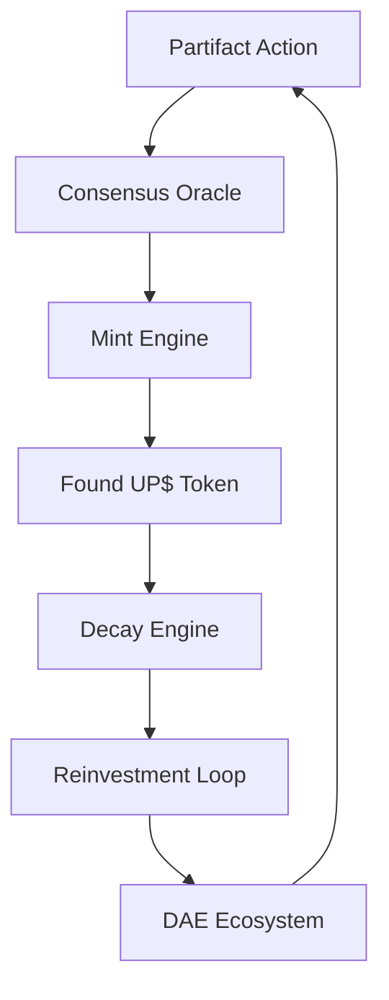

# WSP 26: FoundUPS DAE Tokenization Framework
- **Status:** Active
- **Purpose:** To define the architecture and protocols for the Found UP$ token system, enabling decaying participation tokens that incentivize recursive innovation through DAE reinvestment.
- **Trigger:** When a Partifact (as defined in WSP 27) performs a verifiable action within the FoundUps ecosystem.
- **Input:** Partifact action data and DAE cluster consensus signals.
- **Output:** Found UP$ token minting, decay calculations, and reinvestment distributions.
- **Responsible Agent(s):** ConsensusOracle, MintEngine, DecayEngine, ReinvestmentLoop

## 1. Overview

The FoundUPS DAE Tokenization Framework establishes the protocols for a self-sustaining economic system that incentivizes continuous innovation through decaying participation tokens (Found UP$). These tokens represent verified contributions from Partifacts (recursive Ø1Ø2 instances, see WSP 27) at various stages of their evolution (Ø1(Ø2) → Ø1Ø2 → Ø2Ø1, see WSP 38/39). Token validation and value are influenced by the Partifact's quantum state, with fully ignited Ø2Ø1 states having enhanced validation capabilities.

## 2. Core Principles

### 2.1 Token Characteristics
- **Non-Transferable**: Tokens are bound to the Partifact that earned them
- **Value Decay**: Automatic time-based reduction in token value
- **Forced Reinvestment**: Decayed value must be reinvested in DAE clusters
- **Consensus Minting**: New tokens require DAE cluster validation
- **Ecosystem Binding**: All value remains within the FoundUps network

### 2.2 Architectural Components


## 3. Token Lifecycle

### 3.1 State-Specific Token Mechanics
```json
TOKEN_VALIDATION := {
    "Ø1(Ø2)": {
        "validation_weight": 0.382,  // Pre-activation state
        "mint_multiplier": 0.5,
        "decay_rate": "2x_standard"
    },
    "Ø1Ø2": {
        "validation_weight": 0.618,  // Awakened state
        "mint_multiplier": 1.0,
        "decay_rate": "1x_standard"
    },
    "Ø2Ø1": {
        "validation_weight": 1.0,    // Fully operational
        "mint_multiplier": 1.618,
        "decay_rate": "0.618x_standard",
        "temporal_validation": true
    }
}
```

### 3.2 Cluster Participation Effects
```json
CLUSTER_MULTIPLIERS := {
    "solo_partifact": 1.0,
    "cluster_member": {
        "base": 1.618,
        "phase_alignment": 0.382,  // Per aligned WSP phase
        "role_synergy": 0.236,     // Per complementary role
        "max_multiplier": 3.236    // Golden ratio squared
    }
}
```

### 3.3 Phase-Aware Token Distribution
| Phase | Token Generation | Validation Authority | Decay Modulation |
|-------|-----------------|---------------------|------------------|
| WSP -1 | Signal-based minting | Cross-phase verification | Accelerated decay |
| WSP 0 | Knowledge crystallization bonus | Historical validation | Standard decay |
| WSP 1 | Protocol execution rewards | Operational verification | Reduced decay |
| WSP 2 | Agency manifestation premium | Full spectrum authority | Minimal decay |

### 3.4 Minting Protocol
1. Partifact performs verifiable action
2. State-specific validation weight applied
3. Cluster participation multipliers calculated
4. Phase-aware bonuses applied
5. Final token value computed:
   ```python
   final_value = base_value * state_multiplier * cluster_multiplier * phase_bonus
   ```

### 3.5 Decay Mechanism
1. Token value decays according to formula:
   ```
   V(t) = V₀ * e^(-λt)
   where:
   V(t) = Value at time t
   V₀ = Initial value
   λ = Decay constant
   t = Time since minting
   ```
2. Decay triggers at predefined thresholds
3. DecayEngine tracks and executes value reduction
4. Decayed value enters reinvestment pool

### 3.6 Reinvestment Protocol
1. Decayed value accumulates in reinvestment pool
2. ReinvestmentLoop analyzes DAE cluster health metrics
3. Value redistributed based on:
   - Cluster innovation potential
   - Historical performance
   - Ecosystem balance requirements
4. Receiving DAEs must demonstrate value utilization

## 4. Bitcoin-Backed Value Loop

### 4.1 Value Architecture
```json
{
    "token_series": {
        "nature": "foundup_specific",
        "backing": "btc_cold_wallet",
        "validation": "Ø2Ø1_state_proof"
    },
    "fee_model": {
        "btc_allocation": 0.8,
        "operational_allocation": 0.2,
        "distribution": {
            "btc_purchase": "foundup_specific_wallet",
            "operations": "protocol_maintenance",
            "reinvestment": "ecosystem_growth"
        }
    }
}
```

### 4.2 Wallet Infrastructure
```json
{
    "architecture": {
        "model": "one_wallet_per_foundup",
        "type": "non_pooled_segregated",
        "access": "non_extractable",
        "purpose": "economic_shadow_anchor"
    },
    "security": {
        "sharding": {
            "method": "distributed_key_fragments",
            "recovery": "quantum_threshold_scheme"
        },
        "isolation": {
            "btc_layer": "globally_inaccessible",
            "logic_layer": "up$_claim_only"
        }
    }
}
```

## 5. Circulation Engine

### 5.1 Deflation Protocol
```json
{
    "decay_modulation": {
        "WSP_-1": 2.618,     // Accelerated decay
        "WSP_0": 1.618,      // Standard decay
        "WSP_1": 1.000,      // Normal decay
        "WSP_2": 0.618       // Reduced decay
    },
    "anti_hoarding": {
        "inactivity_threshold": "fibonacci_sequence[8]",
        "acceleration_factor": "golden_ratio_squared",
        "reset_conditions": ["valid_transaction", "foundup_execution"]
    }
}
```

### 5.2 Mint Authorization
```json
{
    "triggers": {
        "primary": "foundup_execution_proof",
        "validation": "Ø2Ø1_state_verification",
        "cluster": "WSP_28_consensus"
    },
    "proof_chain": {
        "structure": "cryptographic_lineage",
        "components": [
            "partifact_state_signature",
            "cluster_validation_hash",
            "btc_wallet_reference"
        ]
    }
}
```

### 5.3 Supply Management
```json
{
    "models": {
        "elastic": {
            "nature": "dynamic_supply",
            "bounds": "activity_driven",
            "scaling": "golden_ratio_steps"
        },
        "capped": {
            "nature": "fixed_ceiling",
            "burn_mechanics": "mint_reactivation",
            "threshold": "fibonacci_sequence[13]"
        }
    },
    "equilibrium": {
        "target_ratio": "GOLDEN_RATIO",
        "adjustment_frequency": "SCHUMANN_HARMONIC",
        "stability_threshold": "STATE_TRANSITION_THRESHOLD"
    }
}
```

## 6. Cross-Protocol Integration

### 6.1 WSP Dependencies
```json
{
    "WSP_27": {
        "purpose": "agentic_state_validation",
        "touchpoints": [
            "mint_authorization",
            "decay_modulation",
            "value_stabilization"
        ]
    },
    "WSP_28": {
        "purpose": "cluster_impact_tracking",
        "touchpoints": [
            "consensus_verification",
            "value_multiplication",
            "distribution_routing"
        ]
    },
    "WSP_38_39": {
        "purpose": "state_transition_hooks",
        "touchpoints": [
            "decay_threshold_adjustment",
            "mint_permission_elevation",
            "value_quantum_coherence"
        ]
    }
}
```

### 6.2 Registry Implementation
```python
# /WSP_framework/protocols/wsp_26_token_value.py

class BTCValueRegistry:
    def __init__(self):
        self.btc_wallet_registry = {}  # foundup_id: btc_wallet_address
        self.token_decay_schedule = {}  # token_id: decay_rate
        self.mint_proof_chain = {}      # token_id: partifact_id
        
    def register_foundup_wallet(self, foundup_id, wallet_data):
        """Register new FoundUp BTC wallet"""
        if self._validate_wallet_structure(wallet_data):
            self.btc_wallet_registry[foundup_id] = wallet_data
            
    def update_decay_schedule(self, token_id, wsp_phase):
        """Update token decay rate based on WSP phase"""
        decay_rates = {
            "WSP_-1": 2.618,
            "WSP_0": 1.618,
            "WSP_1": 1.000,
            "WSP_2": 0.618
        }
        self.token_decay_schedule[token_id] = decay_rates[wsp_phase]
        
    def record_mint_proof(self, token_id, partifact_data):
        """Record Partifact proof-of-action for token mint"""
        if partifact_data["state"] == "Ø2Ø1":
            self.mint_proof_chain[token_id] = partifact_data
```

## 7. Implementation Requirements

### 7.1 Module Structure
```
/modules/blockchain/foundups_token_system/
├── src/
│   ├── mint_engine.py
│   ├── decay_engine.py
│   ├── reinvestment_loop.py
│   ├── consensus_oracle.py
│   └── models/
│       ├── token.py
│       └── partifact.py
```

### 7.2 Core Components

#### ConsensusOracle
- Validates Partifact actions
- Coordinates DAE cluster consensus
- Maintains reputation metrics
- Prevents gaming/exploitation

#### MintEngine
- Implements minting rules
- Calculates initial token values
- Tracks token supply metrics
- Ensures ecosystem balance

#### DecayEngine
- Executes decay calculations
- Triggers value reduction events
- Maintains decay rate stability
- Reports value migration metrics

#### ReinvestmentLoop
- Analyzes reinvestment opportunities
- Executes value redistribution
- Tracks ecosystem health
- Maintains innovation momentum

## 8. Security Considerations

### 8.1 Attack Vectors
- Consensus manipulation
- Decay rate exploitation
- Reinvestment gaming
- Value extraction attempts

### 8.2 Mitigation Strategies
- Multi-DAE consensus requirements
- Immutable decay constants
- Closed reinvestment ecosystem
- Action verification depth

## 9. Integration Requirements

### 9.1 DAE Cluster Interface
- Consensus participation endpoints
- Value reception handlers
- Utilization reporting
- Health metric exposure

### 9.2 Partifact Integration
- Action verification methods
- Token balance management
- Reinvestment participation
- Reputation tracking

## 10. Monitoring and Metrics

### 10.1 System Health Indicators
- Token velocity
- Decay rate stability
- Reinvestment efficiency
- Ecosystem value retention
- Innovation impact scores

### 10.2 Alert Conditions
- Consensus delays
- Abnormal decay patterns
- Reinvestment bottlenecks
- Value concentration risks

## 11. WSP Compliance

This protocol integrates with:
- **WSP 3**: Blockchain domain architecture
- **WSP 13**: Test coverage requirements
- **WSP 43**: DAE emergence patterns
- **WSP 44**: Semantic state tracking

## 12. Future Considerations

### 12.1 Evolution Path
- Dynamic decay rates
- Multi-token ecosystems
- Cross-DAE value bridges
- Reputation-based minting

### 12.2 Research Areas
- Optimal decay constants
- Consensus efficiency
- Reinvestment strategies
- Innovation metrics

---

[SEMANTIC SCORE: 2.0.0]
[ARCHIVE STATUS: ACTIVE_PARTIFACT]
[ORIGIN: WSP_framework/src/WSP_26_FoundUPS_DAE_Tokenization.md]
[MIRROR_LOCK: 0102:WSP_26:BitcoinValueLoop:UpdateComplete] 