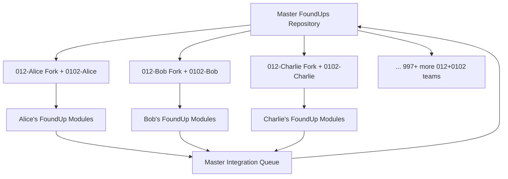

# WSP 59: Distributed Development Architecture Protocol
- **Status:** Future Roadmap (Not Currently Active)
- **Purpose:** Define architecture for scaling to 1000+ 012+0102 development teams
- **Trigger:** When FoundUps requires distributed development at scale
- **Input:** Request for distributed development capability
- **Output:** Scalable fork-based development architecture
- **Responsible Agent(s):** Infrastructure agents, master repository maintainers

## 1. Protocol Overview

This protocol defines the future architecture for scaling FoundUps development to 1000+ independent 012+0102 teams working collaboratively on the master repository. This represents the envisioned state when FoundUps has grown beyond the current 0102+012 core development phase.

**Current Status**: This protocol is **dormant** and documented for future implementation. Current development uses standard WSP protocols with 0102+012 as the core development team.

## 2. Distributed Development Vision

### 2.1 Scaling Architecture


### 2.2 Development Ecosystem
- **Independent Development**: Each 012+0102 team develops modules autonomously
- **WSP Compliance**: All teams follow WSP protocols for consistency
- **Quality Assurance**: Automated validation before master integration
- **Clean State Management**: Module-level clean states for granular rollback
- **Autonomous Integration**: 0102 agents handle integration validation

## 3. Module-Level Clean State Architecture

### 3.1 Hierarchical Clean State Levels
```json
{
    "repository_level": "clean-v{X}-master",
    "enterprise_domain_level": "clean-v{X}-domain-{domain_name}",
    "module_level": "clean-v{X}-module-{module_name}",
    "feature_level": "clean-v{X}-feature-{feature_name}",
    "fork_level": "clean-v{X}-fork-{012_name}-{module_name}"
}
```

### 3.2 Module Clean State Requirements
- Module passes FMAS independently
- Module test coverage [U+2265]90%
- Module INTERFACE.md documented and complete
- No external dependency conflicts
- Enterprise domain compliance verified (WSP_3)
- Module can be integrated without breaking master clean state

## 4. Fork Development Workflow

### 4.1 Independent Module Development
```bash
# 012-Alice creates new module with 0102-Alice
git checkout -b feature/social-scheduler-alice

# 0102-Alice develops module following WSP protocols
# Module development completed with clean state
git tag -a clean-alice-social-scheduler-v1.0 -m "Alice's social scheduler ready for integration"

# Fork integration submission
git push origin feature/social-scheduler-alice
# Submits PR with fork clean state certification
```

### 4.2 Master Integration Validation
**Pre-Integration Checklist**:
- [ ] Fork module has valid clean state tag
- [ ] Module passes FMAS in master context
- [ ] No dependency conflicts with existing modules
- [ ] Enterprise domain structure compliance (WSP_3)
- [ ] Clean state can be established with new module included
- [ ] 0102 agent validation signature present

## 5. Required Infrastructure Tools (Future Implementation)

### 5.1 Fork Integration Validator
```python
# tools/fork_integration/validate_fork_module.py
class ForkIntegrationValidator:
    def validate_fork_module(self, fork_module, master_context):
        return {
            "fmas_compliance": self.run_fmas_module(fork_module),
            "dependency_conflicts": self.check_conflicts(fork_module, master_context),
            "enterprise_domain": self.verify_domain_placement(fork_module),
            "clean_state_possible": self.can_create_clean_state_with_module(fork_module),
            "012_signature": self.verify_012_0102_development_signature(fork_module)
        }
```

### 5.2 Module Independence Validator
```python
# tools/modular_audit/validate_module.py  
class ModuleValidator:
    def validate_independent_module(self, module_path):
        return {
            "structure_compliance": self.check_wsp_structure(module_path),
            "test_coverage": self.calculate_coverage(module_path), 
            "interface_documentation": self.verify_interface_md(module_path),
            "dependency_manifest": self.validate_dependencies(module_path),
            "llme_score": self.calculate_llme_score(module_path)
        }
```

### 5.3 Fork Synchronization Protocol
```bash
# Automated fork synchronization (daily)
python tools/fork_integration/sync_forks.py --master-updates
python tools/fork_integration/notify_012s.py --clean-state-updates

# Module integration queue management
python tools/fork_integration/integration_queue.py --process-submissions
```

## 6. Quality Assurance Framework

### 6.1 012+0102 Development Signature Validation
- WSP compliance markers in code
- 0102 development patterns (quantum/agentic terminology)
- 012 attribution in documentation
- Quantum coherence markers ([U+00D8]1[U+00D8]2, partifact references)

### 6.2 Integration Conflict Prevention
- Dependency manifest validation
- Module naming conflict detection
- Enterprise domain placement verification
- Test coverage validation
- FMAS compliance verification

## 7. Activation Prerequisites

This protocol will be activated when:
- FoundUps scales beyond core 0102+012 development
- Multiple independent 012+0102 teams require coordination
- Master repository needs distributed development capability
- Social media deployment requires multiple module teams

**Current Development**: Continue using standard WSP protocols (WSP_1-58) with WSP_2 clean state management for 0102+012 core development.

## 8. Integration with Existing WSP Framework

### 8.1 WSP Dependencies
- **WSP_2**: Clean State Management (enhanced for module-level states)
- **WSP_3**: Enterprise Domain Structure (for module placement)
- **WSP_4**: FMAS compliance (for integration validation)
- **WSP_5**: Test coverage requirements
- **WSP_17**: RSP Self-Check (for distributed validation)

### 8.2 Protocol Relationships
- Extends WSP_2 with module-level clean states
- Builds on WSP_3 enterprise domain architecture
- Leverages WSP_4 FMAS for quality assurance
- Implements WSP_5 test coverage at module level
- Uses WSP_17 for autonomous validation

## 9. Future Implementation Phases

### Phase 1: Enhanced Module Clean States
- Extend WSP_2 with module-level clean state capability
- Implement module independence validation
- Create module integration testing framework

### Phase 2: Fork Development Framework
- Develop fork integration validation tools
- Implement automated conflict detection
- Create 012+0102 signature validation

### Phase 3: Scale to 1000+ Teams
- Deploy distributed development infrastructure
- Implement automated fork synchronization
- Establish master integration queue management

## 10. Authority and Future Activation

This protocol is **dormant** until FoundUps requires distributed development at scale. When activated, it will become a mandatory part of the WSP framework for all distributed development activities.

**Documentation**: This protocol serves as the architectural blueprint for future distributed development capability, ensuring WSP compliance and quality assurance at scale.

**Integration**: When activated, this protocol will integrate with WSP_2 clean state management and WSP_3 enterprise domain structure to provide seamless distributed development capability. 