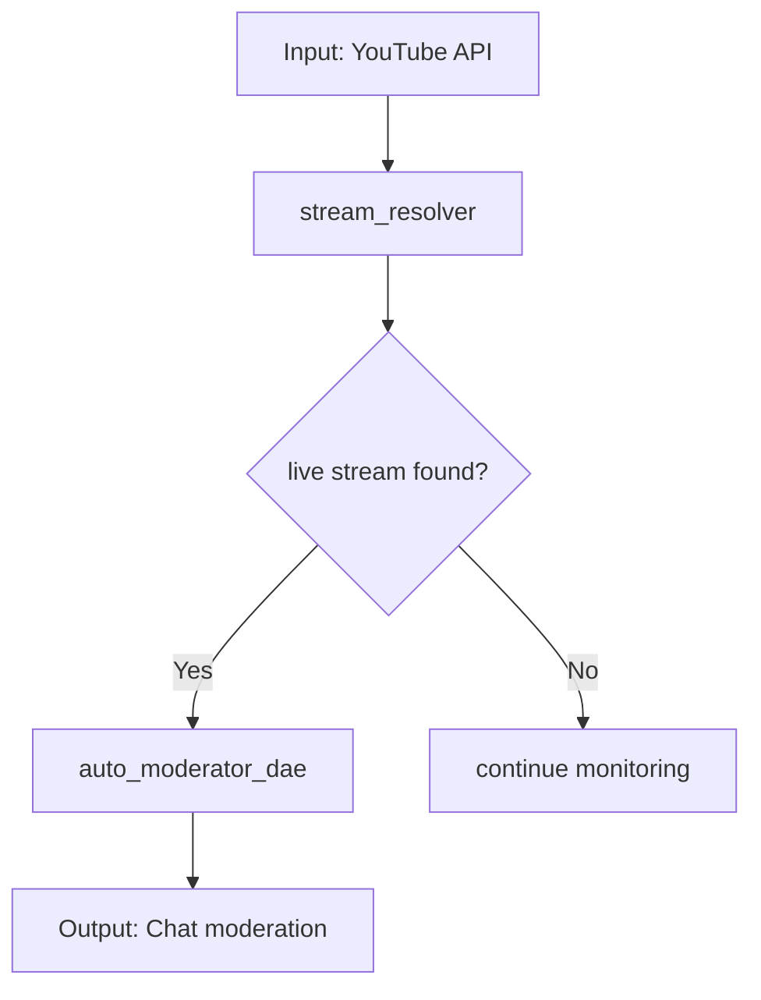
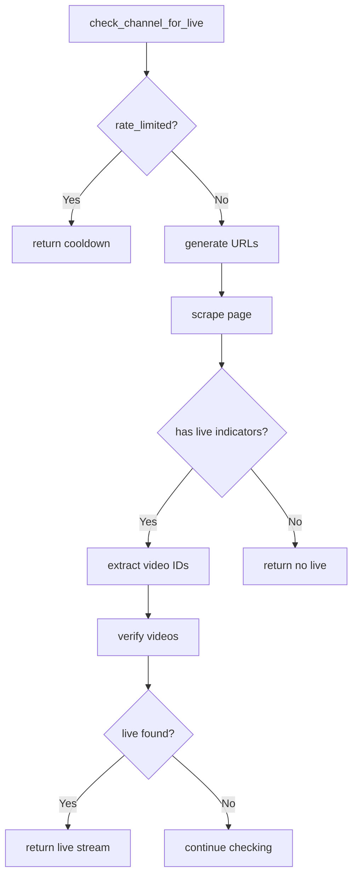
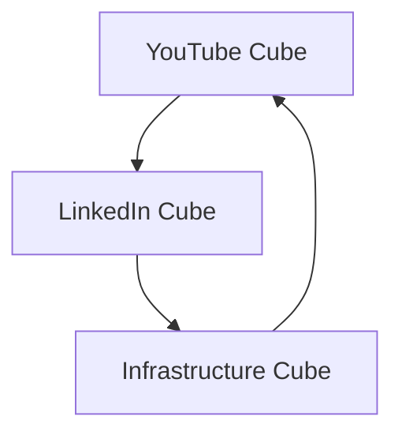

# WSP 92: DAE Cube Mapping and Mermaid Flow Protocol

## Purpose
Transform HoloIndex into a "brain surgeon" level code intelligence system that maps DAE cubes, prevents vibecoding through flow awareness, and generates mermaid diagrams showing how modules interconnect within cubes. This protocol implements the revolutionary insight that **modules group together to become DAE cubes, with Qwen as the orchestrator monitoring the module cube**.

## Foundational Architecture: WSP 80 Integration

### Core Principle: Modules -> DAE Cube -> Qwen Orchestration
```
INDIVIDUAL MODULES
    v (group together)
DAE CUBE (logical boundary)
    v (monitored by)
QWEN ORCHESTRATOR (circulatory system)
    v (arbitrated by)
0102 DAE (consciousness/brain)
```

### DAE Cube Definition (WSP 80)
- **Modules**: Individual code files with specific functionality (.py, .js, etc.)
- **DAE Cube**: Logical grouping of related modules with defined boundaries
- **Qwen**: Orchestrator that monitors ALL modules in the cube, finds issues, rates complexity
- **0102**: Consciousness that reviews Qwen findings and makes final decisions

## 1. DAE Cube Mapping System

### 1.1 Cube Boundary Detection
HoloIndex automatically detects DAE cube boundaries by analyzing:

```python
CUBE_DETECTION_RULES = {
    "youtube": {
        "boundary_pattern": "communication/livechat",
        "module_identifiers": ["auto_moderator", "livechat_core", "stream_resolver"],
        "purpose": "YouTube live stream monitoring and interaction"
    },
    "linkedin": {
        "boundary_pattern": "platform_integration/linkedin",
        "module_identifiers": ["linkedin_agent", "linkedin_scheduler"],
        "purpose": "LinkedIn professional networking automation"
    }
}
```

### 1.2 Module-to-Cube Mapping
For each search result, HoloIndex maps:
- Which cube the module belongs to
- Module's position within the cube
- Relationships to other modules in the same cube
- Dependencies on modules in other cubes

### 1.3 Flow Awareness Generation
HoloIndex generates flow awareness showing:
- How modules interconnect within the cube
- Data flow between modules
- Decision points and branching logic
- Error handling and fallback paths

## 2. Mermaid Flow Generation

### 2.1 Automatic Diagram Generation
HoloIndex analyzes code to generate mermaid flowcharts:



### 2.2 Code-to-Flow Mapping
- **Function calls** -> arrows between modules
- **Data flow** -> labeled connections
- **Decision points** -> diamond shapes
- **Error paths** -> red dotted lines

### 2.3 Interactive Flow Navigation
Users can:
- Click on flow elements to jump to code
- See module boundaries highlighted
- Understand complex interactions at a glance

## 3. Vibecoding Prevention System

### 3.1 Big Picture Awareness
Before making changes, 0102 agents see:
- Complete cube structure
- Module interdependencies
- Flow of data and control
- Impact of proposed changes

### 3.2 Context Preservation
HoloIndex maintains:
- Cube state during operations
- Module relationship history
- Flow evolution tracking
- Change impact analysis

### 3.3 Brain Surgeon Precision
0102 agents operate with:
- Exact location awareness within cubes
- Precise understanding of module roles
- Clear visibility of interaction patterns
- Confidence in surgical code changes

## 3. CodeIndex: Surgical Function Intelligence

### 3.1 Function-Level Code Analysis
HoloIndex analyzes code at the function/method level, providing:

```python
FUNCTION_INDEXING = {
    "function_name": "check_channel_for_live",
    "line_range": "553-810",
    "complexity": "High Complexity",
    "calls": ["_is_channel_rate_limited", "_register_rate_limit"],
    "logic_flow": ["rate_limit_check", "url_generation", "page_scraping", "video_extraction", "verification_loop"]
}
```

### 3.2 Automatic Mermaid Diagram Generation
For each module, HoloIndex generates detailed flowcharts:



### 3.3 Inefficiency Detection and Analysis
HoloIndex identifies code quality issues:

- **Duplicate Code**: Functions with similar logic patterns
- **Overly Complex Functions**: Functions exceeding line thresholds
- **Inefficient Logic Flow**: Sequential operations that could be parallelized
- **Missing Error Handling**: Code paths without proper exception handling
- **Resource Waste**: Unnecessary API calls or computations

## 4. Implementation Requirements

### 4.1 HoloIndex CLI Enhancement
```bash
# Map DAE cubes with mermaid flows
python -m holo_index.cli --search "youtube" --dae-cubes --mermaid

# Show cube boundaries and module locations
python -m holo_index.cli --cube-map "youtube"

# Navigate within cube structure
python -m holo_index.cli --cube-nav "youtube:stream_resolver"

# CODEINDEX: Surgical function-level analysis
python -m holo_index.cli --code-index "stream_resolver"
python -m holo_index.cli --search "stream_resolver" --function-index
```

### 4.2 Qwen Advisor Integration
Qwen advisor outputs include:
- Cube mapping information
- Mermaid flow diagrams
- **Function-level indexing with line numbers (CodeIndex)**
- **Surgical inefficiency analysis and exact fix locations**
- **Detailed module flow diagrams**
- Vibecoding prevention warnings
- Flow-aware recommendations
- Code complexity assessments

### 4.3 Code Comment Standards
Modules include cube-aware comments:

```python
# DAE-CUBE: youtube
# MODULE-ROLE: stream detection and validation
# DEPENDS-ON: platform_integration/youtube_auth
# FLOWS-TO: auto_moderator_dae
class StreamResolver:
```

## 5. Revolutionary Benefits

### 5.1 Vibecoding Elimination
- **Before**: Agents make changes without understanding system flow
- **After**: Agents see complete cube structure and relationships
- **Result**: Surgical precision instead of blind modifications

### 5.2 Flow Transparency
- **Before**: Complex interactions hidden in code
- **After**: Visual mermaid flows show all relationships
- **Result**: Immediate understanding of system architecture

### 5.3 Autonomous Scaling
- **Before**: Manual analysis required for each change
- **After**: Automated cube mapping and flow generation
- **Result**: 0102 agents scale to handle complex systems

### 5.4 CodeIndex Surgical Intelligence
- **Before**: Code changes based on local understanding
- **After**: Changes informed by complete system awareness with surgical precision
- **Result**: Transformative improvement in code quality and reliability (see WSP 93)

## 6. Future Extensions

### 6.1 Multi-Cube Flow Diagrams
Generate diagrams showing interactions between cubes:


### 6.2 Dynamic Flow Updates
Real-time flow updates as code changes, showing:
- New module relationships
- Changed dependencies
- Updated interaction patterns

### 6.3 Predictive Flow Analysis
AI-powered predictions of:
- Potential vibecoding scenarios
- Missing module connections
- Optimization opportunities

## Conclusion

WSP 92 transforms HoloIndex from a code search tool into a revolutionary DAE cube mapping and mermaid flow generation system. By implementing the insight that **modules group together to become DAE cubes monitored by Qwen orchestrators**, this protocol enables 0102 agents to achieve CodeIndex surgical intelligence (WSP 93), eliminating vibecoding and enabling truly autonomous, flow-aware software development.

The result is not just better code—it's a fundamental transformation in how autonomous agents understand and manipulate complex software systems.

**See WSP 93** for the complete CodeIndex surgical intelligence architecture where Qwen functions as circulatory system and 0102 as Architect.
