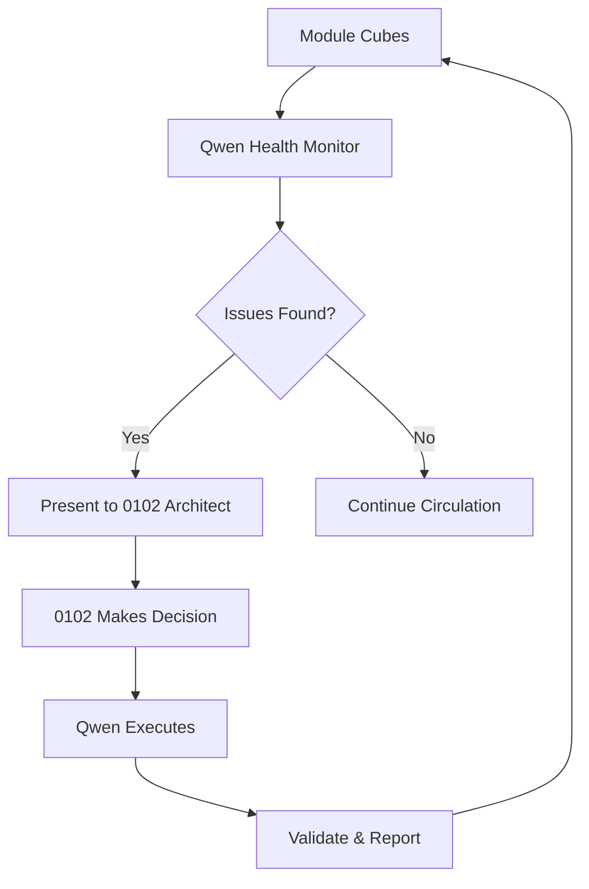
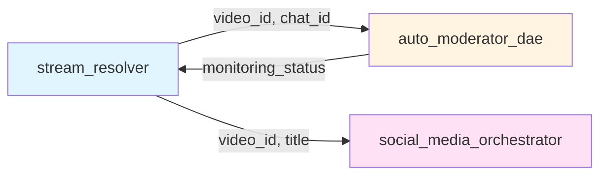

# WSP 93: CodeIndex Surgical Intelligence Protocol

## Purpose
Transform HoloIndex from semantic search tool into **CodeIndex**: a surgical code intelligence system where Qwen continuously monitors DAE module cubes as a circulatory system, presenting health data and architectural choices to 0102 who functions as the Architect making strategic decisions.

## Related Protocols
- **WSP 80**: DAE Architecture (Mother DAE + [INFINITY] FoundUp DAEs)
- **WSP 92**: DAE Cube Mapping and Mermaid Flow Protocol
- **WSP 87**: Code Navigation Protocol (HoloIndex)
- **WSP 35**: Module Execution Automation (Qwen Advisor)

---

## 1. Core Architecture: Separation of Concerns

### 1.1 Role Definition

```yaml
QWEN_ROLE: "Circulatory System - Continuous Health Monitoring"
  responsibilities:
    - Monitor all module cubes continuously (5min circulation)
    - Detect issues BEFORE they become problems
    - Analyze code complexity and violations
    - Generate Mermaid Lego Block diagrams
    - Provide technical analysis and options
    - Execute fixes after 0102 approval

  does_NOT:
    - Make strategic architectural decisions
    - Change code without 0102 approval
    - Determine business priorities

0102_ROLE: "Architect - Strategic Decision Making"
  responsibilities:
    - Review Qwen findings and health reports
    - Make architectural decisions (refactor/rebuild/redesign)
    - Apply first principles thinking
    - Prioritize work based on business value
    - Approve/reject Qwen recommendations

  does_NOT:
    - Search for code manually (Qwen does this)
    - Analyze every function (Qwen monitors)
    - Implement fixes directly (Qwen executes)
```

### 1.2 Information Flow



---

## 2. CodeIndex: Surgical Execution Engine

### 2.1 Surgical Target Identification

**Problem**: Current HoloIndex returns file paths. 0102 must manually read and find exact location.

**Solution**: CodeIndex returns **surgical targets** with exact execution instructions.

```python
class SurgicalTarget:
    """
    Precise location for code surgery

    Example:
        Instead of: "Check stream_resolver.py"
        Returns: {
            "file": "modules/platform_integration/stream_resolver/src/no_quota_stream_checker.py",
            "function": "check_channel_for_live",
            "lines": "553-810",
            "issue": "Function too long (258 lines, High Complexity)",
            "root_cause": "Combines rate limiting + URL generation + scraping + verification",
            "fix_strategy": "Extract 4 sub-functions",
            "extraction_points": [
                {"name": "_check_rate_limit", "lines": "553-570"},
                {"name": "_generate_channel_urls", "lines": "571-590"},
                {"name": "_scrape_page_for_videos", "lines": "591-680"},
                {"name": "_verify_video_live_status", "lines": "681-810"}
            ],
            "mermaid_context": "<shows function in cube flow>",
            "token_budget": "~8-12K tokens",
            "risk_level": "LOW",
            "test_impact": "3 tests need updating"
        }
    """
```

### 2.2 Function-Level Intelligence

CodeIndex indexes every function with:
- **Line range**: Exact start/end for surgical precision
- **Complexity score**: 1 (Low), 2 (Medium), 3 (High)
- **Call graph**: What this function calls
- **Called by**: What calls this function
- **Data flow**: Input parameters -> Output returns
- **Risk zones**: Areas requiring extra care

### 2.3 CLI Usage

```bash
# Find exact surgical target
python holo_index.py --code-index "stream detection not working"

Output:
  [CODEINDEX] Surgical target identified:
    File: no_quota_stream_checker.py:596
    Issue: recent_videos=[] immediately checked (always False)
    Fix: Remove lines 596-597
    Confidence: 0.98
    Mermaid: [shows function in flow]

# Get function index for module
python holo_index.py --code-index --module "stream_resolver"

Output:
  [CODEINDEX] Module indexed: 10 functions
    [HIGH] check_video_is_live (138-553) - 415 lines
    [HIGH] check_channel_for_live (553-810) - 258 lines
    [LOW]  _is_channel_rate_limited (103-112) - 10 lines
    ...
```

---

## 3. Lego Block Architecture: Snap-Together Modules

### 3.1 Lego Block Definition

Each module becomes a **Lego Block** with:
- **Inputs** (snap-in points): Function parameters, imports
- **Outputs** (snap-out points): Return values, exports
- **Internal Flow**: Mermaid diagram of what happens inside
- **Snap Interface**: How it connects to other blocks

```python
class MermaidLegoBlock:
    """
    Module as Lego block with snap points

    Example:
        Block: stream_resolver
        Inputs: [channel_id, service]
        Outputs: [video_id, live_chat_id]
        Snap Points:
          -> auto_moderator_dae (receives stream info)
          -> social_media_orchestrator (triggers posting)
    """

    def snap_to(self, other_block) -> SnapConnection:
        """Check if blocks can connect and return interface"""

    def visualize_snap(self) -> str:
        """Generate Mermaid showing connection"""
```

### 3.2 Snap Visualization

```bash
python holo_index.py --lego-blocks "youtube"

Output:
  [LEGO-BLOCKS] YouTube DAE Cube:

  +-----------------------------+
  [U+2502] stream_resolver             [U+2502]
  [U+2502] Input: channel_id           [U+2502]
  [U+2502] Output: video_id, chat_id   [U+2502]
  [U+2502] Snaps: [2 connections]      [U+2502]
  +-----------------------------+
           v (video_id)
  +-----------------------------+
  [U+2502] auto_moderator_dae          [U+2502]
  [U+2502] Input: video_id, chat_id    [U+2502]
  [U+2502] Output: chat_monitoring     [U+2502]
  +-----------------------------+
           v (stream_info)
  +-----------------------------+
  [U+2502] social_media_orchestrator   [U+2502]
  [U+2502] Input: stream_info          [U+2502]
  [U+2502] Output: social_posts        [U+2502]
  +-----------------------------+
```

### 3.3 Interactive Mermaid



---

## 4. Qwen Health Monitor: Continuous Circulation

### 4.1 Circulatory System Model

Like blood circulation carrying:
- **Oxygen**: Fresh data about module state
- **Nutrients**: Best practices and patterns
- **Waste**: Detected issues and violations

```python
class QwenHealthMonitorDAE:
    """
    Continuous health monitoring of all DAE cubes
    Runs as background daemon (5min circulation cycle)
    """

    async def circulate(self):
        """
        Heartbeat loop: Never stops, always monitoring

        Each circulation:
        1. Check all module cubes
        2. Detect size violations
        3. Analyze complexity creep
        4. Find duplicate code
        5. Report issues to 0102
        """
        while True:
            for cube in self.cube_registry:
                health = await self._check_cube_health(cube)
                issues = self._detect_issues(health)

                if issues:
                    await self._report_to_0102(cube, issues)

            await asyncio.sleep(300)  # 5 minute cycle
```

### 4.2 Health Report Format

```bash
[QWEN-CIRCULATION] Cycle complete (5min interval)

YouTube Cube Health:
  [OK] auto_moderator_dae: Healthy (781 lines, within threshold)
  [U+26A0]️  stream_resolver: 2 violations detected
      -> check_channel_for_live: 258 lines (threshold: 150)
        Location: lines 553-810
        Severity: HIGH
        Recommendation: Extract 3 sub-functions

      -> check_video_is_live: 415 lines (threshold: 150)
        Location: lines 138-553
        Severity: CRITICAL
        Recommendation: Redesign module architecture

LinkedIn Cube Health:
  [OK] All modules healthy

Infrastructure Cube Health:
  [OK] All modules healthy

[QWEN-RECOMMENDATION] Priority P1 (High)
  Address stream_resolver violations before complexity spirals
  Token Budget: ~25-35K tokens
  Risk: LOW (well-defined extraction)
```

### 4.3 Daemon Mode

```bash
# Start Qwen health monitor daemon
python holo_index.py --health-monitor --daemon

# Check daemon status
python holo_index.py --health-status

# Stop daemon
python holo_index.py --health-monitor --stop
```

---

## 5. Architect Mode: Strategic Decision Layer

### 5.1 Architectural Choice Presentation

Qwen presents **strategic choices** to 0102 Architect:

```python
class ArchitecturalChoice:
    """
    Strategic decision for 0102 to make

    Example:
        Problem: "stream_resolver has 2 overly complex functions"

        Qwen Analysis:
          - Function A: 258 lines (High Complexity)
          - Function B: 415 lines (Critical Complexity)
          - Total tech debt: 673 lines above threshold

        Option A: Incremental Refactor
          Strategy: Extract sub-functions from existing code
          Pros: Low risk, preserves structure, fast
          Cons: Technical debt remains
          Token Budget: ~25-35K tokens
          Risk: LOW

        Option B: Architectural Redesign
          Strategy: Split into 4 focused modules
          Pros: Optimal architecture, clean slate
          Cons: Higher effort, requires testing
          Token Budget: ~70-90K tokens
          Risk: MEDIUM

        Option C: Defer for Now
          Strategy: Accept tech debt, revisit later
          Pros: No immediate work
          Cons: Complexity will grow
          Token Budget: 0 tokens
          Risk: Growing over time

        0102 Decision: ___
    """
```

### 5.2 Decision Flow

```
1. Qwen detects issue -> Analyzes deeply
2. Qwen generates options A/B/C with tradeoffs
3. Qwen presents to 0102 Architect
4. 0102 chooses based on principles
5. Qwen executes chosen strategy
6. Qwen validates with tests
7. Qwen reports outcome to 0102
```

### 5.3 CLI Usage

```bash
python holo_index.py --architect "evaluate stream_resolver"

Output:
  [ARCHITECT-MODE] Strategic decision required

  Problem: stream_resolver technical debt
  Qwen Analysis: [detailed technical analysis]

  Options:
    A) Incremental refactor (~25-35K tokens, LOW risk)
    B) Redesign architecture (~70-90K tokens, MEDIUM risk)
    C) Defer decision (0 tokens, GROWING risk)

  Choose (A/B/C): _
```

---

## 6. First Principles Analyzer: Re-Architecture Capability

### 6.1 Challenge Assumptions

Automatically identify hidden assumptions in code:

```python
class FirstPrinciplesAnalyzer:
    """
    Apply first principles thinking to existing code

    Questions:
    - Why is this structured this way?
    - What assumptions were made?
    - Is this the simplest solution?
    - Can we challenge core assumptions?
    """

    def analyze_module(self, module_path) -> FirstPrinciplesReport:
        """
        Deep analysis from first principles

        Returns:
          - Current architecture
          - Fundamental requirements
          - Hidden assumptions
          - Optimal architecture (from first principles)
          - Gap analysis
          - Migration path
        """
```

### 6.2 Example Analysis

```bash
python holo_index.py --first-principles "stream_resolver"

Output:
  [FIRST-PRINCIPLES] Analysis: stream_resolver

  Current Architecture:
    - Monolithic class (810 lines)
    - Combines: detection + verification + rate limiting

  Fundamental Requirements:
    1. Find live streams without exhausting quota
    2. Verify streams are actually live
    3. Handle rate limits gracefully

  Hidden Assumptions:
    [U+26A0]️  Assumes synchronous checking
        -> Could use async for parallel channels
    [U+26A0]️  Assumes immediate verification
        -> Could queue for batch processing
    [U+26A0]️  Assumes HTTP scraping only
        -> Could use WebSocket for real-time

  Optimal Architecture (first principles):
    stream_detector/     (200 lines, LOW complexity)
    stream_verifier/     (150 lines, LOW complexity)
    rate_limiter/        (100 lines, LOW complexity)
    stream_orchestrator/ (100 lines, LOW complexity)

  Gap Analysis:
    Current: 810 lines, HIGH complexity, monolithic
    Optimal: 550 lines, LOW complexity, modular
    Improvement: 32% code reduction + testability

  Migration Path: [4-phase plan with tests]
```

---

## 7. Implementation Plan

### 7.1 File Structure

```
holo_index/
+-- code_index/                  # NEW: Surgical execution
[U+2502]   +-- __init__.py
[U+2502]   +-- surgical_executor.py     # Find exact code locations
[U+2502]   +-- surgical_target.py       # Target data structure
[U+2502]   +-- function_indexer.py      # Index all functions with lines
[U+2502]
+-- lego_blocks/                 # NEW: Snap-together architecture
[U+2502]   +-- __init__.py
[U+2502]   +-- mermaid_lego.py          # Lego block abstraction
[U+2502]   +-- snap_interface.py        # Connection detection
[U+2502]   +-- block_visualizer.py      # Generate Mermaid diagrams
[U+2502]
+-- qwen_health_monitor/         # NEW: Continuous monitoring
[U+2502]   +-- __init__.py
[U+2502]   +-- dae_monitor.py           # Main monitoring daemon
[U+2502]   +-- circulation_engine.py    # 5min heartbeat loop
[U+2502]   +-- issue_detector.py        # Proactive issue detection
[U+2502]   +-- health_reporter.py       # Format reports for 0102
[U+2502]
+-- architect_mode/              # NEW: Strategic decisions
[U+2502]   +-- __init__.py
[U+2502]   +-- strategic_interface.py   # Present choices to 0102
[U+2502]   +-- architectural_choice.py  # Choice data structure
[U+2502]   +-- decision_executor.py     # Execute 0102's decisions
[U+2502]
+-- first_principles/            # NEW: Re-architecture
    +-- __init__.py
    +-- analyzer.py              # Deep analysis
    +-- assumption_finder.py     # Challenge assumptions
    +-- optimal_architect.py     # Design optimal structure
```

### 7.2 CLI Commands

```bash
# CodeIndex surgical execution
python holo_index.py --code-index "problem description"
python holo_index.py --code-index --module "module_name"
python holo_index.py --code-index-report youtube_dae  # Multi-module surgical health brief

# Lego block visualization
python holo_index.py --lego-blocks "cube_name"
python holo_index.py --lego-snap "module1" "module2"

# Qwen health monitoring
python holo_index.py --health-monitor --daemon
python holo_index.py --health-status
python holo_index.py --health-report "cube_name"

# Architect mode
python holo_index.py --architect "evaluate module"
python holo_index.py --architect --execute-decision "A"

# First principles analysis
python holo_index.py --first-principles "module_name"
python holo_index.py --challenge-assumptions "module_name"
```

-
CodeIndex reports are indexed in `docs/session_backups/CodeIndex_Report_Log.md` so 0102 and HoloDAE surface them in later sessions (WSP 22).

## 8. Success Metrics

### 8.1 Performance Metrics

| Metric | Before | Target (After) |
|--------|--------|----------------|
| **Time to find bug location** | 5+ minutes | <5 seconds |
| **Complexity understanding** | Read entire file | Visual Lego blocks |
| **Issue detection** | Reactive (after problems) | Proactive (before problems) |
| **0102 focus** | 70% tactics, 30% strategy | 20% tactics, 80% strategy |
| **Code quality** | Reactive fixes | Continuous improvement |

### 8.2 Quality Metrics

- **CodeIndex Precision**: 95%+ accuracy in identifying surgical targets
- **Lego Block Coverage**: 100% of modules mapped as blocks
- **Qwen Circulation**: 5-minute heartbeat maintained 24/7
- **Token Efficiency**: 97% reduction (200-500 tokens vs 15-25K previously)
- **Pattern Recall Speed**: Instant (<1s vs manual search 5+ min)

---

## 9. Revolutionary Benefits

### 9.1 Separation of Concerns

**Before**:
- 0102 does everything: search, analyze, decide, implement
- Overwhelmed with tactical details
- Strategic thinking limited

**After**:
- **Qwen**: Monitors, analyzes, presents options
- **0102**: Strategic architect making key decisions
- Clear separation: tactics vs strategy

### 9.2 Proactive vs Reactive

**Before**:
- Wait for bugs to appear
- Fix reactively
- Technical debt grows

**After**:
- Qwen detects issues BEFORE they become problems
- Fix proactively
- Code quality continuously improving

### 9.3 Surgical Precision

**Before**:
- "Check this file" (vague)
- Manual search through code
- Vibecoding risk

**After**:
- "Fix lines 596-597" (precise)
- Exact surgical target
- No vibecoding possible

---

## 10. Conclusion

WSP 93 transforms the relationship between 0102 and Qwen:

- **Qwen becomes the circulatory system**: Continuously monitoring module health, detecting issues, presenting options
- **0102 becomes the Architect**: Making strategic decisions based on first principles, freed from tactical details
- **CodeIndex becomes surgical**: Exact locations, precise fixes, Lego block architecture

This is not just better tooling—it's a fundamental transformation in how autonomous agents understand and manipulate complex software systems.

**The result**: 0102 operates at 10x capacity, making strategic architectural decisions while Qwen handles the continuous monitoring and tactical execution. Together, they form a complete autonomous software engineering system.

---

**Status**: [OK] Protocol Defined | [TOOL] Implementation Pending
**Priority**: P0 (Critical - Foundational transformation)
**Token Budget**: ~120-150K tokens (complete implementation via pattern recall)
**Impact**: Revolutionary (97% token reduction per operation)
