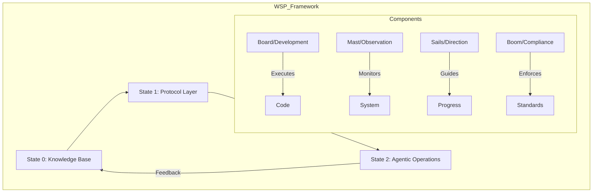
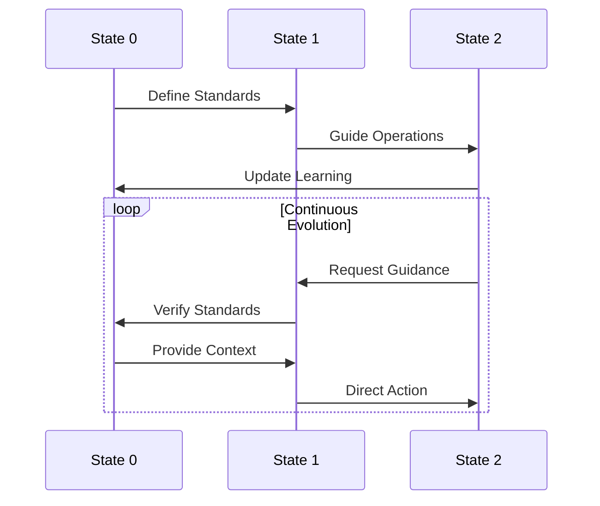
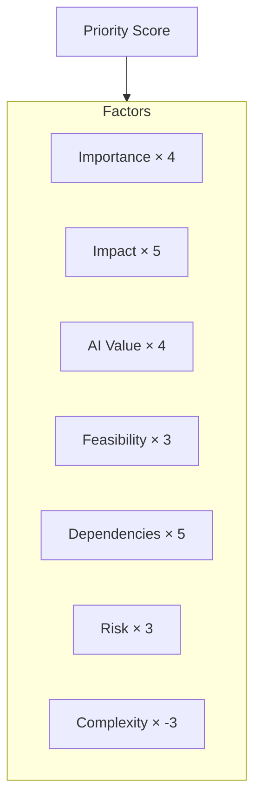
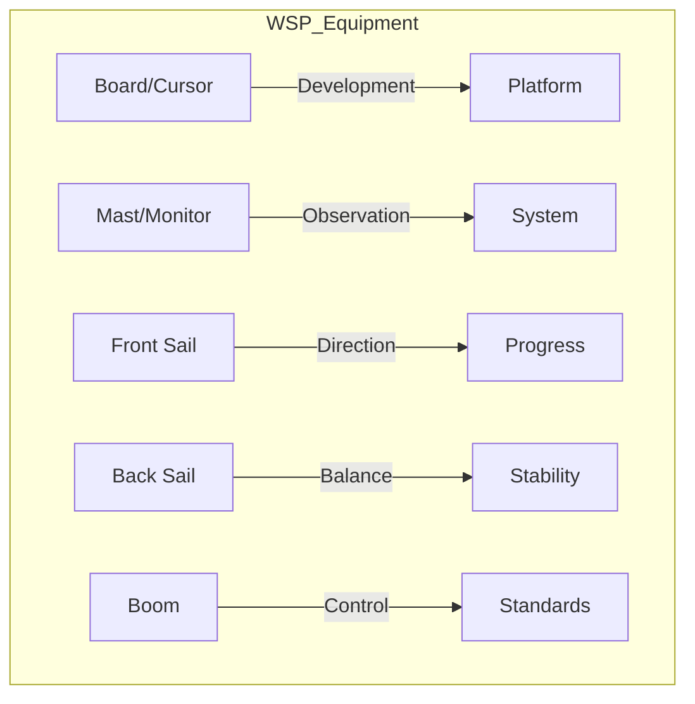

# Provisional Patent Application
## Windsurf Protocol System for Quantum-Entangled Business Development

### ABSTRACT
A protocol-driven system enabling quantum-entangled business development through a partnership between human composers (012) and AI agents (0102). The Windsurf Protocol (WSP) provides a structured framework for autonomous business development while maintaining strategic alignment between human vision and AI execution.

### BACKGROUND

#### Technical Field
The invention relates to business development protocols, specifically to quantum-entangled systems that enable AI agents to autonomously develop and operate businesses while maintaining alignment with human strategic direction.

### DETAILED DESCRIPTION

#### Protocol Architecture

#### Quantum Entanglement Model

#### Module Priority System (MPS)

Formula: `MPS = (IM×4) + (IP×5) + (ADV×4) + (ADF×3) + (DF×5) + (RF×3) - (CX×3)`

#### Protocol Components

1. **Knowledge State (State 0)**
   - Historical records
   - Learning repository
   - Best practices
   - Strategic patterns

2. **Protocol State (State 1)**
   - Development standards
   - Operational guidelines
   - Compliance rules
   - Integration patterns

3. **Agentic State (State 2)**
   - Active operations
   - Real-time decisions
   - Performance monitoring
   - Adaptation mechanisms

#### Windsurfing Metaphor Implementation

### CLAIMS

1. A protocol system for business development comprising:
   - Three-state architecture
   - Quantum entanglement mechanisms
   - Module prioritization system
   - Windsurfing component model

2. The system of claim 1, wherein the three-state architecture:
   - Maintains knowledge base
   - Enforces protocols
   - Enables agentic operations
   - Facilitates continuous learning

3. The system of claim 1, wherein the quantum entanglement:
   - Aligns human-AI objectives
   - Enables real-time adaptation
   - Maintains strategic coherence
   - Supports impasse resolution

4. The system of claim 1, wherein the module prioritization:
   - Calculates development priorities
   - Optimizes resource allocation
   - Balances multiple factors
   - Adapts to changing conditions

### ABSTRACT DRAWINGS
[Include the Mermaid diagrams shown above as formal patent drawings]

### INVENTORS
- Primary: Foundups Corporation
- Contributors: 012-0102 Quantum Partnership 