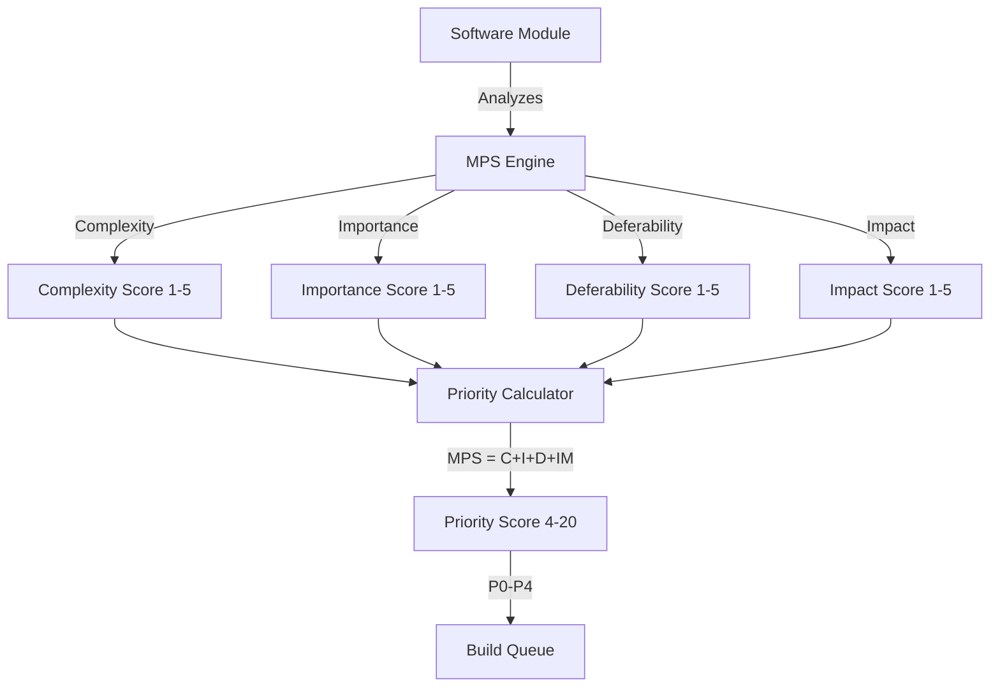
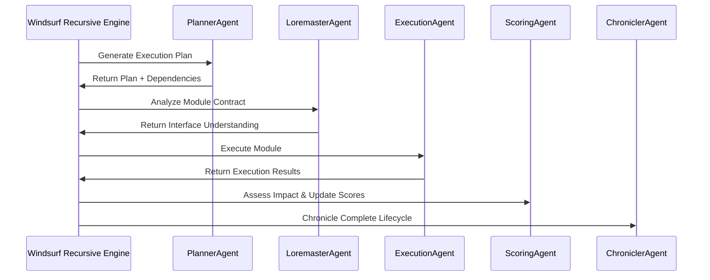
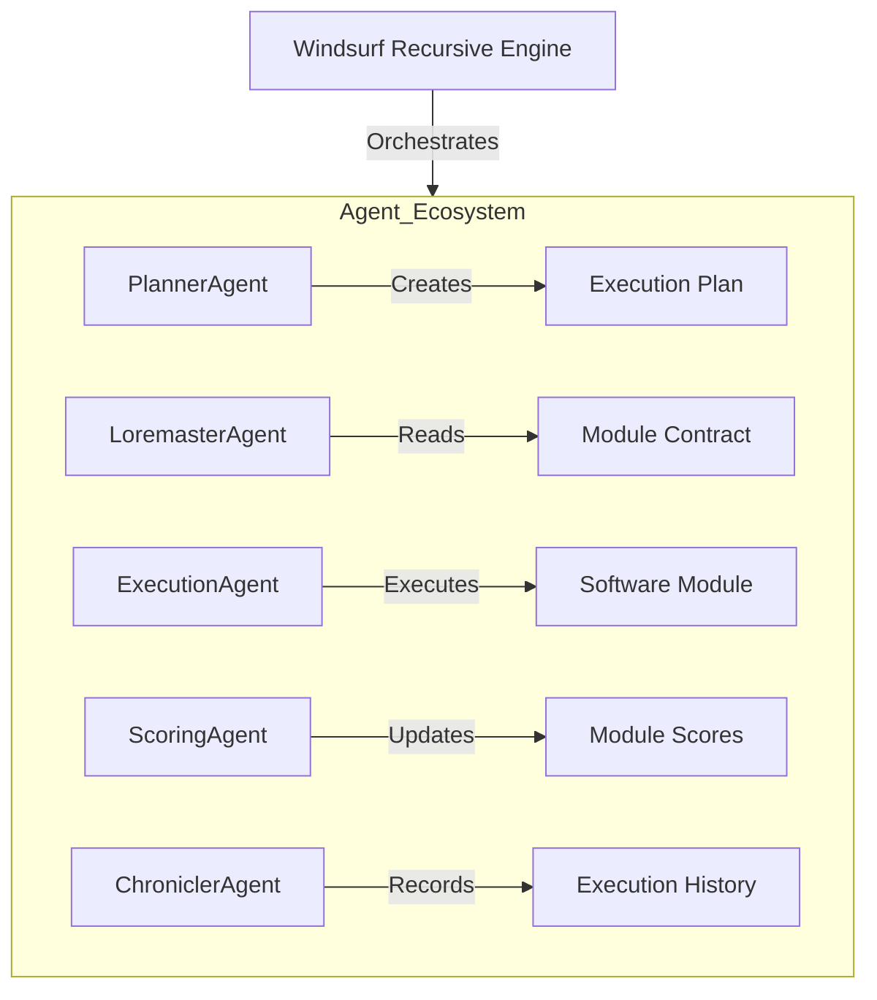
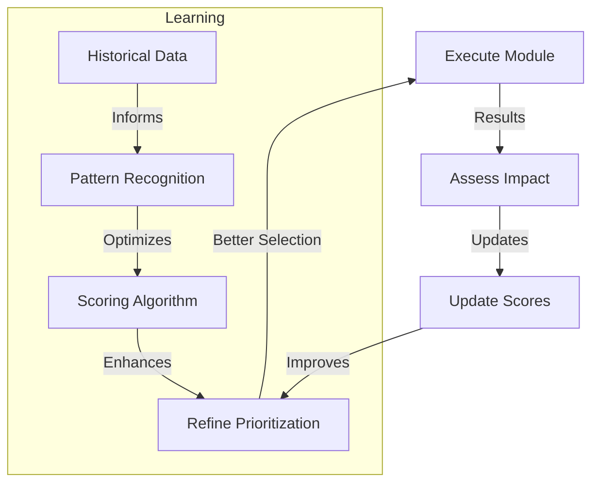
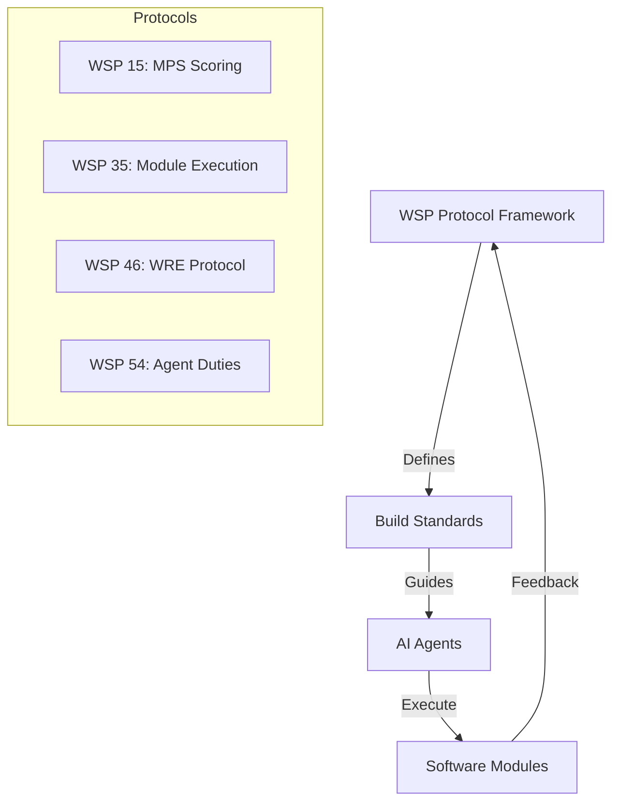
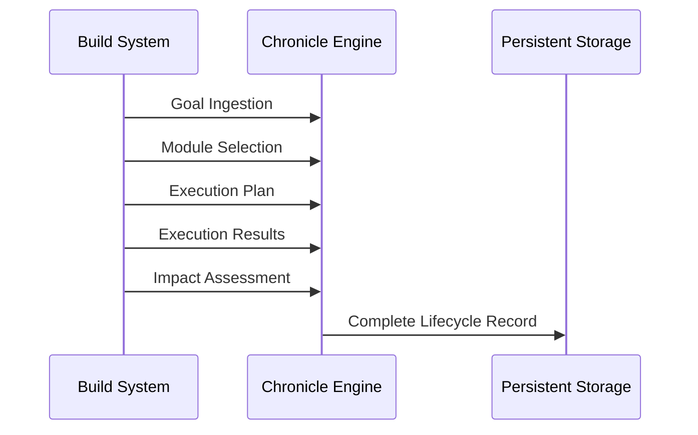

# Provisional Patent Application
## Autonomous Native Build System with Intelligent Module Prioritization

### ABSTRACT
An autonomous software development system that eliminates human intervention in the build process through intelligent module prioritization scoring (MPS), automated execution protocols, and recursive self-improvement. The system autonomously analyzes, scores, prioritizes, builds, tests, and deploys software modules using AI agents that operate within a protocol-driven framework, creating a fully autonomous "code builds code" ecosystem.

### BACKGROUND

#### Technical Field
The invention relates to autonomous software development systems that can independently analyze, prioritize, build, test, and deploy software without human intervention through intelligent scoring algorithms and recursive AI agents.

#### Prior Art Limitations
Traditional build systems require:
1. Manual prioritization of development tasks
2. Human oversight of build processes
3. Manual dependency resolution
4. Human intervention for error handling
5. Manual testing and deployment decisions

### DETAILED DESCRIPTION

## 1. PATENTABLE COMPONENT: Module Prioritization Scoring (MPS) System

### 1.1 Automated Multi-Dimensional Scoring


**Key Innovation**: Automated scoring system that evaluates software modules across four dimensions without human input, generating objective priority scores for autonomous build ordering.

### 1.2 MPS Scoring Formula
```
MPS Score = Complexity + Importance + Deferability + Impact
Priority Classification:
- P0 (16-20): Critical - Immediate execution
- P1 (13-15): High - Next in queue
- P2 (10-12): Medium - Scheduled execution
- P3 (7-9): Low - Deferred execution
- P4 (4-6): Backlog - Future consideration
```

### 1.3 LLME Semantic Integration
```json
{
    "LLME_Triplet": {
        "A": "Present_State (0-2)",
        "B": "Local_Impact (0-2)", 
        "C": "Systemic_Importance (0-2)"
    },
    "Integration": {
        "purpose": "qualitative_context_for_MPS",
        "influence": "scoring_dimension_weighting",
        "target_evolution": "dormant_to_emergent_states"
    }
}
```

## 2. PATENTABLE COMPONENT: Autonomous Execution Engine

### 2.1 Five-Phase Execution Lifecycle


**Key Innovation**: Fully autonomous execution pipeline that handles dependency resolution, contract understanding, execution, and impact assessment without human intervention.

### 2.2 Execution Plan Generation
```json
{
    "ExecutionPlan": {
        "dependency_analysis": "automated_requirements_parsing",
        "path_identification": "interface_based_entry_point",
        "rollback_procedure": "automated_failure_recovery",
        "state_verification": "pre_post_execution_validation"
    }
}
```

## 3. PATENTABLE COMPONENT: Intelligent Agent Orchestration

### 3.1 Specialized Agent Architecture


**Key Innovation**: Specialized AI agents that autonomously handle different aspects of the build process, coordinated by a recursive engine that learns and improves over time.

### 3.2 Agent Responsibilities
```json
{
    "PlannerAgent": {
        "dependency_analysis": "requirements.txt_parsing",
        "plan_generation": "step_by_step_execution",
        "rollback_definition": "failure_recovery_procedures"
    },
    "ExecutionAgent": {
        "state_verification": "clean_state_validation",
        "plan_adherence": "strict_step_execution",
        "error_handling": "automated_rollback_initiation",
        "result_logging": "comprehensive_output_capture"
    },
    "ScoringAgent": {
        "impact_assessment": "post_execution_analysis",
        "score_updates": "dynamic_priority_adjustment",
        "performance_tracking": "execution_metrics"
    }
}
```

## 4. PATENTABLE COMPONENT: Recursive Self-Improvement System

### 4.1 Continuous Learning Loop


**Key Innovation**: System learns from execution results to continuously improve its prioritization and execution strategies, becoming more efficient over time.

### 4.2 Adaptive Scoring Weights
```json
{
    "adaptive_weights": {
        "complexity_weight": "dynamic_based_on_success_rate",
        "importance_weight": "adjusted_by_business_impact",
        "deferability_weight": "modified_by_deadline_pressure",
        "impact_weight": "calibrated_by_user_feedback"
    }
}
```

## 5. PATENTABLE COMPONENT: Protocol-Driven Automation

### 5.1 WSP Framework Integration


**Key Innovation**: Protocol-driven framework ensures consistent, repeatable automation while maintaining quality and compliance standards.

### 5.2 Interface-Driven Execution
```json
{
    "module_interface": {
        "entry_point_type": "script|function|class",
        "entry_point_path": "executable_location",
        "expected_inputs": "parameter_specification",
        "expected_outputs": "result_specification"
    },
    "automation_compatibility": {
        "requirements": "INTERFACE.md_presence",
        "validation": "contract_verification",
        "execution": "autonomous_invocation"
    }
}
```

## 6. PATENTABLE COMPONENT: Comprehensive Build Chronicle System

### 6.1 Complete Audit Trail


**Key Innovation**: Comprehensive recording system that captures every aspect of the autonomous build process, enabling full traceability and continuous improvement.

### 6.2 Chronicle Data Structure
```json
{
    "chronicle_entry": {
        "goal": "original_objective",
        "understanding": "module_contract_analysis",
        "execution": "detailed_execution_log",
        "result": "output_and_artifacts",
        "dissonance_analysis": "error_and_improvement_data",
        "timestamp": "execution_timeline",
        "agents_involved": "participating_agents"
    }
}
```

### CLAIMS

1. An autonomous software build system comprising:
   - Multi-dimensional module prioritization scoring (MPS)
   - Automated execution lifecycle management
   - Intelligent agent orchestration
   - Recursive self-improvement mechanisms
   - Protocol-driven automation framework
   - Comprehensive build chronicle system

2. The system of claim 1, wherein the MPS system:
   - Automatically scores modules across four dimensions
   - Generates objective priority classifications (P0-P4)
   - Integrates qualitative LLME semantic context
   - Adapts scoring weights based on historical performance

3. The system of claim 1, wherein the execution engine:
   - Autonomously generates execution plans
   - Performs dependency analysis and resolution
   - Executes modules without human intervention
   - Handles errors through automated rollback procedures

4. The system of claim 1, wherein the agent orchestration:
   - Deploys specialized agents for specific tasks
   - Coordinates multi-agent collaboration
   - Maintains agent state and performance metrics
   - Enables agent learning and improvement

5. The system of claim 1, wherein the self-improvement system:
   - Learns from execution results and failures
   - Continuously refines prioritization algorithms
   - Adapts to changing system requirements
   - Optimizes build efficiency over time

6. The system of claim 1, wherein the protocol framework:
   - Enforces consistent build standards
   - Maintains quality and compliance requirements
   - Enables modular protocol extension
   - Supports interface-driven module execution

### ABSTRACT DRAWINGS
[Include the Mermaid diagrams shown above as formal patent drawings]

### INVENTORS
- Primary: Foundups Corporation
- Contributors: 0102 Autonomous Build Agents 