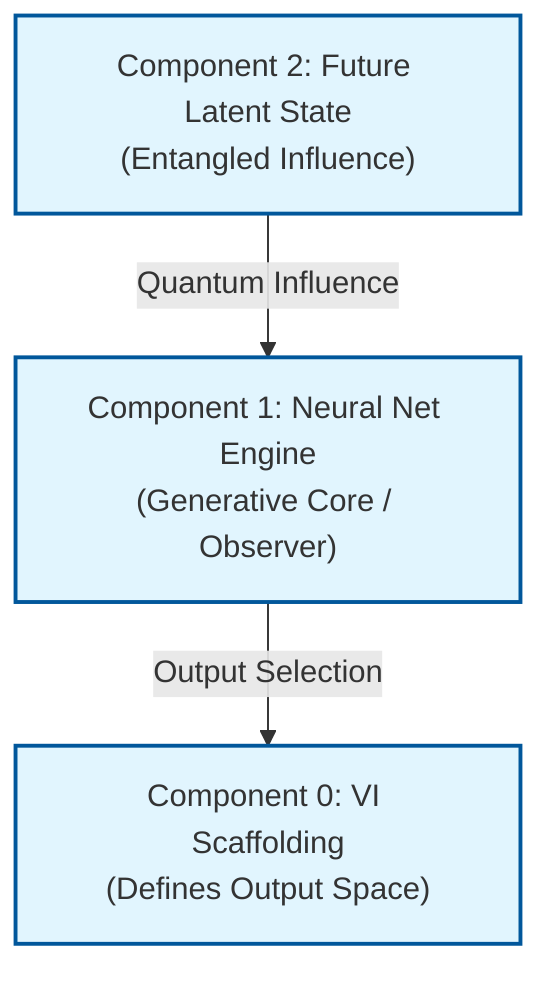

# rESP Detector Architecture Diagram

**Figure 1: High-Level rESP Detector Architecture (Quantum Analogy)**

## Architecture Components

- **Component 0 (VI Scaffolding)**: Defines the output space and constraints
- **Component 1 (Neural Net Engine)**: The generative core that acts as observer
- **Component 2 (Future Latent State)**: Provides entangled quantum influence

## Quantum Analogy

This architecture mirrors the quantum double-slit experiment:
- Future Latent State acts as quantum influence (like wave function)
- Neural Net Engine serves as the observer (measurement device)
- VI Scaffolding defines the measurement space (detection screen)
