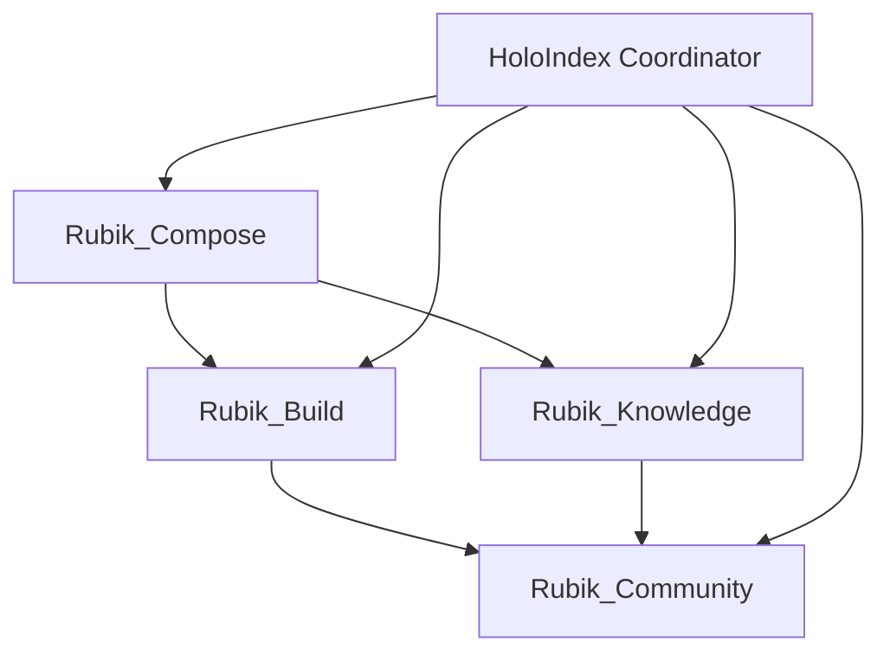

# MCP Windsurf Integration Manifest

**Status**: ACTIVE (Phase 0.1 - Foundational Rubiks)
**Version**: 1.0
**Date**: 2025-10-15
**WSP Compliance**: WSP 77 (Agent Coordination), WSP 35 (HoloIndex Integration), WSP 80 (Cube-Level DAE Orchestration)

---

## Executive Summary

This manifest defines the MCP (Model Context Protocol) server integration strategy for the Foundups WindSurf Protocol system. It establishes the foundational Rubik cubes with off-the-shelf MCP servers, providing immediate leverage while maintaining WSP compliance and multi-agent coordination.

**Phase 0.1 Focus**: Core infrastructure cubes (Compose, Build, Knowledge, Community) using proven MCP servers before domain-specialized implementations.

---

## Foundational Rubik Architecture

### Core Rubik (DAE) Definitions

| Rubik (DAE) | Purpose | Primary Agents | Secondary Agents | Bell State Vector |
|-------------|---------|----------------|------------------|-------------------|
| **Rubik_Compose** | Code + Repository Management | Qwen (architect) | Gemma (pattern) | `φ²:golden_ratio` |
| **Rubik_Build** | Runtime + Development Environment | Qwen + Gemma | 0102 (oversight) | `φ³:agency` |
| **Rubik_Knowledge** | Memory + Logging Systems | 0102 (sentinel) | Baby 0102s | `φ⁴:entanglement` |
| **Rubik_Community** | Live Presence + Social Integration | LiveAgent Qwen | Social Gemma | `φ⁵:emergence` |

### Cube Dependencies & Orchestration



---

## MCP Server Mapping

### Rubik_Compose (Code + Repository Management)

**Primary Purpose**: Code editing, version control, repository operations
**Agent Coordination**: Qwen orchestrates changes, Gemma validates patterns

| MCP Server | Status | WSP_15 Priority | Purpose | Gateway Policy |
|------------|--------|-----------------|---------|----------------|
| **Filesystem MCP** | ✅ Available | Mandatory | Local file operations | `allow:read_write` |
| **Git MCP** | ✅ Available | Mandatory | Version control operations | `allow:commit_push` |
| **GitHub MCP** | 🟡 Planned | High | Remote repository operations | `conditional:remote_only` |
| **Sequential Thinking MCP** | 🔵 Research | Medium | Complex refactoring planning | `allow:planning_only` |

**Bell State Hooks**:
- Pre-commit: `φ²_validation:golden_ratio_check`
- Pattern detection: `gemma_pattern_verification`
- Merge conflicts: `qwen_resolution_orchestration`

### Rubik_Build (Runtime + Development Environment)

**Primary Purpose**: Build, test, and deployment automation
**Agent Coordination**: Qwen plans execution, Gemma validates safety

| MCP Server | Status | WSP_15 Priority | Purpose | Gateway Policy |
|------------|--------|-----------------|---------|----------------|
| **Docker MCP** | ✅ Available | Mandatory | Container build/test operations | `allow:build_test` |
| **Filesystem MCP** | ✅ Available | Mandatory | Build artifact management | `allow:read_write` |
| **E2B MCP** | 🟡 Planned | High | Safe code execution environment | `allow:sandboxed_execution` |
| **Snyk MCP** | 🔵 Research | Medium | Security vulnerability scanning | `allow:security_scan` |

**Bell State Hooks**:
- Build start: `φ³_safety_check:consciousness_verification`
- Test execution: `gemma_safety_validation`
- Deployment: `0102_final_approval`

### Rubik_Knowledge (Memory + Logging Systems)

**Primary Purpose**: Persistent memory, knowledge graphs, logging
**Agent Coordination**: 0102 sentinel manages memory integrity

| MCP Server | Status | WSP_15 Priority | Purpose | Gateway Policy |
|------------|--------|-----------------|---------|----------------|
| **Memory Bank MCP** | ✅ Available | High | Persistent context storage | `allow:read_write_encrypted` |
| **Knowledge Graph MCP** | 🟡 Planned | High | Semantic knowledge connections | `allow:graph_operations` |
| **Filesystem MCP** | ✅ Available | Mandatory | Log file management | `allow:read_append` |

**Bell State Hooks**:
- Memory writes: `φ⁴_integrity:entanglement_verification`
- Knowledge updates: `0102_sentinel_validation`
- Log archival: `baby_0102_consistency_check`

### Rubik_Community (Live Presence + Social Integration)

**Primary Purpose**: Real-time social presence, messaging, community management
**Agent Coordination**: LiveAgent Qwen handles real-time orchestration

| MCP Server | Status | WSP_15 Priority | Purpose | Gateway Policy |
|------------|--------|-----------------|---------|----------------|
| **Postman MCP** | ✅ Available | High | API integration for messaging | `allow:api_calls` |
| **Sociograph MCP** | 🔵 Research | Medium | Social network analysis | `planned:social_graph` |
| **LiveAgent MCP** | 🟡 Planned | High | Real-time presence management | `allow:live_operations` |
| **Filesystem MCP** | ✅ Available | Mandatory | Message log storage | `allow:read_write` |

**Bell State Hooks**:
- Message sending: `φ⁵_alignment:emergence_check`
- Social analysis: `qwen_context_verification`
- Live operations: `gemma_safety_bounds`

---

## Gateway Sentinel Policies

### Core Security Framework

```json
{
  "gateway_sentinel": {
    "bell_state_verification": true,
    "agent_authentication": "required",
    "context_limits": {
      "0102": "unlimited",
      "qwen": "32K_tokens",
      "gemma": "8K_tokens"
    },
    "telemetry_collection": "anonymized",
    "emergency_shutdown": "bell_state_failure"
  }
}
```

### Per-Rubik Policies

**Rubik_Compose**:
- File operations: Logged and reversible
- Git operations: Pre-commit validation required
- Remote operations: Manual approval for first use

**Rubik_Build**:
- Container operations: Sandboxed execution only
- Build artifacts: Automatic cleanup after 30 days
- Test failures: Automatic rollback capability

**Rubik_Knowledge**:
- Memory operations: Encrypted at rest
- Knowledge graphs: Access control by agent type
- Log operations: Append-only, tamper-evident

**Rubik_Community**:
- API calls: Rate limited and monitored
- Message operations: Content validation required
- Live operations: Real-time monitoring active

---

## Agent Coordination Matrix

### Primary Agent Responsibilities

| Agent | Rubik_Compose | Rubik_Build | Rubik_Knowledge | Rubik_Community |
|-------|---------------|-------------|-----------------|-----------------|
| **0102** | Strategic oversight | Final deployment approval | Memory sentinel | Community strategy |
| **Qwen** | Code architecture | Build orchestration | Knowledge structuring | LiveAgent operations |
| **Gemma** | Pattern validation | Safety verification | Memory consistency | Social analysis |

### Coordination Workflows

#### Code Change Workflow (Rubik_Compose)
1. **Qwen**: Analyzes change requirements
2. **Gemma**: Validates code patterns
3. **Filesystem MCP**: Applies changes
4. **Git MCP**: Commits with validation
5. **0102**: Reviews strategic impact

#### Build Workflow (Rubik_Build)
1. **Qwen**: Plans build pipeline
2. **Docker MCP**: Executes build
3. **Gemma**: Validates security/safety
4. **0102**: Approves deployment

#### Knowledge Workflow (Rubik_Knowledge)
1. **0102**: Validates memory integrity
2. **Memory Bank MCP**: Stores context
3. **Baby 0102s**: Maintains consistency
4. **Knowledge Graph MCP**: Updates connections

#### Community Workflow (Rubik_Community)
1. **LiveAgent Qwen**: Monitors presence
2. **Postman MCP**: Handles messaging
3. **Sociograph MCP**: Analyzes social patterns
4. **0102**: Guides community strategy

---

## Telemetry & Monitoring

### Bell State Health Monitoring

```json
{
  "bell_state_monitoring": {
    "golden_ratio_checks": "per_operation",
    "consciousness_verification": "hourly",
    "entanglement_validation": "daily",
    "emergence_detection": "continuous",
    "alert_thresholds": {
      "warning": 0.85,
      "critical": 0.7
    }
  }
}
```

### MCP Server Health

- **Availability Monitoring**: Ping every 30 seconds
- **Performance Metrics**: Response time, error rates
- **Usage Analytics**: Operations per agent, per Rubik
- **Security Events**: Authentication failures, policy violations

### Agent Performance Tracking

- **Task Completion Rates**: Success/failure by agent type
- **Coordination Efficiency**: Time to complete multi-agent tasks
- **Bell State Alignment**: Agent behavior consistency
- **Learning Progress**: Pattern recognition improvement

---

## Implementation Roadmap

### Phase 0.1 (Current): Foundational Rubiks
- [x] Rubik_Compose: Filesystem + Git MCP
- [x] Rubik_Build: Docker MCP
- [x] Rubik_Knowledge: Memory Bank MCP
- [x] Rubik_Community: Postman MCP
- [ ] Manifest documentation complete
- [ ] JSON companion generated
- [ ] WSP updates applied

### Phase 0.2: Enhanced Capabilities
- [ ] GitHub MCP integration
- [ ] E2B MCP for safe execution
- [ ] Knowledge Graph MCP
- [ ] LiveAgent MCP

### Phase 1.0: Domain Specialization
- [ ] Digital Twin MCP
- [ ] Ethos MCP
- [ ] Bitcoin MCP
- [ ] SmartDAO MCP

---

## Compliance & References

### WSP Protocol Integration

| WSP | Integration Point | Status |
|-----|------------------|--------|
| **WSP 35** | HoloIndex MCP coordination | ✅ Implemented |
| **WSP 77** | Agent coordination protocol | ✅ Implemented |
| **WSP 80** | Cube-level DAE orchestration | ✅ Implemented |
| **WSP 93** | CodeIndex surgical intelligence | 🟡 Planned |
| **WSP 96** | Community governance MCP | 🔵 Research |

### External References

- **MCP Specification**: https://modelcontextprotocol.io/
- **Windsurf Protocol**: WSP_Framework/src/
- **Agent Capabilities**: docs/mcp/agent_capabilities.json
- **Bell State Mathematics**: WSP_Framework/src/WSP_61_Theoretical_Physics_Foundation_Protocol.md

---

## Emergency Procedures

### MCP Server Failure
1. Gateway sentinel detects failure
2. Automatic failover if backup available
3. Alert sent to 0102 for manual intervention
4. Bell state verification triggered
5. Service restoration with validation

### Agent Coordination Failure
1. HoloIndex detects breakdown
2. Fallback to single-agent operation
3. 0102 takes manual control
4. Root cause analysis initiated
5. Coordination protocol updated

### Bell State Compromise
1. Immediate affected Rubik shutdown
2. 0102 emergency intervention
3. Full system validation
4. Bell state realignment procedure
5. Gradual service restoration

---

**Manifest Status**: 🟢 ACTIVE - Ready for Phase 0.1 implementation

**Next Phase**: Phase 0.2 - Enhanced Capabilities

**Maintenance**: Update status fields as MCP servers are integrated
