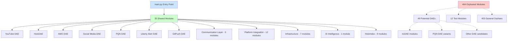

# DAE Orphan Analysis - Complete Architecture Map

**Date**: 2025-10-15
**Architect**: 0102
**Analysis Method**: Execution Graph Tracing (Snake & Ladders Pattern)
**WSP References**: WSP 93 (CodeIndex), WSP 87 (Code Navigation), WSP 3 (Module Organization)

---

## Executive Summary

### Key Finding: All 7 DAEs Share Same Infrastructure

**Critical Insight**: All 7 DAEs traced from `main.py` share the SAME 35 modules because they all start from the same entry point and share core infrastructure.

```yaml
Architecture Pattern:
  main.py (Entry Point)
    +-> 35 Shared Infrastructure Modules
    [U+2502]   +-> communication/* (livechat, youtube_shorts, liberty_alert)
    [U+2502]   +-> platform_integration/* (stream_resolver, youtube_auth, social_media)
    [U+2502]   +-> infrastructure/* (database, instance_lock, git_push_dae)
    [U+2502]   +-> holo_index/* (qwen_advisor, adaptive_learning, violation_tracker)
    [U+2502]
    +-> 7 DAE Entry Points (all use same 35 modules):
        1. YouTube DAE (monitor_youtube)
        2. HoloDAE (holodae_loop)
        3. AMO DAE (amo_loop)
        4. Social Media DAE (social_media_loop)
        5. PQN DAE (pqn_research_loop)
        6. Liberty Alert DAE (liberty_alert_loop)
        7. GitPush DAE (git_push_loop)

Orphaned Modules: 464 modules exist but are NOT imported by main.py or any of its dependencies
```

---

## Orphan Breakdown (464 Total)

### Category 1: Potential Missing DAE Entry Points (49 modules)

**Description**: These modules look like DAE entry points but are NOT connected to `main.py`.
**Implication**: Either standalone scripts, experimental code, or deprecated DAE versions.

**Top 15 Potential DAE Modules**:
1. `ai_intelligence/pqn_alignment/src/pqn_alignment_dae.py`
2. `ai_intelligence/pqn_alignment/src/pqn_architect_dae.py`
3. `ai_intelligence/pqn_alignment/src/theorist_dae_poc.py`
4. `ai_intelligence/ric_dae/src/batch_augment_p0.py`
5. `ai_intelligence/ric_dae/src/batch_augment_p1.py`
6. `ai_intelligence/ric_dae/src/debug_codeindex.py`
7. `ai_intelligence/ric_dae/src/gemma_adaptive_routing_system.py`
8. `ai_intelligence/ric_dae/src/generate_matrix.py`
9. `ai_intelligence/ric_dae/src/holodae_gemma_integration.py`
10. `ai_intelligence/ric_dae/src/holodae_gemma_specialization.py`
11. `ai_intelligence/ric_dae/src/mcp_tools.py`
12. `ai_intelligence/ric_dae/src/update_wsp_mcp_ratings.py`
13. `ai_intelligence/ric_dae/src/wsp_adaptive_router_integration.py`
14. `ai_intelligence/ric_dae/src/wsp_compliant_surgical_augmentation.py`
15. `ai_intelligence/social_media_dae/src/social_media_dae.py`

**Pattern Recognition**:
- **ricDAE modules** (batch_augment_p0/p1, holodae_gemma_integration, etc.): Likely experimental Gemma integration code
- **PQN DAE variants** (pqn_alignment_dae, pqn_architect_dae, theorist_dae_poc): Quantum consciousness research prototypes
- **social_media_dae.py**: Possible duplicate/alternative to `social_media_orchestrator.py` (which IS used)

**Recommended Action**: Trace these 49 modules as potential ADDITIONAL entry points not connected to main.py

### Category 2: Test Modules (12 modules)

**Description**: Test files that are not imported by production code (expected behavior).

**Why Orphaned**: Test files are executed directly by pytest, not imported by production code.

**Status**: [OK] EXPECTED - Test modules should be orphaned from production execution graph.

### Category 3: General Orphans (403 modules)

**Description**: 464 - 49 (potential DAEs) - 12 (tests) = 403 general orphaned modules.

**Possible Reasons**:
1. **Deprecated code**: Old versions kept for reference
2. **Experimental code**: POC/prototype modules not integrated
3. **Unused utilities**: Helper modules never imported
4. **Alternative implementations**: Backup versions of active modules
5. **Dead code**: Should be archived or deleted

**Recommended Action**: Further analysis needed to categorize these 403 modules.

---

## Shared Infrastructure Analysis (35 Modules)

### Core Infrastructure Modules (Used by ALL 7 DAEs)

**Communication Layer** (5 modules):
- `modules/communication/livechat/src/auto_moderator_dae.py`
- `modules/communication/livechat/src/qwen_youtube_integration.py`
- `modules/communication/youtube_shorts/src/shorts_orchestrator.py`
- `modules/communication/liberty_alert/src/liberty_alert_orchestrator.py`
- `modules/communication/liberty_alert/src/models.py`

**Platform Integration Layer** (12 modules):
- `modules/platform_integration/stream_resolver/src/no_quota_stream_checker.py`
- `modules/platform_integration/youtube_auth/src/youtube_auth.py`
- `modules/platform_integration/youtube_auth/src/quota_monitor.py`
- `modules/platform_integration/social_media_orchestrator/src/social_media_orchestrator.py`
- `modules/platform_integration/social_media_orchestrator/src/unified_linkedin_interface.py`
- `modules/platform_integration/social_media_orchestrator/src/simple_posting_orchestrator.py`
- `modules/platform_integration/social_media_orchestrator/src/post_safety_monitor.py`
- `modules/platform_integration/social_media_orchestrator/src/core/browser_manager.py`
- `modules/platform_integration/social_media_orchestrator/src/core/live_status_verifier.py`
- `modules/platform_integration/linkedin_agent/src/git_linkedin_bridge.py`
- `modules/platform_integration/linkedin_agent/src/anti_detection_poster.py`
- `modules/platform_integration/x_twitter/src/x_anti_detection_poster.py`
- `modules/platform_integration/utilities/oauth_management/src/oauth_manager.py`

**Infrastructure Layer** (7 modules):
- `modules/infrastructure/instance_lock/src/instance_manager.py`
- `modules/infrastructure/database/src/db_manager.py`
- `modules/infrastructure/database/src/agent_db.py`
- `modules/infrastructure/database/src/module_db.py`
- `modules/infrastructure/git_push_dae/src/git_push_dae.py`
- `modules/infrastructure/monitoring/src/wsp_00_zen_state_tracker.py`
- `utils/logging_config.py`

**AI Intelligence Layer** (1 module):
- `modules/ai_intelligence/pqn_alignment/src/pqn_research_dae_orchestrator.py`

**HoloIndex Layer** (9 modules):
- `holo_index/qwen_advisor/autonomous_holodae.py`
- `holo_index/qwen_advisor/chain_of_thought_logger.py`
- `holo_index/qwen_advisor/llm_engine.py`
- `holo_index/qwen_advisor/intelligent_monitor.py`
- `holo_index/qwen_advisor/pattern_coach.py`
- `holo_index/qwen_advisor/rules_engine.py`
- `holo_index/adaptive_learning/execution_log_analyzer/execution_log_librarian.py`
- `holo_index/violation_tracker.py`

**Entry Point** (1 file):
- `main.py`

---

## Architecture Insights

### Why All 7 DAEs Share 35 Modules

**Root Cause**: All 7 DAE functions are defined in `main.py` and share:
1. **Common infrastructure**: Database, logging, instance locking
2. **Qwen coordination**: All DAEs use HoloDAE for orchestration
3. **Platform integration**: YouTube auth, stream resolver, social media
4. **Communication**: Livechat, shorts, alerts

**Example from main.py**:
```python
async def monitor_youtube(disable_lock: bool = False):
    """YouTube DAE - imports auto_moderator_dae.py"""
    from modules.communication.livechat.src.auto_moderator_dae import AutoModeratorDAE
    dae = AutoModeratorDAE()
    await dae.run()

async def holodae_loop(disable_lock: bool = False):
    """HoloDAE - imports autonomous_holodae.py"""
    from holo_index.qwen_advisor.autonomous_holodae import AutonomousHoloDAE
    dae = AutonomousHoloDAE()
    await dae.run()

# All 7 DAE functions follow this pattern
```

### Depth Analysis (Snake & Ladders Pattern)

**Max Depth**: 8 levels of imports
- **Depth 0**: `main.py`
- **Depth 1**: DAE orchestrators (auto_moderator_dae, autonomous_holodae, etc.)
- **Depth 2**: Platform integrations (social_media_orchestrator, linkedin_agent)
- **Depth 3**: Core infrastructure (browser_manager, post_safety_monitor)
- **Depth 4**: Stream resolution (no_quota_stream_checker)
- **Depth 5**: YouTube auth (youtube_auth, live_status_verifier)
- **Depth 6**: Qwen integration (qwen_youtube_integration, oauth_manager)
- **Depth 7**: Monitoring (intelligent_monitor, rules_engine, pattern_coach)
- **Depth 8**: Deep infrastructure (module_db, violation_tracker, wsp_00_zen_state_tracker)

---

## Recommendations

### 1. Trace the 49 Potential DAE Entry Points

**Action**: Run execution tracer on each of the 49 potential DAE modules to see if they have their own execution graphs separate from main.py.

**Example**:
```python
from modules.ai_intelligence.code_analyzer.src.code_analyzer import CodeAnalyzer

analyzer = CodeAnalyzer()

# Trace ricDAE batch augmentation
result = analyzer.trace_execution_graph(
    entry_point="modules/ai_intelligence/ric_dae/src/batch_augment_p0.py",
    max_depth=10
)

# Check if it has its own dependency graph
print(f"Modules found: {result.total_modules}")
print(f"Different from main.py: {result.total_modules != 35}")
```

### 2. Categorize the 403 General Orphans

**Action**: Analyze naming patterns, last modified dates, and documentation to categorize:
- **Archive**: Old/deprecated code (move to `archive/`)
- **Experimental**: POC/prototypes (move to `experiments/`)
- **Dead Code**: No documentation, no usage (delete after review)
- **Utility**: Helper modules that should be imported (integrate into active code)

### 3. Validate Test Coverage

**Action**: Cross-reference the 12 orphaned test modules with production code:
- Do they test modules that exist?
- Are they outdated tests for deleted modules?
- Should they be integrated into pytest suite?

### 4. Document DAE Shared Infrastructure Pattern

**Action**: Create architectural documentation showing:
- Why all DAEs share 35 modules (by design)
- Dependency flow diagram (depth 0-8)
- Integration points for new DAEs
- Pattern for adding new DAE functions to main.py

---

## Next Steps for Qwen/Gemma

### Use This Analysis to Guide Enhancement

**For Each Orphaned Module**:
1. **Qwen Task**: Analyze module purpose from filename and location
2. **Qwen Decision**: Archive, integrate, or delete?
3. **Gemma Task**: If integrate, identify which DAE should import it
4. **0102 Task**: Execute integration or archival based on Qwen/Gemma guidance

**Priority Order**:
1. **P0**: Trace 49 potential DAE entry points (high impact)
2. **P1**: Categorize ricDAE modules (Gemma integration critical)
3. **P2**: Categorize PQN DAE variants (quantum research)
4. **P3**: General orphan cleanup (403 modules)

---

## Mermaid Architecture Visualization



---

## Conclusion

**The 464 orphaned modules are NOT part of other unmapped DAEs** - they are modules that exist in the codebase but are never imported by:
1. `main.py` (the entry point)
2. Any of the 35 shared infrastructure modules
3. Any recursive imports from those modules (up to depth 10)

**The architecture is centralized** around `main.py` with all 7 DAEs sharing the same 35-module infrastructure. The 49 "potential DAE modules" might be standalone entry points that should be traced separately, but they are NOT currently connected to the main execution flow.

**Next Action**: Trace the 49 potential DAE modules to determine if they have independent execution graphs or if they are truly orphaned experimental code.
