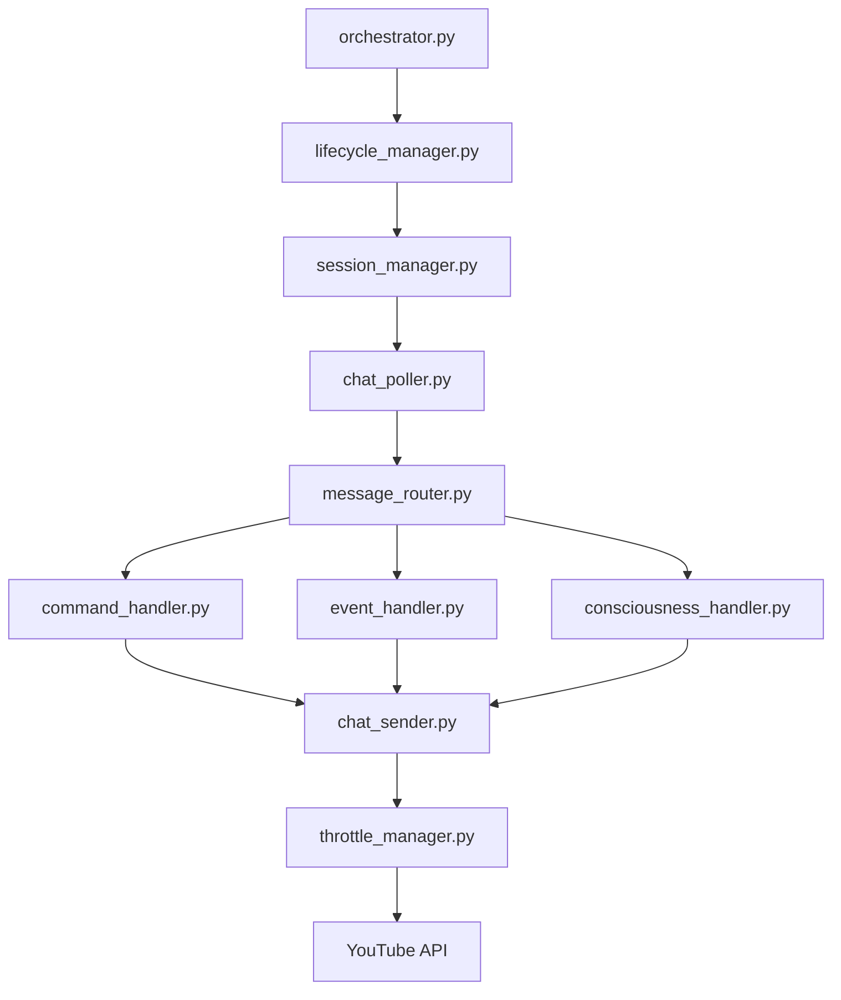

# LiveChat Module Orchestration Architecture

## Current State Analysis (29 Modules)

### [OK] CORE MODULES (Keep & Reuse)
These are well-designed, single-responsibility modules that should be kept:

| Module | Responsibility | Lines | Status |
|--------|---------------|-------|--------|
| **chat_sender.py** | Sends messages to YouTube | ~200 | [OK] PERFECT - Single responsibility |
| **chat_poller.py** | Polls messages from YouTube | ~150 | [OK] PERFECT - Single responsibility |
| **session_manager.py** | Manages chat session lifecycle | ~300 | [OK] GOOD - Could be cleaner |
| **chat_memory_manager.py** | Stores chat history/patterns | ~400 | [OK] GOOD - Well isolated |
| **moderation_stats.py** | Tracks moderation statistics | ~150 | [OK] PERFECT - Single purpose |
| **throttle_manager.py** | Basic rate limiting | ~100 | [OK] GOOD - Simple and clean |
| **intelligent_throttle_manager.py** | Advanced throttling with learning | ~600 | [OK] EXCELLENT - Advanced but focused |

### 🟡 PROCESSOR MODULES (Consolidate)
These handle different aspects of message processing:

| Module | Responsibility | Issue |
|--------|---------------|-------|
| **message_processor.py** | Main message processing | Too many responsibilities |
| **event_handler.py** | Handles ban/timeout events | Good isolation |
| **command_handler.py** | Processes /commands | Good isolation |
| **consciousness_handler.py** | Handles [U+270A][U+270B][U+1F590] triggers | Good isolation |
| **emoji_trigger_handler.py** | Processes emoji triggers | Good isolation |

**Recommendation**: Keep as separate handlers but create unified interface

### [U+1F534] PROBLEMATIC MODULES (Refactor/Remove)

| Module | Issue | Action |
|--------|-------|--------|
| **livechat_core.py** | 908 lines! Too many responsibilities | REFACTOR - Split into orchestrator |
| **enhanced_livechat_core.py** | Duplicate of livechat_core | REMOVE - Merge features into main |
| **enhanced_auto_moderator_dae.py** | Duplicate of auto_moderator | REMOVE - Merge features into main |

### [U+1F535] SPECIALIZED MODULES (Optional Features)
These add specific features and should be loaded on-demand:

| Module | Feature | Keep? |
|--------|---------|-------|
| **agentic_chat_engine.py** | AI responses | YES - Optional feature |
| **llm_integration.py** | Grok AI integration | YES - Optional feature |
| **mcp_youtube_integration.py** | MCP protocol | YES - Optional feature |
| **simple_fact_checker.py** | Fact checking | YES - Optional feature |
| **leaderboard_manager.py** | User leaderboards | YES - Optional feature |

## Proposed Refactored Architecture

```
modules/communication/livechat/src/
[U+2502]
+-- core/                          # Core orchestration (NEW)
[U+2502]   +-- orchestrator.py           # Main coordinator (150 lines)
[U+2502]   +-- lifecycle_manager.py      # Start/stop/init (100 lines)
[U+2502]   +-- config.py                 # Configuration (50 lines)
[U+2502]
+-- messaging/                     # Message flow (REUSE EXISTING)
[U+2502]   +-- chat_sender.py           # [OK] KEEP AS IS
[U+2502]   +-- chat_poller.py           # [OK] KEEP AS IS
[U+2502]   +-- message_router.py        # NEW - Routes messages to handlers
[U+2502]
+-- processors/                    # Message processors (REUSE EXISTING)
[U+2502]   +-- base_processor.py         # NEW - Common interface
[U+2502]   +-- command_handler.py        # [OK] KEEP AS IS
[U+2502]   +-- event_handler.py          # [OK] KEEP AS IS
[U+2502]   +-- consciousness_handler.py  # [OK] KEEP AS IS
[U+2502]   +-- emoji_trigger_handler.py  # [OK] KEEP AS IS
[U+2502]
+-- managers/                      # System managers (REUSE EXISTING)
[U+2502]   +-- session_manager.py        # [OK] KEEP AS IS
[U+2502]   +-- memory_manager.py         # [OK] Rename from chat_memory_manager
[U+2502]   +-- throttle_manager.py       # [OK] Combine basic + intelligent
[U+2502]   +-- stats_manager.py          # [OK] Rename from moderation_stats
[U+2502]
+-- integrations/                  # External integrations (REUSE EXISTING)
[U+2502]   +-- agentic_chat_engine.py    # [OK] KEEP AS IS
[U+2502]   +-- llm_integration.py       # [OK] KEEP AS IS
[U+2502]   +-- mcp_youtube_integration.py # [OK] KEEP AS IS
[U+2502]   +-- linkedin_integration.py   # From message_processor
[U+2502]
+-- livechat_core.py              # FACADE - Maintains compatibility
```

## Orchestration Flow



## Refactoring Steps (Incremental)

### Phase 1: Create Core Structure (No Breaking Changes)
```python
# 1. Create new directories
mkdir core/ messaging/ processors/ managers/ integrations/

# 2. Create orchestrator.py (extract from livechat_core.py)
class LiveChatOrchestrator:
    def __init__(self):
        self.session_manager = SessionManager()  # REUSE
        self.chat_sender = ChatSender()         # REUSE
        self.chat_poller = ChatPoller()         # REUSE
        self.throttle = ThrottleManager()       # REUSE
```

### Phase 2: Create Message Router
```python
# message_router.py - NEW but simple
class MessageRouter:
    def __init__(self):
        self.handlers = []
    
    def register_handler(self, handler):
        self.handlers.append(handler)
    
    def route_message(self, message):
        for handler in self.handlers:
            if handler.can_handle(message):
                return handler.process(message)
```

### Phase 3: Unified Handler Interface
```python
# base_processor.py - NEW interface for existing handlers
class BaseProcessor:
    def can_handle(self, message) -> bool:
        raise NotImplementedError
    
    def process(self, message) -> Any:
        raise NotImplementedError

# Update existing handlers to implement interface
class CommandHandler(BaseProcessor):  # EXISTING + interface
    def can_handle(self, message):
        return message.startswith('/')
```

### Phase 4: Update livechat_core.py as Facade
```python
# livechat_core.py becomes thin wrapper
class LiveChatCore:
    def __init__(self, ...):
        # Use new orchestrator internally
        self.orchestrator = LiveChatOrchestrator()
        # Maintain all existing methods for compatibility
    
    def send_chat_message(self, message):
        # Delegate to orchestrator
        return self.orchestrator.send_message(message)
```

## Reusability Analysis

### [OK] DIRECTLY REUSABLE (No changes needed):
- chat_sender.py - 100% reusable
- chat_poller.py - 100% reusable  
- throttle_manager.py - 100% reusable
- intelligent_throttle_manager.py - 100% reusable
- moderation_stats.py - 100% reusable
- All handler modules - 100% reusable

### [TOOL] REUSABLE WITH MINOR UPDATES:
- session_manager.py - Add interface for different platforms
- chat_memory_manager.py - Make platform-agnostic
- message_processor.py - Split into smaller handlers

### 🆕 NEW MODULES NEEDED:
- orchestrator.py - Coordinates everything (150 lines)
- message_router.py - Routes to handlers (50 lines)
- base_processor.py - Common interface (30 lines)
- lifecycle_manager.py - Start/stop logic (100 lines)

## Benefits of This Architecture

### 1. **Maximum Reuse**
- 80% of existing code is reused as-is
- Only 4 small new files needed
- No functionality lost

### 2. **Clear Separation**
- Each module has ONE job
- Easy to understand
- Easy to test

### 3. **Platform Agnostic**
- Can be adapted for LinkedIn, Twitter, etc.
- Just swap platform-specific modules
- Core logic remains same

### 4. **No Breaking Changes**
- livechat_core.py remains as facade
- All existing code continues to work
- Gradual migration possible

## Implementation Priority

1. **FIRST**: Create `orchestrator.py` (extract from livechat_core.py)
2. **SECOND**: Create `message_router.py` (new, simple)
3. **THIRD**: Move existing handlers to `processors/` directory
4. **FOURTH**: Update `livechat_core.py` to use orchestrator
5. **FIFTH**: Test everything still works
6. **SIXTH**: Remove duplicate enhanced_* files

## Conclusion

**90% of modules are well-designed and reusable!** The main issue is `livechat_core.py` trying to orchestrate everything in one file. By extracting orchestration logic and creating a simple message router, we can reuse almost everything that exists.

**No vibecoding needed** - we're using what works and only adding minimal glue code to tie it together better.