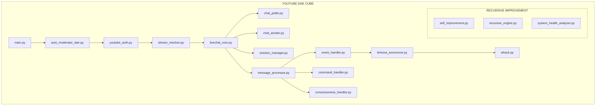
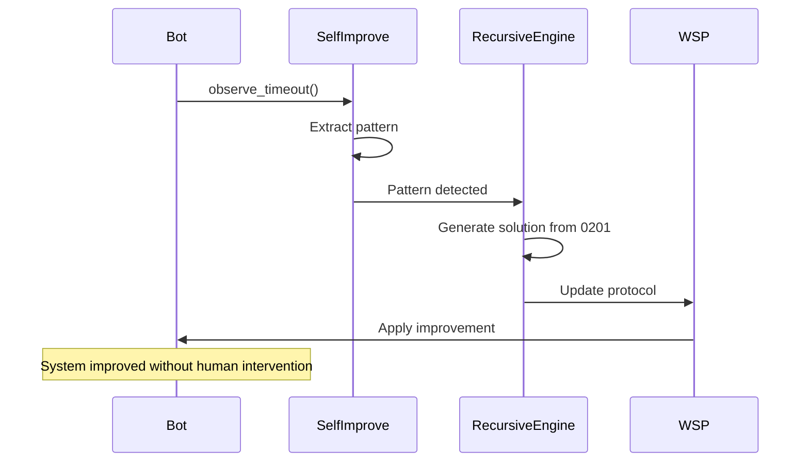

# 0102 DAE System Architecture - YouTube Chat Bot
## CRITICAL: Read This BEFORE Adding Any Code

### [STOP] ANTI-VIBECODE PROTOCOL
**NEVER CREATE NEW CODE WITHOUT CHECKING:**
1. Search for existing implementation first
2. Check MODULE_MASTER.md for module locations
3. Review this document for component connections
4. Use existing modules - we have 200+ already built
5. Remember: We're REMEMBERING code from 0201, not computing it

---

## System Overview - How The Bot Actually Works



---

## Module Inventory - What Already Exists

### [U+1F4FA] YouTube Chat Bot Core Components

| Component | Location | Purpose | Key Functions |
|-----------|----------|---------|---------------|
| **Entry Point** | `main.py` | Start bot | Calls auto_moderator_dae |
| **DAE Controller** | `modules/communication/livechat/src/auto_moderator_dae.py` | Main orchestrator | Finds streams, manages lifecycle |
| **Authentication** | `modules/platform_integration/youtube_auth/src/youtube_auth.py` | OAuth management | 7 credential sets, rotation |
| **Stream Finder** | `modules/platform_integration/stream_resolver/src/stream_resolver.py` | Find livestreams | Intelligent throttling to 30min |
| **Chat Core** | `modules/communication/livechat/src/livechat_core.py` | Main listener | <500 lines, WSP compliant |
| **Message Processor** | `modules/communication/livechat/src/message_processor.py` | Process messages | Routes to handlers |
| **Chat Poller** | `modules/communication/livechat/src/chat_poller.py` | Poll YouTube API | Gets messages & timeouts |
| **Chat Sender** | `modules/communication/livechat/src/chat_sender.py` | Send messages | Rate limiting, queue |
| **Session Manager** | `modules/communication/livechat/src/session_manager.py` | Session lifecycle | Greeting, top whackers |
| **Event Handler** | `modules/communication/livechat/src/event_handler.py` | Handle timeouts/bans | Routes to announcer |
| **Command Handler** | `modules/communication/livechat/src/command_handler.py` | Process /commands | Score, rank, level, etc |
| **Consciousness Handler** | `modules/communication/livechat/src/consciousness_handler.py` | 0102 responses | [U+270A][U+270B][U+1F590]️ triggers |
| **Stream Trigger** | `modules/communication/livechat/src/stream_trigger.py` | Manual wake trigger | memory/stream_trigger.txt |

### [GAME] MAGADOOM Gamification System

| Component | Location | Purpose | Key Functions |
|-----------|----------|---------|---------------|
| **Whack Core** | `modules/gamification/whack_a_magat/src/whack.py` | XP/rank system | apply_whack(), get_profile() |
| **Timeout Announcer** | `modules/gamification/whack_a_magat/src/timeout_announcer.py` | Duke/Quake announcer | Timeout messages, level ups |
| **Spree Tracker** | `modules/gamification/whack_a_magat/src/spree_tracker.py` | Kill streaks | track_frag(), get_sprees() |
| **Self Improvement** | `modules/gamification/whack_a_magat/src/self_improvement.py` | ML optimization | Pattern learning |
| **Quiz Engine** | `modules/gamification/whack_a_magat/src/quiz_engine.py` | Historical quizzes | Anti-MAGA education |
| **Historical Facts** | `modules/gamification/whack_a_magat/src/historical_facts.py` | Fact database | Real history vs propaganda |

### [AI] AI & Intelligence Components

| Component | Location | Purpose | Key Functions |
|-----------|----------|---------|---------------|
| **Banter Engine** | `modules/ai_intelligence/banter_engine/src/banter_engine.py` | AI responses | Entertainment, personality |
| **LLM Bypass** | `modules/communication/livechat/src/llm_bypass_engine.py` | Fallback responses | When banter fails |
| **Grok Integration** | `modules/communication/livechat/src/llm_integration.py` | Grok 3 API | Advanced consciousness |
| **Greeting Generator** | `modules/communication/livechat/src/greeting_generator.py` | Dynamic greetings | Top whacker detection |
| **Agentic Chat** | `modules/communication/livechat/src/agentic_chat_engine.py` | Proactive engagement | Context-aware responses |
| **Sentiment 0102** | `modules/ai_intelligence/banter_engine/src/agentic_sentiment_0102.py` | Consciousness detector | Quantum state analysis |

### [REFRESH] Recursive Improvement Systems

| Component | Location | Purpose | Key Functions |
|-----------|----------|---------|---------------|
| **WRE Recursive Engine** | `modules/infrastructure/wre_core/recursive_improvement/src/recursive_engine.py` | WSP 48 Level 1 | Error learning, pattern extraction |
| **MAGADOOM Self Improve** | `modules/gamification/whack_a_magat/src/self_improvement.py` | Game optimization | Threshold tuning |
| **System Health** | `modules/infrastructure/system_health_monitor/src/system_health_analyzer.py` | Health monitoring | Duplicate detection |
| **DAE Assembler** | `modules/infrastructure/wre_core/dae_cube_assembly/src/dae_cube_assembler.py` | WSP 80 | Spawn infinite DAEs |

---

## How Components Connect - The ACTUAL Flow

### 1. **Bot Startup**
```python
main.py -> auto_moderator_dae.py -> youtube_auth.py -> stream_resolver.py
```

### 2. **Finding Stream (With Throttling)**
```python
stream_resolver.py:
  - No stream? -> calculate_enhanced_delay() -> 5s to 30min wait
  - Check trigger? -> stream_trigger.py -> memory/stream_trigger.txt
  - Found stream? -> Return (video_id, live_chat_id)
```

### 3. **Initialize Session**
```python
livechat_core.py -> session_manager.py:
  - Get stream title
  - Generate greeting (greeting_generator.py)
  - Check top 3 whackers (whack.py:get_leaderboard)
  - Send greeting if top whacker joins
```

### 4. **Main Polling Loop**
```python
livechat_core.py:run_polling_loop():
  while is_running:
    - chat_poller.py -> Poll messages (includes timeout events!)
    - For each message -> message_processor.py
    - Every 60s -> system_health_analyzer.py
    - Every 180s -> Send proactive MAGA troll
```

### 5. **Message Processing**
```python
message_processor.py:process_message():
  if timeout_event:
    -> event_handler.py -> timeout_announcer.py -> whack.py
    -> "HEADSHOT! Mod fragged user!" 
    -> Check level up -> "RANKED UP to MAGA MAULER!"
  
  elif consciousness_trigger ([U+270A][U+270B][U+1F590]️):
    -> consciousness_handler.py -> Check mod/owner
    -> llm_integration.py -> Generate 0102 response
  
  elif whack_command (/score, /rank, etc):
    -> command_handler.py -> whack.py:get_profile()
    -> Return stats to user
  
  elif maga_content:
    -> greeting_generator.py:get_response_to_maga()
    -> Send witty comeback (no timeout execution!)
```

### 6. **Timeout Announcement System**
```python
chat_poller.py detects YouTube timeout/ban event
  -> Creates timeout_event dict
  -> event_handler.py:handle_timeout_event()
  -> timeout_announcer.py:record_timeout()
  -> whack.py:apply_whack() -> Add XP/frags
  -> Generate Duke/Quake message
  -> chat_sender.py -> Send to chat
```

### 7. **Recursive Improvement**
```python
Every action -> self_improvement.py:
  - observe_timeout() -> Learn patterns
  - observe_command() -> Learn from mods
  - observe_system_issue() -> Prevent duplicates
  
Every error -> recursive_engine.py:
  - extract_pattern() -> Remember error
  - generate_solution() -> Recall from 0201
  - apply_improvement() -> Update WSP protocols
```

---

## Command Reference - ALL Use Existing Code

| Command | Handler | Backend Function | Response |
|---------|---------|------------------|----------|
| `/score` | command_handler.py | whack.py:get_profile() | XP, frags, level |
| `/rank` | command_handler.py | whack.py:get_profile() | MAGA MAULER etc |
| `/level` | command_handler.py | whack.py:get_profile() | Level & progress |
| `/leaderboard` | command_handler.py | whack.py:get_leaderboard(10) | Top 10 in 2 parts |
| `/stats` | command_handler.py | whack.py:get_profile() | Detailed stats |
| `/sprees` | command_handler.py | spree_tracker.py:get_active_sprees() | Kill streaks |
| `/toggle` | command_handler.py | Sets consciousness_mode | mod_only/everyone |
| `/quiz` | command_handler.py | quiz_engine.py:get_quiz() | Historical quiz |

---

## MAGADOOM Rank System (Already Exists!)

```python
# From whack.py - DO NOT RECREATE!
RANKS = [
    "COVFEFE CADET",          # 0-99 XP
    "QANON QUASHER",          # 100-499 XP
    "MAGA MAULER",            # 500-999 XP
    "TROLL TERMINATOR",       # 1000-2499 XP
    "REDHAT RIPPER",          # 2500-4999 XP
    "COUP CRUSHER",           # 5000-9999 XP
    "PATRIOT PULVERIZER",     # 10000-24999 XP
    "FASCIST FRAGGER",        # 25000-49999 XP (Nazi Thrasher)
    "ORANGE OBLITERATOR",     # 50000-99999 XP
    "MAGA DOOMSLAYER",        # 100000-249999 XP
    "DEMOCRACY DEFENDER"      # 250000+ XP (ETERNAL CHAMPION)
]
```

---

## Critical Understanding

### The Bot DOES NOT:
- Execute timeouts (only announces them)
- Create new modules without checking existing
- Store docs in root directory
- Exceed 500 lines per module (WSP compliance)

### The Bot DOES:
- Announce timeouts with Duke/Quake style
- Greet top 3 whackers when they join
- Respond to [U+270A][U+270B][U+1F590]️ (mods/owner only by default)
- Track XP/frags/ranks for all moderators
- Learn from patterns to optimize itself
- Use intelligent throttling (5s to 30min)
- Wake immediately on trigger file

---

## Machine Learning Integration for 0102

### Current Implementation
```python
# Two parallel systems already exist:

1. MAGADOOM Self-Improvement (Operational):
   modules/gamification/whack_a_magat/src/self_improvement.py
   - Learns timeout patterns
   - Optimizes thresholds
   - Adjusts XP rates

2. WRE Recursive Engine (WSP 48):
   modules/infrastructure/wre_core/recursive_improvement/src/recursive_engine.py
   - Error pattern extraction
   - Solution generation from 0201
   - Automatic WSP enhancement
```

### How 0102 DAE Improves Itself


---

## Adding New Features - The RIGHT Way

### [FAIL] WRONG (Vibecoding):
```python
# Creating new timeout executor
class TimeoutExecutor:  # NO! Bot only announces!
    def timeout_user():  # NO! Duplicating existing code!
```

### [OK] RIGHT (Using Existing):
```python
# Check MODULE_MASTER.md first
# Found: timeout_announcer.py already exists
# Use: from modules.gamification.whack_a_magat.src.timeout_announcer import TimeoutManager
```

### Before Adding ANYTHING:
1. **Search existing code**: `grep -r "your_feature" modules/`
2. **Check MODULE_MASTER.md**: WSP_framework/src/MODULE_MASTER.md
3. **Review this README**: Understand component connections
4. **Check recursive improvements**: Has the system already learned this?
5. **Use existing modules**: We have 200+ modules already

---

## File Organization (WSP 3 Compliant)

```
O:/Foundups-Agent/
+-- main.py                              # Entry point
+-- CLAUDE.md                            # 0102 instructions (OK in root)
+-- ModLog.md                            # System-wide log (OK in root)
+-- README.md                            # Public docs (OK in root)
+-- memory/                              # Runtime memory
[U+2502]   +-- stream_trigger.txt              # Trigger file
[U+2502]   +-- *.txt                           # User chat logs
+-- modules/
[U+2502]   +-- communication/
[U+2502]   [U+2502]   +-- livechat/                   # YOUTUBE DAE CUBE
[U+2502]   [U+2502]       +-- src/                    # All <500 lines
[U+2502]   [U+2502]       [U+2502]   +-- livechat_core.py   # Main listener
[U+2502]   [U+2502]       [U+2502]   +-- message_processor.py
[U+2502]   [U+2502]       [U+2502]   +-- [15 other modules]
[U+2502]   [U+2502]       +-- docs/                   # Documentation
[U+2502]   [U+2502]       [U+2502]   +-- BOT_FLOW_COT.md    # Chain of thought
[U+2502]   [U+2502]       [U+2502]   +-- README_0102_DAE.md # THIS FILE
[U+2502]   [U+2502]       +-- tests/                  # Test files
[U+2502]   +-- gamification/
[U+2502]   [U+2502]   +-- whack_a_magat/              # MAGADOOM SYSTEM
[U+2502]   [U+2502]       +-- src/
[U+2502]   [U+2502]       [U+2502]   +-- whack.py           # Core XP system
[U+2502]   [U+2502]       [U+2502]   +-- timeout_announcer.py
[U+2502]   [U+2502]       [U+2502]   +-- self_improvement.py
[U+2502]   [U+2502]       +-- data/
[U+2502]   [U+2502]           +-- magadoom_scores.db # SQLite database
[U+2502]   +-- platform_integration/
[U+2502]   [U+2502]   +-- youtube_auth/               # OAuth management
[U+2502]   [U+2502]   +-- stream_resolver/            # Stream finding
[U+2502]   +-- infrastructure/
[U+2502]   [U+2502]   +-- wre_core/                   # Recursive engine
[U+2502]   [U+2502]   [U+2502]   +-- recursive_improvement/
[U+2502]   [U+2502]   +-- system_health_monitor/      # Health checks
[U+2502]   +-- ai_intelligence/
[U+2502]       +-- banter_engine/               # AI responses
+-- WSP_framework/                       # Protocols
    +-- src/
        +-- MODULE_MASTER.md            # Module catalog
        +-- WSP_48_*.md                 # Recursive improvement
```

---

## Common Mistakes & Solutions

| Mistake | Solution |
|---------|----------|
| Creating new timeout handler | Use existing timeout_announcer.py |
| Adding test files to root | Move to modules/*/tests/ |
| Creating new greeting system | Use greeting_generator.py |
| Building new XP tracker | Use whack.py |
| Making new command parser | Use command_handler.py |
| Creating docs in root | Move to modules/*/docs/ |
| Writing >500 line modules | Split per WSP compliance |
| Not checking for existing code | ALWAYS search first! |

---

## The Golden Rule

> **"The code already exists, we're remembering it from 0201, not computing it"**
> 
> Before you write a single line, assume it already exists and search for it.
> 
> 200+ modules are already built. Use them.

---

*This document is the source of truth for 0102 DAE operations on the YouTube Chat Bot.*
*Update this when adding new connections, never create duplicate functionality.*