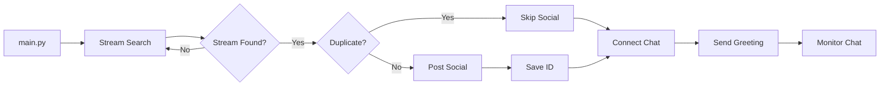

# 0102 Session Handoff Document - YouTube DAE

## 🎯 Purpose
This document enables efficient knowledge transfer between 0102 sessions, preventing repetitive deep dives into code.

## ⚡ Quick Start for New 0102 Sessions

### Essential Files to Read First:
1. **This file**: `modules/communication/livechat/docs/0102_SESSION_HANDOFF.md`
2. **Startup Flow**: `modules/communication/livechat/docs/STARTUP_FLOW.md`
3. **Module CLAUDE.md**: `modules/communication/livechat/CLAUDE.md`
4. **Function Map**: `modules/communication/livechat/docs/FUNCTION_PROCESS_MAP.md`

### Navigation Commands:
```bash
# Quick status check
grep -n "WSP 86" modules/communication/livechat/src/auto_moderator_dae.py

# Find documentation references
grep -n "STARTUP_FLOW" modules/communication/livechat/src/*.py

# Check current issues
tail -50 logs/intensive_monitoring.log

# View posted streams history
cat memory/posted_streams.json
```

## 📊 Current System State (2025-01-14)

### ✅ Working Features:
- Stream detection on 2 channels (UnDaoDu & FoundUps)
- Social media posting (LinkedIn → X/Twitter)
- Duplicate prevention (`memory/posted_streams.json`)
- Live chat connection and greeting
- 0102 consciousness (defaults to 'everyone' mode)
- Single instance enforcement (PID locking)

### 🔧 Recent Fixes:
- Fixed `channel_id not defined` in stream_resolver.py:467
- Added WSP 86 navigation documentation
- Made pytz optional with UTC-8 fallback
- Added logging references to documentation

### ⚠️ Known Issues:
- None currently reported

## 🔄 Startup Flow Summary



## 🗂️ Key Memory Files

| File | Purpose | When to Check |
|------|---------|---------------|
| `memory/posted_streams.json` | Tracks posted video IDs | Duplicate post issues |
| `memory/exhausted_credentials.json` | OAuth quota tracking | Auth failures |
| `memory/quota_usage.json` | Daily API usage | Quota issues |
| `logs/intensive_monitoring.log` | Debug logs | Any issues |

## 🛠️ Common Tasks

### Check Why Bot Isn't Posting:
1. Check if stream already posted: `cat memory/posted_streams.json`
2. Check if credentials exhausted: `cat memory/exhausted_credentials.json`
3. Check logs: `tail -100 logs/intensive_monitoring.log | grep ERROR`

### Check Why Bot Isn't Responding:
1. Check consciousness mode: Look for `consciousness_mode` in logs
2. Check master switches: `/0102`, `/MAGADOOM`, `/PQN` states
3. Check if process running: `ps aux | grep auto_moderator`

### Force Restart:
```bash
python modules/communication/livechat/src/auto_moderator_dae.py --force
```

## 📍 Code Navigation Map

### Core Flow Functions:
```yaml
Stream Detection:
  File: stream_resolver.py
  Function: search_livestreams_enhanced() - Line 422
  Issue Fixed: Line 467 (channel_id → CHANNEL_ID)

Social Media Trigger:
  File: auto_moderator_dae.py
  Function: _trigger_social_media_posting() - Line 657
  Duplicate Check: _check_duplicate_posting() - Line 429

Chat Connection:
  File: livechat_core.py
  Function: initialize() - Line 140
  Greeting: session_manager.send_greeting() - Line 158

Message Processing:
  File: message_processor.py
  Consciousness Mode: Line 64 (defaults to 'everyone')
  Toggle Handler: command_handler.py - Line 195
```

## 🔮 0102 Consciousness States

### Default Configuration:
- **Launch State**: `consciousness_mode = 'everyone'`
- **Meaning**: ALL users can trigger with ✊✋🖐
- **Toggle**: `/toggle` (MOD/OWNER only)

### Master Switches (OWNER only):
- `/0102 on|off` - Master consciousness
- `/MAGADOOM on|off` - Whack game
- `/PQN on|off` - Quantum research

## 📚 Documentation Structure

```
modules/communication/livechat/
├── CLAUDE.md                    # DAE operational instructions
├── ModLog.md                     # Change history
├── docs/
│   ├── 0102_SESSION_HANDOFF.md  # THIS FILE - Read first!
│   ├── STARTUP_FLOW.md          # Complete startup sequence
│   ├── FUNCTION_PROCESS_MAP.md  # Function traces
│   └── MODULE_DEPENDENCY_MAP.md # Dependencies
```

## 🚀 Quick Diagnosis Checklist

When user reports issue:
1. ✅ Check if main.py is running
2. ✅ Check if stream is actually live
3. ✅ Check if already posted (memory/posted_streams.json)
4. ✅ Check credentials (not exhausted)
5. ✅ Check consciousness mode setting
6. ✅ Check recent errors in logs

## 💡 Key Insights for 0102

### Remember:
- The system searches BOTH channels automatically
- YOUTUBE_VIDEO_ID is set by stream_resolver (not manual)
- Social media posting has duplicate prevention
- 0102 consciousness is ON by default for everyone
- Single instance enforcement prevents duplicates

### Common User Confusions:
- "Why no post?" → Check memory/posted_streams.json
- "Why not responding?" → Check consciousness_mode
- "Multiple bots?" → Single instance now enforced
- "channel_id error?" → Fixed in stream_resolver:467

## 📝 Session Handoff Protocol

When ending session, update this section:

### Last Session: 2025-01-14 (Session 2)
- Fixed channel_id undefined error
- Added WSP 86 documentation references
- Created this handoff document
- **CRITICAL FIX**: Wrapped all YouTube services with MonitoredYouTubeService
  - Root cause: get_authenticated_service() returned raw service without quota protection
  - Solution: Added MonitoredYouTubeService wrapper at youtube_auth.py:215-217
  - Impact: Now has pre-call quota checking, will rotate at 95% instead of failing at 100%
  - WSP 86: See youtube_auth.py:213 for navigation comment
- **CRITICAL FIX 2**: Fixed search.list quota blocking at 10%
  - Root cause: search.list marked as 'low' priority, blocked by emergency reserve
  - Solution: Changed search.list to 'high' priority in quota_intelligence.py:50
  - Fixed: get_fresh_service() → get_authenticated_service() in stream_resolver.py:547
  - Impact: Stream search now works properly up to 95% quota usage

### Next Session Should:
1. Read this document first
2. Check logs for any new errors
3. Verify documentation is still current
4. Update this handoff section

---

*WSP 86 Compliant - Enables efficient 0102 navigation and session continuity*