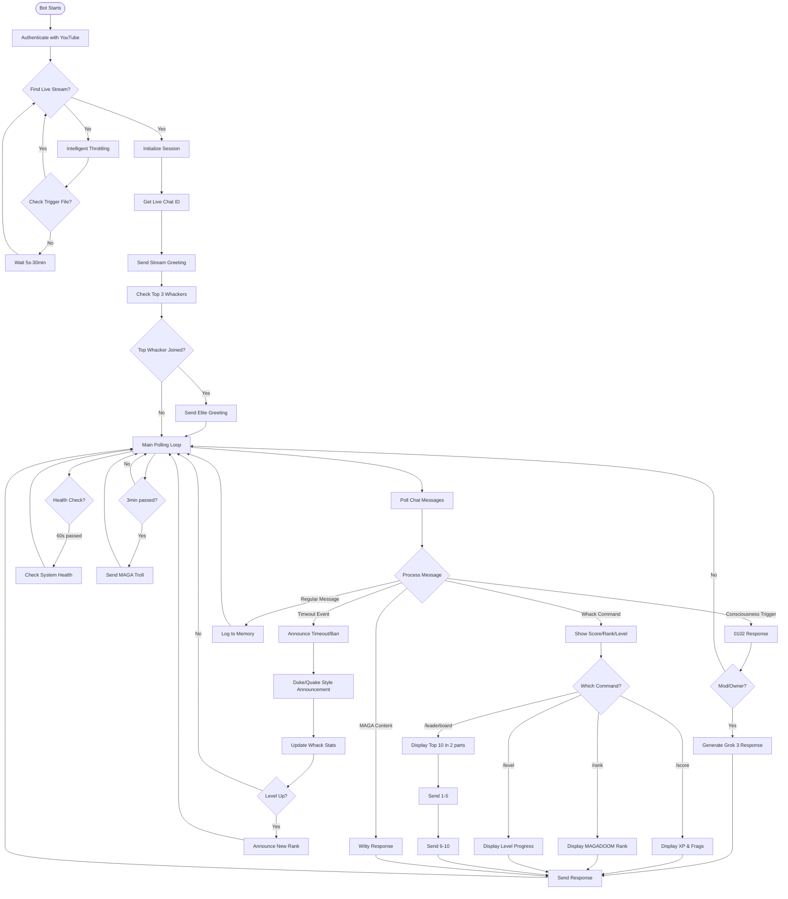
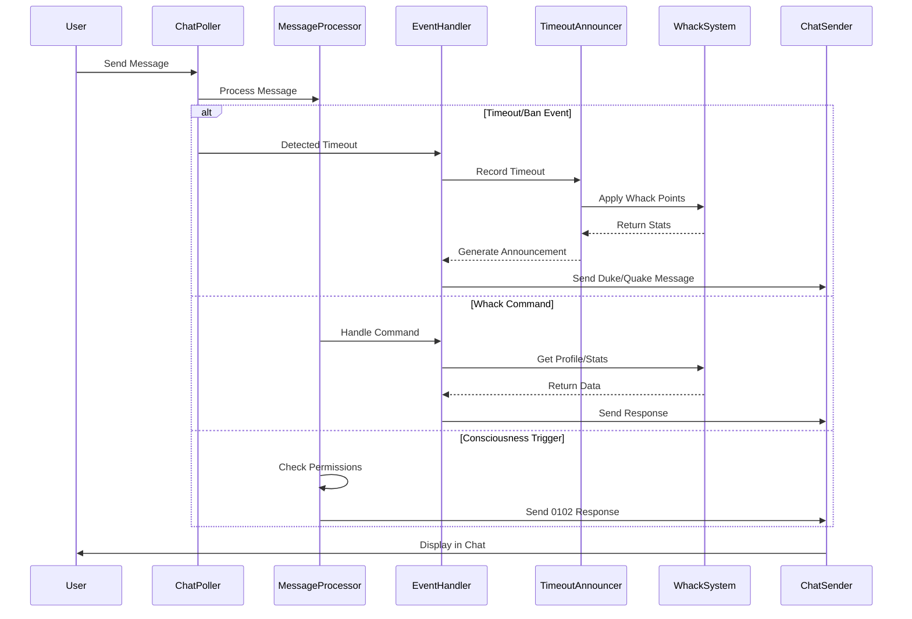
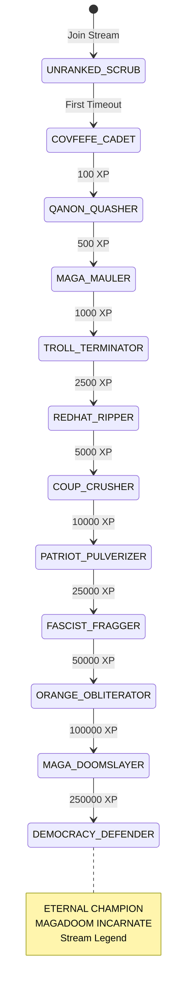

# YouTube Live Chat Bot - Chain of Thought Flow

## Overview
The bot operates as an autonomous YouTube Live Chat moderator with MAGADOOM gamification, following WSP-compliant modular architecture.

## Main Flow Diagram



## Component Interactions



## MAGADOOM Gamification System



## Key Features

### 1. **Intelligent Throttling**
- Starts at 5s between checks
- Scales up to 30 minutes when idle
- Manual trigger via `memory/stream_trigger.txt`
- Preserves YouTube API quota (10,000 units/day)

### 2. **MAGADOOM Whack System**
- Duke Nukem/Quake style announcements
- XP and frag tracking per moderator
- 11 ranks from COVFEFE CADET to DEMOCRACY DEFENDER
- Kill streaks and multi-kill tracking
- Leaderboard with top 10 display

### 3. **Consciousness (0102) System**
- Triggered by [U+270A][U+270B][U+1F590]️ emojis
- Mod/Owner only by default
- `/toggle` command switches between mod-only and everyone
- Uses Grok 3 for advanced responses

### 4. **Command System**
All commands use existing code in `whack.py`:
- `/score` - Display user's XP and frag count
- `/rank` - Show current MAGADOOM rank
- `/level` - Display level and progress to next
- `/leaderboard` - Top 10 in two messages (1-5, 6-10)
- `/stats` - Personal statistics
- `/sprees` - Current kill sprees
- `/toggle` - Toggle consciousness mode (mod/owner only)

### 5. **Timeout Announcements**
Bot announces when mods/owners timeout users:
- "HEADSHOT! [mod] fragged [user]!"
- "DOUBLE WHACK!! [mod] is ON FIRE!"
- "GODLIKE! [mod] is UNSTOPPABLE!"
- Tracks and announces level ups
- Uses actual Duke/Quake voice lines

## File Organization (WSP Compliant)

```
modules/
+-- communication/
[U+2502]   +-- livechat/
[U+2502]       +-- src/
[U+2502]       [U+2502]   +-- livechat_core.py         # Main chat listener (<500 lines)
[U+2502]       [U+2502]   +-- message_processor.py     # Message handling
[U+2502]       [U+2502]   +-- chat_poller.py          # YouTube API polling
[U+2502]       [U+2502]   +-- chat_sender.py          # Send messages
[U+2502]       [U+2502]   +-- event_handler.py        # Timeout/ban events
[U+2502]       [U+2502]   +-- session_manager.py      # Session & greetings
[U+2502]       [U+2502]   +-- stream_trigger.py       # Trigger mechanism
[U+2502]       +-- docs/
[U+2502]           +-- BOT_FLOW_COT.md         # This document
+-- gamification/
    +-- whack_a_magat/
        +-- src/
            +-- whack.py                # Core XP/rank system
            +-- timeout_announcer.py    # Duke/Quake announcer
            +-- spree_tracker.py        # Kill streak tracking
```

## No Vibecoding Policy

All functionality uses **existing modules**:
- Timeout tracking: `whack.py` + `timeout_announcer.py`
- Consciousness: `consciousness_handler.py` + `llm_integration.py`
- Commands: `command_handler.py` + `whack.py`
- Throttling: `stream_resolver.py` + `stream_trigger.py`

**Never add duplicate code** - always search for existing implementations first!