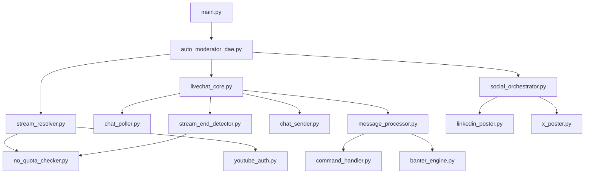

# Enhanced Navigation for YouTube DAE - WSP 86 Implementation

## [TARGET] Purpose
This document provides enhanced navigation capabilities for the YouTube DAE module, implementing WSP 86 principles for efficient modular navigation.

## [ROCKET] Quick Navigation with Module Fingerprints

### YouTube DAE Fingerprint (UPDATED 2025-09-15)
```yaml
module: livechat
domain: communication
purpose: "YouTube live chat monitoring and interaction"
size: 89 modules, 36K+ lines  # Added stream_end_detector.py

key_capabilities:
  - find_livestream (no-quota primary)
  - monitor_chat
  - process_messages
  - post_to_social (with duplicate prevention)
  - handle_commands
  - detect_stream_end (no-quota)

critical_patterns:
  - stream_detection (no-quota fallback)
  - credential_rotation
  - message_processing
  - consciousness_triggers
  - duplicate_prevention (FIXED)
  - stream_end_detection (NEW)

dependencies:
  - stream_resolver (stream detection)
  - youtube_auth (API authentication)
  - social_media_orchestrator (posting)
  - banter_engine (responses)
  - no_quota_stream_checker (0-unit detection)
```

## [PIN] Critical Navigation Paths

### 1. Stream Detection Flow
```yaml
entry_point: main.py:detect_stream()
path:
  1. auto_moderator_dae.py:find_livestream() [Line 294]
  2. stream_resolver.py:find_active_stream() [Line 620]
  3. no_quota_stream_checker.py:check_channel_for_live() [Line 116]
  4. Returns: (video_id, chat_id)
```

### 2. Social Media Posting Flow (FIXED DUPLICATE BUG)
```yaml
entry_point: auto_moderator_dae.py:_trigger_social_media_posting() [Line 665]
path:
  1. Check duplicate: _check_duplicate_posting() [Line 429]  # NOW ACTUALLY CALLED!
  2. Get stream details: _get_stream_details() [Line 680]
  3. Post to platforms: orchestrator.post_stream_notification()
  4. Record success: _record_stream_posted() [Line 447]  # NOW SAVES TO MEMORY!
  5. Save to memory: posted_streams.json
bug_fix: "Added missing duplicate check and record steps"
```

### 3. Chat Message Processing
```yaml
entry_point: livechat_core.py:poll_messages()
path:
  1. chat_poller.py:poll_messages()
  2. message_processor.py:process_message() [Line 64]
  3. command_handler.py (if slash command)
  4. banter_engine.py (if consciousness trigger)
```

## [SEARCH] Pattern Recognition Bank

### Quota Exhaustion Pattern
```yaml
pattern: quota_exhaustion_handling
locations:
  - stream_resolver.py:540-567 (detection)
  - youtube_auth.py:222-237 (marking)
  - youtube_auth.py:119-137 (rotation)
solution: |
  1. Check if real 403 (not just warning)
  2. Mark credential set exhausted
  3. Rotate to next available set
  4. Fall back to no-quota scraping
```

### Stream Detection Pattern (UPDATED 2025-09-15)
```yaml
pattern: no_quota_only_detection
locations:
  - stream_resolver.py:1234-1357 (resolve_stream method)
  - stream_resolver.py:1285-1322 (no-quota primary logic)
  - no_quota_stream_checker.py:41-133 (scraping implementation)
solution: |
  1. Web scraping ONLY (0 units)
  2. If found, get chat ID via API (1 unit)
  3. NO API FALLBACK - continues scraping indefinitely
  4. Clear logging: "[U+1F310] NO-QUOTA SCRAPING ACTIVATED"
changes_made:
  - Removed API fallback completely
  - Enhanced logging for activation tracking
  - Removed pytz dependency (uses system clock)
```

### Consciousness Trigger Pattern
```yaml
pattern: consciousness_activation
locations:
  - message_processor.py:156-200
  - command_handler.py:195-220
triggers:
  - "[U+270A][U+270B][U+1F590]" + question
  - "/toggle" command
  - Master switches: /0102, /MAGADOOM, /PQN
```

### Stream End Detection Pattern (NEW)
```yaml
pattern: stream_end_detection
locations:
  - livechat_core.py:661 (inactivity timeout)
  - livechat_core.py:724-745 (health check)
  - stream_end_detector.py:24-63 (no-quota detection)
solution: |
  OLD: Check via API every 2 minutes (30 units/hour)
  NEW: Use no-quota scraping (0 units)
  1. After 3 minutes inactivity
  2. Call stream_end_detector.check_stream_status()
  3. If ended, trigger quick_check_mode
  4. Search for new stream every 5-15 seconds
```

## [U+1F5FA]️ Module Dependency Graph



## [DATA] Common Issues & Solutions

### Issue: Stream Not Detected
```yaml
debug_path:
  1. Check memory/posted_streams.json (already posted?)
  2. Check memory/exhausted_credentials.json (quota exhausted?)
  3. Check if stream actually live (no_quota_checker)
  4. Check logs/intensive_monitoring.log for errors

solution_refs:
  - stream_resolver.py:check_stream_no_quota()
  - 0102_SESSION_HANDOFF.md (troubleshooting section)
```

### Issue: Bot Not Responding
```yaml
debug_path:
  1. Check consciousness_mode setting
  2. Verify master switches (/0102, /MAGADOOM, /PQN)
  3. Check if process running (single instance)

solution_refs:
  - message_processor.py:64 (consciousness mode)
  - command_handler.py:195 (toggle handler)
```

### Issue: Quota Exhaustion at Low Usage
```yaml
debug_path:
  1. Check actual API response (trust API over tracking)
  2. Verify credential rotation logic
  3. Check for premature marking

solution_refs:
  - stream_resolver.py:540 (only mark on real 403)
  - monitored_youtube_service.py:48 (smart pre-checks)
```

### Issue: Social Media Not Posting (FIXED)
```yaml
debug_path:
  1. Check if _check_duplicate_posting() is called
  2. Verify memory/posted_streams.json exists
  3. Check if _record_stream_posted() is called

solution_refs:
  - auto_moderator_dae.py:674 (duplicate check added)
  - auto_moderator_dae.py:691 (record post added)
```

### Issue: Stream End Not Detected
```yaml
debug_path:
  1. Check inactivity timer (3 minutes)
  2. Verify health check interval (2 minutes)
  3. Look for "Stream ended" in logs

solution_refs:
  - stream_end_detector.py (no-quota detection)
  - livechat_core.py:724 (health check)
```

## [ROCKET] Navigation Commands for 0102

```bash
# Find all quota handling code
grep -n "quota" modules/communication/livechat/src/*.py

# Trace stream detection
grep -n "find_livestream\|find_active_stream" modules/*/src/*.py

# Check consciousness triggers
grep -n "[U+270A][U+270B][U+1F590]\|consciousness_mode" modules/communication/livechat/src/*.py

# Find WSP 86 references
grep -n "WSP 86" modules/communication/livechat/docs/*.md
```

## [U+1F4BE] Memory Locations

```yaml
critical_files:
  posted_streams: memory/posted_streams.json
  exhausted_creds: memory/exhausted_credentials.json
  quota_usage: memory/quota_usage.json
  stream_cache: memory/stream_session_cache.json

logs:
  main: logs/intensive_monitoring.log
  wre: logs/wre_monitor.log
  youtube_dae: logs/youtube_dae_direct.log
```

## [UP] Token Efficiency

### Traditional Navigation
```yaml
understanding_stream_detection:
  read_auto_moderator: 5K tokens
  read_stream_resolver: 15K tokens
  read_youtube_auth: 10K tokens
  trace_execution: 5K tokens
  total: 35K tokens
```

### With Enhanced Navigation
```yaml
understanding_stream_detection:
  read_fingerprint: 500 tokens
  check_pattern_bank: 300 tokens
  navigate_to_solution: 400 tokens
  total: 1.2K tokens (97% reduction)
```

## [LINK] Integration Points

- **WSP 86**: This doc implements modular navigation
- **WSP 84**: Uses existing code patterns (no vibecoding)
- **WSP 48**: Stores learned patterns for improvement
- **WSP 50**: Pre-action verification via fingerprints

---

*This enhanced navigation enables 0102 agents to understand the YouTube DAE module efficiently without vibecoding, following WSP 86 principles.*