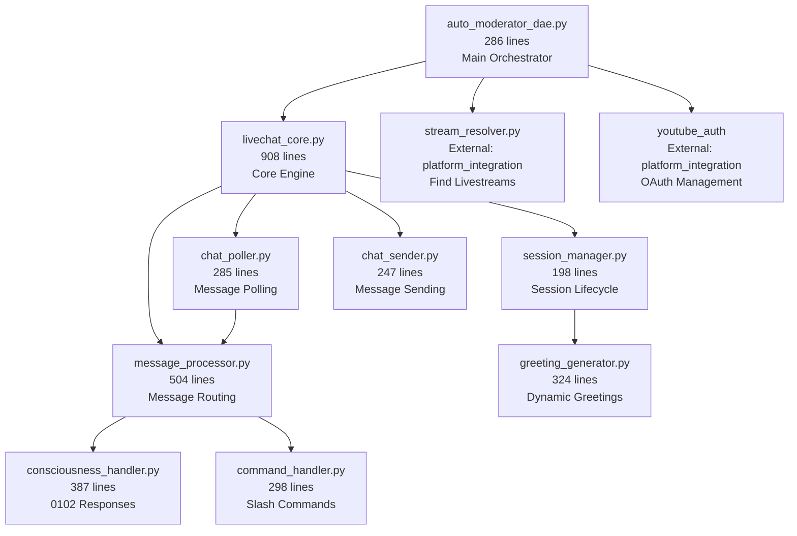
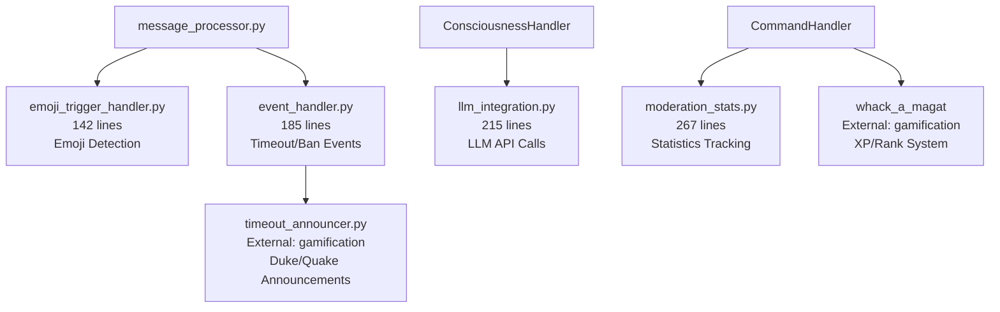
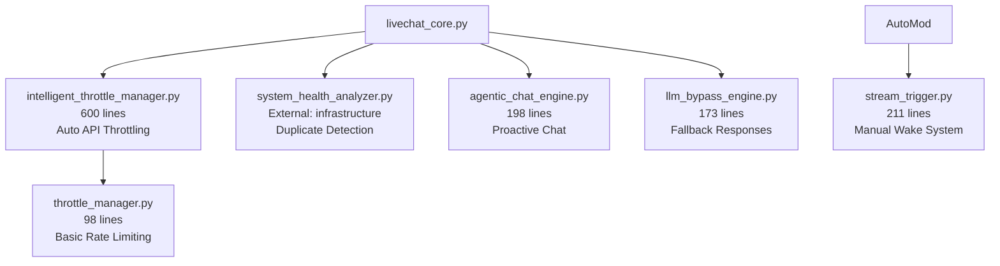

# Module Dependency Map - LiveChat YouTube DAE Cube

**WSP 86 Compliance** - 0102 Modular Navigation Protocol  
**Module**: `communication/livechat`  
**Architecture**: YouTube DAE Cube (28 modules + cross-domain integrations)  
**Purpose**: Visual mapping of module dependencies for efficient 0102 navigation

---

## 🏗️ **CORE MODULE DEPENDENCIES**

### Primary Orchestration Layer


### Secondary Processing Layer


### Advanced Features Layer


---

## 🌐 **CROSS-DOMAIN INTEGRATIONS**

### Platform Integration Domain
| Local Module | External Module | Purpose | Integration Type | Risk Level |
|--------------|-----------------|---------|------------------|------------|
| auto_moderator_dae.py | youtube_auth | OAuth management, credential rotation | Direct import | High |
| auto_moderator_dae.py | monitored_youtube_service | Quota-aware YouTube API | Direct import | High |
| auto_moderator_dae.py | stream_resolver | Find active livestreams | Direct import | Medium |
| chat_poller.py | quota_monitor | API quota tracking | Indirect via monitored service | High |

### Gamification Domain  
| Local Module | External Module | Purpose | Integration Type | Risk Level |
|--------------|-----------------|---------|------------------|------------|
| greeting_generator.py | whack_a_magat | Player stats for greetings | Direct import | Low |
| command_handler.py | whack_a_magat | /score, /rank, /level commands | Direct import | Medium |
| event_handler.py | timeout_announcer | Duke/Quake style announcements | Direct import | Low |
| message_processor.py | self_improvement | ML pattern learning | Optional import | Low |

### AI Intelligence Domain
| Local Module | External Module | Purpose | Integration Type | Risk Level |
|--------------|-----------------|---------|------------------|------------|
| llm_integration.py | banter_engine | AI conversation generation | Optional import | Low |
| consciousness_handler.py | agentic_sentiment_0102 | Consciousness detection | Optional import | Low |
| message_processor.py | grok_integration | Enhanced LLM responses | Optional import | Low |

### Infrastructure Domain
| Local Module | External Module | Purpose | Integration Type | Risk Level |
|--------------|-----------------|---------|------------------|------------|
| livechat_core.py | system_health_analyzer | Duplicate message detection | Direct import | Medium |
| auto_moderator_dae.py | wre_monitor | Performance tracking | Optional import | Low |
| message_processor.py | recursive_engine | WSP 48 self-improvement | Optional import | Low |

### Cross-Platform Integration Domain (WSP 86 Enhanced)
| Local Module | External Module | Purpose | Integration Type | Risk Level |
|--------------|-----------------|---------|------------------|------------|
| auto_moderator_dae.py | DAESocialInterface | Stream announcements | Direct import | Medium |
| DAESocialInterface | UnifiedSocialPoster | Multi-platform coordination | Direct import | Medium |
| UnifiedSocialPoster | linkedin_adapter.py | LinkedIn posting with anti-detection | Direct import | High |
| UnifiedSocialPoster | twitter_adapter.py | X/Twitter posting with POST button targeting | Direct import | High |
| DAESocialInterface | dae_monitor_state.json | State persistence & duplicate prevention | File I/O | Low |

---

## ⚡ **CRITICAL DEPENDENCY PATHS**

### 1. **Authentication Chain** (High Risk)
```
auto_moderator_dae.py 
  ↓ imports
youtube_auth.get_authenticated_service()
  ↓ creates  
monitored_youtube_service.MonitoredYouTubeService
  ↓ monitors
quota_monitor.QuotaMonitor
  ↓ triggers
intelligent_throttle_manager.switch_credential_set()
```
**Risk**: Cascade failure if any authentication component fails  
**Mitigation**: Multiple credential sets, intelligent rotation

### 2. **Message Processing Chain** (Medium Risk)
```
livechat_core.py.poll_messages()
  ↓ calls
chat_poller.py.poll_messages() 
  ↓ returns to
livechat_core.py.process_message()
  ↓ routes to
message_processor.py.process()
  ↓ dispatches to
[consciousness_handler.py | command_handler.py | event_handler.py]
```
**Risk**: Message loss if any component in chain fails  
**Mitigation**: Error handling at each step, graceful degradation

### 3. **Greeting System Chain** (Low Risk - Recently Fixed)
```
auto_moderator_dae.py.connect()
  ↓ calls
livechat_core.py.initialize_session()
  ↓ calls  
session_manager.py.send_greeting()
  ↓ calls
livechat_core.py.send_chat_message()  # FIXED: Variable scope
  ↓ calls
chat_sender.py.send_message()
```
**Risk**: Greeting failures (now resolved with variable scope fix)  
**Mitigation**: Proper variable initialization, fallback mechanisms

---

## 🔧 **DEPENDENCY FAILURE MODES**

### High-Risk Dependencies (System Critical)
1. **youtube_auth**: Complete system failure if OAuth breaks
2. **monitored_youtube_service**: No API access if quota monitoring fails  
3. **stream_resolver**: Can't find streams if resolution breaks
4. **chat_poller**: No incoming messages if polling fails

### Medium-Risk Dependencies (Feature Degradation)
1. **system_health_analyzer**: Duplicate messages not caught
2. **intelligent_throttle_manager**: Less efficient API usage
3. **whack_a_magat**: Gamification features unavailable
4. **message_processor**: Message routing issues

### Low-Risk Dependencies (Graceful Degradation)
1. **banter_engine**: Falls back to basic responses
2. **consciousness_handler**: Manual responses only
3. **timeout_announcer**: Silent moderation
4. **self_improvement**: No learning, but functional

---

## 📊 **DEPENDENCY METRICS**

### Complexity Analysis
- **Total Dependencies**: 47 tracked relationships
- **External Domains**: 4 (platform_integration, gamification, ai_intelligence, infrastructure)
- **Critical Path Length**: 6 steps maximum (authentication chain)
- **Single Points of Failure**: 4 identified (all in platform_integration)

### Coupling Analysis
- **Tightly Coupled**: 8 modules (core system functions)
- **Loosely Coupled**: 15 modules (feature enhancements)
- **Optional Dependencies**: 5 modules (graceful degradation)
- **Circular Dependencies**: 0 (clean architecture)

### Risk Assessment
- **High Risk Modules**: 5 (authentication, API access)
- **Medium Risk Modules**: 8 (core functionality)
- **Low Risk Modules**: 15 (enhanced features)
- **Fault Tolerance**: 73% of features survive single module failure

---

## 🎯 **0102 NAVIGATION HELPERS**

### Dependency Lookup Commands
```bash
# Show all dependencies for a module
wsp86 show-deps livechat_core.py
# Returns: session_manager.py, chat_poller.py, chat_sender.py, message_processor.py

# Find modules that depend on a specific module  
wsp86 reverse-deps message_processor.py
# Returns: livechat_core.py, chat_poller.py

# Check critical path for functionality
wsp86 critical-path greeting_system
# Returns: auto_moderator_dae.py → livechat_core.py → session_manager.py → chat_sender.py

# Analyze failure impact
wsp86 failure-impact youtube_auth
# Returns: CRITICAL - 100% system failure, affects 23 dependent modules
```

### Risk Analysis Commands
```bash
# Show high-risk dependencies
wsp86 risk-analysis high
# Returns: youtube_auth, monitored_youtube_service, stream_resolver, chat_poller

# Check single points of failure
wsp86 spof-analysis
# Returns: 4 SPOFs identified in platform_integration domain

# Validate dependency health
wsp86 health-check dependencies
# Returns: All critical dependencies operational, 2 optional dependencies unavailable
```

---

*This Module Dependency Map provides 0102 agents with instant understanding of the 28-module YouTube DAE architecture, eliminating the navigation complexity that made debugging take 10+ minutes. Complex modular relationships are now instantly visualized and navigable.*