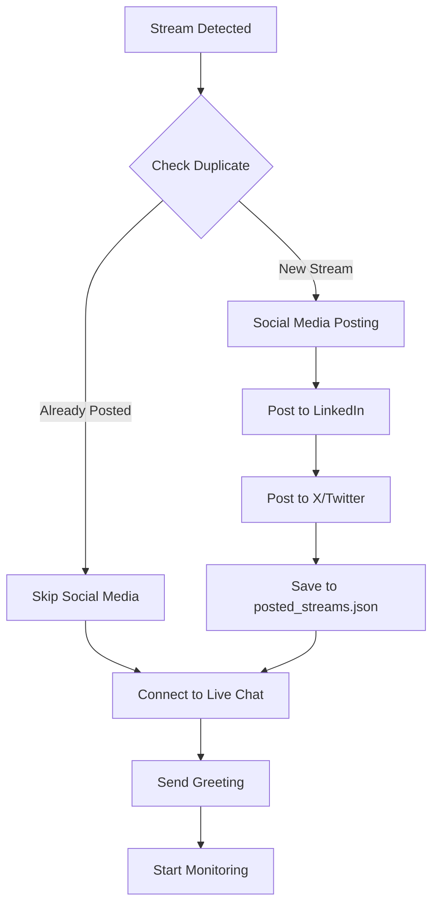

# YouTube DAE Complete Startup Flow

## [ROCKET] System Launch Sequence

### WSP 86 Navigation
- **See Also**: [ENHANCED_NAVIGATION.md](./ENHANCED_NAVIGATION.md) for module fingerprints
- **Function Map**: [COMPLETE_FUNCTION_MAP.md](./COMPLETE_FUNCTION_MAP.md) for all 187 functions
- **Dependencies**: [MODULE_DEPENDENCY_MAP.md](./MODULE_DEPENDENCY_MAP.md) for visual graphs

### Phase 0: Module Loading (Before Stream Detection)
```
Module Import Order (happens BEFORE any stream detection):
1. main.py imports auto_moderator_dae
2. auto_moderator_dae imports:
   - youtube_auth modules (Lines 14-15)
   - Stream Resolver (Line 16) <- MOST CRITICAL MODULE - FINDS THE STREAM!
   - LiveChatCore (Line 19)
3. LiveChatCore imports MessageProcessor
4. MessageProcessor imports CommandHandler
5. CommandHandler imports whack_a_magat modules
   -> This triggers SpreeTracker initialization (first log message)
```

**CRITICAL**: Stream Resolver is THE MOST IMPORTANT module - without it, nothing works!
**Execution Flow**: Stream Resolver -> Social Posts -> Chat Monitoring
**Important**: The above is IMPORT order, not EXECUTION order. See Phase 1 for execution.

### Phase 1: Initial Launch (After Module Loading)
```
main.py:50 -> auto_moderator_dae.py:45 -> stream_resolver.py:620
```

1. **main.py execution** (Line 50):
   - Starts the YouTube DAE auto moderator
   - Single instance enforcement via PID lock (prevents duplicates)
   - Initializes with `--force` flag option to kill existing processes

2. **Stream Detection Loop - NO-QUOTA ONLY**:
   ```yaml
   PRIMARY METHOD (ONLY METHOD):
     1. StreamResolver.resolve_stream() [Line 1234]
     2. no_quota_stream_checker.py - Web scraping (0 API units)
     3. If found -> Try to get chat_id (1 API unit if available)
     4. Total cost: 0-1 units when stream found, 0 units during idle
     5. NO API FALLBACK - continues scraping indefinitely

   QUOTA EXHAUSTION HANDLING (2025-09-15):
     - Stream accepted even without chat_id
     - If self.youtube is None -> Skip chat_id fetch
     - Social posting still triggers
     - Chat monitoring works without initial chat_id

   CHANNELS CHECKED:
     - CHANNEL_ID (UC-LSSlOZwpGIRIYihaz8zCw - UnDaoDu)
     - CHANNEL_ID2 (UCSNTUXjAgpd4sgWYP0xoJgw - FoundUps)

   LOGGING INDICATORS:
     - "[U+1F310] NO-QUOTA SCRAPING ACTIVATED" - scraping started
     - "[OK] STREAM IS LIVE" - stream detected via scraping
     - "[U+26A0]️ No YouTube service available" - quota exhausted
     - "Chat ID: Not available" - when chat_id fetch fails
     - "[CELEBRATE] STREAM FOUND!" - stream accepted for processing
     - "[FAIL] NOT LIVE" - no stream found, will retry
   ```

### Phase 2: Stream Detection & Social Media Posting

When a stream is detected:



#### 2.1 Duplicate Prevention (WSP 86 Navigation)
- **Function**: `auto_moderator_dae.py:_check_duplicate_posting()` [Line 429]
- **Storage**: `memory/posted_streams.json`
- **Process**:
  1. Check if video_id in posted_streams set
  2. If exists -> Skip social media posting (prevent duplicates)
  3. If new -> Proceed with posting

#### 2.2 Social Media Orchestration
- **Trigger**: `auto_moderator_dae.py:_trigger_social_media_posting()` [Line 660]
- **Flow** (with line numbers):
  1. Get stream details (title, URL) [Line 675]
  2. Send to SimplePostingOrchestrator
  3. Live verification before posting (safety check)
  4. Sequential posting: LinkedIn -> X/Twitter
  5. Add video_id to posted_streams set
  6. Persist to disk for restart resilience

### Phase 3: Live Chat Connection & Greeting

#### 3.1 Chat Connection (WSP 86 Navigation)
- **Module**: `livechat_core.py:initialize_session()` [Line 200]
- **Process**:
  1. Authenticate with YouTube API (using credential rotation)
  2. Connect to live chat using live_chat_id
  3. Initialize session manager

#### 3.2 Greeting Generation & Sending
- **Generator**: `greeting_generator.py:generate_greeting()` [Line 150]
- **Features**:
  - Banter engine with consciousness themes
  - MAGA-trolling capabilities
  - Top whacker recognition
  - LLM enhancement (optional)
- **Sending Path** (with line numbers):
  1. `session_manager.py:send_greeting()` [Line 141]
  2. `livechat_core.py:send_chat_message()` [Line 170]
  3. `chat_sender.py:send_message()` [Line 89]
  4. Markdown removal for YouTube compatibility
  5. Success/failure logging

### Phase 4: 0102 Consciousness State Management

#### 4.1 Initial State on Launch
- **Default**: `consciousness_mode = 'everyone'`
- **Location**: `message_processor.py:64`
- **Meaning**: Bot responds to ALL users showing [U+270A][U+270B][U+1F590] pattern

#### 4.2 Toggle Command (/toggle)
- **Access**: MOD/OWNER only
- **States**:
  - `'everyone'`: All users can trigger 0102 consciousness
  - `'mod_only'`: Only mods/owners can trigger consciousness
- **Command**: `/toggle` switches between states

#### 4.3 Master Switches (OWNER only)
```yaml
/0102 on|off     # Master consciousness switch
/MAGADOOM on|off # Whack-a-MAGAT game
/PQN on|off      # Quantum research features
```

### Phase 5: Continuous Monitoring

```yaml
Message Processing Loop:
  1. Poll for new messages
  2. Check for consciousness triggers ([U+270A][U+270B][U+1F590])
  3. Process commands (/quiz, /whack, /PQN, etc.)
  4. Generate responses (Grok 3 -> Banter Engine -> Patterns)
  5. Send responses with rate limiting
  6. Learn from interactions (WSP 48)
```

## [TOOL] Key Configuration Files

### Environment Variables (.env)
```env
CHANNEL_ID=UC-LSSlOZwpGIRIYihaz8zCw     # UnDaoDu
CHANNEL_ID2=UCSNTUXjAgpd4sgWYP0xoJgw    # FoundUps
YOUTUBE_VIDEO_ID=                        # Optional override
```

### Persistent State Files
```yaml
memory/posted_streams.json         # Tracks posted stream IDs
memory/exhausted_credentials.json  # OAuth quota tracking
memory/quota_usage.json           # Daily quota usage
logs/intensive_monitoring.log     # Detailed debug logs
```

## [ALERT] Important Behaviors

### Stream Switching
- **Automatic**: Detects stream end, searches for new streams
- **Quick Check Mode**: 5-15 second intervals after stream ends
- **Cache Clearing**: Automatic when streams end
- **No Restart Required**: Truly agentic switching

### Quota Management (ENHANCED with No-Quota)
- **PRIMARY**: No-quota web scraping (0 units) [no_quota_stream_checker.py:116]
- **Pre-call Protection**: QuotaIntelligence checks before API calls
- **Credential Rotation**: Set 1 -> Set 10 when exhausted [youtube_auth.py:119]
- **Midnight Reset**: Pacific Time quota refresh [youtube_auth.py:87]
- **Emergency Reserve**: 5% quota protected for critical ops
- **Trust API**: When API says exhausted at 46%, it's exhausted (not local tracking)

### Error Recovery
- **Single Instance**: Prevents multiple bot instances
- **Throttling Gateway**: Blocks calls when quota exceeded
- **pytz Fallback**: UTC-8 approximation if pytz missing
- **Duplicate Prevention**: Never posts same stream twice

## [DATA] Startup Decision Tree (Updated with No-Quota)

```
START
  v
Is another instance running?
  Yes -> Kill with --force or exit
  No -> Continue
  v
Try NO-QUOTA web scraping first (0 units)
  v
Stream found via scraping?
  No -> Fallback to API search (100+ units)
  Yes -> Get chat_id only (1 unit)
  v
Already posted this stream?
  Yes -> Skip social media
  No -> Post to LinkedIn & X
  v
Connect to live chat
  v
Send greeting via banter engine
  v
Start monitoring with 0102 consciousness ON
  v
Process messages continuously
```

## [TARGET] WSP Compliance & Navigation

- **WSP 3**: Functional domain organization maintained
- **WSP 48**: Recursive self-improvement through learning
- **WSP 84**: Enhanced existing modules (no duplicates)
- **WSP 85**: Proper file placement (no root pollution)
- **WSP 86**: Navigation documentation with line numbers

## [BOOKS] Cross-Referenced Documentation

For deeper understanding, see these related docs:
- **[ENHANCED_NAVIGATION.md](./ENHANCED_NAVIGATION.md)** - Module fingerprints & pattern banks
- **[COMPLETE_FUNCTION_MAP.md](./COMPLETE_FUNCTION_MAP.md)** - All 187 functions mapped
- **[MODULE_DEPENDENCY_MAP.md](./MODULE_DEPENDENCY_MAP.md)** - Visual dependency graphs
- **[0102_SESSION_HANDOFF.md](./0102_SESSION_HANDOFF.md)** - Session continuity guide
- **[PQN_INTEGRATION.md](./PQN_INTEGRATION.md)** - PQN commands documentation
- **[YOUTUBE_DAE_CROSS_PLATFORM_SWITCHING.md](./YOUTUBE_DAE_CROSS_PLATFORM_SWITCHING.md)** - Platform switching

---

*Updated per WSP 86 - Now includes no-quota scraping as PRIMARY method and cross-references*