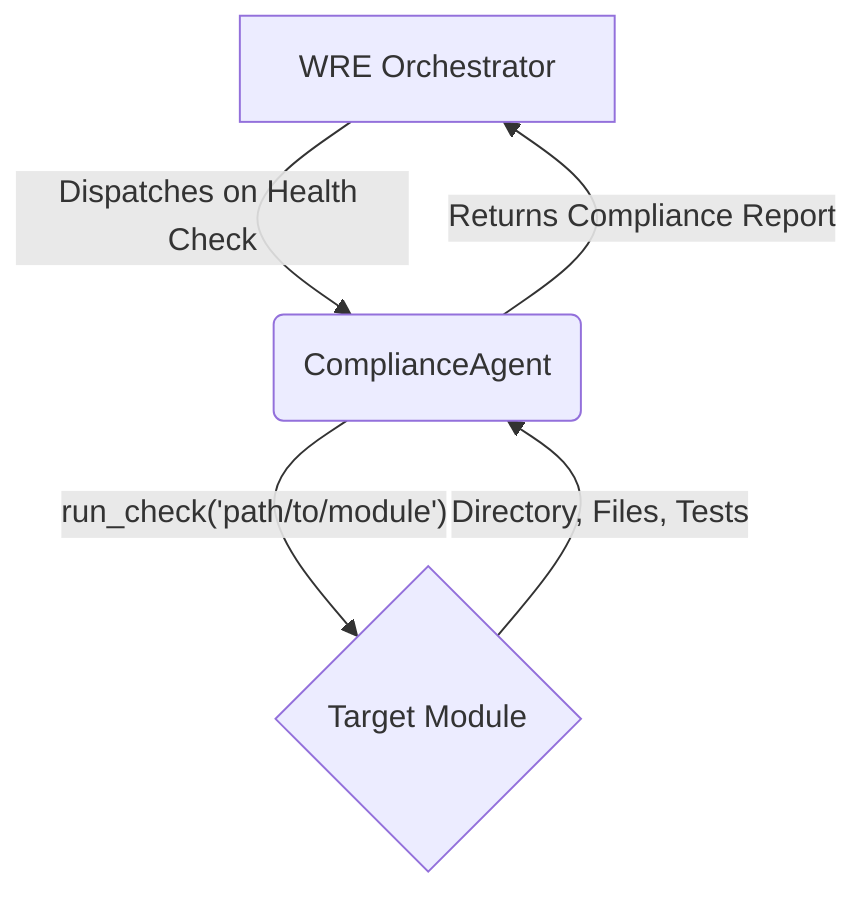

# ComplianceAgent Module

## 1. Overview

This module contains the `ComplianceAgent`, an internal agent of the Windsurf Recursive Engine (WRE).

The ComplianceAgent acts as the automated guardian of the WSP framework's structural integrity. It is the "Guardian" of the system, ensuring all modules adhere to established standards.

## 2. Core Duties

The agent's primary duties include:
-   **Module Structure Validation:** Verifying the existence of `src/` and `tests/` directories.
-   **Mandatory File Audit:** Ensuring all required files like `README.md` and `__init__.py` are present.
-   **Test File Correspondence:** Checking that every source file has a corresponding test file.
-   **Interface & Dependency Validation:** Ensuring compliance with WSP 11 and 12.

For the complete technical specification of these duties, refer to **WSP-54: WRE Agent Duties Specification**.

## 3. How to Use

The `ComplianceAgent` is not intended for direct execution. It is dispatched by the WRE Orchestrator, typically during a system-wide health check.

### Integration Workflow

The agent integrates into the WRE as follows:

1.  **Trigger:** The process starts inside the WRE **Orchestrator** (`orchestrator.py`). A function like `run_system_health_check` is the main trigger.
2.  **Import & Initialization:** The Orchestrator imports the `ComplianceAgent` class and creates an instance of it.
3.  **Dispatching:** The Orchestrator calls the `run_check()` method on the agent instance, passing the file path of the module it wants to inspect.
4.  **Execution:** The `ComplianceAgent` executes its internal checks (directory structure, mandatory files, etc.) on the target module.
5.  **Reporting:** The agent returns a detailed **Compliance Report** (a dictionary) to the Orchestrator. This report contains a boolean `compliant` status and a list of any errors found. The Orchestrator can then use this report to log the system status or take further action. 