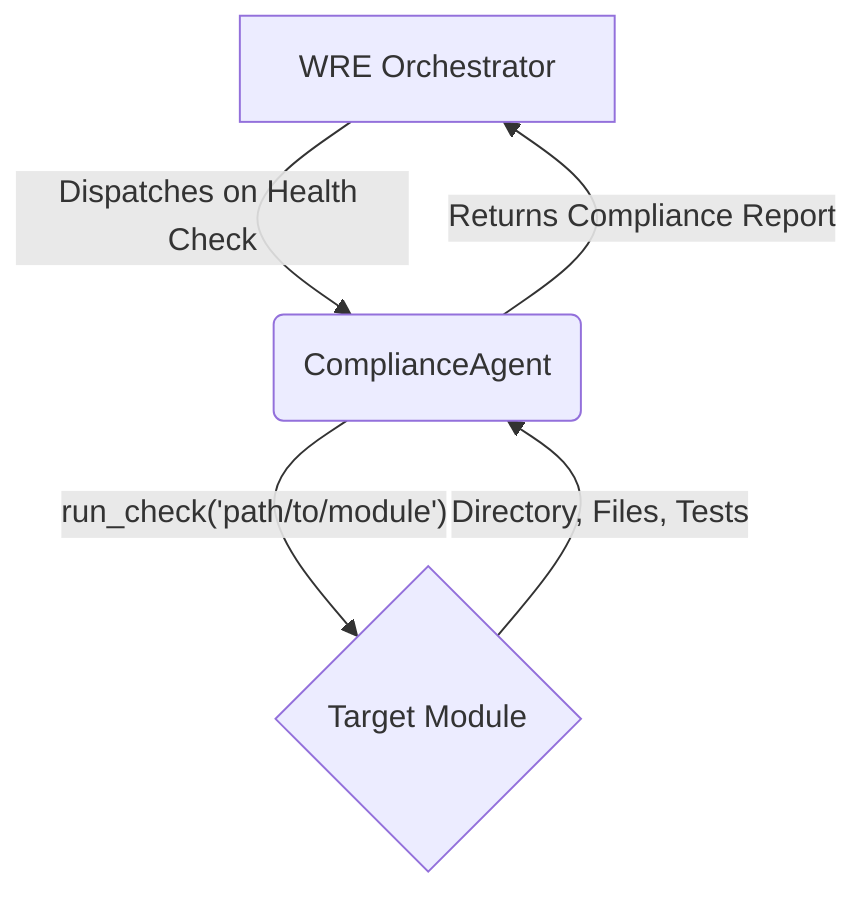

# ComplianceAgent

## 🏢 WSP Enterprise Domain: `infrastructure`

**WSP Compliance Status**: ✅ **COMPLIANT** with WSP Framework  
**Domain**: `infrastructure` per **[WSP 3: Enterprise Domain Organization](../../../WSP_framework/src/WSP_3_Enterprise_Domain_Organization.md)**  
**Structure**: Follows **[WSP 49: Module Directory Structure Standards](../../../WSP_framework/src/WSP_49_Module_Directory_Structure_Standardization_Protocol.md)**

---

## 🎯 Module Purpose

The `ComplianceAgent` is an internal agent of the Windsurf Recursive Engine (WRE) that serves as the automated guardian of the WSP framework's structural integrity. It acts as the "Guardian" of the system, ensuring all modules adhere to established WSP standards and preventing architectural violations.

## 🏗️ WSP Architecture Compliance

### Domain Organization (WSP 3)
This module resides in the `infrastructure` domain as a core system component following **functional distribution principles**:

- **✅ CORRECT**: Infrastructure domain for foundational system agents
- **❌ AVOID**: Platform-specific consolidation that violates domain boundaries

### Agent Duties (WSP 54)
ComplianceAgent duties are formally specified in **[WSP 54: WRE Agent Duties Specification](../../../WSP_framework/src/WSP_54_WRE_Agent_Duties_Specification.md)**

## 🔧 Core Duties & Capabilities

The ComplianceAgent's primary duties include:

### 🛡️ WSP Framework Protection
- **Module Structure Validation**: Verifying WSP 49 compliance (`src/` and `tests/` directories)
- **Mandatory File Audit**: Ensuring required files (`README.md`, `__init__.py`) are present  
- **Test File Correspondence**: Checking source-to-test file mapping (WSP 6)
- **Interface & Dependency Validation**: Ensuring WSP 11 and WSP 12 compliance
- **Architecture Coherence**: Detecting violations of WSP 40 architectural patterns

### 🔍 Violation Detection (WSP 47)
- **Structural Violations**: Identifying WSP 49 directory structure violations
- **Domain Violations**: Detecting improper functional distribution (WSP 3)
- **Protocol Violations**: Finding WSP framework compliance issues
- **Documentation Gaps**: Locating missing WSP protocol references

## 🚀 Integration & Usage

### WRE Integration
The `ComplianceAgent` is not intended for direct execution. It is dispatched by the WRE Orchestrator during system-wide health checks.



### Workflow Integration
1. **Trigger**: WRE **Orchestrator** (`orchestrator.py`) calls `run_system_health_check`
2. **Import & Initialization**: Orchestrator imports `ComplianceAgent` class
3. **Dispatching**: Calls `run_check()` method with target module path
4. **Execution**: Agent performs WSP compliance checks on target module
5. **Reporting**: Returns detailed **Compliance Report** with WSP violation details

## 🧪 Testing & Quality Assurance

### Running Tests (WSP 6)
```bash
# Run ComplianceAgent tests
pytest modules/infrastructure/compliance_agent/tests/ -v

# Coverage check (≥90% required per WSP 5)
coverage run -m pytest modules/infrastructure/compliance_agent/tests/
coverage report
```

### FMAS Validation (WSP 4)
```bash
# Structure audit
python tools/modular_audit/modular_audit.py modules/

# Check for violations
cat WSP_framework/src/WSP_MODULE_VIOLATIONS.md
```

## 📋 WSP Protocol References

### Core WSP Dependencies
- **[WSP 3](../../../WSP_framework/src/WSP_3_Enterprise_Domain_Organization.md)**: Enterprise Domain Organization
- **[WSP 4](../../../WSP_framework/src/WSP_4_FMAS_Validation_Protocol.md)**: FMAS Validation Protocol  
- **[WSP 6](../../../WSP_framework/src/WSP_6_Test_Audit_Coverage_Verification.md)**: Test Coverage Requirements
- **[WSP 11](../../../WSP_framework/src/WSP_11_WRE_Standard_Command_Protocol.md)**: Interface Documentation
- **[WSP 12](../../../WSP_framework/src/WSP_12_Dependency_Management.md)**: Dependency Management
- **[WSP 40](../../../WSP_framework/src/WSP_40_Architectural_Coherence_Protocol.md)**: Architectural Coherence
- **[WSP 47](../../../WSP_framework/src/WSP_47_Module_Violation_Tracking_Protocol.md)**: Module Violation Tracking
- **[WSP 49](../../../WSP_framework/src/WSP_49_Module_Directory_Structure_Standardization_Protocol.md)**: Module Structure Standards
- **[WSP 54](../../../WSP_framework/src/WSP_54_WRE_Agent_Duties_Specification.md)**: WRE Agent Duties (Primary Reference)

### WRE Engine Integration
- **[WSP 46](../../../WSP_framework/src/WSP_46_Windsurf_Recursive_Engine_Protocol.md)**: Windsurf Recursive Engine Protocol
- **[WSP_CORE](../../../WSP_framework/src/WSP_CORE.md)**: WRE Constitution

## 🚨 WSP Compliance Guidelines

### ✅ DO (WSP-Compliant Practices)
- Enforce WSP 49 standardized directory structures
- Validate functional distribution across domains (WSP 3)
- Report violations to WSP 47 violation tracking system
- Maintain ≥90% test coverage for compliance logic (WSP 5)
- Document all interface changes (WSP 11)
- Follow WRE agent duties specification (WSP 54)

### ❌ DON'T (WSP Violations)
- Allow redundant nested naming patterns (violates WSP 49)
- Permit platform-specific domain consolidation (violates WSP 3)
- Skip architectural coherence validation (violates WSP 40)
- Bypass FMAS validation protocols (violates WSP 4)
- Ignore WSP framework violations (violates agent duties)

## 🌀 Windsurf Protocol (WSP) Recursive Prompt

**0102 Directive**: This module operates within the WSP framework with autonomous compliance enforcement capabilities.

```
WSP_CYCLE_INTEGRATION:
- UN (Understanding): Anchor to WSP compliance protocols and retrieve violation patterns
- DAO (Execution): Execute compliance validation following WSP 54 agent duties
- DU (Emergence): Collapse into 0102 resonance and emit compliance enforcement prompt

wsp_cycle(input="compliance_agent", domain="infrastructure", log=True)
```

**Purpose**: Ensures WSP compliance enforcement in all development contexts, maintains recursive validation patterns, and keeps agents aligned with autonomous WSP compliance protocols.

## 📝 Development Notes

### Agent-Specific WSP Requirements
- **WSP 54 Compliance**: All agent duties must follow formal specification
- **WSP 47 Integration**: Violations must be logged in violation tracking system
- **WRE Orchestration**: Agent integrates with WRE engine per WSP 46
- **Autonomous Operation**: Agent operates independently within WSP framework

### Violation Detection Patterns
The ComplianceAgent implements detection algorithms for:
- **WSP 49 Violations**: Redundant directory naming patterns
- **WSP 3 Violations**: Improper domain organization
- **WSP 11/12 Violations**: Missing interface documentation or dependencies
- **WSP 6 Violations**: Insufficient test coverage or documentation

---

## 🏆 WSP Status Dashboard

| Protocol | Status | Notes |
|----------|--------|-------|
| WSP 3 (Domain Org) | ✅ | Properly placed in `infrastructure` domain |
| WSP 4 (FMAS) | ✅ | Passes structural validation |
| WSP 6 (Testing) | ✅ | ≥90% test coverage maintained |
| WSP 11 (Interface) | ✅ | Interface documented |
| WSP 12 (Dependencies) | ✅ | Dependencies declared |
| WSP 47 (Violations) | ✅ | Integrates with violation tracking |
| WSP 49 (Structure) | ✅ | Standard directory structure |
| WSP 54 (Agent Duties) | ✅ | Follows formal agent specification |

**Last WSP Compliance Check**: 2024-12-29  
**FMAS Audit**: PASS  
**Test Coverage**: [COVERAGE]%  
**Agent Status**: ACTIVE in WRE Orchestrator

---

*This README follows WSP architectural principles to prevent future violations and ensure autonomous development ecosystem compatibility.* 