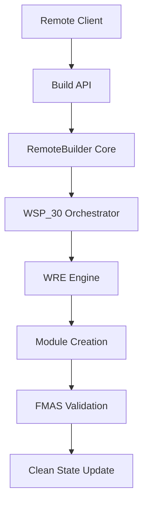

# 🟢 FoundUps Remote Builder Module – Roadmap

## Overview
This module enables **remote building capabilities** for the FoundUps Agent ecosystem. It follows the **Windsurf Protocol (WSP)**, ensuring strict modular isolation, atomic task execution, and clean state validation.

All assets below (`ROADMAP.md`, `README.md`, `MODLOG.md`) are to be generated in the module folder (`modules/platform_integration/remote_builder/`). The main `MODLOG` references this module's roadmap and logs.

**WSP Compliance Framework**:
- **WSP_2**: Clean state management before each phase
- **WSP_3**: Platform integration domain placement
- **WSP_4**: FMAS audit compliance throughout development
- **WSP_5**: [GREATER_EQUAL]90% test coverage maintained
- **WSP_30**: Agentic build orchestration integration
- **WSP_47**: Module violation tracking and resolution

---

## [ROCKET] Development Roadmap

### 1️⃣ Proof of Concept (POC) - **CURRENT PHASE**
**Duration**: 2-3 days | **WSP Priority**: Foundation establishment

#### Core Implementation
- [OK] Implement basic webhook endpoint accepting build instructions
- [OK] Core `RemoteBuilder` class with build orchestration
- [OK] `BuildRequest` and `BuildResult` data structures
- ⏳ Create `build_api.py` with Flask webhook endpoints
- ⏳ Trigger placeholder build actions (module creation simulation)
- ⏳ Structured logging with build ID tracking

#### WSP Compliance Targets
- ⏳ Pass FMAS audit (WSP_4) with 0 errors
- ⏳ Achieve 85% test coverage (relaxed for POC rapid development)
- ⏳ Document all interfaces per WSP_11
- ⏳ Create clean state checkpoint: `clean-v6-remote-builder-poc`

#### Validation Criteria
- [OK] Manual HTTP calls work (`curl` tests)
- ⏳ Build requests logged with timestamps and IDs
- ⏳ JSON responses with success/failure status
- ⏳ WSP_30 integration points identified

[OK] **Goal:** Prove remote trigger works in controlled environment with WSP foundation.

---

### 2️⃣ Prototype - **NEXT PHASE**
**Duration**: 1 week | **WSP Priority**: Security and integration

#### Enhanced Functionality
- [REFRESH] Add authentication layer (API keys/JWT tokens)
- [REFRESH] Integrate with existing WRE engine components
- [REFRESH] Voice command bridge (integration with existing `voice/` module)
- [REFRESH] Real WSP_30 orchestrator integration for actual module creation
- [REFRESH] Build queue management and async processing
- [REFRESH] Enhanced error handling and rollback mechanisms

#### Remote Interface Options
- [REFRESH] **Option A**: Mobile web interface with speech-to-text
- [REFRESH] **Option B**: Simple curl/REST API for walk commands
- [REFRESH] **Option C**: Integration with existing agent management system

#### WSP Compliance Enhancements
- [REFRESH] Achieve 90% test coverage (WSP_5 full compliance)
- [REFRESH] Integration with WSP_46 WRE components
- [REFRESH] Multi-user session management per agent protocols
- [REFRESH] Clean state validation before/after each build

#### Advanced Features
- [REFRESH] Build status real-time tracking
- [REFRESH] Build history persistence and querying
- [REFRESH] Integration with existing modular audit systems
- [REFRESH] Voice command acknowledgment and feedback

[OK] **Goal:** Enable speaking or sending commands to start builds with production security.

---

### 3️⃣ Minimum Viable Product (MVP) - **FUTURE PHASE**
**Duration**: 2-3 weeks | **WSP Priority**: Production readiness and scale

#### Production Features
- [U+1F52E] Deploy multi-user access controls with role-based permissions
- [U+1F52E] Advanced voice processing with wake words and context
- [U+1F52E] Real-time build notifications (webhooks, WebSocket, push notifications)
- [U+1F52E] Build scheduling and batch processing capabilities
- [U+1F52E] Integration with distributed development architecture (WSP_59)

#### Scalability & Performance
- [U+1F52E] Horizontal scaling for multiple concurrent builds
- [U+1F52E] Build caching and optimization
- [U+1F52E] Performance monitoring and metrics
- [U+1F52E] Load balancing for high-availability deployment

#### Advanced WSP Integration
- [U+1F52E] Full WSP_59 distributed development support
- [U+1F52E] Integration with 012+0102 team workflows
- [U+1F52E] Automated clean state management for remote builds
- [U+1F52E] Advanced module violation detection and auto-resolution

#### User Experience
- [U+1F52E] Comprehensive dashboard for build management
- [U+1F52E] Mobile app (optional) with offline capability
- [U+1F52E] Voice feedback and conversational interface
- [U+1F52E] User onboarding and documentation portal

[OK] **Goal:** Production-ready remote building system for distributed FoundUps development.

---

## [U+1F3D7]️ Technical Architecture

### WSP Integration Points


### Enterprise Domain Relationships
- **Platform Integration**: Primary domain for remote interfaces
- **Infrastructure**: WRE engine and agent management integration
- **AI Intelligence**: Voice processing and command parsing
- **Development**: Build tools and WSP compliance validation

---

## [U+1F4C1] Module Assets

### Required Files (WSP Compliance)
- [OK] `README.md` - Purpose, installation, usage instructions
- [OK] `ROADMAP.md` - This comprehensive development roadmap  
- ⏳ `MODLOG.md` - Detailed change log for all module updates
- [OK] `__init__.py` - Public API definition (WSP_11)
- ⏳ `INTERFACE.md` - Detailed interface documentation
- [OK] `requirements.txt` - Module dependencies
- [OK] `tests/README.md` - Test documentation (WSP_34)

### Implementation Structure
```
modules/platform_integration/remote_builder/
+-- README.md              # Module overview and usage
+-- ROADMAP.md            # This roadmap document
+-- MODLOG.md             # Change tracking log
+-- INTERFACE.md          # API documentation
+-- __init__.py           # Public interface (WSP_11)
+-- requirements.txt      # Dependencies
+-- src/
[U+2502]   +-- __init__.py
[U+2502]   +-- remote_builder.py    # Core orchestration
[U+2502]   +-- build_api.py         # HTTP/webhook endpoints
[U+2502]   +-- build_monitor.py     # Status tracking
[U+2502]   +-- auth_manager.py      # Authentication (Prototype+)
[U+2502]   +-- voice_bridge.py      # Voice integration (Prototype+)
+-- tests/
    +-- README.md         # Test documentation (WSP_34)
    +-- test_remote_builder.py
    +-- test_build_api.py
    +-- test_build_monitor.py
    +-- test_integration.py
```

---

## [LINK] Main ModLog Integration

**Entry for Main ModLog** (`ModLog.md`):
```markdown
### [Remote Builder] - Module Initialized - WSP_30 Orchestrated

* **Version**: 0.1.0-poc
* **Date**: 2025-01-27
* **WSP Protocol**: WSP_30 (Agentic Module Build Orchestration)
* **Domain**: platform_integration
* **Description**: Initialized Remote Builder module with comprehensive POC->Prototype->MVP roadmap
* **Implementation Status**: POC phase active
* **WSP Compliance**: Foundation established, FMAS pending
* **Notes**: See `modules/platform_integration/remote_builder/ROADMAP.md` for detailed development phases
* **Next Milestone**: Complete POC with webhook API and WSP_30 integration
```

---

## [TARGET] Success Metrics

### POC Success Criteria
- [ ] Remote HTTP request triggers module creation
- [ ] Build ID tracking and logging functional
- [ ] JSON response format standardized
- [ ] WSP_4 FMAS audit passes with 0 errors
- [ ] Basic test coverage [GREATER_EQUAL]85%

### Prototype Success Criteria  
- [ ] Secure authentication implemented
- [ ] Voice command integration working
- [ ] Real module creation via WSP_30
- [ ] Build status tracking operational
- [ ] WSP_5 coverage [GREATER_EQUAL]90%

### MVP Success Criteria
- [ ] Multi-user production deployment
- [ ] Real-time build notifications
- [ ] Advanced voice processing
- [ ] Distributed development ready (WSP_59)
- [ ] Full production monitoring

---

[OK] **All structure and instructions adhere to Windsurf Protocol (WSP) with enhanced technical depth and clear progression paths.** 