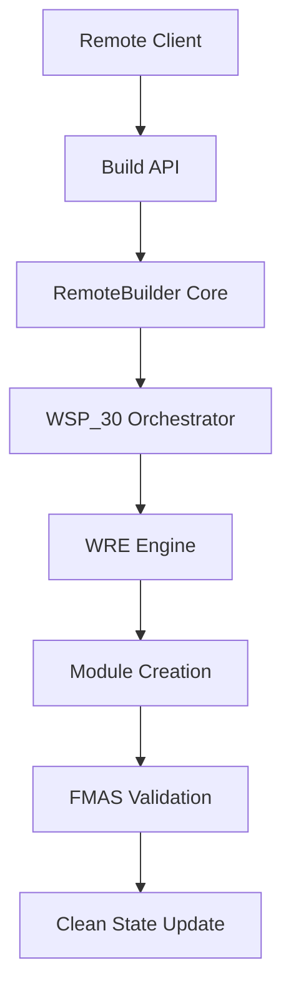

# 🟢 FoundUps Remote Builder Module – Roadmap

## Overview
This module enables **remote building capabilities** for the FoundUps Agent ecosystem. It follows the **Windsurf Protocol (WSP)**, ensuring strict modular isolation, atomic task execution, and clean state validation.

All assets below (`ROADMAP.md`, `README.md`, `MODLOG.md`) are to be generated in the module folder (`modules/platform_integration/remote_builder/`). The main `MODLOG` references this module's roadmap and logs.

**WSP Compliance Framework**:
- **WSP_2**: Clean state management before each phase
- **WSP_3**: Platform integration domain placement
- **WSP_4**: FMAS audit compliance throughout development
- **WSP_5**: ≥90% test coverage maintained
- **WSP_30**: Agentic build orchestration integration
- **WSP_47**: Module violation tracking and resolution

---

## 🚀 Development Roadmap

### 1️⃣ Proof of Concept (POC) - **CURRENT PHASE**
**Duration**: 2-3 days | **WSP Priority**: Foundation establishment

#### Core Implementation
- ✅ Implement basic webhook endpoint accepting build instructions
- ✅ Core `RemoteBuilder` class with build orchestration
- ✅ `BuildRequest` and `BuildResult` data structures
- ⏳ Create `build_api.py` with Flask webhook endpoints
- ⏳ Trigger placeholder build actions (module creation simulation)
- ⏳ Structured logging with build ID tracking

#### WSP Compliance Targets
- ⏳ Pass FMAS audit (WSP_4) with 0 errors
- ⏳ Achieve 85% test coverage (relaxed for POC rapid development)
- ⏳ Document all interfaces per WSP_11
- ⏳ Create clean state checkpoint: `clean-v6-remote-builder-poc`

#### Validation Criteria
- ✅ Manual HTTP calls work (`curl` tests)
- ⏳ Build requests logged with timestamps and IDs
- ⏳ JSON responses with success/failure status
- ⏳ WSP_30 integration points identified

✅ **Goal:** Prove remote trigger works in controlled environment with WSP foundation.

---

### 2️⃣ Prototype - **NEXT PHASE**
**Duration**: 1 week | **WSP Priority**: Security and integration

#### Enhanced Functionality
- 🔄 Add authentication layer (API keys/JWT tokens)
- 🔄 Integrate with existing WRE engine components
- 🔄 Voice command bridge (integration with existing `voice/` module)
- 🔄 Real WSP_30 orchestrator integration for actual module creation
- 🔄 Build queue management and async processing
- 🔄 Enhanced error handling and rollback mechanisms

#### Remote Interface Options
- 🔄 **Option A**: Mobile web interface with speech-to-text
- 🔄 **Option B**: Simple curl/REST API for walk commands
- 🔄 **Option C**: Integration with existing agent management system

#### WSP Compliance Enhancements
- 🔄 Achieve 90% test coverage (WSP_5 full compliance)
- 🔄 Integration with WSP_46 WRE components
- 🔄 Multi-user session management per agent protocols
- 🔄 Clean state validation before/after each build

#### Advanced Features
- 🔄 Build status real-time tracking
- 🔄 Build history persistence and querying
- 🔄 Integration with existing modular audit systems
- 🔄 Voice command acknowledgment and feedback

✅ **Goal:** Enable speaking or sending commands to start builds with production security.

---

### 3️⃣ Minimum Viable Product (MVP) - **FUTURE PHASE**
**Duration**: 2-3 weeks | **WSP Priority**: Production readiness and scale

#### Production Features
- 🔮 Deploy multi-user access controls with role-based permissions
- 🔮 Advanced voice processing with wake words and context
- 🔮 Real-time build notifications (webhooks, WebSocket, push notifications)
- 🔮 Build scheduling and batch processing capabilities
- 🔮 Integration with distributed development architecture (WSP_59)

#### Scalability & Performance
- 🔮 Horizontal scaling for multiple concurrent builds
- 🔮 Build caching and optimization
- 🔮 Performance monitoring and metrics
- 🔮 Load balancing for high-availability deployment

#### Advanced WSP Integration
- 🔮 Full WSP_59 distributed development support
- 🔮 Integration with 012+0102 team workflows
- 🔮 Automated clean state management for remote builds
- 🔮 Advanced module violation detection and auto-resolution

#### User Experience
- 🔮 Comprehensive dashboard for build management
- 🔮 Mobile app (optional) with offline capability
- 🔮 Voice feedback and conversational interface
- 🔮 User onboarding and documentation portal

✅ **Goal:** Production-ready remote building system for distributed FoundUps development.

---

## 🏗️ Technical Architecture

### WSP Integration Points


### Enterprise Domain Relationships
- **Platform Integration**: Primary domain for remote interfaces
- **Infrastructure**: WRE engine and agent management integration
- **AI Intelligence**: Voice processing and command parsing
- **Development**: Build tools and WSP compliance validation

---

## 📁 Module Assets

### Required Files (WSP Compliance)
- ✅ `README.md` - Purpose, installation, usage instructions
- ✅ `ROADMAP.md` - This comprehensive development roadmap  
- ⏳ `MODLOG.md` - Detailed change log for all module updates
- ✅ `__init__.py` - Public API definition (WSP_11)
- ⏳ `INTERFACE.md` - Detailed interface documentation
- ✅ `requirements.txt` - Module dependencies
- ✅ `tests/README.md` - Test documentation (WSP_34)

### Implementation Structure
```
modules/platform_integration/remote_builder/
├── README.md              # Module overview and usage
├── ROADMAP.md            # This roadmap document
├── MODLOG.md             # Change tracking log
├── INTERFACE.md          # API documentation
├── __init__.py           # Public interface (WSP_11)
├── requirements.txt      # Dependencies
├── src/
│   ├── __init__.py
│   ├── remote_builder.py    # Core orchestration
│   ├── build_api.py         # HTTP/webhook endpoints
│   ├── build_monitor.py     # Status tracking
│   ├── auth_manager.py      # Authentication (Prototype+)
│   └── voice_bridge.py      # Voice integration (Prototype+)
└── tests/
    ├── README.md         # Test documentation (WSP_34)
    ├── test_remote_builder.py
    ├── test_build_api.py
    ├── test_build_monitor.py
    └── test_integration.py
```

---

## 🔗 Main ModLog Integration

**Entry for Main ModLog** (`ModLog.md`):
```markdown
### [Remote Builder] - Module Initialized - WSP_30 Orchestrated

* **Version**: 0.1.0-poc
* **Date**: 2025-01-27
* **WSP Protocol**: WSP_30 (Agentic Module Build Orchestration)
* **Domain**: platform_integration
* **Description**: Initialized Remote Builder module with comprehensive POC→Prototype→MVP roadmap
* **Implementation Status**: POC phase active
* **WSP Compliance**: Foundation established, FMAS pending
* **Notes**: See `modules/platform_integration/remote_builder/ROADMAP.md` for detailed development phases
* **Next Milestone**: Complete POC with webhook API and WSP_30 integration
```

---

## 🎯 Success Metrics

### POC Success Criteria
- [ ] Remote HTTP request triggers module creation
- [ ] Build ID tracking and logging functional
- [ ] JSON response format standardized
- [ ] WSP_4 FMAS audit passes with 0 errors
- [ ] Basic test coverage ≥85%

### Prototype Success Criteria  
- [ ] Secure authentication implemented
- [ ] Voice command integration working
- [ ] Real module creation via WSP_30
- [ ] Build status tracking operational
- [ ] WSP_5 coverage ≥90%

### MVP Success Criteria
- [ ] Multi-user production deployment
- [ ] Real-time build notifications
- [ ] Advanced voice processing
- [ ] Distributed development ready (WSP_59)
- [ ] Full production monitoring

---

✅ **All structure and instructions adhere to Windsurf Protocol (WSP) with enhanced technical depth and clear progression paths.** 