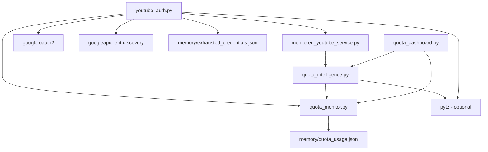
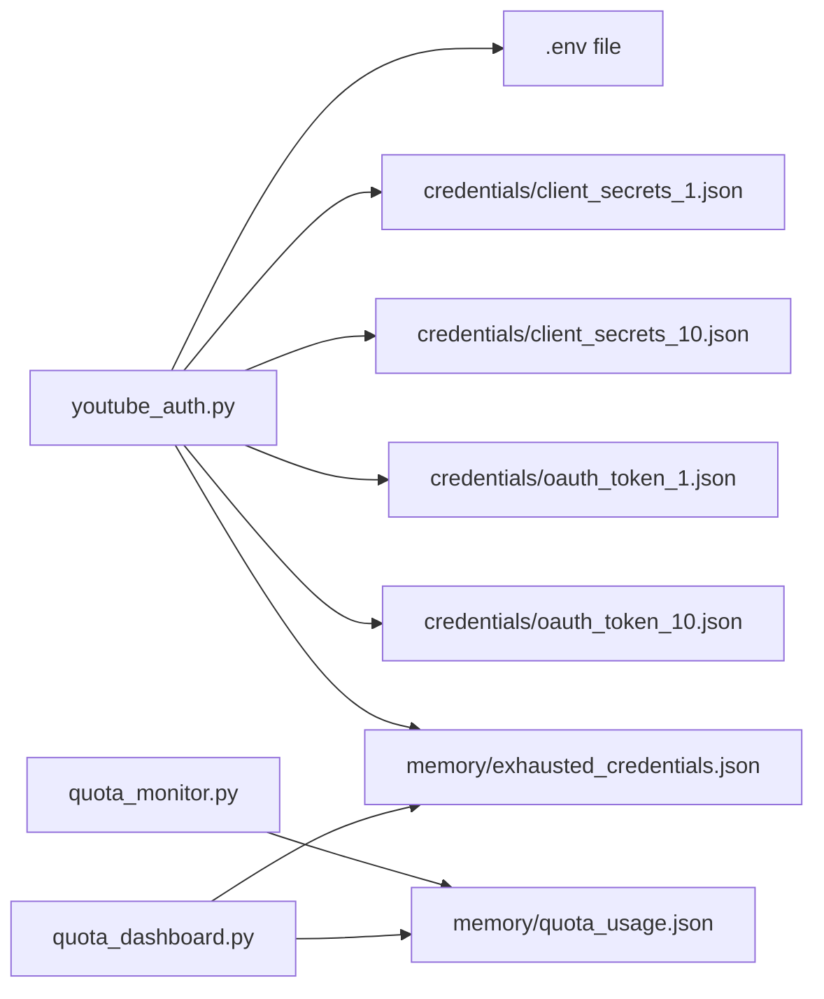
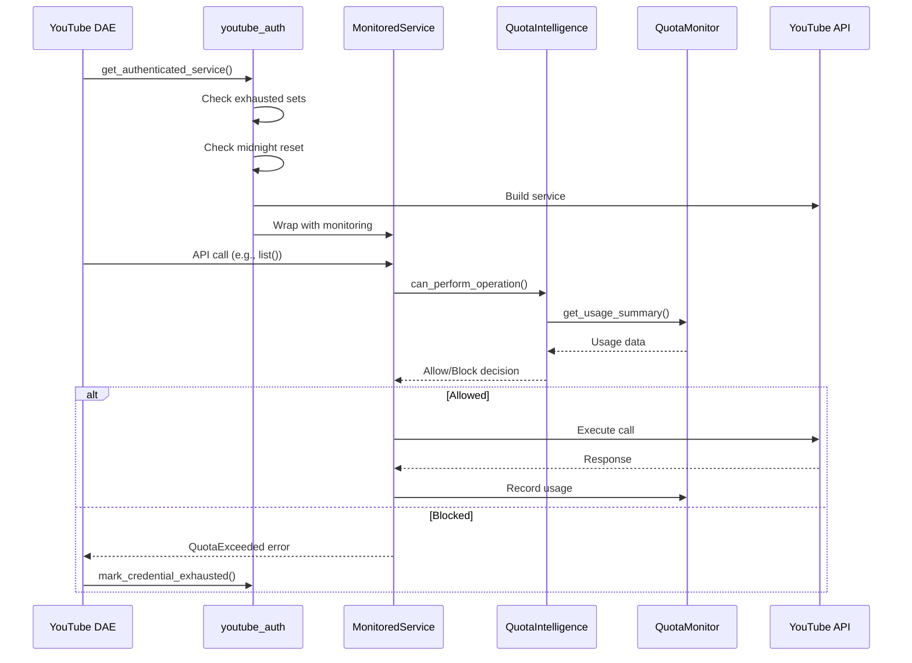
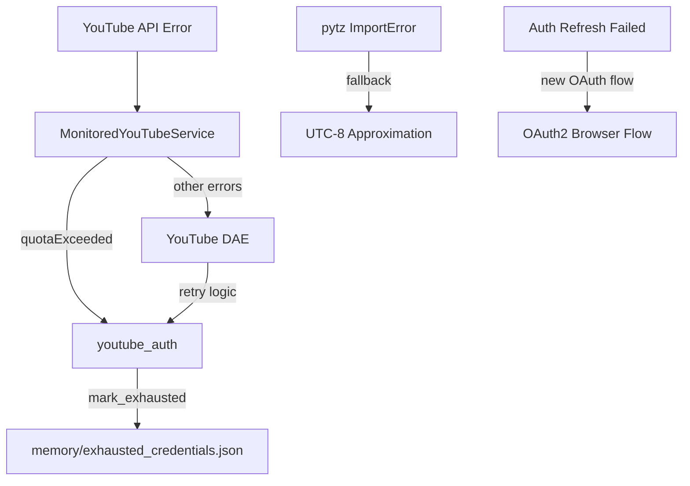

# Module Dependency Map - YouTube Auth

## Core Dependencies

## Module Relationships

### Internal Module Dependencies
| Module | Depends On | Purpose |
|--------|------------|---------|
| youtube_auth.py | quota_monitor.py | Track quota usage and exhaustion |
| youtube_auth.py | monitored_youtube_service.py | Wrap service with monitoring |
| monitored_youtube_service.py | quota_intelligence.py | Pre-call quota checking |
| quota_intelligence.py | quota_monitor.py | Get usage summaries |
| quota_dashboard.py | quota_intelligence.py | Display intelligent metrics |
| quota_dashboard.py | quota_monitor.py | Access raw usage data |

### External Library Dependencies
| Module | External Library | Purpose | Required |
|--------|-----------------|---------|----------|
| youtube_auth.py | google.oauth2.credentials | OAuth2 credential handling | Yes |
| youtube_auth.py | google_auth_oauthlib.flow | OAuth2 flow management | Yes |
| youtube_auth.py | googleapiclient.discovery | Build YouTube API service | Yes |
| youtube_auth.py | pytz | Pacific timezone handling | No (fallback exists) |
| quota_intelligence.py | pytz | Timezone calculations | No (fallback exists) |
| All modules | python-dotenv | Environment variable loading | Yes |

## Cross-Domain Dependencies

| Local Module | External Domain | External Module | Integration Type |
|--------------|-----------------|-----------------|------------------|
| youtube_auth.py | communication/livechat | auto_moderator_dae.py | Provides authenticated service |
| monitored_youtube_service.py | communication/livechat | livechat_core.py | Monitors API calls |
| quota_intelligence.py | infrastructure/shared_utilities | single_instance.py | Process management |
| youtube_auth.py | platform_integration/stream_resolver | stream_resolver.py | Shares credentials |

## File System Dependencies

### Configuration Files
- **.env**: Contains credential file paths and scopes
  - `GOOGLE_CLIENT_SECRETS_FILE_1`
  - `GOOGLE_CLIENT_SECRETS_FILE_10`
  - `OAUTH_TOKEN_FILE_1`
  - `OAUTH_TOKEN_FILE_10`
  - `YOUTUBE_SCOPES`

### Credential Files
- **credentials/client_secrets_*.json**: OAuth2 client configuration
- **credentials/oauth_token_*.json**: Stored authentication tokens

### State Files
- **memory/exhausted_credentials.json**: Tracks exhausted credential sets
- **memory/quota_usage.json**: Tracks daily quota consumption

## Data Flow

## Error Propagation

## Module Evolution Path

### Current State (v1.0.0)
- Quota intelligence with pre-call checking
- Dual credential set support (1, 10)
- Timezone-aware reset with fallback
- Persistent exhaustion tracking

### Next Phase (v1.1.0)
- Machine learning for usage prediction
- Cross-platform quota sharing
- Advanced batch optimization
- GUI dashboard interface

### Future Vision (v2.0.0)
- Distributed quota management
- Multi-account federation
- Automatic quota purchasing
- Self-healing credential rotation